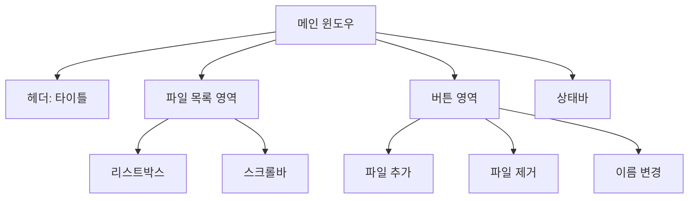

# Chapter 1: 기본 GUI 구조

이 챕터에서는 tkinter를 사용하여 기본적인 GUI 구조를 만들어보겠습니다. 파일 리네이머의 뼈대가 되는 기본 레이아웃과 위젯들을 구성해봅시다.

## 🎯 학습 목표

- tkinter 기본 위젯 사용법 익히기
- 효율적인 레이아웃 설계하기
- 기본적인 이벤트 처리 구현하기
- 사용자 친화적인 인터페이스 설계하기

## 📐 설계 개념

### 전체 레이아웃 구조



### 사용할 위젯들

| 위젯 | 용도 | tkinter 클래스 |
|------|------|----------------|
| 메인 윈도우 | 애플리케이션 창 | `tk.Tk()` |
| 프레임 | 레이아웃 구조 | `ttk.Frame` |
| 라벨 | 텍스트 표시 | `ttk.Label` |
| 리스트박스 | 파일 목록 | `tk.Listbox` |
| 스크롤바 | 스크롤 기능 | `ttk.Scrollbar` |
| 버튼 | 사용자 액션 | `ttk.Button` |

## 💻 코드 구현

### 1. 기본 클래스 구조

```python linenums="1" title="src/renamer-ch1/main.py"
#!/usr/bin/env python3
"""
Chapter 1: Basic Tkinter GUI Structure
기본적인 tkinter 윈도우를 생성하는 예제
"""

import tkinter as tk
from tkinter import ttk


class BasicRenamerGUI:
    def __init__(self):
        self.root = tk.Tk()
        self.setup_window()
        self.setup_widgets()
```

!!! info "클래스 구조 설계"
    - `__init__`: 초기화 메서드에서 윈도우 생성과 설정을 분리
    - `setup_window`: 윈도우 기본 속성 설정
    - `setup_widgets`: GUI 위젯들 배치

### 2. 윈도우 설정

```python linenums="13"
def setup_window(self):
    self.root.title("Renamer - Chapter 1: Basic GUI")
    self.root.geometry("600x400")
    self.root.resizable(True, True)
    
    # 윈도우를 화면 중앙에 배치
    self.center_window()

def center_window(self):
    self.root.update_idletasks()
    x = (self.root.winfo_screenwidth() // 2) - (600 // 2)
    y = (self.root.winfo_screenheight() // 2) - (400 // 2)
    self.root.geometry(f"600x400+{x}+{y}")
```

!!! tip "윈도우 중앙 배치"
    `center_window()` 메서드는 화면 크기를 계산하여 윈도우를 중앙에 배치합니다. 
    사용자 경험을 향상시키는 작은 디테일입니다.

### 3. 위젯 배치

```python linenums="25"
def setup_widgets(self):
    # 메인 프레임
    main_frame = ttk.Frame(self.root, padding="10")
    main_frame.grid(row=0, column=0, sticky=(tk.W, tk.E, tk.N, tk.S))
    
    # 타이틀 라벨
    title_label = ttk.Label(
        main_frame, 
        text="파일 리네이머", 
        font=("맑은 고딕", 16, "bold")
    )
    title_label.grid(row=0, column=0, columnspan=2, pady=(0, 20))
```

#### 파일 목록 영역

```python linenums="38"
    # 파일 목록 영역
    files_label = ttk.Label(main_frame, text="파일 목록:")
    files_label.grid(row=1, column=0, sticky=tk.W, pady=(0, 5))
    
    # 리스트박스와 스크롤바
    listbox_frame = ttk.Frame(main_frame)
    listbox_frame.grid(row=2, column=0, columnspan=2, 
                      sticky=(tk.W, tk.E, tk.N, tk.S), pady=(0, 10))
    
    self.files_listbox = tk.Listbox(listbox_frame, height=10)
    scrollbar = ttk.Scrollbar(listbox_frame, orient=tk.VERTICAL, 
                             command=self.files_listbox.yview)
    self.files_listbox.config(yscrollcommand=scrollbar.set)
    
    self.files_listbox.pack(side=tk.LEFT, fill=tk.BOTH, expand=True)
    scrollbar.pack(side=tk.RIGHT, fill=tk.Y)
```

!!! note "레이아웃 매니저 조합"
    메인 구조는 `grid`를 사용하고, 리스트박스와 스크롤바는 `pack`을 사용합니다. 
    상황에 맞는 레이아웃 매니저를 선택하는 것이 중요합니다.

#### 버튼 영역

```python linenums="54"
    # 버튼 프레임
    button_frame = ttk.Frame(main_frame)
    button_frame.grid(row=3, column=0, columnspan=2, pady=10)
    
    # 파일 추가 버튼
    add_button = ttk.Button(
        button_frame, 
        text="파일 추가", 
        command=self.add_files
    )
    add_button.pack(side=tk.LEFT, padx=(0, 10))
    
    # 파일 삭제 버튼
    remove_button = ttk.Button(
        button_frame, 
        text="파일 제거", 
        command=self.remove_files
    )
    remove_button.pack(side=tk.LEFT, padx=(0, 10))
    
    # 이름 변경 버튼
    rename_button = ttk.Button(
        button_frame, 
        text="이름 변경", 
        command=self.rename_files
    )
    rename_button.pack(side=tk.LEFT)
```

#### 상태바

```python linenums="80"
    # 상태바
    self.status_var = tk.StringVar()
    self.status_var.set("준비됨")
    status_label = ttk.Label(main_frame, textvariable=self.status_var)
    status_label.grid(row=4, column=0, columnspan=2, sticky=tk.W, pady=(10, 0))
```

### 4. 그리드 설정

```python linenums="86"
    # 그리드 설정
    main_frame.columnconfigure(0, weight=1)
    self.root.columnconfigure(0, weight=1)
    self.root.rowconfigure(0, weight=1)
    main_frame.rowconfigure(2, weight=1)  # 리스트박스 영역이 확장됨
```

!!! important "그리드 가중치"
    `columnconfigure`와 `rowconfigure`의 `weight` 매개변수는 창 크기가 변경될 때 
    어떤 영역이 확장될지 결정합니다.

## 🎮 이벤트 처리

### 버튼 이벤트 핸들러

```python linenums="92"
def add_files(self):
    self.status_var.set("파일 추가 기능은 다음 장에서 구현됩니다.")
    
    # 예시 파일들을 리스트에 추가
    example_files = [
        "example1.txt",
        "example2.txt", 
        "document.pdf",
        "image.jpg"
    ]
    
    for file in example_files:
        self.files_listbox.insert(tk.END, file)

def remove_files(self):
    selection = self.files_listbox.curselection()
    if selection:
        for index in reversed(selection):
            self.files_listbox.delete(index)
        self.status_var.set("선택된 파일이 제거되었습니다.")
    else:
        self.status_var.set("제거할 파일을 선택해주세요.")

def rename_files(self):
    if self.files_listbox.size() > 0:
        self.status_var.set("이름 변경 기능은 다음 장에서 구현됩니다.")
    else:
        self.status_var.set("변경할 파일이 없습니다.")
```

!!! tip "사용자 피드백"
    모든 사용자 액션에 대해 상태바를 통해 피드백을 제공합니다. 
    이는 사용자가 애플리케이션의 상태를 이해할 수 있게 도와줍니다.

### 애플리케이션 실행

```python linenums="119"
def run(self):
    self.root.mainloop()


def main():
    app = BasicRenamerGUI()
    app.run()


if __name__ == "__main__":
    main()
```

## 🎨 UI/UX 개선 포인트

### 1. 한글 폰트 사용

```python
font=("맑은 고딕", 16, "bold")
```

Windows에서 한글이 깨지지 않도록 시스템 폰트를 명시적으로 지정합니다.

### 2. 적절한 여백과 간격

```python
main_frame = ttk.Frame(self.root, padding="10")  # 외부 여백
pady=(0, 20)  # 위젯 간 수직 간격
padx=(0, 10)  # 위젯 간 수평 간격
```

### 3. 논리적인 탭 순서

버튼들을 기능별로 그룹핑하고 자주 사용되는 순서대로 배치합니다.

## 🚀 실행 결과

완성된 Chapter 1 예제를 실행하면 다음과 같은 화면을 볼 수 있습니다:


### 테스트 시나리오

1. **파일 추가**: "파일 추가" 버튼을 클릭하여 예시 파일들이 추가되는지 확인
2. **파일 선택**: 리스트에서 파일을 클릭하여 선택 상태 확인
3. **파일 제거**: 선택된 파일이 제거되는지 확인
4. **상태 표시**: 각 액션에 따라 상태바 메시지가 변경되는지 확인
5. **창 크기 조절**: 창 크기를 변경했을 때 레이아웃이 적절히 조정되는지 확인

## 📚 핵심 개념 정리

### tkinter 기본 구조

```python
# 1. 루트 윈도우 생성
root = tk.Tk()

# 2. 위젯 생성 및 배치
widget = ttk.Widget(parent, options...)
widget.grid(row=0, column=0)

# 3. 이벤트 루프 실행
root.mainloop()
```

### 레이아웃 매니저

=== "grid"
    ```python
    widget.grid(row=0, column=0, sticky=tk.W)
    ```
    표 형태의 정확한 배치에 적합

=== "pack"
    ```python
    widget.pack(side=tk.LEFT, fill=tk.X)
    ```
    순차적 배치에 적합

=== "place"
    ```python
    widget.place(x=10, y=20)
    ```
    절대 위치 지정에 적합

### 이벤트 처리

```python
def event_handler(self):
    # 이벤트 처리 로직
    pass

button = ttk.Button(parent, text="클릭", command=self.event_handler)
```

## 🔍 문제 해결

### 자주 발생하는 문제들

!!! warning "Import Error"
    ```
    ModuleNotFoundError: No module named 'tkinter'
    ```
    **해결**: Python 설치 시 tkinter가 포함되지 않은 경우입니다. Python을 재설치하거나 시스템별 tkinter 패키지를 설치하세요.

!!! warning "Font 문제"
    한글이 깨져 보이는 경우, 시스템에 맞는 폰트로 변경하세요:
    ```python
    # Windows
    font=("맑은 고딕", 12)
    # macOS
    font=("AppleGothic", 12)
    # Linux
    font=("DejaVu Sans", 12)
    ```

!!! warning "Layout 문제"
    위젯이 원하는 위치에 나타나지 않는 경우:
    ```python
    # sticky 옵션으로 정렬 조정
    widget.grid(row=0, column=0, sticky=(tk.W, tk.E))
    
    # 가중치 설정으로 확장 제어
    parent.columnconfigure(0, weight=1)
    ```

## 🎯 다음 단계 미리보기

Chapter 1에서는 기본적인 GUI 구조를 만들었습니다. 다음 [Chapter 2](chapter2.md)에서는:

- **드래그 앤 드롭 기능** 추가
- **실제 파일 처리** 로직 구현
- **파일 정보 표시** 개선
- **사용자 경험** 향상

---

!!! success "Chapter 1 완료!"
    축하합니다! 기본적인 GUI 구조를 성공적으로 만들었습니다. 
    이제 실제 파일을 다룰 수 있는 기능을 추가해보겠습니다.

!!! tip "연습 과제"
    - 버튼에 아이콘 추가해보기
    - 메뉴바 추가해보기
    - 키보드 단축키 구현해보기
    - 설정 저장 기능 구상해보기