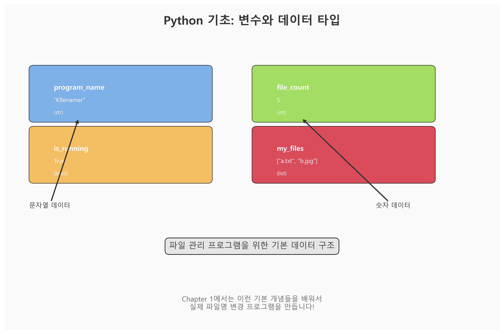

# Chapter 1: Python 기초

## 👋 환영합니다!

안녕하세요! 이 챕터에서는 **파일명을 쉽게 바꿔주는 프로그램(KRenamer)**<!-- -->을 만들기 위해 필요한 파이썬 기초를 차근차근 배워보겠습니다. 

프로그래밍이 처음이시거나 파이썬이 낯설어도 걱정하지 마세요! 실생활에서 자주 하는 일들(파일명 바꾸기, 정리하기)을 코드로 만들어보면서 자연스럽게 배울 수 있습니다.

## 🎯 이번 챕터에서 배울 것들



우리가 만들 프로그램은 다음과 같은 일을 합니다:

- 📁 여러 파일의 이름을 한 번에 바꾸기
- 🔢 파일들에 순서대로 번호 매기기  
- ✏️ 파일명에서 특정 단어 바꾸기
- 📏 파일 크기 보여주기

이런 기능들을 만들기 위해 배워야 할 파이썬 기초들:

- **변수와 데이터** - 파일 정보를 저장하는 방법
- **문자열 다루기** - 파일명을 자유자재로 바꾸는 방법  
- **리스트 사용하기** - 여러 파일을 한 번에 관리하는 방법
- **조건문과 반복문** - 파일들을 하나씩 처리하는 방법
- **함수 만들기** - 같은 작업을 반복하지 않는 방법
- **클래스 기초** - 코드를 깔끔하게 정리하는 방법

## 📚 단계별 학습하기

### 1단계: 변수 만들어보기 📝

파이썬에서 정보를 저장하는 방법을 배워봅시다. 마치 서류를 정리할 때 폴더에 라벨을 붙이는 것처럼, 데이터에 이름표를 붙여주는 것입니다.

```python linenums="13" title="src/krenamer-ch1/main.py"
# 간단한 정보 저장하기
print("=== 변수 사용해보기 ===")

# 텍스트 정보 저장 (문자열)
program_name = "KRenamer"
file_name = "내 문서.txt"

# 숫자 정보 저장
file_count = 5
file_size = 1024

# 참/거짓 정보 저장 (불린)
is_running = True
has_error = False

# 여러 개 정보 저장 (리스트)
my_files = ["사진1.jpg", "문서.pdf", "음악.mp3"]

# 결과 확인하기
print(f"프로그램 이름: {program_name}")
print(f"파일 개수: {file_count}개")
print(f"프로그램 실행중: {is_running}")
print(f"내 파일들: {my_files}")
```

!!! tip "💡 이해하기 쉬운 변수명 사용하기"
    - `program_name` → 프로그램 이름이구나!
    - `file_count` → 파일 개수구나!
    - `my_files` → 내 파일 목록이구나!
    
    변수명을 보면 무엇을 저장하는지 바로 알 수 있게 만드는 것이 중요해요!

### 2단계: 파일명 다루어보기 ✏️

파일명을 바꾸는 것이 우리 프로그램의 핵심이에요! 파일명은 텍스트(문자열)이기 때문에, 문자열을 다루는 방법을 배워봅시다.

```python linenums="27" title="파일명 바꾸기 연습"
print("=== 파일명 바꾸기 연습 ===")

# 원본 파일명
filename = "내 사진 (복사본).jpg"
print(f"🔤 원본 파일명: {filename}")

# 1) 파일명과 확장자 나누기
import os
name_part, extension = os.path.splitext(filename)
print(f"📄 파일명 부분: '{name_part}'")
print(f"📎 확장자 부분: '{extension}'")

# 2) 특별한 문자들 제거하기
cleaned_name = filename.replace("(복사본)", "")  # (복사본) 제거
cleaned_name = cleaned_name.replace("  ", " ")   # 두 번 띄어쓰기를 한 번으로
print(f"🧹 정리된 파일명: '{cleaned_name}'")

# 3) 공백을 밑줄로 바꾸기
underscore_name = cleaned_name.replace(" ", "_")
print(f"🔗 밑줄로 연결: '{underscore_name}'")

# 4) 대소문자 바꾸기
print(f"🔤 소문자로: '{filename.lower()}'")
print(f"🔠 대문자로: '{filename.upper()}'")

# 5) 앞뒤에 글자 추가하기
prefix = "NEW_"
suffix = "_BACKUP"
new_filename = prefix + name_part + suffix + extension
print(f"✨ 최종 결과: '{new_filename}'")
```

!!! success "🎉 축하해요! 파일명 변경 마스터"
    이제 여러분은 파일명을 자유자재로 바꿀 수 있어요!
    
    - `replace()` → 원하는 글자를 다른 글자로 바꾸기
    - `lower()`, `upper()` → 대소문자 바꾸기  
    - `+` 또는 f-string → 앞뒤에 글자 추가하기
    - `os.path.splitext()` → 파일명과 확장자 분리하기

### 3단계: 여러 파일 한 번에 처리하기 📁

실제로는 파일 하나가 아니라 여러 개를 한 번에 처리해야 해요. 파이썬의 **리스트**<!-- -->와 **반복문**<!-- -->을 사용해봅시다!

```python linenums="48" title="여러 파일 처리하기"
print("=== 여러 파일 한 번에 처리하기 ===")

# 여러 파일명을 리스트에 저장
my_files = [
    "휴가사진_001.jpg",
    "휴가사진_002.jpg", 
    "중요문서_v1.2.pdf",
    "백업파일_2023_12_15.zip"
]

print("📋 원본 파일들:")
for file in my_files:
    print(f"  - {file}")

# 모든 파일에 접두사 "정리된_" 추가하기
print("\n✨ 접두사 '정리된_' 추가 결과:")
renamed_files = []
for file in my_files:
    new_name = "정리된_" + file
    renamed_files.append(new_name)
    print(f"  📄 {file} → {new_name}")

# 더 간단한 방법: 리스트 컴프리헨션 (고급 기법)
print("\n🚀 더 간단한 방법으로 해보기:")
quick_renamed = ["NEW_" + file for file in my_files]
for i, file in enumerate(my_files):
    print(f"  📄 {file} → {quick_renamed[i]}")
```

!!! note "💭 반복문 이해하기"
    `for file in my_files:`는 "my_files 리스트에 있는 각 파일에 대해서"라는 뜻이에요.
    
    마치 "서랍에 있는 각 서류에 대해서 도장을 찍자"와 같은 개념입니다!

### 4단계: 파일 정보 알아내기 🔍

실제 파일을 다루려면 파일이 어디에 있는지, 얼마나 큰지 등을 알아야 해요. 컴퓨터에서 파일 정보를 가져오는 방법을 배워봅시다!

```python linenums="73" title="파일 정보 알아내기"
print("=== 파일 정보 알아내기 ===")

# pathlib 라이브러리 사용하기 (최신 방법)
from pathlib import Path

# 예시 파일 경로들
example_files = [
    "C:/Users/홍길동/Documents/보고서.pdf",
    "C:/Users/홍길동/Pictures/가족사진.jpg",
    "C:/Users/홍길동/Music/좋아하는노래.mp3"
]

for file_path in example_files:
    file_info = Path(file_path)
    
    print(f"\n📁 파일 경로: {file_path}")
    print(f"   📄 파일명만: {file_info.name}")
    print(f"   📂 폴더 경로: {file_info.parent}")
    print(f"   📎 확장자: {file_info.suffix}")
    print(f"   📝 이름(확장자 제외): {file_info.stem}")
```

!!! tip "🤔 왜 pathlib을 사용하나요?"
    전에는 `os.path`라는 것을 썼는데, 요즘은 `pathlib`를 더 많이 써요!
    
    **pathlib의 장점:**
    - 더 읽기 쉬움: `file_info.name` (파일명이구나!)
    - 더 사용하기 쉬움: `file_info.parent` (부모 폴더구나!)
    - 실수가 적음: 자동으로 운영체제에 맞게 경로를 처리해줌

### 5단계: 파일 크기를 예쁘게 표시하기 📏

컴퓨터는 파일 크기를 바이트(byte)로 계산해요. 하지만 1048576 바이트보다는 1MB라고 하는 게 훨씬 이해하기 쉽죠!

```python linenums="95" title="파일 크기 예쁘게 만들기"
def make_size_pretty(size_bytes):
    """파일 크기를 읽기 쉽게 바꿔주는 함수"""
    print(f"🔢 원래 크기: {size_bytes} 바이트")
    
    # 크기가 0이면 그냥 0B 반환
    if size_bytes == 0:
        return "0B"
    
    # 단위들: 바이트 → 킬로바이트 → 메가바이트 → 기가바이트
    units = ['B', 'KB', 'MB', 'GB', 'TB']
    
    # 1024로 나누면서 적절한 단위 찾기
    for unit in units:
        if size_bytes < 1024.0:
            if unit == 'B':
                return f"{int(size_bytes)}{unit}"  # 바이트는 정수로
            else:
                return f"{size_bytes:.1f}{unit}"   # 나머지는 소수점 1자리
        size_bytes = size_bytes / 1024.0  # 1024로 나누기
    
    return f"{size_bytes:.1f}TB"  # 매우 큰 파일은 TB

# 테스트해보기
print("=== 파일 크기 예쁘게 만들기 ===")
test_sizes = [0, 512, 1024, 1536, 1048576, 1073741824]

for size in test_sizes:
    pretty_size = make_size_pretty(size)
    print(f"📊 {size:>10} 바이트 = {pretty_size}")
    print()
```

!!! question "💡 1024가 뭔가요?"
    컴퓨터는 2진법을 사용해서 1024 (=2¹⁰)를 기준으로 계산해요!
    
    - 1 KB = 1024 바이트
    - 1 MB = 1024 KB = 1,048,576 바이트  
    - 1 GB = 1024 MB = 1,073,741,824 바이트

### 6단계: 오류가 생겨도 안전하게! 🛡️

프로그램을 사용하다 보면 예상치 못한 일들이 생겨요. 파일이 없다거나, 이미 같은 이름의 파일이 있다거나... 이런 상황에 대비해봅시다!

```python linenums="116" title="안전한 파일명 변경하기"
def safe_rename_file(old_name, new_name):
    """안전하게 파일명을 바꾸는 함수"""
    print(f"🔄 '{old_name}'을 '{new_name}'으로 바꾸려고 해요...")
    
    try:
        # 1단계: 원본 파일이 정말 있는지 확인
        import os
        if not os.path.exists(old_name):
            print(f"❌ 앗! '{old_name}' 파일을 찾을 수 없어요!")
            return False
        
        # 2단계: 새 이름으로 된 파일이 이미 있는지 확인  
        if os.path.exists(new_name):
            print(f"⚠️  '{new_name}' 파일이 이미 있어요!")
            print("   같은 이름의 파일이 있으면 덮어써질 수 있어요.")
            return False
        
        # 3단계: 실제로는 파일명을 바꾸지 않고 시뮬레이션만
        print(f"✅ 성공! '{old_name}' → '{new_name}'으로 바뀔 예정이에요")
        return True
        
    except PermissionError:
        print("🚫 권한이 없어서 파일을 바꿀 수 없어요!")
        print("   (파일이 다른 프로그램에서 사용 중일 수도 있어요)")
        return False
    
    except Exception as e:
        print(f"😵 예상치 못한 문제가 생겼어요: {e}")
        print("   개발자에게 문의해주세요!")
        return False

# 테스트해보기
print("=== 안전한 파일명 변경 테스트 ===")

# 존재하지 않는 파일 테스트
safe_rename_file("없는파일.txt", "새파일.txt")
print()

# 실제 존재할 만한 파일 테스트  
safe_rename_file("C:/Windows/System32/notepad.exe", "새이름.exe")
print()
```

!!! warning "⚠️  왜 try-except를 사용하나요?"
    **프로그램이 갑자기 멈추는 것을 방지하기 위해서예요!**
    
    - `try:` → "이 코드를 실행해보세요"
    - `except:` → "문제가 생기면 이렇게 처리하세요"
    
    이렇게 하면 사용자가 실수해도 프로그램이 안전하게 동작해요!

## 🏗️ 클래스로 코드 정리하기

### 7단계: 나만의 파일 관리자 만들기 🗂️

지금까지 배운 것들을 모아서 **클래스(Class)**<!-- -->라는 것을 만들어봅시다. 클래스는 관련된 기능들을 하나로 묶어주는 상자 같은 거예요!

```python linenums="148" title="나만의 파일 관리자 클래스"
class MyFileManager:
    """내가 만든 파일 관리자"""
    
    def __init__(self):
        """파일 관리자를 처음 만들 때 실행되는 함수"""
        print("🎉 새로운 파일 관리자가 만들어졌어요!")
        self.my_files = []  # 내 파일들을 저장할 리스트
        self.total_renamed = 0  # 지금까지 바꾼 파일 개수
    
    def add_file(self, file_path):
        """파일을 관리 목록에 추가하기"""
        if file_path not in self.my_files:
            self.my_files.append(file_path)
            print(f"📁 '{file_path}' 파일을 추가했어요!")
        else:
            print(f"⚠️  '{file_path}' 파일은 이미 있어요!")
    
    def show_files(self):
        """현재 관리 중인 파일들 보여주기"""
        print(f"\n📋 현재 관리 중인 파일: {len(self.my_files)}개")
        for i, file_path in enumerate(self.my_files, 1):
            print(f"   {i}. {file_path}")
    
    def add_prefix_to_all(self, prefix):
        """모든 파일에 접두사 추가하기"""
        print(f"\n✨ 모든 파일에 '{prefix}' 접두사 추가 결과:")
        new_names = []
        
        for file_path in self.my_files:
            from pathlib import Path
            file_info = Path(file_path)
            new_name = prefix + file_info.name
            new_full_path = file_info.parent / new_name
            new_names.append(str(new_full_path))
            print(f"   📄 {file_info.name} → {new_name}")
        
        return new_names
    
    def add_numbers_to_all(self, start_number=1):
        """모든 파일에 순서대로 번호 매기기"""
        print(f"\n🔢 {start_number}번부터 순서대로 번호 매기기:")
        new_names = []
        
        for i, file_path in enumerate(self.my_files):
            from pathlib import Path
            file_info = Path(file_path)
            number = start_number + i
            new_name = f"{number:03d}_{file_info.name}"  # 001, 002, 003...
            new_full_path = file_info.parent / new_name
            new_names.append(str(new_full_path))
            print(f"   📄 {file_info.name} → {new_name}")
        
        return new_names
```

!!! note "🤔 클래스가 뭔가요?"
    클래스는 **관련된 기능들을 하나로 묶어놓은 설계도**<!-- -->예요!
    
    - `MyFileManager()` → 새로운 파일 관리자 하나 만들기
    - `self.my_files` → 이 관리자가 기억하고 있는 파일 목록
    - `self.add_file()` → 이 관리자에게 "파일 추가해줘"라고 부탁하기

### 8단계: 파일 관리자 사용해보기 🎮


이제 우리가 만든 클래스를 실제로 사용해봅시다!

```python linenums="215" title="파일 관리자 사용해보기"
print("=== 나만의 파일 관리자 사용해보기 ===")

# 1단계: 새로운 파일 관리자 만들기
my_manager = MyFileManager()

# 2단계: 파일들 추가하기
test_files = [
    "C:/Users/내이름/Documents/중요한문서.pdf",
    "C:/Users/내이름/Pictures/가족사진.jpg", 
    "C:/Users/내이름/Music/좋아하는노래.mp3",
    "C:/Users/내이름/Desktop/메모.txt"
]

print("\n📁 파일들을 관리자에 추가하는 중...")
for file_name in test_files:
    my_manager.add_file(file_name)

# 3단계: 현재 파일 목록 확인하기
my_manager.show_files()

# 4단계: 모든 파일에 접두사 추가해보기
my_manager.add_prefix_to_all("정리완료_")

print("\n" + "="*50)

# 5단계: 모든 파일에 순번 매기기
my_manager.add_numbers_to_all(start_number=1)

print("\n🎉 파일 관리자 사용 완료!")
```

!!! success "🏆 축하합니다!"
    클래스를 사용해서 코드를 깔끔하게 정리하는 방법을 배웠어요!
    
    **클래스의 장점:**
    - 🧹 **코드 정리**: 관련된 기능들을 한 곳에 모음
    - 🔒 **데이터 보호**: `self.my_files`는 클래스 내부에서만 직접 접근 가능
    - 🔄 **재사용**: 여러 개의 파일 관리자를 만들 수 있음
    - 📈 **확장성**: 나중에 새로운 기능을 쉽게 추가할 수 있음

## 🚀 추가로 알아두면 좋은 기법들 

### 9단계: 똑똑한 리스트 만들기 (리스트 컴프리헨션) 🧠

파이썬에는 리스트를 더 쉽고 빠르게 만드는 방법이 있어요. 마치 "조건에 맞는 것들만 골라서 새 리스트 만들기"처럼요!

```python linenums="255" title="똑똑한 리스트 만들기"
print("=== 똑똑한 리스트 만들기 ===")

files = [
    "문서.pdf", "사진.jpg", "음악.mp3", 
    "압축파일.zip", "메모.txt", "그림.png", "매우긴파일명이있는문서.docx"
]

print("📂 원본 파일들:")
for file in files:
    print(f"   - {file}")

# 방법 1: 전통적인 방법 - 이미지 파일만 찾기
print("\n🖼️  방법 1 (전통적): 이미지 파일만 찾기")
image_files_old = []
for file in files:
    if file.endswith(('.jpg', '.png')):
        image_files_old.append(file)
print(f"   결과: {image_files_old}")

# 방법 2: 리스트 컴프리헨션 - 한 줄로!
print("\n🚀 방법 2 (똑똑한 방법): 이미지 파일만 찾기")
image_files_new = [file for file in files if file.endswith(('.jpg', '.png'))]
print(f"   결과: {image_files_new}")

# 더 많은 예시들
print("\n✨ 더 많은 똑똑한 리스트 만들기:")

# 확장자 제거하기
names_only = [file.split('.')[0] for file in files]
print(f"📝 확장자 제거: {names_only}")

# 긴 파일명만 선택하기 (8글자 이상)
long_names = [file for file in files if len(file) > 8]
print(f"📏 긴 파일명들: {long_names}")

# 조건에 따라 다르게 처리하기
processed = [file.upper() if file.endswith('.txt') else file for file in files]
print(f"🔄 txt는 대문자로: {processed}")
```

!!! tip "💡 리스트 컴프리헨션 읽는 법"
    `[뭘_만들지 for 각_항목 in 원본_리스트 if 조건]`
    
    - `file` → 각각의 파일을 의미
    - `for file in files` → files 리스트의 각 파일에 대해
    - `if file.endswith('.jpg')` → jpg로 끝나는 파일만
    - `file.upper()` → 대문자로 바꿔서 새 리스트에 넣기

## 🧪 직접 해보기 (실습 과제)

### 🌟 기본 도전과제

이제 여러분이 직접 해볼 차례예요! 차근차근 해보세요.

#### 1. 파일명 깔끔하게 만들기 🧹
```python
def clean_my_filename(filename):
    """파일명을 깔끔하게 정리하는 함수를 만들어보세요!"""
    # 힌트: 
    # - 공백을 언더스코어(_)로 바꾸기
    # - 특수문자 (, ), [, ] 제거하기  
    # - 연속된 언더스코어를 하나로 만들기
    
    # 여기에 코드를 작성해보세요!
    pass

# 테스트해보기
test_filename = "내 중요한 문서 (복사본) [최종].pdf"
print(f"원본: {test_filename}")
print(f"정리: {clean_my_filename(test_filename)}")
# 기대 결과: "내_중요한_문서_최종.pdf"
```

#### 2. 확장자별로 파일 분류하기 📂
```python
def sort_files_by_type(file_list):
    """파일들을 확장자별로 분류하는 함수를 만들어보세요!"""
    # 힌트:
    # - 딕셔너리를 만들어서 확장자를 키로 사용
    # - 같은 확장자끼리 리스트로 묶기
    
    # 여기에 코드를 작성해보세요!
    pass

# 테스트해보기
my_files = ["사진1.jpg", "문서.pdf", "사진2.jpg", "음악.mp3", "메모.txt", "노래2.mp3"]
sorted_files = sort_files_by_type(my_files)
print("확장자별 분류 결과:")
for ext, files in sorted_files.items():
    print(f"  {ext}: {files}")
```

### 🚀 고급 도전과제

#### 3. 똑똑한 파일명 만들기 🤖
```python
def make_smart_filename(original_name, options):
    """여러 옵션을 받아서 파일명을 똑똑하게 바꾸는 함수"""
    # options 예시:
    # {
    #     'add_date': True,        # 현재 날짜 추가
    #     'add_number': 1,         # 순번 추가  
    #     'make_lowercase': True,  # 소문자로 변경
    #     'remove_spaces': True    # 공백 제거
    # }
    
    # 도전해보세요!
    pass

# 테스트해보기
options = {
    'add_date': True,
    'add_number': 5,
    'make_lowercase': True,
    'remove_spaces': True
}
result = make_smart_filename("My Important File.txt", options)
print(f"똑똑한 파일명: {result}")
```

!!! question "💭 막히면 어떻게 하나요?"
    **걱정하지 마세요!** 프로그래밍에서 막히는 건 당연해요.
    
    1. **천천히 단계별로**: 큰 문제를 작은 부분으로 나누어 생각하기
    2. **이전 예시 참고**: 위에서 배운 코드들을 다시 보기
    3. **작은 것부터**: 전체를 다 만들려 하지 말고 일부분부터 시작
    4. **테스트하며 진행**: 조금씩 만들어가며 print()로 확인하기

## 🎯 다음에는 뭘 배우나요?

Chapter 1에서 배운 파이썬 기초가 다음 챕터들에서 어떻게 쓰이는지 미리 봅시다!

### 🗺️ 우리의 학습 여정

```
Chapter 1 (지금!) → Chapter 2 → Chapter 3 → ... → Chapter 11
    📝 파이썬           🖼️ GUI          🖱️ 드래그앤드롭        🚀 프로그램 배포
     기초              화면 만들기        파일 끌어다 놓기         다른 사람도 사용
```

**다음 챕터들에서 사용될 오늘 배운 내용들:**

- **Chapter 2** 🖼️: 클래스로 화면 구성 요소들 만들기
- **Chapter 3** 🖱️: 파일 정보 처리와 리스트로 파일 관리
- **Chapter 4** ✏️: 문자열 처리로 실제 파일명 바꾸기
- **Chapter 5** 🔧: 예외 처리로 안전한 파일 작업
- **Chapter 6+** 🚀: 더 전문적인 프로그램 만들기

## 🎓 Chapter 1 졸업 시험!

### ✅ 내가 배운 것들 체크해보기

**파이썬 기초 (기본 중의 기본!)**

- [ ] 변수에 값 저장하기 (`name = "파일명"`)
- [ ] 문자열 바꾸기 (`filename.replace(" ", "_")`)
- [ ] 리스트 사용하기 (`my_files = ["a.txt", "b.jpg"]`)
- [ ] 반복문으로 여러 작업 하기 (`for file in files:`)
- [ ] 함수 만들어서 코드 정리하기 (`def my_function():`)

**파일 다루기 (KRenamer의 핵심!)**

- [ ] 파일 경로 분석하기 (`Path(file_path).name`)
- [ ] 파일명과 확장자 나누기 (`os.path.splitext()`)
- [ ] 파일 크기 예쁘게 표시하기 (`1024 → 1KB`)
- [ ] 안전하게 오류 처리하기 (`try-except`)

**고급 기법들 (보너스!)**

- [ ] 클래스로 코드 정리하기 (`class FileManager:`)
- [ ] 리스트 컴프리헨션 (`[f for f in files if ...]`)

### 🌟 최종 점검 문제

다음 코드가 뭘 하는지 이해할 수 있나요?

```python
files = ["사진 (복사본).jpg", "문서.pdf", "음악.mp3"]
cleaned = [f.replace(" (복사본)", "") for f in files if f.endswith('.jpg')]
print(cleaned)  # 결과: ['사진.jpg']
```

이해했다면 Chapter 1 졸업! 🎉

---

!!! success "🎉 Chapter 1 완주 축하드려요!"
    파이썬 기초를 성공적으로 마스터했습니다!
    
    **이제 할 수 있는 것들:**

    - ✅ 변수와 리스트로 데이터 관리
    - ✅ 파일명을 마음대로 바꾸기
    - ✅ 반복문으로 여러 파일 한 번에 처리
    - ✅ 클래스로 깔끔한 코드 작성
    - ✅ 안전한 오류 처리

!!! tip "🚀 다음 단계 준비하기"
    **Chapter 2에서는:**

    - 화면에 버튼과 입력창 만들기
    - 마우스 클릭 이벤트 처리하기
    - 예쁜 GUI 프로그램 완성하기
    
    오늘 배운 파이썬 기초가 모두 사용됩니다!