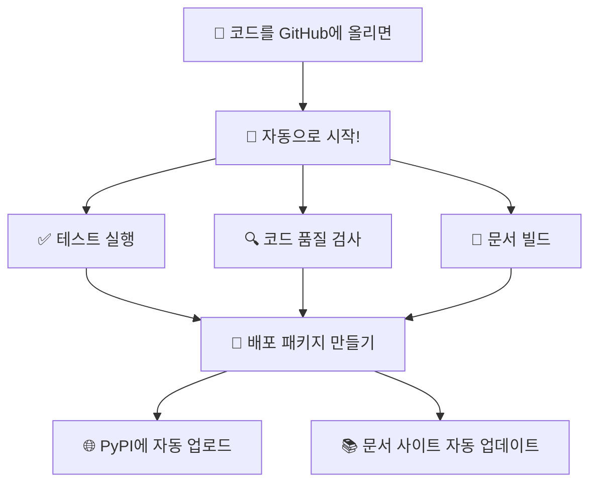

# Chapter 10: 자동화의 마법 - GitHub Actions

이번 챕터에서는 **개발자의 꿈**<!-- -->인 **"모든 것이 자동으로 되는 시스템"**<!-- -->을 만들어보겠습니다!

코드를 GitHub에 올리기만 하면 자동으로 테스트하고, 빌드하고, 배포까지 해주는 마법같은 시스템을 구축해보겠습니다.

## 🎯 이번 챕터의 목표

- **"자동화가 뭔지"** 이해하기 (왜 필요한지부터)
- **GitHub Actions 개념** 쉽게 이해하기
- **우리 프로젝트에 어떻게 적용할지** 계획하기
- **실제로 설정해보기** (단계별로 차근차근)

## 🤔 자동화가 왜 필요할까요?

### 개발자의 일상적인 고민들

프로그램을 만들다 보면 이런 상황들을 만나게 됩니다:

- **"코드를 수정했는데 다른 부분이 망가졌을까?"** → 매번 테스트해야 함
- **"새 버전을 배포하려는데 실수할까봐 무서워"** → 배포 과정이 복잡함
- **"여러 운영체제에서 잘 작동하는지 확인해야 해"** → 일일이 테스트하기 어려움
- **"팀원들과 함께 작업할 때 충돌이 생겨"** → 코드 통합이 어려움

### 자동화의 장점

이런 문제들을 **자동화**<!-- -->로 해결할 수 있습니다:

```
Before (수동): 코드 작성 → 직접 테스트 → 직접 빌드 → 직접 배포 → 😰
After (자동): 코드 작성 → GitHub에 올리기 → 모든 것이 자동으로! → 😎
```

## 🎬 GitHub Actions 쉽게 이해하기

### GitHub Actions란?

GitHub Actions는 **"GitHub의 로봇 비서"**<!-- -->라고 생각하면 됩니다.

여러분이 코드를 GitHub에 올리면, 미리 설정해둔 작업들을 자동으로 실행해주는 서비스입니다.

### 핵심 개념들 (쉽게 설명)

!!! note "GitHub Actions 개념 쉽게 이해하기"
    - **Workflow** = "할 일 목록" (예: 테스트하고 → 빌드하고 → 배포하기)
    - **Job** = "할 일 목록의 각 항목" (예: 테스트하기, 빌드하기)
    - **Step** = "각 항목의 세부 단계" (예: Python 설치 → 코드 다운로드 → 테스트 실행)
    - **Runner** = "일을 해주는 컴퓨터" (GitHub이 제공하는 가상 컴퓨터)

## 🎯 우리 프로젝트에 어떤 자동화를 적용할까요?

### KRenamer 프로젝트 자동화 계획

우리 프로젝트에 이런 자동화를 적용해보겠습니다:



### 단계별 자동화 설명

1. **"코드 올리기"** → **"테스트 자동 실행"**
    - 내가 실수한 게 없는지 자동으로 확인
    - 모든 기능이 잘 작동하는지 체크
   
2. **"테스트 통과"** → **"자동 빌드"**
    - Windows, macOS, Linux용으로 각각 빌드
    - 실행 파일도 자동으로 생성
   
3. **"빌드 완료"** → **"자동 배포"**
    - PyPI에 자동으로 패키지 업로드
    - 문서 사이트도 자동으로 업데이트

## 🛠️ 실제로 어떻게 설정하나요?

### GitHub Actions 설정의 핵심

GitHub Actions는 **YAML 파일**<!-- -->로 설정합니다. 이 파일들은 `.github/workflows/` 폴더에 넣으면 됩니다.

### 필요한 파일들

```
.github/workflows/
├── ci.yml          # 코드를 올릴 때마다 테스트
├── release.yml     # 새 버전 배포할 때 실행
└── docs.yml        # 문서 사이트 자동 업데이트
```

각각이 하는 일:

- **ci.yml**: 코드 품질 검사 + 테스트 실행
- **release.yml**: 패키지 빌드 + PyPI 업로드
- **docs.yml**: 문서 사이트 자동 배포

### 설정 파일 예시 (간단 버전)

기본적인 테스트 자동화 설정은 이런 느낌입니다:

```yaml
# "코드가 올라오면 자동으로 테스트해줘"
name: 자동 테스트
on: [push, pull_request]  # 언제 실행할지

jobs:
  test:  # 무슨 일을 할지
    runs-on: ubuntu-latest  # 어떤 컴퓨터에서 실행할지
    steps:
      - name: 코드 다운로드
        uses: actions/checkout@v4
      - name: Python 설치
        uses: actions/setup-python@v4
      - name: 테스트 실행
        run: pytest
```

!!! tip "자세한 설정 파일들은..."
    완전한 설정 파일들은 **GitHub 레포지토리**<!-- -->에서 확인하세요:
    
    - 📁 [CI/CD 설정 파일들](https://github.com/geniuskey/krenamer/tree/main/.github/workflows)
    - 📖 [설정 방법 상세 가이드](https://github.com/geniuskey/krenamer/blob/main/.github/README.md)

## 🎯 자동화의 효과

### 개발자 경험의 변화

GitHub Actions를 설정하고 나면 이런 마법같은 경험을 하게 됩니다:

**Before (수동 작업)**:

  1. 코드 수정
  2. 로컬에서 테스트 실행 (5분)
  3. 다른 OS에서도 테스트 (10분) 
  4. 문서 다시 빌드 (3분)
  5. 패키지 빌드 (5분)
  6. PyPI에 수동 업로드 (2분)
  7. 문서 사이트 수동 배포 (5분)

**총 소요시간: 30분 + 실수 위험도 높음** 😰

**After (자동화)**:

  1. 코드 수정
  2. GitHub에 push

**총 소요시간: 1분, 나머지는 모두 자동!** 😎

### 자동화로 얻는 것들

  - ✅ **시간 절약**: 반복 작업 제거
  - ✅ **실수 방지**: 사람이 할 일이 줄어들수록 실수도 줄어듦
  - ✅ **품질 향상**: 모든 코드가 자동으로 테스트됨
  - ✅ **팀워크**: 팀원들과 일관된 프로세스 공유
  - ✅ **신뢰성**: 배포 과정이 표준화됨

## 🚀 다음 단계

이제 자동화의 개념과 필요성을 이해했으니, 다음 챕터에서는 실제로 패키지를 PyPI에 배포하는 방법을 배워보겠습니다.

다음 [Chapter 11: PyPI 배포하기](chapter11.md)에서는 **내가 만든 프로그램을 전 세계 사람들이 쉽게 설치할 수 있게** 만드는 방법을 배워보겠습니다!

---

!!! success "Chapter 10 완료!"
    자동화의 마법을 이해했습니다! 이제 개발자다운 효율적인 워크플로우를 구축할 수 있게 되었네요.

!!! tip "연습 과제"
    - GitHub Actions 탭에서 다른 프로젝트들의 워크플로우 구경해보기
    - 간단한 테스트 워크플로우 하나 만들어보기
    - CI/CD의 장점을 친구들에게 설명해보기
