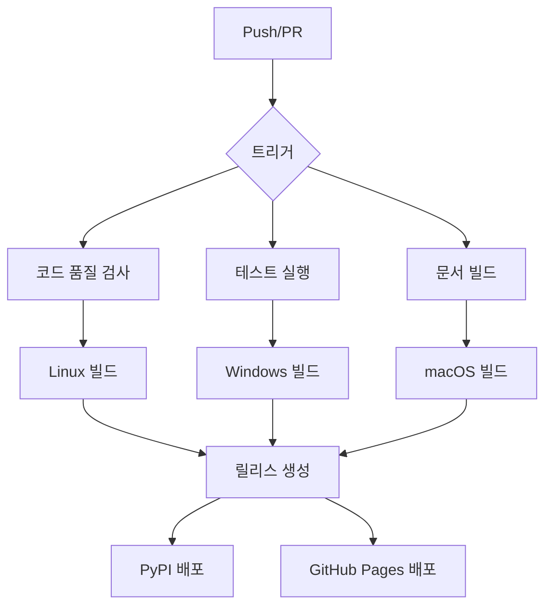

# Chapter 10: GitHub Actions Workflows 구성하기

이번 챕터에서는 KRenamer 프로젝트에 GitHub Actions를 적용하여 CI/CD(지속적 통합/배포) 파이프라인을 구축합니다. 자동화된 테스트, 빌드, 배포 프로세스를 통해 전문적인 소프트웨어 개발 워크플로우를 완성해보겠습니다.

## 🎯 학습 목표

- **GitHub Actions 기본 개념** 이해
- **CI/CD 파이프라인** 설계 및 구현
- **자동화된 테스트** 워크플로우 구성
- **다중 플랫폼 빌드** 및 **릴리스 자동화**
- **보안 모범 사례** 적용

## 📚 GitHub Actions 개요

### GitHub Actions란?

GitHub Actions는 GitHub에서 제공하는 CI/CD 플랫폼으로, 코드 저장소에서 직접 워크플로우를 자동화할 수 있습니다.

!!! info "GitHub Actions의 핵심 개념"
    - **Workflow**: 자동화된 프로세스 (YAML 파일로 정의)
    - **Job**: 워크플로우 내의 작업 단위
    - **Step**: Job 내의 개별 작업
    - **Action**: 재사용 가능한 작업 단위
    - **Runner**: 워크플로우를 실행하는 서버

### KRenamer 프로젝트 워크플로우 설계



## 🔧 기본 워크플로우 구성

### 1. 디렉토리 구조 설정

```bash title="GitHub Actions 디렉토리 구조"
.github/
├── workflows/
│   ├── ci.yml              # 지속적 통합
│   ├── release.yml         # 릴리스 자동화
│   ├── docs.yml           # 문서 배포
│   └── security.yml       # 보안 검사
├── ISSUE_TEMPLATE/
│   ├── bug_report.md
│   └── feature_request.md
└── PULL_REQUEST_TEMPLATE.md
```

### 2. 기본 CI 워크플로우

```yaml title=".github/workflows/ci.yml"
name: Continuous Integration

on:
  push:
    branches: [ main, develop ]
  pull_request:
    branches: [ main ]

env:
  PYTHON_VERSION: '3.11'

jobs:
  code-quality:
    name: Code Quality Checks
    runs-on: ubuntu-latest
    
    steps:
    - name: Checkout code
      uses: actions/checkout@v4
      
    - name: Set up Python
      uses: actions/setup-python@v4
      with:
        python-version: ${{ env.PYTHON_VERSION }}
        
    - name: Cache pip dependencies
      uses: actions/cache@v3
      with:
        path: ~/.cache/pip
        key: ${{ runner.os }}-pip-${{ hashFiles('**/requirements*.txt') }}
        restore-keys: |
          ${{ runner.os }}-pip-
          
    - name: Install dependencies
      run: |
        python -m pip install --upgrade pip
        pip install black isort flake8 mypy bandit safety
        pip install -r requirements.txt
        pip install -r requirements-dev.txt
        
    - name: Code formatting check (Black)
      run: black --check --diff src/ tests/
      
    - name: Import sorting check (isort)
      run: isort --check-only --diff src/ tests/
      
    - name: Lint with flake8
      run: |
        flake8 src/ tests/ --count --select=E9,F63,F7,F82 --show-source --statistics
        flake8 src/ tests/ --count --exit-zero --max-complexity=10 --max-line-length=88 --statistics
        
    - name: Type checking with mypy
      run: mypy src/
      
    - name: Security analysis with bandit
      run: bandit -r src/ -f json -o bandit-report.json
      
    - name: Dependency vulnerability check
      run: safety check --json --output safety-report.json
      
    - name: Upload security reports
      uses: actions/upload-artifact@v3
      if: always()
      with:
        name: security-reports
        path: |
          bandit-report.json
          safety-report.json

  test:
    name: Test Suite
    runs-on: ${{ matrix.os }}
    strategy:
      matrix:
        os: [ubuntu-latest, windows-latest, macos-latest]
        python-version: ['3.8', '3.9', '3.10', '3.11', '3.12']
        exclude:
          # macOS에서 Python 3.8 제외 (지원 종료)
          - os: macos-latest
            python-version: '3.8'
    
    steps:
    - name: Checkout code
      uses: actions/checkout@v4
      
    - name: Set up Python ${{ matrix.python-version }}
      uses: actions/setup-python@v4
      with:
        python-version: ${{ matrix.python-version }}
        
    - name: Cache pip dependencies
      uses: actions/cache@v3
      with:
        path: |
          ~/.cache/pip
          ~/.local/share/virtualenvs
        key: ${{ runner.os }}-python-${{ matrix.python-version }}-pip-${{ hashFiles('**/requirements*.txt') }}
        
    - name: Install system dependencies (Ubuntu)
      if: matrix.os == 'ubuntu-latest'
      run: |
        sudo apt-get update
        sudo apt-get install -y python3-tk xvfb
        
    - name: Install dependencies
      run: |
        python -m pip install --upgrade pip
        pip install pytest pytest-cov pytest-xvfb coverage
        pip install -e .
        pip install -r requirements-dev.txt
        
    - name: Run tests with coverage
      run: |
        coverage run -m pytest tests/ -v --tb=short
        coverage xml
        
    - name: Upload coverage to Codecov
      uses: codecov/codecov-action@v3
      with:
        file: ./coverage.xml
        flags: unittests
        name: codecov-umbrella
        fail_ci_if_error: false

  build:
    name: Build Distribution
    runs-on: ubuntu-latest
    needs: [code-quality, test]
    
    steps:
    - name: Checkout code
      uses: actions/checkout@v4
      
    - name: Set up Python
      uses: actions/setup-python@v4
      with:
        python-version: ${{ env.PYTHON_VERSION }}
        
    - name: Install build dependencies
      run: |
        python -m pip install --upgrade pip
        pip install build twine
        
    - name: Build package
      run: python -m build
      
    - name: Check distribution
      run: twine check dist/*
      
    - name: Upload build artifacts
      uses: actions/upload-artifact@v3
      with:
        name: python-package-distributions
        path: dist/

  executable-build:
    name: Build Executables
    runs-on: ${{ matrix.os }}
    needs: [code-quality, test]
    strategy:
      matrix:
        include:
          - os: ubuntu-latest
            platform: linux
          - os: windows-latest
            platform: windows
          - os: macos-latest
            platform: macos
    
    steps:
    - name: Checkout code
      uses: actions/checkout@v4
      
    - name: Set up Python
      uses: actions/setup-python@v4
      with:
        python-version: ${{ env.PYTHON_VERSION }}
        
    - name: Install dependencies
      run: |
        python -m pip install --upgrade pip
        pip install pyinstaller
        pip install -e .
        
    - name: Build executable
      run: |
        pyinstaller --onefile --windowed \
          --name KRenamer-${{ matrix.platform }} \
          --add-data "src/krenamer/assets/*:assets" \
          src/krenamer/main.py
          
    - name: Upload executable
      uses: actions/upload-artifact@v3
      with:
        name: executable-${{ matrix.platform }}
        path: dist/KRenamer-${{ matrix.platform }}*
```

### 3. 릴리스 자동화 워크플로우

```yaml title=".github/workflows/release.yml"
name: Release

on:
  push:
    tags:
      - 'v*'

env:
  PYTHON_VERSION: '3.11'

jobs:
  create-release:
    name: Create Release
    runs-on: ubuntu-latest
    outputs:
      upload_url: ${{ steps.create_release.outputs.upload_url }}
      
    steps:
    - name: Checkout code
      uses: actions/checkout@v4
      with:
        fetch-depth: 0
        
    - name: Generate changelog
      id: changelog
      run: |
        # 이전 태그 찾기
        PREVIOUS_TAG=$(git tag --sort=-version:refname | sed -n 2p)
        
        # 커밋 로그 생성
        if [ -z "$PREVIOUS_TAG" ]; then
          CHANGELOG=$(git log --pretty=format:"- %s" --no-merges)
        else
          CHANGELOG=$(git log ${PREVIOUS_TAG}..HEAD --pretty=format:"- %s" --no-merges)
        fi
        
        # GitHub Actions 출력 설정
        echo "changelog<<EOF" >> $GITHUB_OUTPUT
        echo "$CHANGELOG" >> $GITHUB_OUTPUT
        echo "EOF" >> $GITHUB_OUTPUT
        
    - name: Create Release
      id: create_release
      uses: actions/create-release@v1
      env:
        GITHUB_TOKEN: ${{ secrets.GITHUB_TOKEN }}
      with:
        tag_name: ${{ github.ref }}
        release_name: Release ${{ github.ref }}
        body: |
          ## Changes in this Release
          ${{ steps.changelog.outputs.changelog }}
          
          ## Installation
          
          ### PyPI
          ```bash
          pip install renamer==${{ github.ref_name }}
          ```
          
          ### Executables
          Download the appropriate executable for your platform from the assets below.
          
          ## Verification
          All releases are signed and can be verified using the provided checksums.
        draft: false
        prerelease: ${{ contains(github.ref, 'alpha') || contains(github.ref, 'beta') || contains(github.ref, 'rc') }}

  build-and-publish:
    name: Build and Publish to PyPI
    runs-on: ubuntu-latest
    needs: create-release
    environment: release
    
    steps:
    - name: Checkout code
      uses: actions/checkout@v4
      
    - name: Set up Python
      uses: actions/setup-python@v4
      with:
        python-version: ${{ env.PYTHON_VERSION }}
        
    - name: Install dependencies
      run: |
        python -m pip install --upgrade pip
        pip install build twine
        
    - name: Build package
      run: python -m build
      
    - name: Publish to PyPI
      env:
        TWINE_USERNAME: __token__
        TWINE_PASSWORD: ${{ secrets.PYPI_API_TOKEN }}
      run: twine upload dist/*

  build-executables:
    name: Build and Upload Executables
    runs-on: ${{ matrix.os }}
    needs: create-release
    strategy:
      matrix:
        include:
          - os: ubuntu-latest
            platform: linux
            ext: ""
          - os: windows-latest
            platform: windows
            ext: ".exe"
          - os: macos-latest
            platform: macos
            ext: ""
    
    steps:
    - name: Checkout code
      uses: actions/checkout@v4
      
    - name: Set up Python
      uses: actions/setup-python@v4
      with:
        python-version: ${{ env.PYTHON_VERSION }}
        
    - name: Install dependencies
      run: |
        python -m pip install --upgrade pip
        pip install pyinstaller
        pip install -e .
        
    - name: Build executable
      run: |
        pyinstaller --onefile --windowed \
          --name KRenamer-${{ matrix.platform }} \
          --add-data "src/krenamer/assets/*:assets" \
          src/krenamer/main.py
          
    - name: Create checksum
      run: |
        cd dist
        if [ "${{ matrix.platform }}" = "windows" ]; then
          certutil -hashfile KRenamer-${{ matrix.platform }}${{ matrix.ext }} SHA256 > KRenamer-${{ matrix.platform }}.sha256
        else
          shasum -a 256 KRenamer-${{ matrix.platform }}${{ matrix.ext }} > KRenamer-${{ matrix.platform }}.sha256
        fi
        
    - name: Upload Release Asset
      uses: actions/upload-release-asset@v1
      env:
        GITHUB_TOKEN: ${{ secrets.GITHUB_TOKEN }}
      with:
        upload_url: ${{ needs.create-release.outputs.upload_url }}
        asset_path: ./dist/KRenamer-${{ matrix.platform }}${{ matrix.ext }}
        asset_name: KRenamer-${{ matrix.platform }}${{ matrix.ext }}
        asset_content_type: application/octet-stream
        
    - name: Upload Checksum
      uses: actions/upload-release-asset@v1
      env:
        GITHUB_TOKEN: ${{ secrets.GITHUB_TOKEN }}
      with:
        upload_url: ${{ needs.create-release.outputs.upload_url }}
        asset_path: ./dist/KRenamer-${{ matrix.platform }}.sha256
        asset_name: KRenamer-${{ matrix.platform }}.sha256
        asset_content_type: text/plain

  notify-release:
    name: Notify Release
    runs-on: ubuntu-latest
    needs: [build-and-publish, build-executables]
    if: always()
    
    steps:
    - name: Notify Discord (Success)
      if: ${{ needs.build-and-publish.result == 'success' && needs.build-executables.result == 'success' }}
      uses: sarisia/actions-status-discord@v1
      with:
        webhook: ${{ secrets.DISCORD_WEBHOOK }}
        title: "🎉 KRenamer Release ${{ github.ref_name }}"
        description: "새 버전이 성공적으로 릴리스되었습니다!"
        color: 0x00ff00
        
    - name: Notify Discord (Failure)
      if: ${{ needs.build-and-publish.result == 'failure' || needs.build-executables.result == 'failure' }}
      uses: sarisia/actions-status-discord@v1
      with:
        webhook: ${{ secrets.DISCORD_WEBHOOK }}
        title: "❌ KRenamer Release Failed"
        description: "릴리스 과정에서 오류가 발생했습니다."
        color: 0xff0000
```

### 4. 문서 배포 워크플로우

```yaml title=".github/workflows/docs.yml"
name: Deploy Documentation

on:
  push:
    branches: [ main ]
    paths: [ 'docs/**', 'mkdocs.yml' ]
  workflow_dispatch:

permissions:
  contents: read
  pages: write
  id-token: write

concurrency:
  group: "pages"
  cancel-in-progress: false

jobs:
  build-docs:
    name: Build Documentation
    runs-on: ubuntu-latest
    
    steps:
    - name: Checkout
      uses: actions/checkout@v4
      with:
        fetch-depth: 0
        
    - name: Setup Python
      uses: actions/setup-python@v4
      with:
        python-version: '3.11'
        
    - name: Cache dependencies
      uses: actions/cache@v3
      with:
        path: ~/.cache/pip
        key: ${{ runner.os }}-docs-${{ hashFiles('**/requirements-docs.txt') }}
        
    - name: Install dependencies
      run: |
        pip install mkdocs mkdocs-material
        pip install mkdocs-macros-plugin mkdocs-glightbox
        pip install -r requirements-docs.txt
        
    - name: Configure Git for mike
      run: |
        git config --global user.name "github-actions[bot]"
        git config --global user.email "github-actions[bot]@users.noreply.github.com"
        
    - name: Build documentation
      run: |
        # 현재 버전 확인
        VERSION=$(python -c "import src.krenamer; print(src.krenamer.__version__)")
        
        # Mike로 버전별 문서 빌드
        mike deploy --push --update-aliases $VERSION latest
        mike set-default --push latest
        
    - name: Setup Pages
      uses: actions/configure-pages@v3
      
    - name: Upload artifact
      uses: actions/upload-pages-artifact@v2
      with:
        path: ./site

  deploy-docs:
    name: Deploy to GitHub Pages
    environment:
      name: github-pages
      url: ${{ steps.deployment.outputs.page_url }}
    runs-on: ubuntu-latest
    needs: build-docs
    
    steps:
    - name: Deploy to GitHub Pages
      id: deployment
      uses: actions/deploy-pages@v2
```

### 5. 보안 검사 워크플로우

```yaml title=".github/workflows/security.yml"
name: Security Checks

on:
  schedule:
    - cron: '0 6 * * 1'  # 매주 월요일 오전 6시
  push:
    branches: [ main ]
  pull_request:
    branches: [ main ]

jobs:
  dependency-scan:
    name: Dependency Vulnerability Scan
    runs-on: ubuntu-latest
    
    steps:
    - name: Checkout code
      uses: actions/checkout@v4
      
    - name: Set up Python
      uses: actions/setup-python@v4
      with:
        python-version: '3.11'
        
    - name: Install dependencies
      run: |
        python -m pip install --upgrade pip
        pip install safety pip-audit
        pip install -r requirements.txt
        
    - name: Run Safety check
      run: |
        safety check --json --output safety-report.json
        safety check  # 실패 시 종료
        
    - name: Run pip-audit
      run: |
        pip-audit --format=json --output=pip-audit-report.json
        pip-audit  # 실패 시 종료
        
    - name: Upload security reports
      uses: actions/upload-artifact@v3
      if: always()
      with:
        name: dependency-security-reports
        path: |
          safety-report.json
          pip-audit-report.json

  code-scan:
    name: Code Security Scan
    runs-on: ubuntu-latest
    
    steps:
    - name: Checkout code
      uses: actions/checkout@v4
      
    - name: Set up Python
      uses: actions/setup-python@v4
      with:
        python-version: '3.11'
        
    - name: Install dependencies
      run: |
        python -m pip install --upgrade pip
        pip install bandit semgrep
        
    - name: Run Bandit security scan
      run: |
        bandit -r src/ -f json -o bandit-report.json
        bandit -r src/  # 실패 시 종료
        
    - name: Run Semgrep security scan
      run: |
        semgrep --config=auto src/ --json --output=semgrep-report.json
        semgrep --config=auto src/
        
    - name: Upload security reports
      uses: actions/upload-artifact@v3
      if: always()
      with:
        name: code-security-reports
        path: |
          bandit-report.json
          semgrep-report.json

  secrets-scan:
    name: Secrets Detection
    runs-on: ubuntu-latest
    
    steps:
    - name: Checkout code
      uses: actions/checkout@v4
      with:
        fetch-depth: 0
        
    - name: Run TruffleHog
      uses: trufflesecurity/trufflehog@main
      with:
        path: ./
        base: main
        head: HEAD
        extra_args: --debug --only-verified
```

## 🔐 보안 및 시크릿 관리

### 1. GitHub Secrets 설정

```bash title="필요한 Secrets"
# PyPI 배포용
PYPI_API_TOKEN

# Discord 알림용 (선택사항)
DISCORD_WEBHOOK

# 코드 커버리지 (선택사항)
CODECOV_TOKEN

# 코드 스캔 (선택사항)
SONAR_TOKEN
```

### 2. 환경별 시크릿 관리

```yaml title="환경별 시크릿 구성"
# GitHub Repository Settings > Environments
environments:
  development:
    secrets:
      - DEV_API_KEY
  staging:
    secrets:
      - STAGING_API_KEY
  production:
    secrets:
      - PROD_API_KEY
      - PYPI_API_TOKEN
    protection_rules:
      - required_reviewers: 2
      - wait_timer: 5  # 5분 대기
```

### 3. 보안 모범 사례

```yaml title="보안 강화 예제"
jobs:
  secure-job:
    runs-on: ubuntu-latest
    permissions:
      contents: read  # 최소 권한 원칙
      
    steps:
    - name: Checkout with token
      uses: actions/checkout@v4
      with:
        token: ${{ secrets.GITHUB_TOKEN }}
        persist-credentials: false  # 자격증명 지속 방지
        
    - name: Setup Python with hash verification
      uses: actions/setup-python@v4
      with:
        python-version: '3.11'
        
    - name: Install with hash verification
      run: |
        pip install --require-hashes -r requirements-lock.txt
        
    - name: Verify signatures
      run: |
        # 패키지 서명 검증
        pip install sigstore
        python -m sigstore verify dist/*.whl
```

## 📊 모니터링 및 알림

### 1. 워크플로우 상태 배지

```markdown title="README.md에 추가할 배지들"


```

### 2. Slack/Discord 알림 설정

```yaml title="알림 워크플로우 추가"
  notify:
    name: Notify Team
    runs-on: ubuntu-latest
    needs: [test, build]
    if: always()
    
    steps:
    - name: Notify Slack
      uses: 8398a7/action-slack@v3
      with:
        status: ${{ job.status }}
        channel: '#ci-cd'
        webhook_url: ${{ secrets.SLACK_WEBHOOK }}
        fields: repo,message,commit,author,action,eventName,ref,workflow
      if: always()
```

### 3. 성능 모니터링

```yaml title="성능 추적 워크플로우"
  performance:
    name: Performance Monitoring
    runs-on: ubuntu-latest
    
    steps:
    - name: Checkout code
      uses: actions/checkout@v4
      
    - name: Setup Python
      uses: actions/setup-python@v4
      with:
        python-version: '3.11'
        
    - name: Install dependencies
      run: |
        pip install pytest-benchmark memory-profiler
        pip install -e .
        
    - name: Run performance tests
      run: |
        pytest tests/performance/ --benchmark-json=benchmark.json
        
    - name: Store benchmark results
      uses: benchmark-action/github-action-benchmark@v1
      with:
        tool: 'pytest'
        output-file-path: benchmark.json
        github-token: ${{ secrets.GITHUB_TOKEN }}
        auto-push: true
```

## 🚀 고급 워크플로우 패턴

### 1. 매트릭스 빌드 전략

```yaml title="복잡한 매트릭스 구성"
strategy:
  matrix:
    os: [ubuntu-latest, windows-latest, macos-latest]
    python-version: ['3.8', '3.9', '3.10', '3.11', '3.12']
    gui-backend: [tkinter, qt]
    include:
      # 특별한 구성 추가
      - os: ubuntu-latest
        python-version: '3.11'
        gui-backend: tkinter
        extra-tests: true
    exclude:
      # 지원하지 않는 조합 제외
      - os: macos-latest
        python-version: '3.8'
      - gui-backend: qt
        os: windows-latest
  fail-fast: false  # 하나 실패해도 계속 진행
```

### 2. 조건부 실행 패턴

```yaml title="조건부 워크플로우"
jobs:
  changes:
    runs-on: ubuntu-latest
    outputs:
      src: ${{ steps.changes.outputs.src }}
      tests: ${{ steps.changes.outputs.tests }}
      docs: ${{ steps.changes.outputs.docs }}
    steps:
    - uses: actions/checkout@v4
    - uses: dorny/paths-filter@v2
      id: changes
      with:
        filters: |
          src:
            - 'src/**'
          tests:
            - 'tests/**'
          docs:
            - 'docs/**'
            - 'mkdocs.yml'

  test:
    needs: changes
    if: ${{ needs.changes.outputs.src == 'true' || needs.changes.outputs.tests == 'true' }}
    runs-on: ubuntu-latest
    steps:
    - name: Run tests
      run: pytest

  docs:
    needs: changes
    if: ${{ needs.changes.outputs.docs == 'true' }}
    runs-on: ubuntu-latest
    steps:
    - name: Build docs
      run: mkdocs build
```

### 3. 재사용 가능한 워크플로우

```yaml title=".github/workflows/reusable-test.yml"
name: Reusable Test Workflow

on:
  workflow_call:
    inputs:
      python-version:
        required: true
        type: string
      os:
        required: true
        type: string
      extra-deps:
        required: false
        type: string
        default: ""
    secrets:
      CODECOV_TOKEN:
        required: false

jobs:
  test:
    runs-on: ${{ inputs.os }}
    steps:
    - uses: actions/checkout@v4
    - uses: actions/setup-python@v4
      with:
        python-version: ${{ inputs.python-version }}
    - name: Install dependencies
      run: |
        pip install pytest pytest-cov
        pip install -e .
        ${{ inputs.extra-deps && format('pip install {0}', inputs.extra-deps) || '' }}
    - name: Run tests
      run: pytest --cov=src --cov-report=xml
    - name: Upload coverage
      if: ${{ secrets.CODECOV_TOKEN }}
      uses: codecov/codecov-action@v3
      with:
        token: ${{ secrets.CODECOV_TOKEN }}
```

```yaml title="재사용 워크플로우 호출"
jobs:
  test-matrix:
    strategy:
      matrix:
        include:
          - os: ubuntu-latest
            python: '3.11'
            deps: 'tkinterdnd2'
          - os: windows-latest
            python: '3.10'
            deps: ''
    uses: ./.github/workflows/reusable-test.yml
    with:
      python-version: ${{ matrix.python }}
      os: ${{ matrix.os }}
      extra-deps: ${{ matrix.deps }}
    secrets:
      CODECOV_TOKEN: ${{ secrets.CODECOV_TOKEN }}
```

## 📋 설정 파일들

### 1. 개발 의존성 정의

```text title="requirements-dev.txt"
# Testing
pytest>=7.0.0
pytest-cov>=4.0.0
pytest-xvfb>=2.0.0
pytest-benchmark>=4.0.0

# Code Quality
black>=23.0.0
isort>=5.12.0
flake8>=6.0.0
mypy>=1.0.0

# Security
bandit>=1.7.0
safety>=2.3.0
pip-audit>=2.6.0

# Documentation
mkdocs>=1.5.0
mkdocs-material>=9.0.0
mkdocs-macros-plugin>=1.0.0

# Build
build>=0.10.0
twine>=4.0.0
wheel>=0.40.0

# Development
pre-commit>=3.0.0
tox>=4.0.0
```

### 2. 의존성 고정

```text title="requirements-lock.txt"
# Production dependencies with exact versions
tkinter==3.11.0 \
    --hash=sha256:...
pathlib==1.0.1 \
    --hash=sha256:...

# Optional dependencies
tkinterdnd2==0.3.0 \
    --hash=sha256:...
```

### 3. 개발 환경 설정

```yaml title=".pre-commit-config.yaml"
repos:
-   repo: https://github.com/pre-commit/pre-commit-hooks
    rev: v4.4.0
    hooks:
    -   id: trailing-whitespace
    -   id: end-of-file-fixer
    -   id: check-yaml
    -   id: check-added-large-files

-   repo: https://github.com/psf/black
    rev: 23.7.0
    hooks:
    -   id: black
        language_version: python3

-   repo: https://github.com/pycqa/isort
    rev: 5.12.0
    hooks:
    -   id: isort

-   repo: https://github.com/pycqa/flake8
    rev: 6.0.0
    hooks:
    -   id: flake8

-   repo: https://github.com/pre-commit/mirrors-mypy
    rev: v1.5.0
    hooks:
    -   id: mypy
        additional_dependencies: [types-all]

-   repo: https://github.com/PyCQA/bandit
    rev: 1.7.5
    hooks:
    -   id: bandit
        args: ['-r', 'src/']
```

## 🎯 베스트 프랙티스

### 1. 워크플로우 최적화

!!! tip "성능 최적화 팁"
    - **캐싱 활용**: pip, npm, cargo 등 의존성 캐싱
    - **병렬 실행**: 독립적인 job들을 병렬로 실행
    - **조건부 실행**: 변경된 파일에 따라 선택적 실행
    - **아티팩트 공유**: job 간 빌드 결과물 공유

### 2. 보안 강화

!!! warning "보안 체크리스트"
    - ✅ 최소 권한 원칙 적용
    - ✅ 시크릿을 환경 변수로 노출 금지
    - ✅ 써드파티 액션 버전 고정
    - ✅ 의존성 해시 검증
    - ✅ 정기적인 보안 스캔

### 3. 모니터링 및 알림

!!! info "모니터링 전략"
    - **상태 배지**: README에 빌드 상태 표시
    - **알림 설정**: 팀 커뮤니케이션 도구 연동
    - **메트릭 수집**: 빌드 시간, 테스트 커버리지 추적
    - **오류 분석**: 실패 패턴 분석 및 개선

## 🏁 마무리

GitHub Actions를 통해 구축한 완전한 CI/CD 파이프라인:

- ✅ **자동화된 테스트**: 다중 플랫폼, 다중 Python 버전
- ✅ **코드 품질 검사**: 포맷팅, 린팅, 타입 체킹
- ✅ **보안 검사**: 의존성 취약점, 코드 스캔
- ✅ **자동 릴리스**: 태그 기반 PyPI 배포 및 실행파일 생성
- ✅ **문서 배포**: GitHub Pages 자동 업데이트
- ✅ **모니터링**: 알림 및 성능 추적

!!! success "Chapter 9 완료!"
    GitHub Actions를 활용한 전문적인 CI/CD 파이프라인을 성공적으로 구축했습니다!
    이제 PyPI 배포를 통한 패키지 퍼블리싱을 학습해보겠습니다.

!!! tip "추가 학습 자료"
    - [GitHub Actions 공식 문서](https://docs.github.com/en/actions)
    - [Workflow 문법 가이드](https://docs.github.com/en/actions/using-workflows/workflow-syntax-for-github-actions)
    - [보안 모범 사례](https://docs.github.com/en/actions/security-guides)
    - [Marketplace Actions](https://github.com/marketplace?type=actions)