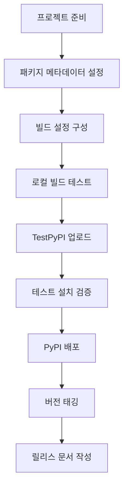

# Chapter 11: PyPI 배포하기

이번 챕터에서는 KRenamer 프로젝트를 PyPI(Python Package Index)에 배포하는 전체 과정을 학습합니다. 패키지 준비부터 자동화된 배포까지, 전문적인 Python 패키지 퍼블리싱 워크플로우를 완성해보겠습니다.

## 🎯 학습 목표

- **PyPI 배포 프로세스** 전체 이해
- **setup.py vs pyproject.toml** 현대적 패키징 방법
- **버전 관리** 및 **태깅 전략**
- **자동화된 배포** 파이프라인 구축
- **패키지 보안** 및 **검증** 방법

## 📚 PyPI 배포 개요

### PyPI란?

PyPI(Python Package Index)는 Python 패키지의 공식 저장소로, `pip install` 명령어로 설치할 수 있는 모든 패키지가 호스팅되는 곳입니다.

!!! info "PyPI 배포의 장점"
    - **전 세계 접근성**: 누구나 `pip install renamer`로 설치 가능
    - **의존성 관리**: pip이 자동으로 의존성 해결
    - **버전 관리**: 여러 버전 동시 호스팅 및 관리
    - **신뢰성**: 안정적인 CDN을 통한 빠른 다운로드

### 배포 프로세스 개요



## 🔧 프로젝트 구조 준비

### 1. 표준 패키지 구조

```bash title="최종 프로젝트 구조"
renamer/
├── src/
│   └── krenamer/
│       ├── __init__.py           # 버전 정보 포함
│       ├── main.py              # 진입점
│       ├── core.py              # 핵심 로직
│       ├── gui.py               # GUI 구현
│       └── assets/              # 리소스 파일
│           ├── icon.ico
│           └── logo.png
├── tests/
│   ├── __init__.py
│   ├── test_core.py
│   ├── test_gui.py
│   └── fixtures/
├── docs/
│   ├── *.md
│   └── images/
├── pyproject.toml               # 현대적 패키징 설정
├── setup.py                     # 레거시 호환성 (선택)
├── MANIFEST.in                  # 추가 파일 포함
├── README.md                    # PyPI 설명 페이지
├── LICENSE                      # 라이선스 파일
├── CHANGELOG.md                 # 변경 로그
└── requirements.txt             # 의존성 목록
```

### 2. 버전 관리 설정

```python title="src/krenamer/__init__.py"
"""
KRenamer - Korean Windows GUI file renaming tool
한국어 윈도우 GUI 파일명 변경 도구
"""

__version__ = "1.0.0"
__author__ = "KRenamer Team"
__email__ = "contact@krenamer.com"
__description__ = "Korean Windows GUI file renaming tool with drag & drop support"
__url__ = "https://github.com/geniuskey/krenamer"

# 주요 클래스들을 패키지 레벨에서 import 가능하게 설정
from .core import RenameEngine
from .gui import RenamerGUI

# 편의를 위한 버전 체크 함수
def get_version():
    """현재 버전 반환"""
    return __version__

def check_dependencies():
    """의존성 확인"""
    dependencies = {}
    
    try:
        import tkinter
        dependencies['tkinter'] = True
    except ImportError:
        dependencies['tkinter'] = False
    
    try:
        import tkinterdnd2
        dependencies['tkinterdnd2'] = True
    except ImportError:
        dependencies['tkinterdnd2'] = False
    
    return dependencies

# 패키지 정보 딕셔너리
__package_info__ = {
    'name': 'renamer',
    'version': __version__,
    'author': __author__,
    'email': __email__,
    'description': __description__,
    'url': __url__,
    'dependencies': check_dependencies()
}
```

## 📦 현대적 패키징 설정

### 1. pyproject.toml 기본 설정

```toml title="pyproject.toml"
[build-system]
requires = ["setuptools>=61.0", "wheel"]
build-backend = "setuptools.build_meta"

[project]
name = "renamer"
version = "1.0.0"
description = "Korean Windows GUI file renaming tool with drag & drop support"
readme = "README.md"
license = { file = "LICENSE" }
authors = [
    { name = "KRenamer Team", email = "contact@krenamer.com" }
]
maintainers = [
    { name = "KRenamer Team", email = "contact@krenamer.com" }
]
classifiers = [
    "Development Status :: 5 - Production/Stable",
    "Intended Audience :: End Users/Desktop",
    "License :: OSI Approved :: MIT License",
    "Operating System :: Microsoft :: Windows",
    "Operating System :: POSIX :: Linux",
    "Operating System :: MacOS",
    "Programming Language :: Python :: 3",
    "Programming Language :: Python :: 3.8",
    "Programming Language :: Python :: 3.9", 
    "Programming Language :: Python :: 3.10",
    "Programming Language :: Python :: 3.11",
    "Programming Language :: Python :: 3.12",
    "Topic :: Desktop Environment :: File Managers",
    "Topic :: Utilities",
    "Environment :: X11 Applications",
    "Environment :: Win32 (MS Windows)",
    "Environment :: MacOS X",
]
keywords = [
    "file-rename", "batch-rename", "gui", "tkinter",
    "korean", "drag-drop", "file-management", "utility"
]
requires-python = ">=3.8"
dependencies = [
    # 필수 의존성 없음 (tkinter는 Python 표준 라이브러리)
]

[project.optional-dependencies]
# 선택적 의존성 그룹
gui = [
    "tkinterdnd2>=0.3.0",  # 드래그 앤 드롭 지원
]
dev = [
    "pytest>=7.0.0",
    "pytest-cov>=4.0.0",
    "black>=23.0.0",
    "isort>=5.12.0",
    "flake8>=6.0.0",
    "mypy>=1.0.0",
]
docs = [
    "mkdocs>=1.5.0",
    "mkdocs-material>=9.0.0",
    "mkdocs-macros-plugin>=1.0.0",
]
build = [
    "build>=0.10.0",
    "twine>=4.0.0",
    "wheel>=0.40.0",
]

[project.urls]
Homepage = "https://github.com/geniuskey/krenamer"
Documentation = "https://geniuskey.github.io/krenamer"
Repository = "https://github.com/geniuskey/krenamer.git"
"Bug Tracker" = "https://github.com/geniuskey/krenamer/issues"
Discussions = "https://github.com/geniuskey/krenamer/discussions"
Changelog = "https://github.com/geniuskey/krenamer/blob/main/CHANGELOG.md"

[project.scripts]
# 명령줄 진입점
renamer = "krenamer.main:main"
krenamer = "krenamer.main:main"

[project.gui-scripts]
# GUI 애플리케이션 진입점 (Windows에서 콘솔 창 숨김)
renamer-gui = "krenamer.main:main"

[tool.setuptools]
package-dir = {"" = "src"}

[tool.setuptools.packages.find]
where = ["src"]

[tool.setuptools.package-data]
krenamer = ["assets/*"]

# 개발 도구 설정
[tool.black]
line-length = 88
target-version = ['py38']
include = '\.pyi?$'
extend-exclude = '''
/(
  # directories
  \.eggs
  | \.git
  | \.hg
  | \.mypy_cache
  | \.tox
  | \.venv
  | build
  | dist
)/
'''

[tool.isort]
profile = "black"
multi_line_output = 3
line_length = 88
known_first_party = ["krenamer"]

[tool.mypy]
python_version = "3.8"
warn_return_any = true
warn_unused_configs = true
disallow_untyped_defs = true
disallow_incomplete_defs = true
check_untyped_defs = true
disallow_untyped_decorators = true
no_implicit_optional = true
warn_redundant_casts = true
warn_unused_ignores = true
warn_no_return = true
warn_unreachable = true
strict_equality = true

[tool.pytest.ini_options]
testpaths = ["tests"]
python_files = ["test_*.py"]
python_classes = ["Test*"]
python_functions = ["test_*"]
addopts = [
    "--strict-markers",
    "--disable-warnings",
    "--cov=src/krenamer",
    "--cov-report=term-missing",
    "--cov-report=html",
    "--cov-report=xml",
]
markers = [
    "slow: marks tests as slow (deselect with '-m \"not slow\"')",
    "gui: marks tests as requiring GUI (deselect with '-m \"not gui\"')",
    "integration: marks tests as integration tests",
]

[tool.coverage.run]
source = ["src/krenamer"]
omit = [
    "*/tests/*",
    "*/test_*.py",
    "*/__pycache__/*",
    "*/.*",
]

[tool.coverage.report]
exclude_lines = [
    "pragma: no cover",
    "def __repr__",
    "if self.debug:",
    "if settings.DEBUG",
    "raise AssertionError",
    "raise NotImplementedError",
    "if 0:",
    "if __name__ == .__main__.:",
    "class .*\\bProtocol\\):",
    "@(abc\\.)?abstractmethod",
]
```

### 2. MANIFEST.in 설정

```text title="MANIFEST.in"
# 문서 파일들 포함
include README.md
include LICENSE
include CHANGELOG.md
include pyproject.toml

# 설정 파일들 포함
include requirements*.txt
include .gitignore

# 문서 디렉토리 포함
recursive-include docs *.md *.png *.jpg *.gif
recursive-include docs *.yml *.yaml

# 테스트 파일들 포함
recursive-include tests *.py
recursive-include tests *.txt *.json

# 에셋 파일들 포함
recursive-include src/krenamer/assets *.ico *.png *.jpg *.gif

# 불필요한 파일들 제외
recursive-exclude * __pycache__
recursive-exclude * *.py[co]
recursive-exclude * *.so
recursive-exclude * .DS_Store
recursive-exclude * Thumbs.db
exclude .gitignore
exclude .github
exclude .vscode
exclude *.egg-info
```

### 3. 동적 버전 관리

```python title="src/krenamer/_version.py"
"""
동적 버전 관리 모듈
Git 태그를 기반으로 버전을 자동 생성
"""

import os
import subprocess
from typing import Optional

def get_git_version() -> Optional[str]:
    """Git 태그에서 버전 정보 추출"""
    try:
        # 현재 디렉토리가 Git 저장소인지 확인
        git_dir = subprocess.check_output(
            ['git', 'rev-parse', '--git-dir'],
            stderr=subprocess.DEVNULL,
            text=True
        ).strip()
        
        if not git_dir:
            return None
            
        # 최신 태그 가져오기
        tag = subprocess.check_output(
            ['git', 'describe', '--tags', '--exact-match'],
            stderr=subprocess.DEVNULL,
            text=True
        ).strip()
        
        # v 접두사 제거
        if tag.startswith('v'):
            tag = tag[1:]
            
        return tag
        
    except (subprocess.CalledProcessError, FileNotFoundError):
        return None

def get_version() -> str:
    """버전 정보 반환"""
    # Git 태그에서 버전 가져오기 시도
    git_version = get_git_version()
    if git_version:
        return git_version
    
    # 환경 변수에서 버전 가져오기 (CI/CD 환경)
    env_version = os.getenv('KRENAMER_VERSION')
    if env_version:
        return env_version
    
    # 기본 버전 (개발 환경)
    return "1.0.0-dev"

# 버전 상수
__version__ = get_version()
```

```toml title="pyproject.toml에 동적 버전 설정 추가"
[project]
# ... 기존 설정 ...
dynamic = ["version"]

[tool.setuptools.dynamic]
version = {attr = "krenamer._version.__version__"}
```

## 📝 문서 및 메타데이터 준비

### 1. PyPI용 README.md 작성

```markdown title="README.md"
# KRenamer


**Korean Windows GUI file renaming tool with drag & drop support**

KRenamer는 윈도우 환경에서 파일명을 일괄적으로 변경할 수 있는 한국어 GUI 도구입니다. 
드래그 앤 드롭 기능과 다양한 리네임 옵션을 지원하여 효율적인 파일 관리가 가능합니다.

## ✨ 주요 기능

- 🎯 **직관적인 GUI**: 드래그 앤 드롭으로 파일 추가
- 🔧 **다양한 리네임 방식**: 접두사/접미사, 순번 매기기, 찾기/바꾸기
- 🎛️ **고급 필터링**: 파일 크기, 확장자, 날짜별 조건부 처리
- 🔍 **실시간 미리보기**: 변경 결과를 사전에 확인
- 🔄 **되돌리기 기능**: 안전한 파일 작업
- 🌏 **한국어 지원**: 완전한 한국어 인터페이스

## 🚀 설치

### PyPI를 통한 설치 (권장)

```bash
pip install renamer
```

### 추가 기능이 포함된 설치

```bash
# 드래그 앤 드롭 기능 포함
pip install renamer[gui]

# 개발 도구 포함
pip install renamer[dev]
```

### 소스에서 설치

```bash
git clone https://github.com/geniuskey/krenamer.git
cd renamer
pip install -e .
```

## 🎮 사용법

### GUI 모드 실행

```bash
# 명령어로 실행
renamer

# 또는
krenamer

# Python 모듈로 실행
python -m krenamer.main
```

### 프로그래밍 방식 사용

```python
from krenamer import RenameEngine

# 리네임 엔진 생성
engine = RenameEngine()

# 파일 추가
engine.add_file("/path/to/file1.txt")
engine.add_file("/path/to/file2.jpg")

# 리네임 옵션 설정
engine.prefix = "NEW_"
engine.suffix = "_BACKUP"

# 미리보기 생성
preview = engine.generate_preview()
for original, new, valid in preview:
    print(f"{original} -> {new} ({'✓' if valid else '✗'})")

# 실행
result = engine.execute_rename()
print(f"성공: {result['success']}, 실패: {result['failed']}")
```

## 📋 시스템 요구사항

- **Python**: 3.8 이상
- **운영체제**: Windows, macOS, Linux
- **필수 라이브러리**: tkinter (Python 표준 라이브러리)
- **선택 라이브러리**: tkinterdnd2 (드래그 앤 드롭 기능)

## 🔧 개발 환경 설정

```bash
# 저장소 클론
git clone https://github.com/geniuskey/krenamer.git
cd renamer

# 개발 의존성 설치
pip install -e .[dev]

# 테스트 실행
pytest

# 코드 포맷팅
black src/ tests/
isort src/ tests/

# 타입 체크
mypy src/
```

## 📚 문서

- [사용자 가이드](https://geniuskey.github.io/krenamer)
- [API 문서](https://geniuskey.github.io/krenamer/api/)
- [개발자 가이드](https://geniuskey.github.io/krenamer/contributing/)
- [튜토리얼](https://geniuskey.github.io/krenamer/tutorial/)

## 🤝 기여하기

KRenamer는 오픈소스 프로젝트입니다. 기여를 환영합니다!

1. 이 저장소를 포크하세요
2. 기능 브랜치를 만드세요 (`git checkout -b feature/amazing-feature`)
3. 변경사항을 커밋하세요 (`git commit -m 'Add amazing feature'`)
4. 브랜치에 푸시하세요 (`git push origin feature/amazing-feature`)
5. Pull Request를 열어주세요

자세한 내용은 [기여 가이드](contributing.md)를 참조하세요.

## 📄 라이선스

이 프로젝트는 MIT 라이선스 하에 배포됩니다. 자세한 내용은 [LICENSE](LICENSE.md) 파일을 참조하세요.

## 🙏 감사의 말

- [tkinterdnd2](https://github.com/pmgagne/tkinterdnd2) - 드래그 앤 드롭 기능
- [Python](https://python.org) - 훌륭한 프로그래밍 언어
- 모든 기여자와 사용자들

## 📞 지원

- [이슈 리포트](https://github.com/geniuskey/krenamer/issues)
- [토론](https://github.com/geniuskey/krenamer/discussions)
- [이메일](mailto:contact@krenamer.com)

---

**KRenamer**를 사용해 주셔서 감사합니다! ⭐️ 이 프로젝트가 도움이 되셨다면 GitHub에서 스타를 눌러주세요.
```

### 2. 변경 로그 작성

```markdown title="CHANGELOG.md"
# Changelog

All notable changes to this project will be documented in this file.

The format is based on [Keep a Changelog](https://keepachangelog.com/en/1.0.0/),
and this project adheres to [Semantic Versioning](https://semver.org/spec/v2.0.0.html).

## [Unreleased]

### Added
- 새로운 기능들이 여기에 추가됩니다.

### Changed
- 기존 기능의 변경사항들이 여기에 기록됩니다.

### Fixed
- 버그 수정 내용들이 여기에 기록됩니다.

## [1.0.0] - 2024-01-15

### Added
- 드래그 앤 드롭 파일 추가 기능
- 다양한 리네임 방식 지원 (접두사, 접미사, 순번, 찾기/바꾸기)
- 실시간 미리보기 기능
- 고급 필터링 시스템 (크기, 확장자, 날짜별)
- 사용자 설정 저장/복원
- 작업 히스토리 및 되돌리기 기능
- 정규표현식 지원
- 한국어 완전 지원
- 크로스 플랫폼 지원 (Windows, macOS, Linux)
- 명령줄 인터페이스 지원
- 패키지형 배포 지원

### Technical
- Python 3.8+ 지원
- tkinter 기반 GUI
- 플러그인 아키텍처
- 종합적인 테스트 스위트
- GitHub Actions CI/CD
- MkDocs 문서화
- PyPI 배포 자동화

## [0.9.0] - 2023-12-20

### Added
- 베타 버전 릴리스
- 핵심 기능 구현 완료
- 기본 GUI 인터페이스

### Fixed
- 파일 경로 처리 개선
- Windows 호환성 문제 해결

## [0.1.0] - 2023-11-01

### Added
- 초기 프로젝트 구조
- 기본 파일명 변경 기능
- 간단한 GUI 프로토타입

[Unreleased]: https://github.com/geniuskey/krenamer/compare/v1.0.0...HEAD
[1.0.0]: https://github.com/geniuskey/krenamer/compare/v0.9.0...v1.0.0
[0.9.0]: https://github.com/geniuskey/krenamer/compare/v0.1.0...v0.9.0
[0.1.0]: https://github.com/geniuskey/krenamer/releases/tag/v0.1.0
```

### 3. 라이선스 파일

```text title="LICENSE"
MIT License

Copyright (c) 2024 KRenamer Team

Permission is hereby granted, free of charge, to any person obtaining a copy
of this software and associated documentation files (the "Software"), to deal
in the Software without restriction, including without limitation the rights
to use, copy, modify, merge, publish, distribute, sublicense, and/or sell
copies of the Software, and to permit persons to whom the Software is
furnished to do so, subject to the following conditions:

The above copyright notice and this permission notice shall be included in all
copies or substantial portions of the Software.

THE SOFTWARE IS PROVIDED "AS IS", WITHOUT WARRANTY OF ANY KIND, EXPRESS OR
IMPLIED, INCLUDING BUT NOT LIMITED TO THE WARRANTIES OF MERCHANTABILITY,
FITNESS FOR A PARTICULAR PURPOSE AND NONINFRINGEMENT. IN NO EVENT SHALL THE
AUTHORS OR COPYRIGHT HOLDERS BE LIABLE FOR ANY CLAIM, DAMAGES OR OTHER
LIABILITY, WHETHER IN AN ACTION OF CONTRACT, TORT OR OTHERWISE, ARISING FROM,
OUT OF OR IN CONNECTION WITH THE SOFTWARE OR THE USE OR OTHER DEALINGS IN THE
SOFTWARE.
```

## 🔨 빌드 및 테스트

### 1. 로컬 빌드 스크립트

```python title="scripts/build.py"
#!/usr/bin/env python3
"""
빌드 자동화 스크립트
로컬 환경에서 패키지 빌드 및 검증
"""

import os
import sys
import subprocess
import shutil
from pathlib import Path

def run_command(cmd, description):
    """명령어 실행 및 결과 확인"""
    print(f"\n📋 {description}")
    print(f"💻 실행: {cmd}")
    
    result = subprocess.run(cmd, shell=True, capture_output=True, text=True)
    
    if result.returncode != 0:
        print(f"❌ 실패: {description}")
        print(f"오류 출력: {result.stderr}")
        sys.exit(1)
    else:
        print(f"✅ 성공: {description}")
        if result.stdout.strip():
            print(f"출력: {result.stdout.strip()}")

def clean_build():
    """빌드 아티팩트 정리"""
    print("🧹 빌드 아티팩트 정리 중...")
    
    dirs_to_clean = [
        "build", "dist", "*.egg-info",
        "src/*.egg-info", "__pycache__"
    ]
    
    for pattern in dirs_to_clean:
        for path in Path(".").glob(pattern):
            if path.is_dir():
                shutil.rmtree(path)
                print(f"   삭제됨: {path}")
            elif path.is_file():
                path.unlink()
                print(f"   삭제됨: {path}")

def check_environment():
    """개발 환경 확인"""
    print("🔍 개발 환경 확인 중...")
    
    # Python 버전 확인
    python_version = sys.version_info
    if python_version < (3, 8):
        print(f"❌ Python 3.8 이상이 필요합니다. 현재: {python_version}")
        sys.exit(1)
    
    print(f"✅ Python {python_version.major}.{python_version.minor}.{python_version.micro}")
    
    # 필요한 도구들 확인
    required_tools = ['build', 'twine', 'pytest']
    for tool in required_tools:
        try:
            subprocess.run([tool, '--version'], capture_output=True, check=True)
            print(f"✅ {tool} 설치됨")
        except (subprocess.CalledProcessError, FileNotFoundError):
            print(f"❌ {tool}이 설치되지 않았습니다. pip install {tool}")
            sys.exit(1)

def run_tests():
    """테스트 실행"""
    print("🧪 테스트 실행 중...")
    
    # 단위 테스트
    run_command("pytest tests/ -v --tb=short", "단위 테스트 실행")
    
    # 커버리지 테스트
    run_command("pytest tests/ --cov=src/krenamer --cov-report=term-missing", "커버리지 테스트")
    
    # 타입 체크
    run_command("mypy src/krenamer", "타입 체크")

def run_quality_checks():
    """코드 품질 검사"""
    print("🔍 코드 품질 검사 중...")
    
    # 포맷팅 체크
    run_command("black --check src/ tests/", "Black 포맷팅 체크")
    
    # Import 정렬 체크
    run_command("isort --check-only src/ tests/", "isort Import 정렬 체크")
    
    # 린트 체크
    run_command("flake8 src/ tests/", "Flake8 린트 체크")
    
    # 보안 체크
    run_command("bandit -r src/", "Bandit 보안 체크")

def build_package():
    """패키지 빌드"""
    print("📦 패키지 빌드 중...")
    
    # 빌드 실행
    run_command("python -m build", "패키지 빌드")
    
    # 빌드 결과 확인
    dist_files = list(Path("dist").glob("*"))
    print(f"\n📁 빌드된 파일들:")
    for file in dist_files:
        print(f"   {file.name} ({file.stat().st_size:,} bytes)")

def verify_package():
    """패키지 검증"""
    print("🔍 패키지 검증 중...")
    
    # twine check
    run_command("twine check dist/*", "Twine 패키지 검증")
    
    # 패키지 내용 확인
    run_command("python -m tarfile -l dist/*.tar.gz", "소스 배포판 내용 확인")

def main():
    """메인 빌드 프로세스"""
    print("🚀 KRenamer 패키지 빌드 시작")
    print("=" * 50)
    
    try:
        # 1. 환경 확인
        check_environment()
        
        # 2. 정리
        clean_build()
        
        # 3. 코드 품질 검사
        run_quality_checks()
        
        # 4. 테스트 실행
        run_tests()
        
        # 5. 패키지 빌드
        build_package()
        
        # 6. 패키지 검증
        verify_package()
        
        print("\n🎉 빌드 완료!")
        print("📦 dist/ 디렉토리에서 빌드된 패키지를 확인하세요.")
        
    except KeyboardInterrupt:
        print("\n⏹️ 사용자에 의해 중단됨")
        sys.exit(1)
    except Exception as e:
        print(f"\n💥 예상치 못한 오류: {e}")
        sys.exit(1)

if __name__ == "__main__":
    main()
```

### 2. TestPyPI 배포 스크립트

```python title="scripts/deploy_test.py"
#!/usr/bin/env python3
"""
TestPyPI 배포 스크립트
실제 PyPI 배포 전 테스트용 배포
"""

import os
import sys
import subprocess
import getpass
from pathlib import Path

def check_credentials():
    """TestPyPI 자격증명 확인"""
    print("🔐 TestPyPI 자격증명 확인 중...")
    
    # API 토큰 확인
    token = os.getenv('TEST_PYPI_TOKEN')
    if not token:
        print("⚠️ TEST_PYPI_TOKEN 환경변수가 설정되지 않았습니다.")
        token = getpass.getpass("TestPyPI API 토큰을 입력하세요: ")
        if not token:
            print("❌ API 토큰이 필요합니다.")
            sys.exit(1)
    
    return token

def upload_to_testpypi(token):
    """TestPyPI에 업로드"""
    print("📤 TestPyPI에 업로드 중...")
    
    cmd = [
        "twine", "upload",
        "--repository", "testpypi",
        "--username", "__token__",
        "--password", token,
        "dist/*"
    ]
    
    result = subprocess.run(cmd, capture_output=True, text=True)
    
    if result.returncode != 0:
        print(f"❌ 업로드 실패: {result.stderr}")
        sys.exit(1)
    else:
        print("✅ TestPyPI 업로드 성공!")
        print("🔗 https://test.pypi.org/project/krenamer/")

def test_installation():
    """TestPyPI에서 설치 테스트"""
    print("🧪 TestPyPI에서 설치 테스트 중...")
    
    # 임시 가상환경 생성
    print("   가상환경 생성 중...")
    subprocess.run([sys.executable, "-m", "venv", "test_env"], check=True)
    
    # 가상환경에서 설치 테스트
    if sys.platform == "win32":
        pip_path = "test_env/Scripts/pip"
        python_path = "test_env/Scripts/python"
    else:
        pip_path = "test_env/bin/pip"
        python_path = "test_env/bin/python"
    
    try:
        # TestPyPI에서 설치
        print("   TestPyPI에서 설치 중...")
        subprocess.run([
            pip_path, "install",
            "--index-url", "https://test.pypi.org/simple/",
            "--extra-index-url", "https://pypi.org/simple/",
            "renamer"
        ], check=True)
        
        # 임포트 테스트
        print("   임포트 테스트 중...")
        subprocess.run([
            python_path, "-c",
            "import krenamer; print(f'버전: {krenamer.__version__}')"
        ], check=True)
        
        print("✅ 설치 테스트 성공!")
        
    finally:
        # 임시 환경 정리
        import shutil
        shutil.rmtree("test_env", ignore_errors=True)

def main():
    """메인 프로세스"""
    print("🧪 TestPyPI 배포 및 테스트")
    print("=" * 40)
    
    # 빌드된 파일 확인
    dist_files = list(Path("dist").glob("*"))
    if not dist_files:
        print("❌ dist/ 디렉토리에 빌드된 파일이 없습니다.")
        print("   먼저 'python scripts/build.py'를 실행하세요.")
        sys.exit(1)
    
    try:
        # 1. 자격증명 확인
        token = check_credentials()
        
        # 2. TestPyPI 업로드
        upload_to_testpypi(token)
        
        # 3. 설치 테스트
        test_installation()
        
        print("\n🎉 TestPyPI 배포 및 테스트 완료!")
        print("🔗 TestPyPI 페이지: https://test.pypi.org/project/krenamer/")
        print("📋 다음 단계: 실제 PyPI 배포")
        
    except KeyboardInterrupt:
        print("\n⏹️ 사용자에 의해 중단됨")
        sys.exit(1)
    except Exception as e:
        print(f"\n💥 예상치 못한 오류: {e}")
        sys.exit(1)

if __name__ == "__main__":
    main()
```

## 🚀 자동화된 배포 시스템

### 1. 릴리스 자동화 워크플로우 (확장)

```yaml title=".github/workflows/release-advanced.yml"
name: Advanced Release Pipeline

on:
  push:
    tags:
      - 'v*'
  workflow_dispatch:
    inputs:
      version:
        description: 'Release version (e.g., 1.0.0)'
        required: true
        type: string
      prerelease:
        description: 'Mark as pre-release'
        required: false
        type: boolean
        default: false

env:
  PYTHON_VERSION: '3.11'

jobs:
  validate-release:
    name: Validate Release
    runs-on: ubuntu-latest
    outputs:
      version: ${{ steps.get-version.outputs.version }}
      is-prerelease: ${{ steps.check-prerelease.outputs.result }}
      
    steps:
    - name: Checkout code
      uses: actions/checkout@v4
      with:
        fetch-depth: 0
        
    - name: Get version from tag or input
      id: get-version
      run: |
        if [ "${{ github.event_name }}" = "workflow_dispatch" ]; then
          VERSION="${{ github.event.inputs.version }}"
        else
          VERSION=${GITHUB_REF#refs/tags/v}
        fi
        echo "version=$VERSION" >> $GITHUB_OUTPUT
        echo "📋 Release Version: $VERSION"
        
    - name: Check if prerelease
      id: check-prerelease
      run: |
        VERSION="${{ steps.get-version.outputs.version }}"
        if [[ "$VERSION" =~ (alpha|beta|rc) ]] || [ "${{ github.event.inputs.prerelease }}" = "true" ]; then
          echo "result=true" >> $GITHUB_OUTPUT
          echo "🔄 Pre-release detected"
        else
          echo "result=false" >> $GITHUB_OUTPUT
          echo "✅ Stable release"
        fi
        
    - name: Validate version format
      run: |
        VERSION="${{ steps.get-version.outputs.version }}"
        if ! [[ "$VERSION" =~ ^[0-9]+\.[0-9]+\.[0-9]+(-[a-zA-Z0-9]+)?$ ]]; then
          echo "❌ Invalid version format: $VERSION"
          echo "Expected format: X.Y.Z or X.Y.Z-suffix"
          exit 1
        fi
        echo "✅ Valid version format: $VERSION"

  security-scan:
    name: Security Scan
    runs-on: ubuntu-latest
    needs: validate-release
    
    steps:
    - name: Checkout code
      uses: actions/checkout@v4
      
    - name: Set up Python
      uses: actions/setup-python@v4
      with:
        python-version: ${{ env.PYTHON_VERSION }}
        
    - name: Install security tools
      run: |
        pip install bandit safety pip-audit
        pip install -e .
        
    - name: Run security scan
      run: |
        echo "🔍 Running security scans..."
        
        # Bandit scan
        bandit -r src/ -f json -o bandit-report.json
        bandit -r src/
        
        # Safety scan
        safety check --json --output safety-report.json
        safety check
        
        # Pip audit
        pip-audit --format=json --output=pip-audit-report.json
        pip-audit
        
        echo "✅ All security scans passed"
        
    - name: Upload security reports
      uses: actions/upload-artifact@v3
      if: always()
      with:
        name: security-reports-${{ needs.validate-release.outputs.version }}
        path: |
          bandit-report.json
          safety-report.json
          pip-audit-report.json

  build-and-test:
    name: Build and Test
    runs-on: ${{ matrix.os }}
    needs: [validate-release, security-scan]
    strategy:
      matrix:
        os: [ubuntu-latest, windows-latest, macos-latest]
        python-version: ['3.8', '3.9', '3.10', '3.11', '3.12']
        exclude:
          - os: macos-latest
            python-version: '3.8'
    
    steps:
    - name: Checkout code
      uses: actions/checkout@v4
      
    - name: Set up Python ${{ matrix.python-version }}
      uses: actions/setup-python@v4
      with:
        python-version: ${{ matrix.python-version }}
        
    - name: Install dependencies
      run: |
        python -m pip install --upgrade pip
        pip install build pytest pytest-cov
        pip install -e .[dev]
        
    - name: Run tests
      run: |
        pytest tests/ -v --cov=src/krenamer --cov-report=xml
        
    - name: Build package
      run: |
        python -m build
        
    - name: Upload build artifacts
      uses: actions/upload-artifact@v3
      with:
        name: dist-${{ matrix.os }}-python${{ matrix.python-version }}
        path: dist/

  test-pypi-upload:
    name: Test PyPI Upload
    runs-on: ubuntu-latest
    needs: [validate-release, build-and-test]
    if: needs.validate-release.outputs.is-prerelease == 'true'
    environment: test-pypi
    
    steps:
    - name: Checkout code
      uses: actions/checkout@v4
      
    - name: Set up Python
      uses: actions/setup-python@v4
      with:
        python-version: ${{ env.PYTHON_VERSION }}
        
    - name: Download build artifacts
      uses: actions/download-artifact@v3
      with:
        name: dist-ubuntu-latest-python${{ env.PYTHON_VERSION }}
        path: dist/
        
    - name: Install twine
      run: pip install twine
      
    - name: Upload to Test PyPI
      env:
        TWINE_USERNAME: __token__
        TWINE_PASSWORD: ${{ secrets.TEST_PYPI_API_TOKEN }}
      run: |
        twine upload --repository testpypi dist/*
        
    - name: Test installation from Test PyPI
      run: |
        # 잠시 대기 (TestPyPI 반영 시간)
        sleep 60
        
        # 임시 환경에서 설치 테스트
        python -m venv test_env
        source test_env/bin/activate || test_env/Scripts/activate
        
        pip install --index-url https://test.pypi.org/simple/ \
                   --extra-index-url https://pypi.org/simple/ \
                   renamer==${{ needs.validate-release.outputs.version }}
        
        # 기본 임포트 테스트
        python -c "import krenamer; print(f'✅ Successfully imported KRenamer v{krenamer.__version__}')"

  create-release:
    name: Create GitHub Release
    runs-on: ubuntu-latest
    needs: [validate-release, build-and-test]
    outputs:
      upload_url: ${{ steps.create_release.outputs.upload_url }}
      
    steps:
    - name: Checkout code
      uses: actions/checkout@v4
      with:
        fetch-depth: 0
        
    - name: Generate release notes
      id: generate-notes
      run: |
        VERSION="${{ needs.validate-release.outputs.version }}"
        
        # 이전 태그 찾기
        PREVIOUS_TAG=$(git tag --sort=-version:refname | grep -v "v$VERSION" | head -1)
        
        # 변경사항 생성
        if [ -n "$PREVIOUS_TAG" ]; then
          CHANGES=$(git log $PREVIOUS_TAG..HEAD --pretty=format:"- %s" --no-merges)
        else
          CHANGES=$(git log --pretty=format:"- %s" --no-merges)
        fi
        
        # 릴리스 노트 파일 생성
        cat > release_notes.md << EOF
        ## 🚀 KRenamer v$VERSION 릴리스
        
        ### ✨ 새로운 기능 및 개선사항
        $CHANGES
        
        ### 📦 설치 방법
        
        \`\`\`bash
        pip install renamer==$VERSION
        \`\`\`
        
        ### 🔗 관련 링크
        - [문서](https://geniuskey.github.io/krenamer)
        - [PyPI 패키지](https://pypi.org/project/krenamer/$VERSION/)
        - [소스 코드](https://github.com/geniuskey/krenamer/tree/v$VERSION)
        
        ### 🔍 체크섬 확인
        릴리스된 바이너리의 무결성을 확인하려면 함께 제공되는 .sha256 파일을 사용하세요.
        EOF
        
    - name: Create Release
      id: create_release
      uses: actions/create-release@v1
      env:
        GITHUB_TOKEN: ${{ secrets.GITHUB_TOKEN }}
      with:
        tag_name: v${{ needs.validate-release.outputs.version }}
        release_name: KRenamer v${{ needs.validate-release.outputs.version }}
        body_path: release_notes.md
        draft: false
        prerelease: ${{ needs.validate-release.outputs.is-prerelease == 'true' }}

  pypi-upload:
    name: Upload to PyPI
    runs-on: ubuntu-latest
    needs: [validate-release, build-and-test, create-release]
    if: needs.validate-release.outputs.is-prerelease == 'false'
    environment: pypi
    
    steps:
    - name: Download build artifacts
      uses: actions/download-artifact@v3
      with:
        name: dist-ubuntu-latest-python${{ env.PYTHON_VERSION }}
        path: dist/
        
    - name: Install twine
      run: pip install twine
      
    - name: Upload to PyPI
      env:
        TWINE_USERNAME: __token__
        TWINE_PASSWORD: ${{ secrets.PYPI_API_TOKEN }}
      run: |
        twine upload dist/*
        
    - name: Verify PyPI upload
      run: |
        # PyPI 반영 대기
        sleep 120
        
        # 설치 테스트
        pip install renamer==${{ needs.validate-release.outputs.version }}
        python -c "import krenamer; print(f'✅ PyPI upload verified: v{krenamer.__version__}')"

  notify-release:
    name: Notify Release Completion
    runs-on: ubuntu-latest
    needs: [validate-release, create-release, pypi-upload]
    if: always()
    
    steps:
    - name: Send Discord notification
      uses: sarisia/actions-status-discord@v1
      if: ${{ needs.pypi-upload.result == 'success' }}
      with:
        webhook: ${{ secrets.DISCORD_WEBHOOK }}
        title: "🎉 KRenamer v${{ needs.validate-release.outputs.version }} Released!"
        description: |
          새 버전이 성공적으로 배포되었습니다!
          
          📦 **PyPI**: https://pypi.org/project/krenamer/${{ needs.validate-release.outputs.version }}/
          📖 **릴리스 노트**: ${{ needs.create-release.outputs.html_url }}
          🔗 **문서**: https://geniuskey.github.io/krenamer
          
          설치: `pip install renamer==${{ needs.validate-release.outputs.version }}`
        color: 0x00ff00
        
    - name: Send failure notification
      uses: sarisia/actions-status-discord@v1
      if: ${{ contains(needs.*.result, 'failure') }}
      with:
        webhook: ${{ secrets.DISCORD_WEBHOOK }}
        title: "❌ KRenamer Release Failed"
        description: "릴리스 과정에서 오류가 발생했습니다. GitHub Actions를 확인해주세요."
        color: 0xff0000
```

## 📊 배포 모니터링 및 분석

### 1. 배포 상태 체크 스크립트

```python title="scripts/check_deployment.py"
#!/usr/bin/env python3
"""
배포 상태 체크 스크립트
PyPI 배포 후 상태 확인 및 검증
"""

import requests
import json
import time
import sys
from typing import Dict, Any

def check_pypi_status(package_name: str, version: str) -> Dict[str, Any]:
    """PyPI 패키지 상태 확인"""
    url = f"https://pypi.org/pypi/{package_name}/{version}/json"
    
    try:
        response = requests.get(url, timeout=10)
        if response.status_code == 200:
            data = response.json()
            return {
                'status': 'available',
                'version': data['info']['version'],
                'upload_time': data['releases'][version][0]['upload_time'],
                'downloads': data['info'].get('downloads', {}),
                'files': len(data['releases'][version])
            }
        elif response.status_code == 404:
            return {'status': 'not_found'}
        else:
            return {'status': 'error', 'code': response.status_code}
    except requests.RequestException as e:
        return {'status': 'error', 'message': str(e)}

def check_installation(package_name: str, version: str) -> Dict[str, Any]:
    """패키지 설치 테스트"""
    import subprocess
    import tempfile
    import shutil
    
    with tempfile.TemporaryDirectory() as temp_dir:
        try:
            # 가상환경 생성
            subprocess.run([
                sys.executable, '-m', 'venv', 
                f'{temp_dir}/test_env'
            ], check=True, capture_output=True)
            
            # pip 경로 설정
            if sys.platform == 'win32':
                pip_path = f'{temp_dir}/test_env/Scripts/pip'
                python_path = f'{temp_dir}/test_env/Scripts/python'
            else:
                pip_path = f'{temp_dir}/test_env/bin/pip'
                python_path = f'{temp_dir}/test_env/bin/python'
            
            # 패키지 설치
            install_result = subprocess.run([
                pip_path, 'install', f'{package_name}=={version}'
            ], capture_output=True, text=True)
            
            if install_result.returncode != 0:
                return {
                    'status': 'install_failed',
                    'error': install_result.stderr
                }
            
            # 임포트 테스트
            import_result = subprocess.run([
                python_path, '-c', 
                f'import {package_name.replace("-", "_")}; print("SUCCESS")'
            ], capture_output=True, text=True)
            
            if import_result.returncode != 0:
                return {
                    'status': 'import_failed',
                    'error': import_result.stderr
                }
            
            return {'status': 'success'}
            
        except subprocess.CalledProcessError as e:
            return {'status': 'error', 'message': str(e)}

def check_download_stats(package_name: str) -> Dict[str, Any]:
    """패키지 다운로드 통계 확인"""
    url = f"https://pypistats.org/api/packages/{package_name}/recent"
    
    try:
        response = requests.get(url, timeout=10)
        if response.status_code == 200:
            return response.json()
        else:
            return {'status': 'unavailable'}
    except requests.RequestException:
        return {'status': 'error'}

def main():
    """메인 체크 프로세스"""
    package_name = "renamer"
    version = sys.argv[1] if len(sys.argv) > 1 else input("확인할 버전을 입력하세요: ")
    
    print(f"🔍 KRenamer v{version} 배포 상태 확인")
    print("=" * 50)
    
    # 1. PyPI 가용성 확인
    print("📦 PyPI 패키지 상태 확인 중...")
    pypi_status = check_pypi_status(package_name, version)
    
    if pypi_status['status'] == 'available':
        print(f"✅ PyPI에서 사용 가능")
        print(f"   버전: {pypi_status['version']}")
        print(f"   업로드 시간: {pypi_status['upload_time']}")
        print(f"   파일 개수: {pypi_status['files']}")
    elif pypi_status['status'] == 'not_found':
        print(f"❌ PyPI에서 찾을 수 없음")
        return
    else:
        print(f"⚠️ PyPI 상태 확인 오류: {pypi_status}")
    
    # 2. 설치 테스트
    print("\n🧪 설치 테스트 중...")
    install_status = check_installation(package_name, version)
    
    if install_status['status'] == 'success':
        print("✅ 설치 및 임포트 성공")
    else:
        print(f"❌ 설치 테스트 실패: {install_status}")
    
    # 3. 다운로드 통계
    print("\n📊 다운로드 통계 확인 중...")
    stats = check_download_stats(package_name)
    
    if 'data' in stats:
        recent_downloads = stats['data']
        print(f"✅ 최근 다운로드 통계:")
        print(f"   일간: {recent_downloads.get('last_day', 'N/A')}")
        print(f"   주간: {recent_downloads.get('last_week', 'N/A')}")
        print(f"   월간: {recent_downloads.get('last_month', 'N/A')}")
    else:
        print("⚠️ 다운로드 통계를 가져올 수 없음")
    
    print(f"\n🎉 배포 상태 확인 완료!")
    print(f"🔗 PyPI 페이지: https://pypi.org/project/{package_name}/{version}/")

if __name__ == "__main__":
    main()
```

## 🎯 베스트 프랙티스 및 팁

### 1. 버전 관리 전략

!!! tip "Semantic Versioning 가이드"
    - **MAJOR.MINOR.PATCH** 형식 사용
    - **Major**: 호환성을 깨는 변경
    - **Minor**: 하위 호환되는 기능 추가
    - **Patch**: 하위 호환되는 버그 수정
    - **Pre-release**: `-alpha.1`, `-beta.2`, `-rc.1` 등

### 2. 보안 고려사항

!!! warning "보안 체크리스트"
    - ✅ API 토큰을 GitHub Secrets에 저장
    - ✅ 배포 환경에 보호 규칙 설정
    - ✅ 의존성 취약점 정기 스캔
    - ✅ 릴리스 서명 및 체크섬 제공
    - ✅ 패키지 내용 최소화

### 3. 품질 보증

!!! info "품질 관리 전략"
    - **자동화된 테스트**: 모든 플랫폼에서 테스트
    - **TestPyPI 활용**: 실제 배포 전 테스트
    - **점진적 배포**: 베타 → RC → 정식
    - **롤백 계획**: 문제 발생 시 빠른 대응

## 🏁 마무리

PyPI 배포를 통해 완성한 전문적인 패키지 퍼블리싱:

- ✅ **현대적 패키징**: pyproject.toml 기반 설정
- ✅ **자동화된 배포**: GitHub Actions CI/CD
- ✅ **품질 보증**: 다단계 테스트 및 검증
- ✅ **보안 강화**: 시크릿 관리 및 취약점 스캔
- ✅ **모니터링**: 배포 상태 추적 및 분석

!!! success "Chapter 10 완료!"
    PyPI를 통한 전문적인 패키지 배포 시스템을 성공적으로 구축했습니다!
    이제 마지막으로 PyInstaller를 통한 독립 실행파일 생성을 학습해보겠습니다.

!!! tip "추가 학습 자료"
    - [Python Packaging User Guide](https://packaging.python.org/)
    - [PyPI 공식 문서](https://pypi.org/help/)
    - [Twine 사용법](https://twine.readthedocs.io/)
    - [Semantic Versioning](https://semver.org/)