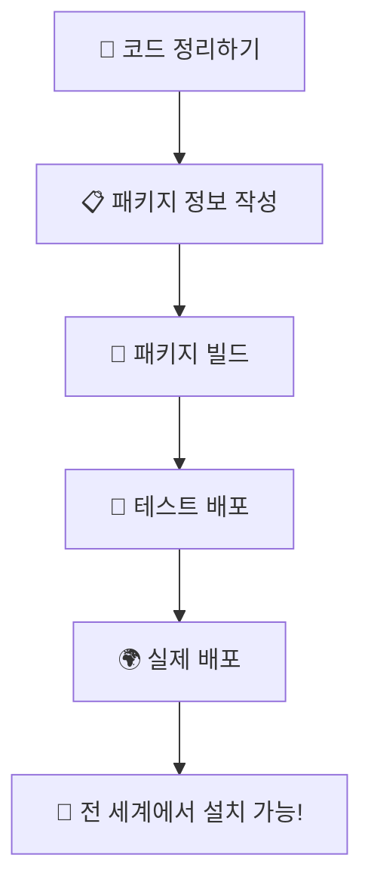

# Chapter 11: 전 세계에 내 프로그램 배포하기 - PyPI

이번 챕터에서는 **"pip install renamer"** 한 줄로 전 세계 누구나 우리 프로그램을 설치할 수 있게 만들어보겠습니다!

마치 **앱스토어에 앱을 올리는 것**<!-- -->처럼, Python의 공식 패키지 저장소인 PyPI에 우리 프로그램을 올려보겠습니다.

## 🎯 이번 챕터의 목표

- **"PyPI가 뭔지"** 이해하기 (Python의 앱스토어!)
- **"패키지란 뭔지"** 개념 잡기
- **우리 프로그램을 패키지로 만들기**
- **실제로 PyPI에 올려보기** (전 세계 배포!)

## 🏪 PyPI는 Python의 앱스토어

### PyPI가 뭔가요?

PyPI(Python Package Index)는 **Python의 공식 앱스토어**<!-- -->라고 생각하면 됩니다.

- **스마트폰**: 앱스토어에서 앱 다운로드 → `App Store에서 앱 설치`
- **Python**: PyPI에서 패키지 다운로드 → `pip install 패키지명`

### PyPI에 올리면 좋은 점들

!!! success "PyPI의 마법"
    **Before**: "내 프로그램 써보려면..."
    
    1. GitHub에서 코드 다운로드
    2. Python 설치 확인
    3. 의존성 패키지들 일일이 설치
    4. 코드 실행 방법 찾기
    5. 실행해보기
    
    **After**: "pip install krenamer" 끝! 😎
    
    → **전 세계 누구나 쉽게 설치 가능**

## 📦 패키지 만들기의 핵심 단계

### 배포 과정을 쉽게 설명하면



1. **코드 정리**: 패키지로 만들 수 있게 파일들 정리
2. **정보 작성**: 패키지 이름, 설명, 의존성 등 명시
3. **빌드**: 배포용 파일로 변환
4. **테스트**: 실제 배포 전에 테스트 서버에서 확인
5. **배포**: PyPI에 업로드!

## 🛠️ 패키지 만들기 실습

### 프로젝트 구조 정리

패키지를 만들려면 특별한 구조로 파일들을 정리해야 합니다:

```
krenamer/
├── src/krenamer/           # 실제 프로그램 코드
├── pyproject.toml          # 패키지 정보 (중요!)
├── README.md              # 프로그램 설명
└── LICENSE                # 라이선스
```

### 패키지 정보 파일 만들기

가장 중요한 것은 **pyproject.toml** 파일입니다. 이 파일에는 우리 패키지의 모든 정보가 들어갑니다:

```toml
[project]
name = "krenamer"
version = "1.0.0"
description = "한국어 파일명 변경 도구"
authors = [{name = "Your Name", email = "your.email@example.com"}]

[project.scripts]
krenamer = "krenamer.main:main"  # 명령어로 실행 가능하게
```

!!! tip "자세한 설정은..."
    완전한 **pyproject.toml** 파일과 배포 스크립트는 **GitHub 레포지토리**에서 확인하세요:
    
    - 📁 [패키지 설정 파일들](https://github.com/geniuskey/krenamer/blob/main/pyproject.toml)
    - 📖 [PyPI 배포 가이드](https://github.com/geniuskey/krenamer/blob/main/docs/deployment.md)

## 🚀 실제 배포하기

### 배포 과정 (간단 버전)

실제 PyPI에 올리는 과정은 의외로 간단합니다:

```bash
# 1. 빌드 도구 설치
pip install build twine

# 2. 패키지 빌드
python -m build

# 3. 테스트 배포 (안전하게!)
twine upload --repository testpypi dist/*

# 4. 실제 배포
twine upload dist/*
```

### 배포 후의 마법

배포가 완료되면 전 세계 누구나 이렇게 설치할 수 있습니다:

```bash
pip install krenamer
krenamer  # 바로 실행!
```

## 🎯 PyPI 배포의 의미

### 개발자로서 한 단계 성장

PyPI에 패키지를 배포한다는 것은:

- ✅ **오픈소스 기여**: 전 세계 개발자들과 코드 공유
- ✅ **포트폴리오**: 실제 사용 가능한 프로젝트 완성
- ✅ **전문성 증명**: 배포까지 완료한 완전한 프로젝트
- ✅ **커뮤니티 참여**: Python 생태계에 기여

### 사용자 경험의 변화

**Before**: "이 프로그램 어떻게 써요?"

1. GitHub 찾아가기
2. README 읽어보기
3. 코드 다운로드
4. 환경 설정
5. 실행 방법 찾기

**After**: `pip install krenamer` → 끝!

## 🚀 다음 단계

이제 PyPI 배포를 마스터했으니, 마지막으로 **실행 파일**<!-- -->을 만들어서 Python이 없는 컴퓨터에서도 우리 프로그램을 실행할 수 있게 만들어보겠습니다.

다음 [Chapter 12: PyInstaller .exe 파일 만들기](chapter12.md)에서는 **더블클릭 한 번으로 실행되는 프로그램**<!-- -->을 만드는 방법을 배워보겠습니다!

---

!!! success "Chapter 11 완료!"
    이제 전 세계 누구나 여러분의 프로그램을 쉽게 설치할 수 있게 되었습니다! 진정한 오픈소스 개발자가 되었네요.

!!! tip "연습 과제"
    - PyPI에서 인기 있는 패키지들 둘러보기
    - 간단한 Hello World 패키지 만들어서 TestPyPI에 올려보기
    - 다른 사람들이 만든 패키지 설치해서 사용해보기
