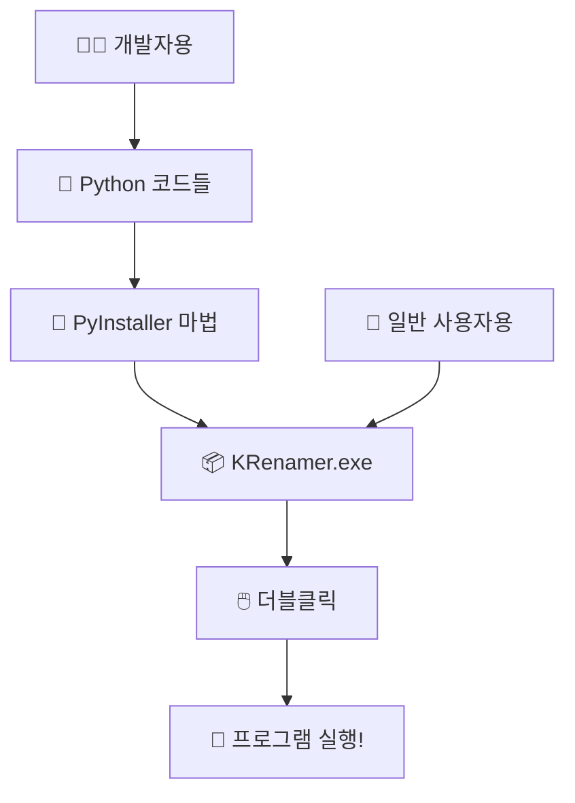

# Chapter 12: 더블클릭으로 실행되는 프로그램 만들기

이번 챕터에서는 **"Python이 없어도 실행되는 프로그램"**<!-- -->을 만들어보겠습니다!

친구들이나 가족들이 Python을 모르더라도 **더블클릭 한 번으로** 우리 프로그램을 실행할 수 있게 만드는 마법을 배워보겠습니다.

## 🎯 이번 챕터의 목표

- **"실행 파일이 뭔지"** 이해하기 (더블클릭으로 실행되는 그것!)
- **왜 실행 파일이 필요한지** 알아보기
- **간단한 방법으로 실행 파일 만들기**
- **친구들에게 쉽게 배포하는 방법** 배우기

## 🤔 왜 실행 파일이 필요할까요?

### 일반 사용자의 고민들

Python으로 만든 멋진 프로그램을 친구들에게 공유하고 싶을 때:

- **"Python이 뭐야?"** → 친구들은 Python을 모름
- **"설치가 너무 복잡해"** → pip install, 환경 설정 등이 어려움
- **"명령어를 어떻게 쳐?"** → 터미널 사용이 두려움
- **"에러가 왜 나와?"** → 환경 차이로 인한 문제들

### 실행 파일의 마법

실행 파일을 만들면 이 모든 문제가 해결됩니다:

```
Before: "내 프로그램 써보려면..."
1. Python 설치하기
2. 필요한 패키지들 설치하기  
3. 명령어 입력하기
4. 환경 설정하기
😰 "너무 복잡해..."

After: "KRenamer.exe 더블클릭!"
→ 바로 실행! 😎
```

## 🎁 실행 파일이란?

### 실행 파일의 개념

**실행 파일(.exe)**<!-- -->은 **"컴퓨터가 바로 이해할 수 있는 프로그램"**<!-- -->입니다.

- **일반 사용자가 아는 프로그램들**: Chrome.exe, Word.exe, 게임.exe
- **더블클릭하면 바로 실행**: 별도 설치나 설정 없이
- **모든 것이 포함됨**: 프로그램 + 필요한 모든 파일들

### 우리가 만들 것



## 🛠️ 간단하게 실행 파일 만들기

### PyInstaller 소개

**PyInstaller**<!-- -->는 **"Python 코드를 실행 파일로 바꿔주는 도구"**<!-- -->입니다.

- **마치**: 요리 재료를 도시락으로 포장해주는 것처럼
- **결과**: 누구나 쉽게 먹을 수 있는(실행할 수 있는) 완성품
- **장점**: 복잡한 과정을 몇 줄의 명령어로 해결

### 기본 사용법 (초간단 버전)

우리 KRenamer를 실행 파일로 만드는 과정:

#### 1단계: PyInstaller 설치
```bash
pip install pyinstaller
```

#### 2단계: 실행 파일 생성
```bash
pyinstaller --onefile --windowed src/krenamer/main.py
```

#### 3단계: 완성!
- `dist/` 폴더에 `main.exe` 생성됨
- 이 파일을 친구들에게 보내면 끝!

### 명령어 옵션 쉽게 이해하기

```bash
pyinstaller --onefile --windowed --name KRenamer src/krenamer/main.py
```

각 옵션의 의미:

- `--onefile`: **"모든 것을 하나의 파일로"** (여러 파일 대신 하나의 .exe)
- `--windowed`: **"검은 창 숨기기"** (GUI 프로그램용, 명령창 안 보임)
- `--name KRenamer`: **"파일 이름 정하기"** (main.exe 대신 KRenamer.exe)

## 🎨 더 멋지게 만들기

### 아이콘 추가하기

우리 프로그램에 예쁜 아이콘을 추가할 수 있습니다:

```bash
pyinstaller --onefile --windowed --icon=icon.ico --name KRenamer src/krenamer/main.py
```

- `--icon=icon.ico`: 아이콘 파일 지정
- 결과: 바탕화면에서 전문적인 프로그램처럼 보임!

### 파일 정리하기

실행 파일을 만들기 전에 이런 것들을 준비하면 좋습니다:

```
프로젝트 폴더/
├── src/krenamer/main.py    # 메인 프로그램
├── icon.ico                # 아이콘 파일
├── README.txt              # 사용 설명서
└── dist/                   # 완성된 실행 파일이 여기에!
```

## 🚀 친구들에게 배포하기

### 간단한 배포 방법

완성된 KRenamer.exe를 친구들에게 나누는 방법들:

#### 1. USB나 이메일로 보내기

- `dist/KRenamer.exe` 파일만 복사해서 전송
- 받은 사람은 바로 더블클릭으로 실행 가능

#### 2. 구글 드라이브나 클라우드 활용

- 파일을 클라우드에 업로드
- 다운로드 링크를 친구들에게 공유

#### 3. GitHub에서 배포

- Releases 기능을 사용해서 공식적으로 배포
- 전 세계 사람들이 다운로드 가능

### 사용자를 위한 간단한 가이드 만들기

친구들을 위해 이런 안내문을 만들어주세요:

```
📋 KRenamer 사용법

1. KRenamer.exe를 다운로드하세요
2. 바탕화면이나 원하는 곳에 저장하세요
3. 더블클릭으로 실행하세요!

⚠️ 주의사항:

- 처음 실행시 Windows에서 "알 수 없는 게시자" 경고가 나올 수 있습니다
- "추가 정보" → "실행"을 클릭하면 됩니다
- 이는 정상적인 보안 기능입니다

🎯 사용법:

- 파일을 드래그 앤 드롭하세요
- 원하는 이름 변경 규칙을 설정하세요
- "실행" 버튼을 클릭하세요
```

## 🔍 만들어진 실행 파일 확인하기

### 실행 파일이 잘 만들어졌는지 확인하는 방법

1. **크기 확인**: 보통 10-50MB 정도 (정상)
2. **아이콘 확인**: 설정한 아이콘이 잘 표시되는지
3. **실행 확인**: 더블클릭했을 때 프로그램이 잘 뜨는지
4. **기능 확인**: 모든 기능이 정상 작동하는지

### 문제 해결

만약 실행 파일이 제대로 작동하지 않는다면:

- **에러 메시지 확인**: 어떤 파일이 누락되었는지 확인
- **필요한 파일 추가**: `--add-data` 옵션으로 추가 파일 포함
- **간단하게 다시 시도**: 처음엔 기본 옵션만 사용해보기

## 🌟 실행 파일의 장점들

### 개발자 입장에서

- ✅ **포트폴리오**: "실제 배포 가능한 프로그램 제작" 경험
- ✅ **사용자 피드백**: 더 많은 사람들이 쉽게 사용 가능
- ✅ **전문성**: 완성도 높은 소프트웨어 개발 능력 증명

### 사용자 입장에서

- ✅ **편리함**: 복잡한 설치 과정 불필요
- ✅ **신뢰감**: 전문적인 프로그램처럼 보임
- ✅ **접근성**: 프로그래밍 지식 없이도 사용 가능

## 🎯 다음 단계들

실행 파일을 성공적으로 만들었다면, 이런 것들도 시도해볼 수 있습니다:

### 더 전문적으로 만들기

!!! tip "고급 기능들"
    자세한 설정과 고급 기능들은 **GitHub 레포지토리**에서 확인하세요:
    
    - 📁 [PyInstaller 고급 설정](https://github.com/geniuskey/krenamer/tree/main/scripts)
    - 📖 [실행 파일 최적화 가이드](https://github.com/geniuskey/krenamer/blob/main/docs/deployment.md)
    - 🔧 [자동 빌드 시스템](https://github.com/geniuskey/krenamer/blob/main/.github/workflows)

### 실제 배포 체험

- **다른 컴퓨터에서 테스트**: 친구 컴퓨터에서 실행해보기
- **피드백 수집**: 사용자들의 의견 듣기
- **개선 및 업데이트**: 문제점 해결하고 새 버전 배포

## 🏁 마무리

축하합니다! 이제 여러분은:

- ✅ **실행 파일의 개념** 이해
- ✅ **PyInstaller 기본 사용법** 습득  
- ✅ **실제 배포 가능한 프로그램** 완성
- ✅ **사용자 친화적인 소프트웨어** 제작 경험

**Python 프로그래머**<!-- -->에서 **소프트웨어 개발자**<!-- -->로 한 단계 성장했습니다!

---

!!! success "전체 프로젝트 완성!"
    KRenamer 프로젝트의 모든 여정이 완료되었습니다!
    
    - **Chapter 1-4**: 기초 GUI 개발
    - **Chapter 5-9**: 핵심 기능 구현  
    - **Chapter 10**: 자동화 시스템
    - **Chapter 11**: 전 세계 배포
    - **Chapter 12**: 실행 파일 제작

!!! tip "축하합니다! 🎉"
    이제 여러분은 완전한 소프트웨어 개발 과정을 경험했습니다:
    
    - 아이디어 → 설계 → 개발 → 테스트 → 배포 → 유지보수
    - Python 기초부터 실무 배포까지 전체 워크플로우 완성
    - 실제 사용자가 사용할 수 있는 완성된 소프트웨어 제작

!!! note "계속 배우고 싶다면..."
    - 다른 GUI 라이브러리 시도해보기 (Qt, Kivy 등)
    - 웹 개발로 확장하기 (Flask, Django)
    - 모바일 앱 개발 도전하기 (Kivy, React Native)
    - 오픈소스 프로젝트에 기여하기