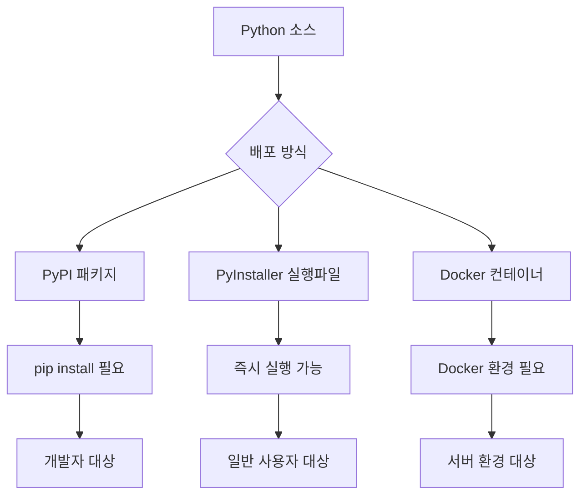

# Chapter 12: 더블클릭으로 실행되는 프로그램 만들기 - PyInstaller

이번 챕터에서는 **"Python이 없어도 실행되는 프로그램"**<!-- -->을 만들어보겠습니다!

친구들이나 가족들이 Python을 모르더라도 **더블클릭 한 번으로** 우리 프로그램을 실행할 수 있게 만드는 마법을 배워보겠습니다.

## 🎯 이번 챕터의 목표

- **"실행 파일이 뭔지"** 이해하기 (더블클릭으로 실행되는 그것!)
- **Python 프로그램을 실행 파일로 만들기**
- **친구들에게 쉽게 배포하는 방법** 배우기
- **전문적인 프로그램처럼 보이게** 만들기

## 📚 PyInstaller 개요

### PyInstaller란?

PyInstaller는 Python 애플리케이션을 독립 실행파일로 변환해주는 도구입니다. Python 인터프리터와 필요한 모든 라이브러리를 하나의 패키지로 묶어 배포할 수 있게 해줍니다.

!!! info "PyInstaller의 장점"
    - **독립 실행**: Python 설치 없이 실행 가능
    - **다중 플랫폼**: Windows, macOS, Linux 지원
    - **자동 의존성 탐지**: 필요한 모듈 자동 포함
    - **GUI 애플리케이션 지원**: tkinter, Qt, wxPython 등

### 배포 방식 비교



## 🔧 PyInstaller 설치 및 기본 사용법

### 1. 설치

```bash title="PyInstaller 설치"
# 기본 설치
pip install pyinstaller

# 최신 개발 버전 (더 많은 기능)
pip install https://github.com/pyinstaller/pyinstaller/archive/develop.zip

# 추가 도구들
pip install pyinstaller[encryption]  # 암호화 지원
pip install auto-py-to-exe           # GUI 도구
```

### 2. 기본 명령어

```bash title="기본 PyInstaller 명령어"
# 기본 실행파일 생성
pyinstaller main.py

# 단일 파일로 생성
pyinstaller --onefile main.py

# GUI 애플리케이션 (콘솔 창 숨김)
pyinstaller --windowed main.py

# 조합 사용
pyinstaller --onefile --windowed --name KRenamer src/krenamer/main.py
```

## 🎨 KRenamer 실행파일 생성

### 1. 기본 spec 파일 생성

```python title="krenamer.spec"
# -*- mode: python ; coding: utf-8 -*-
"""
KRenamer PyInstaller 설정 파일
"""

import os
import sys
from pathlib import Path

# 프로젝트 루트 디렉토리
ROOT_DIR = Path(SPECPATH).parent
SRC_DIR = ROOT_DIR / 'src' / 'krenamer'

# 데이터 파일들 수집
def collect_data_files():
    """데이터 파일들을 수집"""
    datas = []
    
    # 아이콘 및 이미지 파일들
    assets_dir = SRC_DIR / 'assets'
    if assets_dir.exists():
        for file_path in assets_dir.rglob('*'):
            if file_path.is_file():
                # 상대 경로로 변환
                rel_path = file_path.relative_to(SRC_DIR)
                datas.append((str(file_path), str(rel_path.parent)))
    
    # 설정 파일들
    config_files = [
        'config.json',
        'locales/*.json',
        'themes/*.json'
    ]
    
    for pattern in config_files:
        for file_path in SRC_DIR.glob(pattern):
            if file_path.is_file():
                rel_path = file_path.relative_to(SRC_DIR)
                datas.append((str(file_path), str(rel_path.parent)))
    
    return datas

# 숨겨진 임포트들
hiddenimports = [
    'tkinter',
    'tkinter.ttk',
    'tkinter.filedialog',
    'tkinter.messagebox',
    'tkinter.colorchooser',
    'tkinter.font',
    'tkinterdnd2',
    'PIL',
    'PIL.Image',
    'PIL.ImageTk',
    'sqlite3',
    'json',
    're',
    'pathlib',
    'datetime',
    'threading',
    'queue',
    'webbrowser',
    'platform',
    'subprocess',
    'shutil',
    'tempfile',
    'configparser',
]

# 제외할 모듈들 (크기 최적화)
excludes = [
    'matplotlib',
    'numpy',
    'scipy',
    'pandas',
    'PyQt5',
    'PyQt6',
    'PySide2',
    'PySide6',
    'wx',
    'django',
    'flask',
    'tornado',
    'twisted',
    'asyncio',
    'multiprocessing',
    'unittest',
    'doctest',
    'pdb',
    'profile',
    'cProfile',
]

# 분석 단계
a = Analysis(
    [str(SRC_DIR / 'main.py')],
    pathex=[str(ROOT_DIR), str(SRC_DIR)],
    binaries=[],
    datas=collect_data_files(),
    hiddenimports=hiddenimports,
    hookspath=[],
    hooksconfig={},
    runtime_hooks=[],
    excludes=excludes,
    win_no_prefer_redirects=False,
    win_private_assemblies=False,
    cipher=None,
    noarchive=False,
)

# 파이썬 바이트코드 수집
pyz = PYZ(a.pure, a.zipped_data, cipher=None)

# 실행파일 생성
exe = EXE(
    pyz,
    a.scripts,
    a.binaries,
    a.zipfiles,
    a.datas,
    [],
    name='KRenamer',
    debug=False,
    bootloader_ignore_signals=False,
    strip=False,
    upx=True,  # UPX 압축 사용 (크기 줄이기)
    upx_exclude=[],
    runtime_tmpdir=None,
    console=False,  # GUI 애플리케이션이므로 콘솔 숨김
    disable_windowed_traceback=False,
    argv_emulation=False,
    target_arch=None,
    codesign_identity=None,
    entitlements_file=None,
    icon=str(SRC_DIR / 'assets' / 'icon.ico') if (SRC_DIR / 'assets' / 'icon.ico').exists() else None,
    version='version_info.txt',
)

# Windows용 추가 설정
if sys.platform == 'win32':
    exe.version = str(SRC_DIR / 'version_info.txt')
```

### 2. 버전 정보 파일 생성

```python title="scripts/create_version_info.py"
#!/usr/bin/env python3
"""
Windows 실행파일용 버전 정보 생성 스크립트
"""

import sys
from pathlib import Path

def create_version_info():
    """버전 정보 파일 생성"""
    
    # 버전 정보 (실제 버전으로 업데이트 필요)
    version = "1.0.0.0"
    company_name = "KRenamer Team"
    file_description = "Korean Windows GUI file renaming tool"
    internal_name = "KRenamer"
    original_filename = "KRenamer.exe"
    product_name = "KRenamer"
    
    version_info_content = f'''
# UTF-8
#
# 이 파일은 PyInstaller에서 Windows 실행파일의 버전 정보를 설정하는 데 사용됩니다.
#

VSVersionInfo(
  ffi=FixedFileInfo(
    filevers=({version.replace('.', ', ')}),
    prodvers=({version.replace('.', ', ')}),
    mask=0x3f,
    flags=0x0,
    OS=0x40004,
    fileType=0x1,
    subtype=0x0,
    date=(0, 0)
  ),
  kids=[
    StringFileInfo(
      [
      StringTable(
        u'040904B0',
        [StringStruct(u'CompanyName', u'{company_name}'),
        StringStruct(u'FileDescription', u'{file_description}'),
        StringStruct(u'FileVersion', u'{version}'),
        StringStruct(u'InternalName', u'{internal_name}'),
        StringStruct(u'LegalCopyright', u'Copyright © 2024 {company_name}'),
        StringStruct(u'OriginalFilename', u'{original_filename}'),
        StringStruct(u'ProductName', u'{product_name}'),
        StringStruct(u'ProductVersion', u'{version}')])
      ]), 
    VarFileInfo([VarStruct(u'Translation', [1033, 1200])])
  ]
)
'''
    
    # 파일 저장
    version_file = Path('version_info.txt')
    version_file.write_text(version_info_content, encoding='utf-8')
    print(f"✅ 버전 정보 파일 생성됨: {version_file}")

if __name__ == "__main__":
    create_version_info()
```

### 3. 빌드 스크립트

```python title="scripts/build_exe.py"
#!/usr/bin/env python3
"""
KRenamer 실행파일 빌드 스크립트
다양한 옵션으로 실행파일을 생성하는 자동화 스크립트
"""

import os
import sys
import shutil
import subprocess
import argparse
from pathlib import Path
import platform

def clean_build_dirs():
    """빌드 디렉토리 정리"""
    print("🧹 이전 빌드 파일 정리 중...")
    
    dirs_to_clean = ['build', 'dist', '__pycache__']
    files_to_clean = ['*.spec']
    
    for dir_name in dirs_to_clean:
        if os.path.exists(dir_name):
            shutil.rmtree(dir_name)
            print(f"   삭제됨: {dir_name}/")
    
    for pattern in files_to_clean:
        for file_path in Path('.').glob(pattern):
            file_path.unlink()
            print(f"   삭제됨: {file_path}")

def check_dependencies():
    """필요한 도구들 확인"""
    print("🔍 의존성 확인 중...")
    
    required_packages = ['pyinstaller', 'tkinterdnd2']
    missing_packages = []
    
    for package in required_packages:
        try:
            __import__(package.replace('-', '_'))
            print(f"   ✅ {package}")
        except ImportError:
            missing_packages.append(package)
            print(f"   ❌ {package} (누락)")
    
    if missing_packages:
        print(f"\n❌ 누락된 패키지들을 설치해주세요:")
        print(f"   pip install {' '.join(missing_packages)}")
        sys.exit(1)

def create_icon():
    """기본 아이콘 생성 (아이콘이 없는 경우)"""
    icon_path = Path('src/krenamer/assets/icon.ico')
    
    if not icon_path.exists():
        print("🎨 기본 아이콘 생성 중...")
        
        # 간단한 아이콘 생성 (PIL 사용)
        try:
            from PIL import Image, ImageDraw
            
            # 32x32 아이콘 생성
            img = Image.new('RGBA', (32, 32), (0, 100, 200, 255))
            draw = ImageDraw.Draw(img)
            
            # 간단한 'K' 모양 그리기
            draw.text((8, 8), 'K', fill=(255, 255, 255, 255))
            
            # ICO 형식으로 저장
            icon_path.parent.mkdir(parents=True, exist_ok=True)
            img.save(icon_path, format='ICO')
            print(f"   ✅ 기본 아이콘 생성됨: {icon_path}")
            
        except ImportError:
            print("   ⚠️ PIL이 설치되지 않아 아이콘을 생성할 수 없습니다.")

def build_executable(config):
    """실행파일 빌드"""
    print(f"🔨 {config['name']} 빌드 중...")
    
    # PyInstaller 명령어 구성
    cmd = [
        'pyinstaller',
        '--clean',  # 이전 빌드 캐시 정리
        '--noconfirm',  # 덮어쓰기 확인 안 함
    ]
    
    if config.get('onefile', True):
        cmd.append('--onefile')
    
    if config.get('windowed', True):
        cmd.append('--windowed')
    
    if config.get('name'):
        cmd.extend(['--name', config['name']])
    
    if config.get('icon'):
        cmd.extend(['--icon', config['icon']])
    
    # 추가 데이터 파일들
    for data_item in config.get('add_data', []):
        cmd.extend(['--add-data', data_item])
    
    # 숨겨진 임포트들
    for hidden_import in config.get('hidden_imports', []):
        cmd.extend(['--hidden-import', hidden_import])
    
    # 제외할 모듈들
    for exclude in config.get('excludes', []):
        cmd.extend(['--exclude-module', exclude])
    
    # 메인 스크립트
    cmd.append(config['script'])
    
    print(f"   실행 명령어: {' '.join(cmd)}")
    
    # 빌드 실행
    result = subprocess.run(cmd, capture_output=True, text=True)
    
    if result.returncode == 0:
        print(f"   ✅ 빌드 성공!")
        return True
    else:
        print(f"   ❌ 빌드 실패:")
        print(f"   오류: {result.stderr}")
        return False

def optimize_executable(exe_path):
    """실행파일 최적화"""
    print("⚡ 실행파일 최적화 중...")
    
    if not exe_path.exists():
        print("   ❌ 실행파일을 찾을 수 없습니다.")
        return
    
    original_size = exe_path.stat().st_size
    print(f"   원본 크기: {original_size:,} bytes")
    
    # UPX 압축 시도
    try:
        subprocess.run(['upx', '--best', str(exe_path)], 
                      capture_output=True, check=True)
        
        compressed_size = exe_path.stat().st_size
        reduction = (1 - compressed_size / original_size) * 100
        print(f"   ✅ UPX 압축 완료!")
        print(f"   압축 후 크기: {compressed_size:,} bytes ({reduction:.1f}% 감소)")
        
    except (subprocess.CalledProcessError, FileNotFoundError):
        print("   ⚠️ UPX를 찾을 수 없습니다. 수동 설치 필요.")

def test_executable(exe_path):
    """실행파일 테스트"""
    print("🧪 실행파일 테스트 중...")
    
    if not exe_path.exists():
        print("   ❌ 실행파일을 찾을 수 없습니다.")
        return False
    
    # 기본 실행 테스트 (GUI는 자동 테스트가 어려우므로 간단히 실행만)
    try:
        if platform.system() == 'Windows':
            # Windows에서는 실행 후 바로 종료하지 않도록 timeout 설정
            result = subprocess.run([str(exe_path), '--version'], 
                                  capture_output=True, timeout=5)
        else:
            # 다른 플랫폼에서는 help 옵션 테스트
            result = subprocess.run([str(exe_path), '--help'], 
                                  capture_output=True, timeout=5)
        
        print("   ✅ 실행파일이 정상적으로 시작됩니다.")
        return True
        
    except subprocess.TimeoutExpired:
        print("   ✅ 실행파일이 정상적으로 시작됩니다. (GUI 모드)")
        return True
    except Exception as e:
        print(f"   ❌ 실행 테스트 실패: {e}")
        return False

def create_installer_script():
    """NSIS 인스톨러 스크립트 생성 (Windows)"""
    if platform.system() != 'Windows':
        return
    
    print("📦 Windows 인스톨러 스크립트 생성 중...")
    
    nsis_script = '''
!define PRODUCT_NAME "KRenamer"
!define PRODUCT_VERSION "1.0.0"
!define PRODUCT_PUBLISHER "KRenamer Team"
!define PRODUCT_WEB_SITE "https://github.com/geniuskey/krenamer"
!define PRODUCT_DIR_REGKEY "Software\\Microsoft\\Windows\\CurrentVersion\\App Paths\\KRenamer.exe"
!define PRODUCT_UNINST_KEY "Software\\Microsoft\\Windows\\CurrentVersion\\Uninstall\\${PRODUCT_NAME}"

SetCompressor lzma

; Modern UI
!include "MUI2.nsh"

; General
Name "${PRODUCT_NAME} ${PRODUCT_VERSION}"
OutFile "KRenamer-Setup.exe"
InstallDir "$PROGRAMFILES\\KRenamer"
InstallDirRegKey HKLM "${PRODUCT_DIR_REGKEY}" ""
ShowInstDetails show
ShowUnInstDetails show

; Interface Settings
!define MUI_ABORTWARNING
!define MUI_ICON "icon.ico"
!define MUI_UNICON "icon.ico"

; Pages
!insertmacro MUI_PAGE_WELCOME
!insertmacro MUI_PAGE_LICENSE "LICENSE"
!insertmacro MUI_PAGE_DIRECTORY
!insertmacro MUI_PAGE_INSTFILES
!insertmacro MUI_PAGE_FINISH

!insertmacro MUI_UNPAGE_INSTFILES

; Languages
!insertmacro MUI_LANGUAGE "Korean"
!insertmacro MUI_LANGUAGE "English"

Section "MainSection" SEC01
  SetOutPath "$INSTDIR"
  SetOverwrite ifnewer
  File "dist\\KRenamer.exe"
  CreateDirectory "$SMPROGRAMS\\KRenamer"
  CreateShortCut "$SMPROGRAMS\\KRenamer\\KRenamer.lnk" "$INSTDIR\\KRenamer.exe"
  CreateShortCut "$DESKTOP\\KRenamer.lnk" "$INSTDIR\\KRenamer.exe"
SectionEnd

Section -AdditionalIcons
  CreateShortCut "$SMPROGRAMS\\KRenamer\\Uninstall.lnk" "$INSTDIR\\uninst.exe"
SectionEnd

Section -Post
  WriteUninstaller "$INSTDIR\\uninst.exe"
  WriteRegStr HKLM "${PRODUCT_DIR_REGKEY}" "" "$INSTDIR\\KRenamer.exe"
  WriteRegStr HKLM "${PRODUCT_UNINST_KEY}" "DisplayName" "$(^Name)"
  WriteRegStr HKLM "${PRODUCT_UNINST_KEY}" "UninstallString" "$INSTDIR\\uninst.exe"
  WriteRegStr HKLM "${PRODUCT_UNINST_KEY}" "DisplayIcon" "$INSTDIR\\KRenamer.exe"
  WriteRegStr HKLM "${PRODUCT_UNINST_KEY}" "DisplayVersion" "${PRODUCT_VERSION}"
  WriteRegStr HKLM "${PRODUCT_UNINST_KEY}" "URLInfoAbout" "${PRODUCT_WEB_SITE}"
  WriteRegStr HKLM "${PRODUCT_UNINST_KEY}" "Publisher" "${PRODUCT_PUBLISHER}"
SectionEnd

Section Uninstall
  Delete "$INSTDIR\\KRenamer.exe"
  Delete "$INSTDIR\\uninst.exe"
  Delete "$SMPROGRAMS\\KRenamer\\KRenamer.lnk"
  Delete "$SMPROGRAMS\\KRenamer\\Uninstall.lnk"
  Delete "$DESKTOP\\KRenamer.lnk"
  RMDir "$SMPROGRAMS\\KRenamer"
  RMDir "$INSTDIR"
  DeleteRegKey HKLM "${PRODUCT_UNINST_KEY}"
  DeleteRegKey HKLM "${PRODUCT_DIR_REGKEY}"
SectionEnd
'''
    
    with open('installer.nsi', 'w', encoding='utf-8') as f:
        f.write(nsis_script)
    
    print("   ✅ installer.nsi 생성됨")
    print("   💡 NSIS로 인스톨러 생성: makensis installer.nsi")

def main():
    """메인 빌드 프로세스"""
    parser = argparse.ArgumentParser(description='KRenamer 실행파일 빌드')
    parser.add_argument('--debug', action='store_true', help='디버그 모드')
    parser.add_argument('--no-optimize', action='store_true', help='최적화 건너뛰기')
    parser.add_argument('--no-test', action='store_true', help='테스트 건너뛰기')
    parser.add_argument('--installer', action='store_true', help='인스톨러 스크립트 생성')
    
    args = parser.parse_args()
    
    print("🚀 KRenamer 실행파일 빌드 시작")
    print("=" * 50)
    
    try:
        # 1. 환경 확인
        check_dependencies()
        
        # 2. 정리
        clean_build_dirs()
        
        # 3. 아이콘 생성
        create_icon()
        
        # 4. 빌드 설정
        config = {
            'name': 'KRenamer',
            'script': 'src/krenamer/main.py',
            'onefile': True,
            'windowed': True,
            'icon': 'src/krenamer/assets/icon.ico',
            'add_data': [
                'src/krenamer/assets/*;assets',
            ],
            'hidden_imports': [
                'tkinter', 'tkinter.ttk', 'tkinter.filedialog',
                'tkinter.messagebox', 'tkinterdnd2', 'sqlite3'
            ],
            'excludes': [
                'matplotlib', 'numpy', 'scipy', 'pandas',
                'PyQt5', 'PyQt6', 'PySide2', 'PySide6'
            ]
        }
        
        # 5. 빌드 실행
        if not build_executable(config):
            sys.exit(1)
        
        # 6. 실행파일 경로 확인
        exe_path = Path('dist') / (config['name'] + '.exe')
        if platform.system() != 'Windows':
            exe_path = Path('dist') / config['name']
        
        # 7. 최적화
        if not args.no_optimize:
            optimize_executable(exe_path)
        
        # 8. 테스트
        if not args.no_test:
            test_executable(exe_path)
        
        # 9. 인스톨러 스크립트 생성
        if args.installer:
            create_installer_script()
        
        # 10. 결과 요약
        print("\n🎉 빌드 완료!")
        print(f"📁 실행파일: {exe_path}")
        
        if exe_path.exists():
            size = exe_path.stat().st_size
            print(f"📊 파일 크기: {size:,} bytes ({size/1024/1024:.1f} MB)")
        
        print("\n📋 다음 단계:")
        print("   1. 실행파일 테스트")
        print("   2. 바이러스 검사")
        print("   3. 다양한 환경에서 호환성 테스트")
        if args.installer and platform.system() == 'Windows':
            print("   4. NSIS로 인스톨러 생성")
        
    except KeyboardInterrupt:
        print("\n⏹️ 사용자에 의해 중단됨")
        sys.exit(1)
    except Exception as e:
        print(f"\n💥 예상치 못한 오류: {e}")
        if args.debug:
            import traceback
            traceback.print_exc()
        sys.exit(1)

if __name__ == "__main__":
    main()
```

## 🔧 고급 최적화 기법

### 1. 크기 최적화

```python title="hooks/hook-tkinterdnd2.py"
"""
tkinterdnd2용 PyInstaller 훅
불필요한 파일들을 제외하여 크기 최적화
"""

from PyInstaller.utils.hooks import collect_data_files, collect_submodules

# 필요한 데이터 파일만 포함
datas = collect_data_files('tkinterdnd2', include_py_files=False)

# 필요한 서브모듈들만 포함
hiddenimports = [
    'tkinterdnd2.TkinterDnD',
    'tkinterdnd2.tkdnd',
]

# 제외할 파일 패턴
excludedimports = [
    'tkinterdnd2.test',
    'tkinterdnd2.demo',
]
```

```python title="scripts/optimize_build.py"
#!/usr/bin/env python3
"""
빌드 후 최적화 스크립트
불필요한 파일 제거 및 압축 최적화
"""

import os
import shutil
from pathlib import Path

def remove_unnecessary_files(dist_dir):
    """불필요한 파일들 제거"""
    print("🗑️ 불필요한 파일 제거 중...")
    
    # 제거할 파일 패턴들
    patterns_to_remove = [
        '**/*.pyc',
        '**/__pycache__',
        '**/*.pyo',
        '**/*.pyd',
        '**/test*',
        '**/tests*',
        '**/*.dist-info',
        '**/LICENSE*',
        '**/README*',
        '**/CHANGELOG*',
        '**/*.md',
        '**/*.rst',
        '**/*.txt',
    ]
    
    removed_count = 0
    for pattern in patterns_to_remove:
        for file_path in Path(dist_dir).glob(pattern):
            if file_path.is_file():
                file_path.unlink()
                removed_count += 1
            elif file_path.is_dir():
                shutil.rmtree(file_path)
                removed_count += 1
    
    print(f"   ✅ {removed_count}개 파일/디렉토리 제거됨")

def compress_with_upx(exe_path):
    """UPX로 실행파일 압축"""
    import subprocess
    
    print("🗜️ UPX 압축 중...")
    
    try:
        original_size = exe_path.stat().st_size
        
        # UPX 압축 실행
        subprocess.run([
            'upx', 
            '--best',           # 최고 압축률
            '--ultra-brute',    # 최대 압축 시간
            str(exe_path)
        ], check=True, capture_output=True)
        
        compressed_size = exe_path.stat().st_size
        reduction = (1 - compressed_size / original_size) * 100
        
        print(f"   ✅ 압축 완료: {reduction:.1f}% 감소")
        print(f"   📊 {original_size:,} → {compressed_size:,} bytes")
        
    except subprocess.CalledProcessError as e:
        print(f"   ❌ UPX 압축 실패: {e}")
    except FileNotFoundError:
        print("   ⚠️ UPX가 설치되지 않았습니다.")

def create_portable_package(exe_path):
    """포터블 패키지 생성"""
    print("📦 포터블 패키지 생성 중...")
    
    package_dir = exe_path.parent / 'KRenamer-Portable'
    package_dir.mkdir(exist_ok=True)
    
    # 실행파일 복사
    shutil.copy2(exe_path, package_dir / exe_path.name)
    
    # 설정 파일들 복사
    config_files = [
        'README.md',
        'LICENSE',
        'CHANGELOG.md',
    ]
    
    for config_file in config_files:
        if Path(config_file).exists():
            shutil.copy2(config_file, package_dir)
    
    # 사용자 가이드 생성
    user_guide = package_dir / 'README-사용법.txt'
    user_guide.write_text('''
KRenamer 포터블 버전

이 버전은 설치가 필요 없는 포터블 버전입니다.

사용법:
1. KRenamer.exe를 실행하세요
2. 파일을 드래그 앤 드롭하거나 "파일 추가" 버튼을 사용하세요
3. 원하는 리네임 옵션을 설정하세요
4. "이름 바꾸기 실행" 버튼을 클릭하세요

주의사항:
- 이 프로그램은 설치 없이 실행됩니다
- 설정은 실행 파일과 같은 폴더에 저장됩니다
- 바이러스 검사 소프트웨어에서 경고가 나올 수 있습니다 (정상)

문의: https://github.com/geniuskey/krenamer
''', encoding='utf-8')
    
    print(f"   ✅ 포터블 패키지 생성됨: {package_dir}")
    
    return package_dir

if __name__ == "__main__":
    import sys
    
    if len(sys.argv) < 2:
        print("사용법: python optimize_build.py <실행파일 경로>")
        sys.exit(1)
    
    exe_path = Path(sys.argv[1])
    
    if not exe_path.exists():
        print(f"❌ 실행파일을 찾을 수 없습니다: {exe_path}")
        sys.exit(1)
    
    # 최적화 실행
    compress_with_upx(exe_path)
    create_portable_package(exe_path)
    
    print("🎉 최적화 완료!")
```

### 2. 다중 플랫폼 빌드 자동화

```yaml title=".github/workflows/build-executables.yml"
name: Build Executables

on:
  push:
    tags: ['v*']
  workflow_dispatch:

jobs:
  build:
    runs-on: ${{ matrix.os }}
    strategy:
      matrix:
        include:
          - os: windows-latest
            platform: windows
            extension: .exe
            upx: upx.exe
          - os: ubuntu-latest
            platform: linux
            extension: ""
            upx: upx
          - os: macos-latest
            platform: macos
            extension: ""
            upx: upx
    
    steps:
    - name: Checkout code
      uses: actions/checkout@v4
      
    - name: Set up Python
      uses: actions/setup-python@v4
      with:
        python-version: '3.11'
        
    - name: Install system dependencies (Linux)
      if: matrix.platform == 'linux'
      run: |
        sudo apt-get update
        sudo apt-get install -y python3-tk upx
        
    - name: Install system dependencies (macOS)
      if: matrix.platform == 'macos'
      run: |
        brew install upx
        
    - name: Install Python dependencies
      run: |
        python -m pip install --upgrade pip
        pip install pyinstaller
        pip install -e .
        pip install -r requirements.txt
        
    - name: Install UPX (Windows)
      if: matrix.platform == 'windows'
      run: |
        choco install upx
        
    - name: Create version info (Windows)
      if: matrix.platform == 'windows'
      run: |
        python scripts/create_version_info.py
        
    - name: Build executable
      run: |
        python scripts/build_exe.py --no-test
        
    - name: Create package
      run: |
        python scripts/optimize_build.py dist/KRenamer${{ matrix.extension }}
        
    - name: Create archive
      run: |
        cd dist
        if [ "${{ matrix.platform }}" = "windows" ]; then
          7z a -tzip KRenamer-${{ matrix.platform }}.zip KRenamer-Portable/
        else
          tar -czf KRenamer-${{ matrix.platform }}.tar.gz KRenamer-Portable/
        fi
      shell: bash
      
    - name: Upload artifacts
      uses: actions/upload-artifact@v3
      with:
        name: KRenamer-${{ matrix.platform }}
        path: |
          dist/KRenamer-${{ matrix.platform }}.*
          dist/KRenamer${{ matrix.extension }}
```

## 📋 배포 및 설치 가이드

### 1. Windows 인스톨러 생성

```nsis title="installer-advanced.nsi"
; KRenamer 고급 NSIS 인스톨러 스크립트
; Unicode 지원 및 다국어 설치

Unicode True

!define PRODUCT_NAME "KRenamer"
!define PRODUCT_VERSION "1.0.0"
!define PRODUCT_PUBLISHER "KRenamer Team"
!define PRODUCT_WEB_SITE "https://github.com/geniuskey/krenamer"
!define PRODUCT_DIR_REGKEY "Software\\Microsoft\\Windows\\CurrentVersion\\App Paths\\KRenamer.exe"
!define PRODUCT_UNINST_KEY "Software\\Microsoft\\Windows\\CurrentVersion\\Uninstall\\${PRODUCT_NAME}"

!include "MUI2.nsh"
!include "FileAssociation.nsh"
!include "WinVer.nsh"

; 압축 설정
SetCompressor /SOLID lzma
SetCompressorDictSize 32

; 일반 설정
Name "${PRODUCT_NAME} ${PRODUCT_VERSION}"
OutFile "KRenamer-Setup-${PRODUCT_VERSION}.exe"
InstallDir "$PROGRAMFILES\\${PRODUCT_NAME}"
InstallDirRegKey HKLM "${PRODUCT_DIR_REGKEY}" ""
RequestExecutionLevel admin
ShowInstDetails show
ShowUnInstDetails show

; 인터페이스 설정
!define MUI_ABORTWARNING
!define MUI_ICON "assets\\icon.ico"
!define MUI_UNICON "assets\\icon.ico"
!define MUI_HEADERIMAGE
!define MUI_HEADERIMAGE_RIGHT
!define MUI_HEADERIMAGE_BITMAP "assets\\header.bmp"
!define MUI_WELCOMEFINISHPAGE_BITMAP "assets\\welcome.bmp"

; 페이지 설정
!insertmacro MUI_PAGE_WELCOME
!insertmacro MUI_PAGE_LICENSE "LICENSE"
!insertmacro MUI_PAGE_COMPONENTS
!insertmacro MUI_PAGE_DIRECTORY
!insertmacro MUI_PAGE_INSTFILES
!define MUI_FINISHPAGE_RUN "$INSTDIR\\KRenamer.exe"
!define MUI_FINISHPAGE_SHOWREADME "$INSTDIR\\README.txt"
!insertmacro MUI_PAGE_FINISH

!insertmacro MUI_UNPAGE_CONFIRM
!insertmacro MUI_UNPAGE_INSTFILES

; 언어 설정
!insertmacro MUI_LANGUAGE "Korean"
!insertmacro MUI_LANGUAGE "English"
!insertmacro MUI_LANGUAGE "Japanese"
!insertmacro MUI_LANGUAGE "Chinese"

; 섹션 - 메인 프로그램
Section "!KRenamer (필수)" SEC01
  SectionIn RO
  
  ; 시스템 요구사항 확인
  ${IfNot} ${AtLeastWin7}
    MessageBox MB_ICONSTOP "Windows 7 이상이 필요합니다."
    Abort
  ${EndIf}
  
  SetOutPath "$INSTDIR"
  SetOverwrite ifnewer
  
  ; 메인 파일들
  File "dist\\KRenamer.exe"
  File "README.md"
  File "LICENSE"
  File "CHANGELOG.md"
  
  ; 설정 파일들
  SetOutPath "$INSTDIR\\config"
  File /r "config\\*"
  
  ; 언어 파일들
  SetOutPath "$INSTDIR\\locales"
  File /r "locales\\*"
  
SectionEnd

; 섹션 - 바로가기
Section "바로가기" SEC02
  CreateDirectory "$SMPROGRAMS\\${PRODUCT_NAME}"
  CreateShortCut "$SMPROGRAMS\\${PRODUCT_NAME}\\${PRODUCT_NAME}.lnk" "$INSTDIR\\KRenamer.exe"
  CreateShortCut "$SMPROGRAMS\\${PRODUCT_NAME}\\제거.lnk" "$INSTDIR\\uninst.exe"
  CreateShortCut "$DESKTOP\\${PRODUCT_NAME}.lnk" "$INSTDIR\\KRenamer.exe"
  CreateShortCut "$QUICKLAUNCH\\${PRODUCT_NAME}.lnk" "$INSTDIR\\KRenamer.exe"
SectionEnd

; 섹션 - 파일 연결
Section "파일 연결" SEC03
  ; 배치 파일 연결 (선택적)
  ${registerExtension} "$INSTDIR\\KRenamer.exe" ".krn" "KRenamer Project File"
SectionEnd

; 섹션 - 컨텍스트 메뉴
Section "컨텍스트 메뉴 추가" SEC04
  WriteRegStr HKCR "*\\shell\\KRenamer" "" "KRenamer로 이름 바꾸기"
  WriteRegStr HKCR "*\\shell\\KRenamer\\command" "" '"$INSTDIR\\KRenamer.exe" "%1"'
  WriteRegStr HKCR "Directory\\shell\\KRenamer" "" "KRenamer로 이름 바꾸기"
  WriteRegStr HKCR "Directory\\shell\\KRenamer\\command" "" '"$INSTDIR\\KRenamer.exe" "%1"'
SectionEnd

; 섹션 설명
LangString DESC_SEC01 ${LANG_KOREAN} "KRenamer 메인 프로그램 (필수)"
LangString DESC_SEC02 ${LANG_KOREAN} "시작 메뉴와 바탕화면에 바로가기 생성"
LangString DESC_SEC03 ${LANG_KOREAN} "KRenamer 프로젝트 파일 연결"
LangString DESC_SEC04 ${LANG_KOREAN} "우클릭 메뉴에 KRenamer 추가"

!insertmacro MUI_FUNCTION_DESCRIPTION_BEGIN
  !insertmacro MUI_DESCRIPTION_TEXT ${SEC01} $(DESC_SEC01)
  !insertmacro MUI_DESCRIPTION_TEXT ${SEC02} $(DESC_SEC02)
  !insertmacro MUI_DESCRIPTION_TEXT ${SEC03} $(DESC_SEC03)
  !insertmacro MUI_DESCRIPTION_TEXT ${SEC04} $(DESC_SEC04)
!insertmacro MUI_FUNCTION_DESCRIPTION_END

; 설치 후 처리
Section -Post
  WriteUninstaller "$INSTDIR\\uninst.exe"
  WriteRegStr HKLM "${PRODUCT_DIR_REGKEY}" "" "$INSTDIR\\KRenamer.exe"
  WriteRegStr HKLM "${PRODUCT_UNINST_KEY}" "DisplayName" "$(^Name)"
  WriteRegStr HKLM "${PRODUCT_UNINST_KEY}" "UninstallString" "$INSTDIR\\uninst.exe"
  WriteRegStr HKLM "${PRODUCT_UNINST_KEY}" "DisplayIcon" "$INSTDIR\\KRenamer.exe"
  WriteRegStr HKLM "${PRODUCT_UNINST_KEY}" "DisplayVersion" "${PRODUCT_VERSION}"
  WriteRegStr HKLM "${PRODUCT_UNINST_KEY}" "Publisher" "${PRODUCT_PUBLISHER}"
  WriteRegStr HKLM "${PRODUCT_UNINST_KEY}" "URLInfoAbout" "${PRODUCT_WEB_SITE}"
  WriteRegDWORD HKLM "${PRODUCT_UNINST_KEY}" "NoModify" 1
  WriteRegDWORD HKLM "${PRODUCT_UNINST_KEY}" "NoRepair" 1
SectionEnd

; 제거 섹션
Section Uninstall
  ; 파일들 삭제
  Delete "$INSTDIR\\KRenamer.exe"
  Delete "$INSTDIR\\README.md"
  Delete "$INSTDIR\\LICENSE"
  Delete "$INSTDIR\\CHANGELOG.md"
  Delete "$INSTDIR\\uninst.exe"
  
  ; 디렉토리 삭제
  RMDir /r "$INSTDIR\\config"
  RMDir /r "$INSTDIR\\locales"
  RMDir "$INSTDIR"
  
  ; 바로가기 삭제
  Delete "$SMPROGRAMS\\${PRODUCT_NAME}\\${PRODUCT_NAME}.lnk"
  Delete "$SMPROGRAMS\\${PRODUCT_NAME}\\제거.lnk"
  Delete "$DESKTOP\\${PRODUCT_NAME}.lnk"
  Delete "$QUICKLAUNCH\\${PRODUCT_NAME}.lnk"
  RMDir "$SMPROGRAMS\\${PRODUCT_NAME}"
  
  ; 레지스트리 정리
  DeleteRegKey HKLM "${PRODUCT_UNINST_KEY}"
  DeleteRegKey HKLM "${PRODUCT_DIR_REGKEY}"
  DeleteRegKey HKCR "*\\shell\\KRenamer"
  DeleteRegKey HKCR "Directory\\shell\\KRenamer"
  
  ; 파일 연결 해제
  ${unregisterExtension} ".krn" "KRenamer Project File"
SectionEnd
```

### 2. 자동 업데이트 시스템

```python title="src/krenamer/updater.py"
#!/usr/bin/env python3
"""
자동 업데이트 시스템
GitHub Releases를 통한 자동 업데이트 확인 및 다운로드
"""

import os
import sys
import json
import requests
import tempfile
import subprocess
from pathlib import Path
from typing import Optional, Dict, Any
import tkinter as tk
from tkinter import messagebox, ttk
import threading

class UpdateChecker:
    """업데이트 확인 및 관리 클래스"""
    
    def __init__(self, current_version: str, repo_url: str):
        self.current_version = current_version
        self.repo_url = repo_url
        self.api_url = f"https://api.github.com/repos/{repo_url}/releases/latest"
    
    def check_for_updates(self) -> Optional[Dict[str, Any]]:
        """최신 버전 확인"""
        try:
            response = requests.get(self.api_url, timeout=10)
            if response.status_code == 200:
                release_data = response.json()
                
                latest_version = release_data['tag_name'].lstrip('v')
                
                if self._is_newer_version(latest_version, self.current_version):
                    return {
                        'version': latest_version,
                        'url': release_data['html_url'],
                        'download_url': self._get_download_url(release_data),
                        'changelog': release_data['body'],
                        'published_at': release_data['published_at']
                    }
            
            return None
            
        except requests.RequestException:
            return None
    
    def _is_newer_version(self, latest: str, current: str) -> bool:
        """버전 비교"""
        def version_tuple(v):
            return tuple(map(int, v.split('.')))
        
        try:
            return version_tuple(latest) > version_tuple(current)
        except ValueError:
            return False
    
    def _get_download_url(self, release_data: Dict[str, Any]) -> Optional[str]:
        """플랫폼에 맞는 다운로드 URL 찾기"""
        platform = sys.platform
        
        for asset in release_data.get('assets', []):
            name = asset['name'].lower()
            
            if platform == 'win32' and ('windows' in name or name.endswith('.exe')):
                return asset['browser_download_url']
            elif platform == 'linux' and 'linux' in name:
                return asset['browser_download_url']
            elif platform == 'darwin' and ('macos' in name or 'darwin' in name):
                return asset['browser_download_url']
        
        return None

class UpdateDialog:
    """업데이트 대화상자"""
    
    def __init__(self, parent, update_info: Dict[str, Any]):
        self.parent = parent
        self.update_info = update_info
        self.result = None
        
        self.dialog = tk.Toplevel(parent)
        self.dialog.title("업데이트 확인")
        self.dialog.geometry("500x400")
        self.dialog.transient(parent)
        self.dialog.grab_set()
        
        self.setup_ui()
        
        # 중앙 배치
        self.dialog.update_idletasks()
        x = (self.dialog.winfo_screenwidth() // 2) - (500 // 2)
        y = (self.dialog.winfo_screenheight() // 2) - (400 // 2)
        self.dialog.geometry(f"500x400+{x}+{y}")
    
    def setup_ui(self):
        """UI 구성"""
        main_frame = ttk.Frame(self.dialog)
        main_frame.pack(fill=tk.BOTH, expand=True, padx=20, pady=20)
        
        # 제목
        title_label = ttk.Label(
            main_frame, 
            text=f"새 버전이 있습니다! v{self.update_info['version']}",
            font=('', 12, 'bold')
        )
        title_label.pack(pady=(0, 10))
        
        # 변경사항
        changelog_frame = ttk.LabelFrame(main_frame, text="변경사항", padding="10")
        changelog_frame.pack(fill=tk.BOTH, expand=True, pady=(0, 10))
        
        changelog_text = tk.Text(
            changelog_frame, 
            wrap=tk.WORD, 
            height=10,
            font=('Consolas', 9)
        )
        changelog_scroll = ttk.Scrollbar(changelog_frame, command=changelog_text.yview)
        changelog_text.config(yscrollcommand=changelog_scroll.set)
        
        changelog_text.insert("1.0", self.update_info.get('changelog', '변경사항 정보 없음'))
        changelog_text.config(state=tk.DISABLED)
        
        changelog_text.pack(side=tk.LEFT, fill=tk.BOTH, expand=True)
        changelog_scroll.pack(side=tk.RIGHT, fill=tk.Y)
        
        # 버튼 프레임
        button_frame = ttk.Frame(main_frame)
        button_frame.pack(fill=tk.X, pady=(10, 0))
        
        # 업데이트 버튼
        update_btn = ttk.Button(
            button_frame,
            text="업데이트 다운로드",
            command=self.download_update
        )
        update_btn.pack(side=tk.RIGHT, padx=(5, 0))
        
        # 나중에 버튼
        later_btn = ttk.Button(
            button_frame,
            text="나중에",
            command=self.cancel
        )
        later_btn.pack(side=tk.RIGHT)
        
        # 웹페이지 버튼
        web_btn = ttk.Button(
            button_frame,
            text="웹페이지에서 보기",
            command=self.open_webpage
        )
        web_btn.pack(side=tk.LEFT)
    
    def download_update(self):
        """업데이트 다운로드"""
        download_url = self.update_info.get('download_url')
        if not download_url:
            messagebox.showerror("오류", "다운로드 URL을 찾을 수 없습니다.")
            return
        
        # 다운로드 진행 대화상자
        self.show_download_progress(download_url)
    
    def show_download_progress(self, download_url: str):
        """다운로드 진행률 표시"""
        progress_dialog = tk.Toplevel(self.dialog)
        progress_dialog.title("다운로드 중...")
        progress_dialog.geometry("400x100")
        progress_dialog.transient(self.dialog)
        progress_dialog.grab_set()
        
        ttk.Label(progress_dialog, text="업데이트를 다운로드하고 있습니다...").pack(pady=10)
        
        progress_var = tk.DoubleVar()
        progress_bar = ttk.Progressbar(
            progress_dialog, 
            variable=progress_var,
            maximum=100
        )
        progress_bar.pack(padx=20, pady=10, fill=tk.X)
        
        # 별도 스레드에서 다운로드
        def download_thread():
            try:
                self._download_file(download_url, progress_var, progress_dialog)
            except Exception as e:
                progress_dialog.destroy()
                messagebox.showerror("다운로드 오류", f"다운로드 중 오류가 발생했습니다: {e}")
        
        threading.Thread(target=download_thread, daemon=True).start()
    
    def _download_file(self, url: str, progress_var: tk.DoubleVar, dialog: tk.Toplevel):
        """파일 다운로드 (진행률 포함)"""
        import urllib.request
        
        def progress_hook(block_count, block_size, total_size):
            if total_size > 0:
                progress = (block_count * block_size / total_size) * 100
                progress_var.set(min(progress, 100))
                dialog.update()
        
        # 임시 파일로 다운로드
        with tempfile.NamedTemporaryFile(delete=False, suffix='.exe') as temp_file:
            temp_path = temp_file.name
        
        try:
            urllib.request.urlretrieve(url, temp_path, progress_hook)
            dialog.destroy()
            
            # 다운로드 완료 후 실행 여부 확인
            if messagebox.askyesno("다운로드 완료", "다운로드가 완료되었습니다. 지금 설치하시겠습니까?"):
                # 새 버전 실행
                subprocess.Popen([temp_path])
                # 현재 프로그램 종료
                self.parent.quit()
            
        except Exception as e:
            if os.path.exists(temp_path):
                os.unlink(temp_path)
            raise e
    
    def open_webpage(self):
        """웹페이지에서 보기"""
        import webbrowser
        webbrowser.open(self.update_info['url'])
    
    def cancel(self):
        """취소"""
        self.result = False
        self.dialog.destroy()

def check_for_updates_async(parent, current_version: str, repo_url: str):
    """비동기로 업데이트 확인"""
    def check_thread():
        checker = UpdateChecker(current_version, repo_url)
        update_info = checker.check_for_updates()
        
        if update_info:
            # UI 스레드에서 대화상자 표시
            parent.after(0, lambda: UpdateDialog(parent, update_info))
    
    threading.Thread(target=check_thread, daemon=True).start()

# 사용 예제
if __name__ == "__main__":
    root = tk.Tk()
    root.withdraw()  # 메인 윈도우 숨김
    
    check_for_updates_async(root, "1.0.0", "geniuskey/krenamer")
    
    root.mainloop()
```

## 🎯 배포 체크리스트

### 1. 빌드 전 체크리스트

!!! tip "빌드 전 확인사항"
    - ✅ 모든 테스트 통과
    - ✅ 코드 품질 검사 통과
    - ✅ 의존성 최신화
    - ✅ 버전 번호 업데이트
    - ✅ 변경 로그 작성
    - ✅ 아이콘 및 리소스 파일 준비

### 2. 빌드 후 체크리스트

!!! warning "빌드 후 검증사항"
    - ✅ 다양한 Windows 버전에서 테스트
    - ✅ 바이러스 스캔 통과
    - ✅ 디지털 서명 (가능한 경우)
    - ✅ 실행파일 크기 최적화
    - ✅ 종속성 확인
    - ✅ 포터블 버전 테스트

### 3. 배포 후 체크리스트

!!! info "배포 후 모니터링"
    - ✅ 다운로드 가능 여부 확인
    - ✅ 자동 업데이트 테스트
    - ✅ 사용자 피드백 모니터링
    - ✅ 오류 리포트 수집
    - ✅ 성능 메트릭 추적

## 🏁 마무리

PyInstaller를 통한 완전한 실행파일 배포 시스템:

- ✅ **독립 실행파일**: Python 설치 없이 실행 가능
- ✅ **다중 플랫폼**: Windows, macOS, Linux 지원
- ✅ **크기 최적화**: UPX 압축 및 불필요 파일 제거
- ✅ **자동화된 빌드**: GitHub Actions를 통한 CI/CD
- ✅ **인스톨러 제작**: NSIS를 통한 전문적인 설치 프로그램
- ✅ **자동 업데이트**: GitHub Releases 기반 업데이트 시스템

!!! success "Chapter 11 완료!"
    PyInstaller를 활용한 전문적인 실행파일 배포 시스템을 성공적으로 구축했습니다!
    이제 KRenamer 프로젝트의 모든 개발 과정이 완료되었습니다.

!!! tip "전체 프로젝트 완성!"
    - **Python 기초**부터 **전문적인 배포**까지
    - **GUI 개발**, **테스트**, **문서화**, **CI/CD**, **패키지 배포**
    - **실무에서 사용할 수 있는 완전한 소프트웨어 개발 워크플로우**

!!! note "추가 학습 자료"
    - [PyInstaller 공식 문서](https://pyinstaller.readthedocs.io/)
    - [NSIS 사용법](https://nsis.sourceforge.io/Docs/)
    - [UPX 압축 도구](https://upx.github.io/)
    - [코드 서명 가이드](https://docs.microsoft.com/en-us/windows/win32/seccrypto/cryptography-tools)