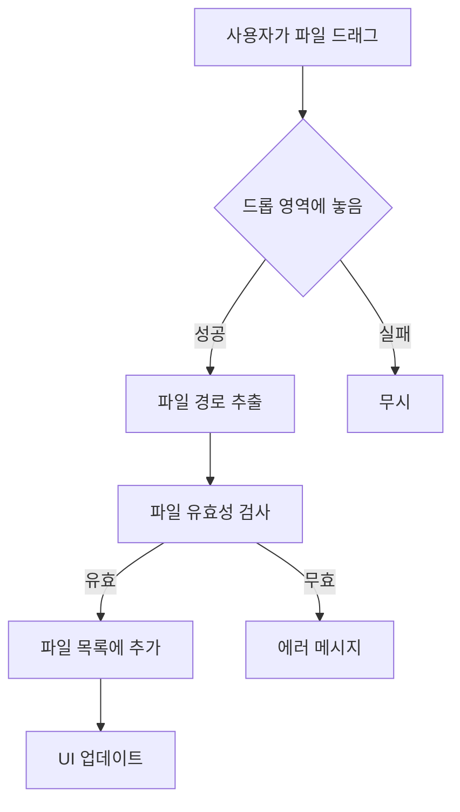

# Chapter 2: 드래그 앤 드롭 기능

이번 챕터에서는 사용자가 파일을 직접 드래그 앤 드롭할 수 있는 기능을 추가하고, 실제 파일 시스템과 상호작용하는 기능을 구현해보겠습니다.

## 🎯 학습 목표

- tkinterdnd2 라이브러리 활용법 익히기
- 파일 시스템 접근 및 파일 정보 처리
- 사용자 친화적인 파일 관리 인터페이스 구현
- 에러 처리 및 예외 상황 대응

## 📦 필요한 라이브러리

### tkinterdnd2 설치

```bash
pip install tkinterdnd2
```

!!! info "tkinterdnd2란?"
    tkinterdnd2는 tkinter에 드래그 앤 드롭 기능을 추가해주는 서드파티 라이브러리입니다.
    Windows, macOS, Linux에서 모두 동작합니다.

## 🔧 핵심 기능 설계

### 드래그 앤 드롭 플로우



### 향상된 파일 관리

- **중복 파일 체크**: 이미 추가된 파일은 제외
- **파일 정보 표시**: 파일명, 크기, 확장자 등
- **파일 개수 카운터**: 현재 로드된 파일 수 표시
- **선택적 제거**: 다중 선택으로 여러 파일 동시 제거

## 💻 코드 구현

### 1. 라이브러리 Import 및 초기 설정

```python linenums="1" title="src/renamer-ch2/main.py"
#!/usr/bin/env python3
"""
Chapter 2: Drag & Drop Functionality
드래그 앤 드롭 기능을 추가한 GUI
"""

import tkinter as tk
from tkinter import ttk
import os
from pathlib import Path

try:
    from tkinterdnd2 import DND_FILES, TkinterDnD
    DND_AVAILABLE = True
except ImportError:
    DND_AVAILABLE = False
```

!!! tip "선택적 Import"
    `try-except`를 사용하여 tkinterdnd2가 없어도 기본 기능은 동작하도록 합니다.
    이는 배포 시 호환성을 높이는 좋은 패턴입니다.

### 2. 향상된 클래스 구조

```python linenums="16"
class DragDropRenamerGUI:
    def __init__(self):
        if DND_AVAILABLE:
            self.root = TkinterDnD.Tk()  # 드래그 앤 드롭 지원
        else:
            self.root = tk.Tk()
        
        self.files = []  # 파일 경로를 저장할 리스트
        self.setup_window()
        self.setup_widgets()
        self.setup_drag_drop()
```

### 3. 드롭 영역 설계

```python linenums="38"
def setup_widgets(self):
    # ... 기본 설정 ...
    
    # 드롭 영역
    if DND_AVAILABLE:
        drop_info = "파일을 여기에 드래그 앤 드롭하세요"
    else:
        drop_info = "tkinterdnd2가 설치되지 않음. '파일 추가' 버튼을 사용하세요"
    
    self.drop_label = ttk.Label(
        main_frame,
        text=drop_info,
        relief="solid",
        padding="20",
        anchor="center"
    )
    self.drop_label.grid(row=1, column=0, columnspan=2, sticky=(tk.W, tk.E), pady=(0, 10))
```

!!! note "시각적 피드백"
    `relief="solid"`로 드롭 영역을 명확히 구분하고, 
    라이브러리 유무에 따라 다른 안내 메시지를 표시합니다.

### 4. 향상된 파일 목록 UI

```python linenums="58"
    # 파일 개수 표시
    self.count_var = tk.StringVar()
    self.count_var.set("파일 개수: 0")
    count_label = ttk.Label(main_frame, textvariable=self.count_var)
    count_label.grid(row=2, column=1, sticky=tk.E, pady=(0, 5))
    
    # 리스트박스와 스크롤바 (수평 스크롤 추가)
    listbox_frame = ttk.Frame(main_frame)
    listbox_frame.grid(row=3, column=0, columnspan=2, 
                      sticky=(tk.W, tk.E, tk.N, tk.S), pady=(0, 10))
    
    self.files_listbox = tk.Listbox(listbox_frame, height=12, selectmode=tk.EXTENDED)
    scrollbar_y = ttk.Scrollbar(listbox_frame, orient=tk.VERTICAL, command=self.files_listbox.yview)
    scrollbar_x = ttk.Scrollbar(listbox_frame, orient=tk.HORIZONTAL, command=self.files_listbox.xview)
    
    self.files_listbox.config(yscrollcommand=scrollbar_y.set, xscrollcommand=scrollbar_x.set)
    
    self.files_listbox.grid(row=0, column=0, sticky=(tk.W, tk.E, tk.N, tk.S))
    scrollbar_y.grid(row=0, column=1, sticky=(tk.N, tk.S))
    scrollbar_x.grid(row=1, column=0, sticky=(tk.W, tk.E))
    
    listbox_frame.columnconfigure(0, weight=1)
    listbox_frame.rowconfigure(0, weight=1)
```

!!! tip "다중 선택 모드"
    `selectmode=tk.EXTENDED`로 설정하여 Ctrl+클릭이나 Shift+클릭으로 
    여러 파일을 선택할 수 있게 합니다.

### 5. 향상된 버튼 영역

```python linenums="82"
    # 버튼 프레임
    button_frame = ttk.Frame(main_frame)
    button_frame.grid(row=4, column=0, columnspan=2, pady=10)
    
    # 파일 추가 버튼
    add_button = ttk.Button(
        button_frame, 
        text="파일 추가", 
        command=self.add_files_dialog
    )
    add_button.pack(side=tk.LEFT, padx=(0, 10))
    
    # 파일 제거 버튼
    remove_button = ttk.Button(
        button_frame, 
        text="선택 제거", 
        command=self.remove_selected_files
    )
    remove_button.pack(side=tk.LEFT, padx=(0, 10))
    
    # 모두 제거 버튼
    clear_button = ttk.Button(
        button_frame, 
        text="모두 제거", 
        command=self.clear_all_files
    )
    clear_button.pack(side=tk.LEFT, padx=(0, 10))
```

## 🎮 드래그 앤 드롭 구현

### 1. 드래그 앤 드롭 설정

```python linenums="113"
def setup_drag_drop(self):
    if DND_AVAILABLE:
        self.drop_label.drop_target_register(DND_FILES)
        self.drop_label.dnd_bind('<<Drop>>', self.on_drop)
        
        self.files_listbox.drop_target_register(DND_FILES)
        self.files_listbox.dnd_bind('<<Drop>>', self.on_drop)
```

!!! info "이벤트 바인딩"
    - `drop_target_register(DND_FILES)`: 파일 드롭을 받을 수 있도록 등록
    - `dnd_bind('<<Drop>>', handler)`: 드롭 이벤트 핸들러 연결

### 2. 드롭 이벤트 처리

```python linenums="120"
def on_drop(self, event):
    files = self.root.tk.splitlist(event.data)
    self.add_files(files)
```

### 3. 파일 추가 다이얼로그

```python linenums="124"
def add_files_dialog(self):
    from tkinter import filedialog
    files = filedialog.askopenfilenames(
        title="파일 선택",
        filetypes=[
            ("모든 파일", "*.*"),
            ("텍스트 파일", "*.txt"),
            ("이미지 파일", "*.jpg *.jpeg *.png *.gif *.bmp"),
            ("문서 파일", "*.pdf *.doc *.docx")
        ]
    )
    if files:
        self.add_files(files)
```

!!! tip "파일 형식 필터"
    `filetypes` 매개변수로 사용자가 특정 형식의 파일만 선택하기 쉽게 만듭니다.

## 📁 파일 관리 로직

### 1. 스마트 파일 추가

```python linenums="137"
def add_files(self, file_paths):
    added_count = 0
    
    for file_path in file_paths:
        if os.path.isfile(file_path) and file_path not in self.files:
            self.files.append(file_path)
            file_name = os.path.basename(file_path)
            self.files_listbox.insert(tk.END, file_name)
            added_count += 1
    
    self.update_file_count()
    
    if added_count > 0:
        self.status_var.set(f"{added_count}개 파일이 추가되었습니다")
    else:
        self.status_var.set("추가할 새로운 파일이 없습니다")
```

!!! note "중복 검사"
    - `os.path.isfile()`: 실제 파일인지 확인
    - `file_path not in self.files`: 이미 추가된 파일인지 확인

### 2. 선택적 파일 제거

```python linenums="152"
def remove_selected_files(self):
    selection = self.files_listbox.curselection()
    if selection:
        # 뒤에서부터 제거 (인덱스 변경 방지)
        for index in reversed(selection):
            self.files_listbox.delete(index)
            del self.files[index]
        
        self.update_file_count()
        self.status_var.set(f"{len(selection)}개 파일이 제거되었습니다")
    else:
        self.status_var.set("제거할 파일을 선택해주세요")
```

!!! important "역순 제거"
    리스트에서 항목을 제거할 때는 뒤에서부터 제거해야 인덱스가 꼬이지 않습니다.

### 3. 전체 파일 제거

```python linenums="165"
def clear_all_files(self):
    count = len(self.files)
    self.files.clear()
    self.files_listbox.delete(0, tk.END)
    self.update_file_count()
    self.status_var.set(f"모든 파일({count}개)이 제거되었습니다")
```

### 4. 파일 카운터 업데이트

```python linenums="172"
def update_file_count(self):
    self.count_var.set(f"파일 개수: {len(self.files)}")
```

## 🧪 테스트 시나리오

### 1. 드래그 앤 드롭 테스트

=== "단일 파일"
    1. 탐색기에서 파일 하나를 선택
    2. 드롭 영역으로 드래그
    3. 파일이 목록에 추가되는지 확인

=== "다중 파일"
    1. 탐색기에서 여러 파일을 선택 (Ctrl+클릭)
    2. 드롭 영역으로 드래그
    3. 모든 파일이 목록에 추가되는지 확인

=== "폴더 드롭"
    1. 폴더를 드래그 앤 드롭
    2. 폴더는 무시되고 파일만 처리되는지 확인

### 2. 파일 관리 테스트

=== "중복 파일"
    1. 같은 파일을 두 번 추가
    2. 중복이 방지되는지 확인

=== "다중 선택 제거"
    1. 여러 파일을 선택 (Ctrl+클릭)
    2. "선택 제거" 버튼 클릭
    3. 선택된 파일들만 제거되는지 확인

=== "전체 제거"
    1. 여러 파일을 추가
    2. "모두 제거" 버튼 클릭
    3. 모든 파일이 제거되는지 확인

## 🎨 UI/UX 개선사항

### 1. 시각적 피드백

```python
# 드롭 영역 강조
self.drop_label = ttk.Label(
    main_frame,
    text=drop_info,
    relief="solid",      # 테두리 표시
    padding="20",        # 충분한 패딩
    anchor="center"      # 중앙 정렬
)
```

### 2. 상태 정보 표시

```python
# 실시간 파일 개수 표시
self.count_var.set(f"파일 개수: {len(self.files)}")

# 사용자 액션에 대한 피드백
self.status_var.set(f"{added_count}개 파일이 추가되었습니다")
```

### 3. 다양한 입력 방법 지원

- **드래그 앤 드롭**: 직관적인 파일 추가
- **파일 다이얼로그**: 전통적인 파일 선택
- **다중 선택**: 효율적인 파일 관리

## 🔍 에러 처리

### 1. 라이브러리 누락 처리

```python
try:
    from tkinterdnd2 import DND_FILES, TkinterDnD
    DND_AVAILABLE = True
except ImportError:
    DND_AVAILABLE = False
    # 기본 기능으로 fallback
```

### 2. 파일 시스템 에러

```python
def add_files(self, file_paths):
    added_count = 0
    
    for file_path in file_paths:
        try:
            if os.path.isfile(file_path) and file_path not in self.files:
                self.files.append(file_path)
                file_name = os.path.basename(file_path)
                self.files_listbox.insert(tk.END, file_name)
                added_count += 1
        except (OSError, PermissionError) as e:
            self.status_var.set(f"파일 접근 오류: {e}")
            continue
```

## 🚀 실행 결과

완성된 Chapter 2 예제를 실행하면:


### 새로 추가된 기능들

1. **드래그 앤 드롭 영역**: 파일을 직접 끌어다 놓을 수 있음
2. **파일 개수 표시**: 현재 로드된 파일 수 실시간 표시
3. **향상된 버튼**: 선택 제거, 모두 제거 기능
4. **수평 스크롤바**: 긴 파일명도 확인 가능
5. **다중 선택**: 여러 파일을 동시에 선택/제거 가능

## 📚 핵심 개념 정리

### 드래그 앤 드롭 패턴

```python
# 1. 위젯을 드롭 타겟으로 등록
widget.drop_target_register(DND_FILES)

# 2. 드롭 이벤트 바인딩
widget.dnd_bind('<<Drop>>', self.on_drop)

# 3. 이벤트 핸들러에서 데이터 처리
def on_drop(self, event):
    files = self.root.tk.splitlist(event.data)
    self.process_files(files)
```

### 파일 시스템 작업

```python
import os
from pathlib import Path

# 파일 존재 확인
if os.path.isfile(file_path):
    # 파일 처리

# 파일명 추출
file_name = os.path.basename(file_path)

# 경로 조작 (pathlib 사용 권장)
path = Path(file_path)
name = path.name
extension = path.suffix
```

### 리스트 관리 패턴

```python
# 중복 방지 추가
if item not in list:
    list.append(item)

# 역순 제거
for index in reversed(selection):
    del list[index]

# 전체 삭제
list.clear()
```

## 🎯 다음 단계 미리보기

Chapter 2에서는 파일을 관리하는 기능을 추가했습니다. 다음 [Chapter 3](chapter3.md)에서는:

- **실제 파일명 변경** 로직 구현
- **다양한 리네임 방식** 지원
- **미리보기 기능** 추가
- **안전한 파일 조작** 구현

---

!!! success "Chapter 2 완료!"
    드래그 앤 드롭 기능과 파일 관리 기능을 성공적으로 구현했습니다!
    이제 실제로 파일명을 변경하는 핵심 기능을 만들어보겠습니다.

!!! tip "연습 과제"
    - 파일 정보를 더 자세히 표시해보기 (크기, 수정일 등)
    - 파일 형식별로 다른 아이콘 표시해보기
    - 파일 목록을 저장/불러오기 기능 추가해보기
    - 드롭 시 시각적 효과 추가해보기