# Chapter 2: Tkinter UI 요소 완전 정복

## 👋 GUI 프로그램의 세계로!

안녕하세요! Chapter 1에서 파이썬 기초를 배웠으니, 이제 진짜 재미있는 부분을 시작해봅시다! 

지금까지는 검은 화면에 글자만 나오는 프로그램을 만들었는데, 이번에는 **버튼, 입력창, 메뉴가 있는 진짜 프로그램**<!-- -->을 만들어보겠습니다.

## 🎯 이번 챕터에서 배울 것들

**Tkinter를 선택하는 이유:**

- ✅ 파이썬에 기본으로 포함되어 있음 (별도 설치 불필요)
- ✅ 배우기 쉬움 (초보자 친화적)
- ✅ 윈도우, 맥, 리눅스 모두에서 동작
- ✅ KRenamer 같은 데스크톱 앱에 완벽

**학습할 UI 요소들:**

- 🖼️ **기본 구조**: 창(Window)과 기본 설정들
- 📝 **텍스트 요소**: Label, Entry, Text
- 🔘 **버튼과 체크박스**: Button, Checkbutton, Radiobutton
- 📋 **목록과 선택**: Listbox, Combobox
- 🖼️ **레이아웃**: Frame, 배치 관리자들
- 🎨 **고급 요소**: Canvas, Menu, Scrollbar

## 📚 1. 기본 구조 - 모든 GUI의 출발점

### 첫 번째 창 만들어보기

```python linenums="1" title="src/chapter2/01_basic_window.py"
import tkinter as tk

# 1단계: 기본 창 만들기
root = tk.Tk()  # 새로운 창을 만듭니다
root.title("내 첫 번째 GUI 프로그램")  # 창 제목 설정
root.geometry("300x200")  # 창 크기 설정 (가로x세로)

# 2단계: 창 보여주기 (이것이 없으면 창이 안 보여요!)
root.mainloop()
```

*위 코드를 실행하면 간단한 GUI 창이 나타납니다. 제목 표시줄과 크기가 설정된 기본 창의 모습입니다.*

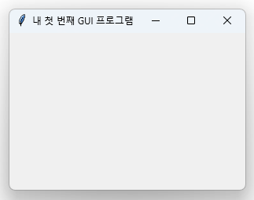

!!! tip "💡 tkinter 기본 구조 이해하기"
    **모든 tkinter 프로그램의 필수 3단계:**
    
    1. `import tkinter as tk` → tkinter 라이브러리 가져오기
    2. `root = tk.Tk()` → 메인 창 만들기  
    3. `root.mainloop()` → 창 보여주고 사용자 입력 기다리기

### 창 설정 옵션들

```python linenums="15" title="src/chapter2/02_window_config.py"
import tkinter as tk

root = tk.Tk()

# 창 설정 옵션들
root.title("창 설정 연습")          # 제목
root.geometry("300x200")          # 크기
root.resizable(True, False)       # 가로만 크기 조절 가능
root.minsize(200, 100)            # 최소 크기
root.maxsize(800, 600)            # 최대 크기
root.configure(bg="lightblue")    # 배경색

root.mainloop()
```

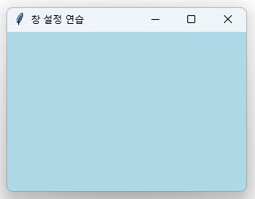

## 📝 2. 텍스트 요소들 - 정보를 보여주고 받기

### Label - 텍스트와 이미지 표시

*Label 위젯의 다양한 스타일링 옵션들을 보여주는 예제입니다. 기본 라벨, 스타일 적용된 라벨, 여러 줄 라벨, 그리고 동적으로 변경되는 라벨을 확인할 수 있습니다.*

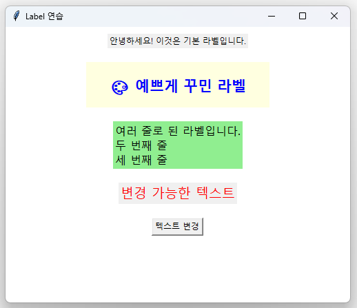

```python linenums="1" title="src/chapter2/03_labels.py"
import tkinter as tk

root = tk.Tk()
root.title("Label 연습")
root.geometry("500x400")
root.configure(bg="white")

# 기본 라벨
basic_label = tk.Label(root, text="안녕하세요! 이것은 기본 라벨입니다.")
basic_label.pack(pady=10)

# 스타일이 적용된 라벨
styled_label = tk.Label(
    root,
    text="🎨 예쁘게 꾸민 라벨",
    font=("맑은 고딕", 16, "bold"),    # 폰트 설정
    fg="blue",                         # 글자색
    bg="lightyellow",                  # 배경색
    width=20,                          # 너비 (글자 수)
    height=2                           # 높이 (줄 수)
)
styled_label.pack(pady=10)

# 여러 줄 라벨
multiline_label = tk.Label(
    root,
    text="여러 줄로 된 라벨입니다.\n두 번째 줄\n세 번째 줄",
    font=("맑은 고딕", 12),
    justify=tk.LEFT,                   # 텍스트 정렬
    bg="lightgreen"
)
multiline_label.pack(pady=10)

# 동적으로 변하는 라벨
dynamic_var = tk.StringVar()
dynamic_var.set("변경 가능한 텍스트")

dynamic_label = tk.Label(
    root,
    textvariable=dynamic_var,          # StringVar 사용
    font=("맑은 고딕", 14),
    fg="red"
)
dynamic_label.pack(pady=10)

# 텍스트를 변경하는 버튼
def change_text():
    import random
    texts = ["안녕하세요!", "Hello!", "こんにちは!", "Bonjour!", "¡Hola!"]
    dynamic_var.set(random.choice(texts))

change_button = tk.Button(root, text="텍스트 변경", command=change_text)
change_button.pack(pady=10)

root.mainloop()
```


### Entry - 한 줄 텍스트 입력

Entry 위젯은 사용자로부터 한 줄의 텍스트를 입력받을 때 사용합니다. 단계별로 살펴보겠습니다.

#### 🔹 1단계: 기본 Entry 만들기

*Entry 위젯을 사용한 텍스트 입력 예제입니다. 일반 텍스트 입력창을 확인할 수 있습니다.*

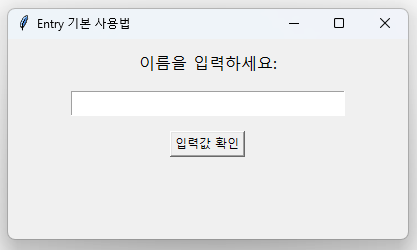

```python linenums="1" title="src/chapter2/04a_basic_entry.py"
import tkinter as tk

root = tk.Tk()
root.title("Entry 기본 사용법")
root.geometry("400x200")

# 기본 입력창
tk.Label(root, text="이름을 입력하세요:", font=("맑은 고딕", 12)).pack(pady=10)
name_entry = tk.Entry(root, font=("맑은 고딕", 12), width=30)
name_entry.pack(pady=5)

# 입력값 가져오기
def show_input():
    user_input = name_entry.get()  # Entry에서 텍스트 가져오기
    result_label.config(text=f"입력하신 내용: {user_input}")

tk.Button(root, text="입력값 확인", command=show_input).pack(pady=10)

result_label = tk.Label(root, text="", font=("맑은 고딕", 11), fg="blue")
result_label.pack()

root.mainloop()
```

#### 🔹 2단계: 다양한 Entry 스타일

*일반 텍스트, 비밀번호(별표 표시), 읽기 전용, 색상이 적용된 다양한 Entry 위젯의 스타일을 보여주는 예제입니다.*

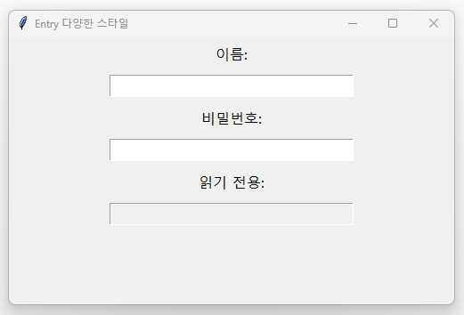

```python linenums="15" title="src/chapter2/04b_entry_styles.py"
import tkinter as tk

root = tk.Tk()
root.title("Entry 다양한 스타일")
root.geometry("500x300")

# 일반 텍스트 입력창
tk.Label(root, text="이름:", font=("맑은 고딕", 12)).pack(pady=5)
name_entry = tk.Entry(root, font=("맑은 고딕", 12), width=30)
name_entry.pack(pady=5)

# 비밀번호 입력창 (별표로 숨김)
tk.Label(root, text="비밀번호:", font=("맑은 고딕", 12)).pack(pady=5)
password_entry = tk.Entry(root, font=("맑은 고딕", 12), width=30, show="*")
password_entry.pack(pady=5)

# 읽기 전용 입력창
tk.Label(root, text="읽기 전용:", font=("맑은 고딕", 12)).pack(pady=5)
readonly_entry = tk.Entry(root, font=("맑은 고딕", 12), width=30, state="readonly")
readonly_entry.insert(0, "이 텍스트는 수정할 수 없습니다")
readonly_entry.pack(pady=5)

root.mainloop()
```

#### 🔹 3단계: 입력값 검증과 처리

*사용자 입력값을 검증하고 결과를 표시하는 예제입니다. 이름, 나이, 이메일 입력 필드와 검증 결과를 확인할 수 있습니다.*

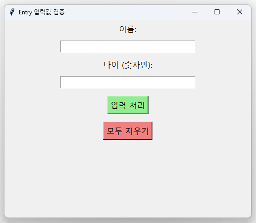

```python linenums="30" title="src/chapter2/04c_entry_validation.py"
import tkinter as tk
import tkinter.messagebox as msgbox

root = tk.Tk()
root.title("Entry 입력값 검증")
root.geometry("500x400")

# 입력 필드들
tk.Label(root, text="이름:", font=("맑은 고딕", 12)).pack(pady=5)
name_entry = tk.Entry(root, font=("맑은 고딕", 12), width=30)
name_entry.pack(pady=5)

tk.Label(root, text="나이 (숫자만):", font=("맑은 고딕", 12)).pack(pady=5)
age_entry = tk.Entry(root, font=("맑은 고딕", 12), width=30)
age_entry.pack(pady=5)

# 입력값 처리 함수
def process_input():
    name = name_entry.get()
    age = age_entry.get()
    
    # 입력값 검증
    if not name:
        msgbox.showwarning("입력 오류", "이름을 입력해주세요!")
        return
    
    if age and not age.isdigit():
        msgbox.showerror("입력 오류", "나이는 숫자만 입력해주세요!")
        return
    
    # 결과 표시
    result = f"안녕하세요, {name}님!"
    if age:
        result += f"\n나이: {age}세"
    
    msgbox.showinfo("입력 결과", result)

# 버튼과 기능
tk.Button(root, text="입력 처리", command=process_input, 
          font=("맑은 고딕", 12), bg="lightgreen").pack(pady=10)

def clear_all():
    name_entry.delete(0, tk.END)  # Entry 내용 지우기
    age_entry.delete(0, tk.END)

tk.Button(root, text="모두 지우기", command=clear_all,
          font=("맑은 고딕", 12), bg="lightcoral").pack(pady=5)

# Enter 키로 입력 처리
root.bind('<Return>', lambda event: process_input())

root.mainloop()
```

!!! tip "💡 Entry 위젯 핵심 포인트"

    - `.get()`: Entry에서 텍스트 가져오기
    - `.insert(position, text)`: 특정 위치에 텍스트 삽입
    - `.delete(start, end)`: 특정 범위의 텍스트 삭제
    - `show="*"`: 비밀번호처럼 문자를 숨김 처리
    - `state="readonly"`: 읽기 전용으로 설정

### Text - 여러 줄 텍스트 입력/표시

Text 위젯은 Entry와 달리 여러 줄의 텍스트를 다룰 때 사용합니다. 단계별로 알아보겠습니다.

#### 🔹 1단계: 기본 Text 위젯

*여러 줄 텍스트를 입력하고 편집할 수 있는 기본 Text 위젯의 사용 예제입니다. 단어 단위 줄바꿈과 배경색이 적용되어 있습니다.*

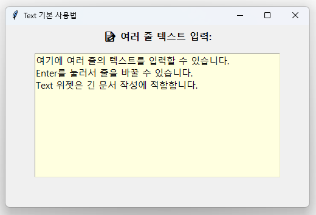

```python linenums="1" title="src/chapter2/05a_basic_text.py"
import tkinter as tk

root = tk.Tk()
root.title("Text 기본 사용법")
root.geometry("500x300")

tk.Label(root, text="📝 여러 줄 텍스트 입력:", font=("맑은 고딕", 12, "bold")).pack(pady=5)

# 기본 Text 위젯
text_widget = tk.Text(
    root,
    height=10,
    width=50,
    font=("맑은 고딕", 11),
    wrap=tk.WORD,              # 단어 단위로 줄바꿈
    bg="lightyellow"
)
text_widget.pack(pady=10)

# 초기 텍스트 넣기
text_widget.insert(tk.END, "여기에 여러 줄의 텍스트를 입력할 수 있습니다.\n")
text_widget.insert(tk.END, "Enter를 눌러서 줄을 바꿀 수 있습니다.\n")
text_widget.insert(tk.END, "Text 위젯은 긴 문서 작성에 적합합니다.")

root.mainloop()
```

#### 🔹 2단계: 스크롤이 있는 Text

*ScrolledText 위젯을 사용한 예제로, 많은 양의 텍스트를 스크롤바를 통해 효과적으로 탐색할 수 있습니다.*

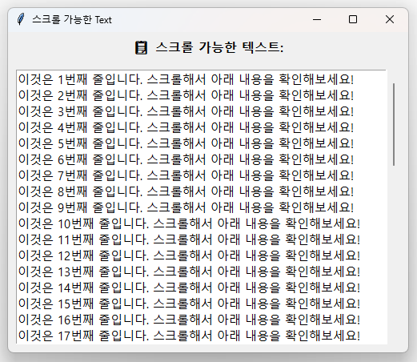

```python linenums="20" title="src/chapter2/05b_scrolled_text.py"
import tkinter as tk
from tkinter import scrolledtext

root = tk.Tk()
root.title("스크롤 가능한 Text")
root.geometry("500x400")

tk.Label(root, text="📋 스크롤 가능한 텍스트:", font=("맑은 고딕", 12, "bold")).pack(pady=5)

# 스크롤바가 있는 Text 위젯
text_area = scrolledtext.ScrolledText(
    root,
    height=15,
    width=60,
    font=("맑은 고딕", 11),
    wrap=tk.WORD
)
text_area.pack(padx=10, pady=10, fill=tk.BOTH, expand=True)

# 많은 양의 텍스트 추가
for i in range(50):
    text_area.insert(tk.END, f"이것은 {i+1}번째 줄입니다. 스크롤해서 아래 내용을 확인해보세요!\n")

root.mainloop()
```

#### 🔹 3단계: Text 조작 기능들

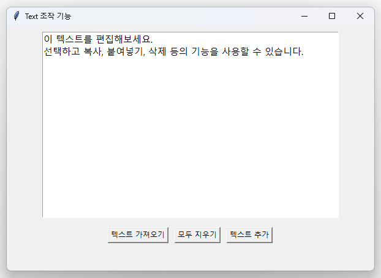

```python linenums="40" title="src/chapter2/05c_text_operations.py"
import tkinter as tk

root = tk.Tk()
root.title("Text 조작 기능")
root.geometry("600x400")

# Text 위젯
text_widget = tk.Text(root, height=15, width=60, font=("맑은 고딕", 11))
text_widget.pack(padx=10, pady=10)

# 초기 텍스트
text_widget.insert(tk.END, "이 텍스트를 편집해보세요.\n선택하고 복사, 붙여넣기, 삭제 등의 기능을 사용할 수 있습니다.")

# 버튼 프레임
button_frame = tk.Frame(root)
button_frame.pack(pady=5)

def get_text():
    content = text_widget.get(1.0, tk.END)
    print("현재 텍스트:", content)

def clear_text():
    text_widget.delete(1.0, tk.END)

def insert_text():
    text_widget.insert(tk.END, "\n새로운 텍스트가 추가되었습니다.")

tk.Button(button_frame, text="텍스트 가져오기", command=get_text).pack(side=tk.LEFT, padx=5)
tk.Button(button_frame, text="모두 지우기", command=clear_text).pack(side=tk.LEFT, padx=5)
tk.Button(button_frame, text="텍스트 추가", command=insert_text).pack(side=tk.LEFT, padx=5)

root.mainloop()
```

!!! tip "💡 Text 위젯 핵심 포인트"
    - **Text vs Entry**: Entry는 한 줄, Text는 여러 줄
    - **위치 표시**: `"1.0"` = 1번째 줄, 0번째 문자 (첫 번째 위치)
    - **`tk.END`**: 텍스트의 마지막 위치
    - **`wrap=tk.WORD`**: 단어 단위로 줄바꿈 (긴 줄을 자동으로 감쌈)
    - **ScrolledText**: 스크롤바가 자동으로 추가된 Text 위젯

## 🔘 3. 버튼과 선택 요소들

### Button - 클릭 이벤트 처리

*Button 위젯의 다양한 기능들을 보여주는 예제입니다. 기본 버튼, 색상이 적용된 버튼들, 그리고 메시지박스와 연동된 특별한 기능 버튼들을 확인할 수 있습니다.*

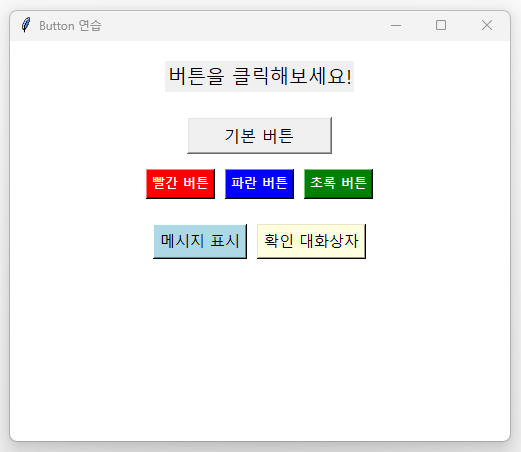

```python linenums="1" title="src/chapter2/06_buttons.py"
import tkinter as tk
from tkinter import messagebox

root = tk.Tk()
root.title("Button 연습")
root.geometry("500x400")
root.configure(bg="white")

# 클릭 횟수를 저장할 변수
click_count = 0
status_var = tk.StringVar()
status_var.set("버튼을 클릭해보세요!")

# 상태 표시 라벨
status_label = tk.Label(root, textvariable=status_var, font=("맑은 고딕", 14))
status_label.pack(pady=20)

# 기본 버튼
def basic_click():
    global click_count
    click_count += 1
    status_var.set(f"기본 버튼이 {click_count}번 클릭되었습니다!")

basic_button = tk.Button(
    root,
    text="기본 버튼",
    command=basic_click,
    font=("맑은 고딕", 12),
    width=15
)
basic_button.pack(pady=5)

# 스타일이 적용된 버튼들
style_frame = tk.Frame(root, bg="white")
style_frame.pack(pady=10)

tk.Button(style_frame, text="빨간 버튼", bg="red", fg="white",
          font=("맑은 고딕", 10, "bold"),
          command=lambda: status_var.set("빨간 버튼 클릭!")).pack(side=tk.LEFT, padx=5)

tk.Button(style_frame, text="파란 버튼", bg="blue", fg="white",
          font=("맑은 고딕", 10, "bold"),
          command=lambda: status_var.set("파란 버튼 클릭!")).pack(side=tk.LEFT, padx=5)

tk.Button(style_frame, text="초록 버튼", bg="green", fg="white",
          font=("맑은 고딕", 10, "bold"),
          command=lambda: status_var.set("초록 버튼 클릭!")).pack(side=tk.LEFT, padx=5)

# 특별한 기능 버튼들
special_frame = tk.Frame(root, bg="white")
special_frame.pack(pady=15)

def show_message():
    messagebox.showinfo("메시지", "안녕하세요! 이것은 메시지 박스입니다.")

def confirm_action():
    result = messagebox.askyesno("확인", "정말로 실행하시겠습니까?")
    if result:
        status_var.set("사용자가 '예'를 선택했습니다!")
    else:
        status_var.set("사용자가 '아니오'를 선택했습니다!")

tk.Button(special_frame, text="메시지 표시", command=show_message,
          font=("맑은 고딕", 11), bg="lightblue").pack(side=tk.LEFT, padx=5)

tk.Button(special_frame, text="확인 대화상자", command=confirm_action,
          font=("맑은 고딕", 11), bg="lightyellow").pack(side=tk.LEFT, padx=5)

root.mainloop()
```


### Checkbutton과 Radiobutton - 선택 옵션

*Checkbutton과 Radiobutton의 차이점을 보여주는 예제입니다. 체크박스는 여러 개를 동시에 선택할 수 있고, 라디오버튼은 하나만 선택할 수 있습니다. 선택 결과를 처리하는 방법도 함께 보여줍니다.*

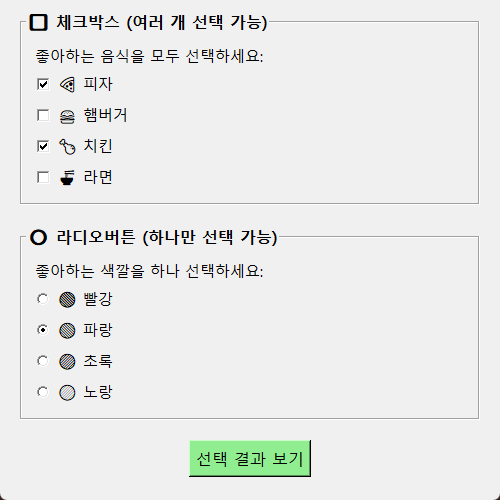

```python linenums="1" title="src/chapter2/07_checkradio.py"
import tkinter as tk

root = tk.Tk()
root.title("체크박스와 라디오버튼")
root.geometry("500x500")

# 체크박스 섹션
check_frame = tk.LabelFrame(root, text="🔲 체크박스 (여러 개 선택 가능)", 
                           font=("맑은 고딕", 12, "bold"), padx=10, pady=10)
check_frame.pack(pady=10, padx=20, fill="x")

# 체크박스 변수들
pizza_var = tk.BooleanVar()
burger_var = tk.BooleanVar()
chicken_var = tk.BooleanVar()
noodle_var = tk.BooleanVar()

tk.Label(check_frame, text="좋아하는 음식을 모두 선택하세요:", 
         font=("맑은 고딕", 11)).pack(anchor="w")

tk.Checkbutton(check_frame, text="🍕 피자", variable=pizza_var,
               font=("맑은 고딕", 11)).pack(anchor="w")
tk.Checkbutton(check_frame, text="🍔 햄버거", variable=burger_var,
               font=("맑은 고딕", 11)).pack(anchor="w")
tk.Checkbutton(check_frame, text="🍗 치킨", variable=chicken_var,
               font=("맑은 고딕", 11)).pack(anchor="w")
tk.Checkbutton(check_frame, text="🍜 라면", variable=noodle_var,
               font=("맑은 고딕", 11)).pack(anchor="w")

# 라디오버튼 섹션
radio_frame = tk.LabelFrame(root, text="🔘 라디오버튼 (하나만 선택 가능)", 
                           font=("맑은 고딕", 12, "bold"), padx=10, pady=10)
radio_frame.pack(pady=10, padx=20, fill="x")

# 라디오버튼 변수
color_var = tk.StringVar()
color_var.set("red")  # 기본값 설정

tk.Label(radio_frame, text="좋아하는 색깔을 하나 선택하세요:", 
         font=("맑은 고딕", 11)).pack(anchor="w")

colors = [("🔴 빨강", "red"), ("🔵 파랑", "blue"), ("🟢 초록", "green"), ("🟡 노랑", "yellow")]

for text, value in colors:
    tk.Radiobutton(radio_frame, text=text, variable=color_var, value=value,
                   font=("맑은 고딕", 11)).pack(anchor="w")

# 결과 표시 함수
def show_selections():
    # 체크박스 결과
    foods = []
    if pizza_var.get(): foods.append("피자")
    if burger_var.get(): foods.append("햄버거")
    if chicken_var.get(): foods.append("치킨")
    if noodle_var.get(): foods.append("라면")
    
    # 라디오버튼 결과
    selected_color = color_var.get()
    color_names = {"red": "빨강", "blue": "파랑", "green": "초록", "yellow": "노랑"}
    
    # 결과 메시지
    result = "📋 선택 결과:\n\n"
    
    if foods:
        result += f"좋아하는 음식: {', '.join(foods)}\n"
    else:
        result += "선택된 음식이 없습니다.\n"
    
    result += f"좋아하는 색깔: {color_names[selected_color]}"
    
    result_label.config(text=result)

# 버튼과 결과 표시 영역
button_frame = tk.Frame(root)
button_frame.pack(pady=10)

tk.Button(button_frame, text="선택 결과 보기", command=show_selections,
          font=("맑은 고딕", 12), bg="lightgreen").pack(side=tk.LEFT, padx=5)

def reset_selections():
    pizza_var.set(False)
    burger_var.set(False)
    chicken_var.set(False)
    noodle_var.set(False)
    color_var.set("red")
    result_label.config(text="선택을 초기화했습니다.")

tk.Button(button_frame, text="선택 초기화", command=reset_selections,
          font=("맑은 고딕", 12), bg="lightcoral").pack(side=tk.LEFT, padx=5)

# 결과 표시 라벨
result_label = tk.Label(root, text="위에서 선택을 하고 '선택 결과 보기'를 클릭하세요.",
                       font=("맑은 고딕", 11), fg="blue", justify="left")
result_label.pack(pady=20)

root.mainloop()
```


## 📋 4. 목록과 선택 요소들

### Listbox - 목록 선택

Listbox는 여러 항목 중에서 하나 또는 여러 개를 선택할 수 있는 목록을 만들 때 사용합니다.

#### 🔹 1단계: 기본 Listbox

*단일 선택이 가능한 Listbox 위젯 예제입니다.*

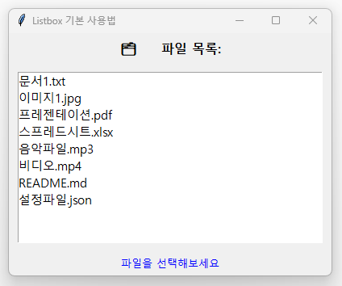

```python linenums="1" title="src/chapter2/08a_basic_listbox.py"
import tkinter as tk

root = tk.Tk()
root.title("Listbox 기본 사용법")
root.geometry("400x300")

tk.Label(root, text="📋 프로그래밍 언어 목록:", font=("맑은 고딕", 12, "bold")).pack(pady=10)

# 기본 Listbox (단일 선택)
listbox = tk.Listbox(root, height=8, font=("맑은 고딕", 11))
listbox.pack(pady=10)

# 목록에 항목 추가
languages = ["Python", "JavaScript", "Java", "C++", "C#", "Go", "Rust", "Swift"]
for lang in languages:
    listbox.insert(tk.END, lang)  # 마지막에 항목 추가

# 선택된 항목 확인하기
def show_selection():
    selection = listbox.curselection()  # 선택된 항목의 인덱스
    if selection:
        selected_item = listbox.get(selection[0])  # 선택된 항목의 텍스트
        result_label.config(text=f"선택: {selected_item}")
    else:
        result_label.config(text="선택된 항목이 없습니다.")

tk.Button(root, text="선택 확인", command=show_selection, 
          font=("맑은 고딕", 11)).pack(pady=10)

result_label = tk.Label(root, text="", font=("맑은 고딕", 11), fg="blue")
result_label.pack()

root.mainloop()
```

#### 🔹 2단계: 다중 선택 Listbox

*다중 선택이 가능한 Listbox 위젯 예제입니다.*


```python linenums="30" title="src/chapter2/08b_multiple_listbox.py"
import tkinter as tk

root = tk.Tk()
root.title("다중 선택 Listbox")
root.geometry("400x400")

tk.Label(root, text="🍎 좋아하는 과일을 여러 개 선택하세요:", 
         font=("맑은 고딕", 11, "bold")).pack(pady=10)

# 다중 선택이 가능한 Listbox
multi_listbox = tk.Listbox(root, height=8, font=("맑은 고딕", 11),
                          selectmode=tk.MULTIPLE)  # 다중 선택 모드
multi_listbox.pack(pady=10)

fruits = ["🍎 사과", "🍌 바나나", "🍇 포도", "🍓 딸기", "🍑 체리", "🥝 키위", "🍊 오렌지", "🥭 망고"]
for fruit in fruits:
    multi_listbox.insert(tk.END, fruit)

def show_multiple_selection():
    selections = multi_listbox.curselection()  # 여러 개 선택된 인덱스들
    if selections:
        selected_fruits = [multi_listbox.get(i) for i in selections]
        result_text.config(text=f"선택된 과일:\n" + "\n".join(selected_fruits))
    else:
        result_text.config(text="선택된 과일이 없습니다.")

tk.Button(root, text="선택 결과 보기", command=show_multiple_selection,
          font=("맑은 고딕", 11), bg="lightgreen").pack(pady=10)

result_text = tk.Label(root, text="", font=("맑은 고딕", 10), fg="blue", justify=tk.LEFT)
result_text.pack(pady=10)

root.mainloop()
```

#### 🔹 3단계: Listbox 항목 추가/삭제

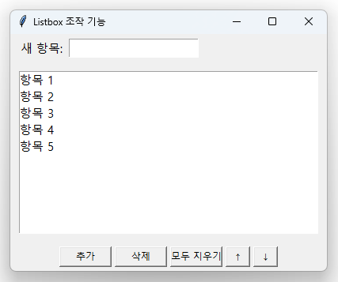

*Listbox를 사용해 할 일을 추가·삭제·전체 삭제할 수 있는 간단한 To-Do 리스트 관리 프로그램입니다.*

```python linenums="60" title="src/chapter2/08c_listbox_operations.py"
import tkinter as tk

root = tk.Tk()
root.title("Listbox 조작 기능")
root.geometry("400x300")

# 상단 프레임 - 입력과 버튼
top_frame = tk.Frame(root)
top_frame.pack(fill=tk.X, padx=10, pady=5)

tk.Label(top_frame, text="새 항목:", font=("맑은 고딕", 11)).pack(side=tk.LEFT)
entry = tk.Entry(top_frame, font=("맑은 고딕", 11), width=20)
entry.pack(side=tk.LEFT, padx=5)

# Listbox
listbox = tk.Listbox(root, height=6, font=("맑은 고딕", 11))
listbox.pack(padx=10, pady=10, fill=tk.BOTH, expand=True)

# 초기 항목들
initial_items = ["항목 1", "항목 2", "항목 3", "항목 4", "항목 5"]
for item in initial_items:
    listbox.insert(tk.END, item)

# 기능 함수들
def add_item():
    new_item = entry.get()
    if new_item:
        listbox.insert(tk.END, new_item)
        entry.delete(0, tk.END)

def delete_item():
    selection = listbox.curselection()
    if selection:
        listbox.delete(selection[0])

def clear_all():
    listbox.delete(0, tk.END)

def move_up():
    selection = listbox.curselection()
    if selection and selection[0] > 0:
        index = selection[0]
        item = listbox.get(index)
        listbox.delete(index)
        listbox.insert(index - 1, item)
        listbox.select_set(index - 1)

def move_down():
    selection = listbox.curselection()
    if selection and selection[0] < listbox.size() - 1:
        index = selection[0]
        item = listbox.get(index)
        listbox.delete(index)
        listbox.insert(index + 1, item)
        listbox.select_set(index + 1)

# 버튼 프레임
button_frame = tk.Frame(root)
button_frame.pack(pady=5)

tk.Button(button_frame, text="추가", command=add_item, width=8).pack(side=tk.LEFT, padx=2)
tk.Button(button_frame, text="삭제", command=delete_item, width=8).pack(side=tk.LEFT, padx=2)
tk.Button(button_frame, text="모두 지우기", command=clear_all, width=8).pack(side=tk.LEFT, padx=2)
tk.Button(button_frame, text="↑", command=move_up, width=3).pack(side=tk.LEFT, padx=2)
tk.Button(button_frame, text="↓", command=move_down, width=3).pack(side=tk.LEFT, padx=2)

# Enter 키로 항목 추가
entry.bind('<Return>', lambda e: add_item())

root.mainloop()
```

!!! tip "💡 Listbox 핵심 포인트"

    - **`.curselection()`**: 선택된 항목의 인덱스 반환 (튜플 형태)
    - **`.get(index)`**: 특정 인덱스의 항목 텍스트 가져오기
    - **`.insert(position, text)`**: 항목 추가 (`tk.END`로 마지막에 추가)
    - **`.delete(index)`**: 항목 삭제 (인덱스 범위도 가능)
    - **`selectmode=tk.MULTIPLE`**: 다중 선택 모드
    - **`.size()`**: 총 항목 개수 확인


### Combobox - 드롭다운 선택

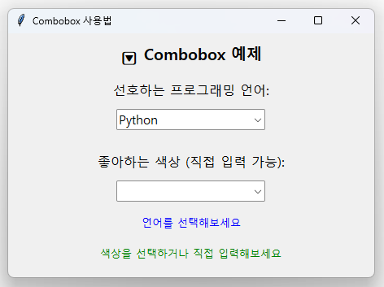

*Combobox 위젯을 사용한 드롭다운 선택 예제입니다. 읽기 전용과 편집 가능한 두 가지 모드, 그리고 선택 결과 표시를 확인할 수 있습니다.*

```python linenums="1" title="src/chapter2/09_combobox.py"
import tkinter as tk
from tkinter import ttk

root = tk.Tk()
root.title("Combobox 사용법")
root.geometry("450x300")

tk.Label(root, text="🔽 Combobox 예제", font=("맑은 고딕", 14, "bold")).pack(pady=10)

# 기본 Combobox
tk.Label(root, text="선호하는 프로그래밍 언어:", font=("맑은 고딕", 12)).pack(pady=5)
languages = ["Python", "JavaScript", "Java", "C++", "C#", "Go", "Rust", "Swift"]
language_combo = ttk.Combobox(root, values=languages, font=("맑은 고딕", 11), state="readonly")
language_combo.pack(pady=5)
language_combo.set("Python")  # 기본값 설정

# 편집 가능한 Combobox
tk.Label(root, text="좋아하는 색상 (직접 입력 가능):", font=("맑은 고딕", 12)).pack(pady=(20, 5))
colors = ["빨강", "파랑", "초록", "노랑", "보라", "주황"]
color_combo = ttk.Combobox(root, values=colors, font=("맑은 고딕", 11))
color_combo.pack(pady=5)

# 선택 이벤트 처리
def on_language_select(event):
    selected = event.widget.get()
    result_label.config(text=f"선택된 언어: {selected}")

def on_color_select(event):
    selected = event.widget.get()
    color_label.config(text=f"선택/입력된 색상: {selected}")

language_combo.bind('<<ComboboxSelected>>', on_language_select)
color_combo.bind('<<ComboboxSelected>>', on_color_select)

# 결과 표시
result_label = tk.Label(root, text="언어를 선택해보세요", font=("맑은 고딕", 10), fg="blue")
result_label.pack(pady=10)

color_label = tk.Label(root, text="색상을 선택하거나 직접 입력해보세요", font=("맑은 고딕", 10), fg="green")
color_label.pack(pady=5)

# 현재 값 확인 버튼
def show_values():
    lang = language_combo.get()
    color = color_combo.get()
    info = f"언어: {lang}, 색상: {color}"
    info_label.config(text=info)

tk.Button(root, text="선택 내용 확인", command=show_values, 
          font=("맑은 고딕", 11), bg="lightgray").pack(pady=15)

info_label = tk.Label(root, text="", font=("맑은 고딕", 10), fg="darkblue")
info_label.pack()

root.mainloop()
```


## 🖼️ 5. 레이아웃과 구조 요소들

### Frame - 위젯 그룹화

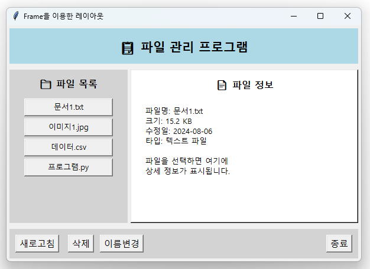

*Frame을 이용해 상단·중앙·하단 레이아웃을 구성하고, 내부 위젯 배치에는 pack(좌우/상하 정렬)과 grid(격자 배치)를 함께 활용할 수 있음을 보여주는 예제입니다.*

```python linenums="1" title="src/chapter2/10_frames_layout.py"
import tkinter as tk

root = tk.Tk()
root.title("Frame을 이용한 레이아웃")
root.geometry("600x400")

# 상단 프레임 - 제목
top_frame = tk.Frame(root, bg="lightblue", height=60)
top_frame.pack(fill=tk.X, padx=5, pady=5)
top_frame.pack_propagate(False)  # 프레임 크기 고정

title_label = tk.Label(top_frame, text="📋 파일 관리 프로그램", 
                      font=("맑은 고딕", 16, "bold"), bg="lightblue")
title_label.pack(expand=True)

# 중앙 프레임 - 좌우로 분할
center_frame = tk.Frame(root)
center_frame.pack(fill=tk.BOTH, expand=True, padx=5, pady=5)

# 왼쪽 프레임 - 파일 목록
left_frame = tk.Frame(center_frame, bg="lightgray", width=200)
left_frame.pack(side=tk.LEFT, fill=tk.Y, padx=(0, 5))
left_frame.pack_propagate(False)

tk.Label(left_frame, text="📁 파일 목록", font=("맑은 고딕", 12, "bold"), 
         bg="lightgray").pack(pady=10)

files = ["문서1.txt", "이미지1.jpg", "데이터.csv", "프로그램.py"]
for file in files:
    tk.Button(left_frame, text=file, width=20, 
              font=("맑은 고딕", 10)).pack(pady=2, padx=10)

# 오른쪽 프레임 - 상세 정보
right_frame = tk.Frame(center_frame, bg="white", relief=tk.RAISED, bd=2)
right_frame.pack(side=tk.RIGHT, fill=tk.BOTH, expand=True)

tk.Label(right_frame, text="📄 파일 정보", font=("맑은 고딕", 12, "bold"), 
         bg="white").pack(pady=10)

info_text = """파일명: 문서1.txt
크기: 15.2 KB
수정일: 2024-08-06
타입: 텍스트 파일

파일을 선택하면 여기에
상세 정보가 표시됩니다."""

tk.Label(right_frame, text=info_text, font=("맑은 고딕", 10), 
         bg="white", justify=tk.LEFT, anchor="nw").pack(padx=20, pady=10, fill=tk.BOTH)

# 하단 프레임 - 버튼들
bottom_frame = tk.Frame(root, bg="lightgray", height=50)
bottom_frame.pack(fill=tk.X, padx=5, pady=5)
bottom_frame.pack_propagate(False)

tk.Button(bottom_frame, text="새로고침", font=("맑은 고딕", 11)).pack(side=tk.LEFT, padx=10, pady=10)
tk.Button(bottom_frame, text="삭제", font=("맑은 고딕", 11)).pack(side=tk.LEFT, padx=5, pady=10)
tk.Button(bottom_frame, text="이름변경", font=("맑은 고딕", 11)).pack(side=tk.LEFT, padx=5, pady=10)
tk.Button(bottom_frame, text="종료", font=("맑은 고딕", 11)).pack(side=tk.RIGHT, padx=10, pady=10)

root.mainloop()
```


### 레이아웃 매니저 심화

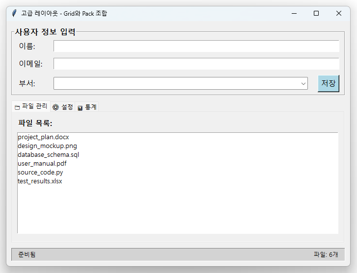

*ttk 위젯과 복잡한 레이아웃을 사용한 고급 GUI 구성 예제입니다. 제목, 설정 패널, 탭 미리보기 등 실제 애플리케이션에서 사용되는 구조를 보여줍니다.*

```python linenums="30" title="src/chapter2/11_advanced_layout.py"
import tkinter as tk
from tkinter import ttk

root = tk.Tk()
root.title("고급 레이아웃 - Grid와 Pack 조합")
root.geometry("700x500")

# 메인 컨테이너
main_frame = tk.Frame(root)
main_frame.pack(fill=tk.BOTH, expand=True, padx=10, pady=10)

# 상단 영역 - Grid 사용
top_section = tk.LabelFrame(main_frame, text="사용자 정보 입력", font=("맑은 고딕", 12, "bold"))
top_section.pack(fill=tk.X, pady=(0, 10))

# Grid로 입력 필드들 배치
tk.Label(top_section, text="이름:", font=("맑은 고딕", 11)).grid(row=0, column=0, sticky="w", padx=10, pady=5)
name_entry = tk.Entry(top_section, font=("맑은 고딕", 11), width=30)
name_entry.grid(row=0, column=1, columnspan=2, padx=10, pady=5, sticky="ew")

tk.Label(top_section, text="이메일:", font=("맑은 고딕", 11)).grid(row=1, column=0, sticky="w", padx=10, pady=5)
email_entry = tk.Entry(top_section, font=("맑은 고딕", 11), width=30)
email_entry.grid(row=1, column=1, columnspan=2, padx=10, pady=5, sticky="ew")

tk.Label(top_section, text="부서:", font=("맑은 고딕", 11)).grid(row=2, column=0, sticky="w", padx=10, pady=5)
dept_combo = ttk.Combobox(top_section, values=["개발팀", "디자인팀", "기획팀", "마케팅팀"], 
                         font=("맑은 고딕", 11), state="readonly")
dept_combo.grid(row=2, column=1, padx=10, pady=5, sticky="ew")

tk.Button(top_section, text="저장", font=("맑은 고딕", 11), bg="lightblue").grid(row=2, column=2, padx=10, pady=5)

# 그리드 가중치 설정
top_section.columnconfigure(1, weight=1)

# 중앙 영역 - Notebook (탭)
notebook = ttk.Notebook(main_frame)
notebook.pack(fill=tk.BOTH, expand=True, pady=(0, 10))

# 탭 1: 파일 목록
tab1 = tk.Frame(notebook)
notebook.add(tab1, text="📁 파일 관리")

# 파일 목록용 프레임
file_frame = tk.Frame(tab1)
file_frame.pack(fill=tk.BOTH, expand=True, padx=10, pady=10)

tk.Label(file_frame, text="파일 목록:", font=("맑은 고딕", 11, "bold")).pack(anchor="w")
file_listbox = tk.Listbox(file_frame, font=("맑은 고딕", 10), height=10)
file_listbox.pack(fill=tk.BOTH, expand=True, pady=5)

# 샘플 파일들
sample_files = ["project_plan.docx", "design_mockup.png", "database_schema.sql", 
                "user_manual.pdf", "source_code.py", "test_results.xlsx"]
for file in sample_files:
    file_listbox.insert(tk.END, file)

# 탭 2: 설정
tab2 = tk.Frame(notebook)
notebook.add(tab2, text="⚙️ 설정")

settings_frame = tk.LabelFrame(tab2, text="애플리케이션 설정", font=("맑은 고딕", 11, "bold"))
settings_frame.pack(fill=tk.X, padx=10, pady=10)

# 체크박스들
tk.Checkbutton(settings_frame, text="자동 저장 활성화", font=("맑은 고딕", 10)).pack(anchor="w", padx=20, pady=5)
tk.Checkbutton(settings_frame, text="알림 표시", font=("맑은 고딕", 10)).pack(anchor="w", padx=20, pady=5)
tk.Checkbutton(settings_frame, text="다크 모드", font=("맑은 고딕", 10)).pack(anchor="w", padx=20, pady=5)

# 탭 3: 통계
tab3 = tk.Frame(notebook)
notebook.add(tab3, text="📊 통계")

stats_text = """파일 처리 통계:

총 파일 수: 1,247개
처리 완료: 1,195개
오류 발생: 12개
대기 중: 40개

처리율: 95.8%
평균 처리 시간: 0.3초/파일"""

tk.Label(tab3, text=stats_text, font=("맑은 고딕", 11), justify="left", anchor="nw").pack(padx=20, pady=20, fill=tk.BOTH)

# 하단 상태바
status_frame = tk.Frame(main_frame, bg="lightgray", relief=tk.SUNKEN, bd=1)
status_frame.pack(fill=tk.X)

tk.Label(status_frame, text="준비됨", bg="lightgray", font=("맑은 고딕", 9)).pack(side=tk.LEFT, padx=10, pady=2)
tk.Label(status_frame, text="파일: 6개", bg="lightgray", font=("맑은 고딕", 9)).pack(side=tk.RIGHT, padx=10, pady=2)

root.mainloop()
```


## 🎨 6. 고급 위젯들

### Canvas - 그림 그리기

Canvas는 그림을 그리거나 도형을 표시할 수 있는 위젯입니다. 게임, 차트, 그래픽 도구 등을 만들 때 사용됩니다.

#### 🔹 1단계: 기본 도형 그리기

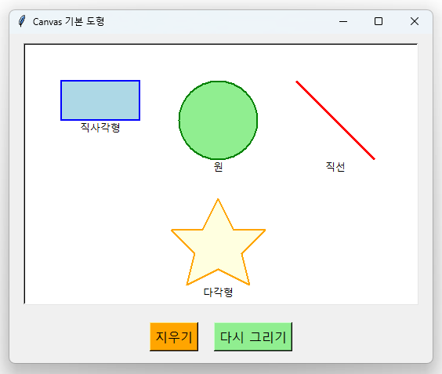

*Canvas 위젯을 사용해서 직사각형, 원, 직선, 다각형 등 다양한 기본 도형을 그리는 예제입니다. 각 도형에 색상과 테두리를 적용할 수 있습니다.*

```python linenums="1" title="src/chapter2/12a_basic_canvas.py"
import tkinter as tk

root = tk.Tk()
root.title("Canvas 기본 도형")
root.geometry("600x400")

# 캔버스 생성
canvas = tk.Canvas(root, width=500, height=300, bg="white", bd=2, relief="sunken")
canvas.pack(pady=20)

# 기본 도형들 그리기
def draw_basic_shapes():
    # 직사각형
    canvas.create_rectangle(50, 50, 150, 100, fill="lightblue", outline="blue", width=2)
    canvas.create_text(100, 110, text="직사각형", font=("맑은 고딕", 10))
    
    # 원 (타원)
    canvas.create_oval(200, 50, 300, 150, fill="lightgreen", outline="green", width=2)
    canvas.create_text(250, 160, text="원", font=("맑은 고딕", 10))
    
    # 직선
    canvas.create_line(350, 50, 450, 150, fill="red", width=3)
    canvas.create_text(400, 160, text="직선", font=("맑은 고딕", 10))
    
    # 다각형 (별 모양)
    points = [250, 200, 270, 240, 310, 240, 280, 270, 290, 310, 250, 290, 210, 310, 220, 270, 190, 240, 230, 240]
    canvas.create_polygon(points, fill="lightyellow", outline="orange", width=2)
    canvas.create_text(250, 320, text="다각형", font=("맑은 고딕", 10))

# 도형 그리기
draw_basic_shapes()

# 지우기 버튼
tk.Button(root, text="지우기", command=lambda: canvas.delete("all"), 
          font=("맑은 고딕", 12), bg="orange").pack(pady=10)
tk.Button(root, text="다시 그리기", command=draw_basic_shapes,
          font=("맑은 고딕", 12), bg="lightgreen").pack()

root.mainloop()
```

#### 🔹 2단계: 마우스로 그리기

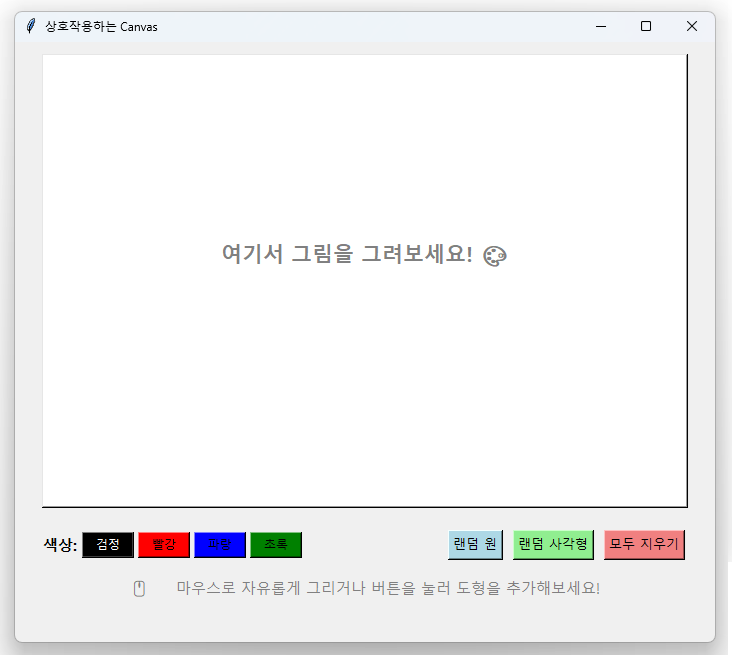

```python linenums="30" title="src/chapter2/12b_interactive_canvas.py"
import tkinter as tk

root = tk.Tk()
root.title("마우스로 그리기")
root.geometry("600x500")

tk.Label(root, text="🎨 마우스를 드래그해서 그림을 그려보세요!", 
         font=("맑은 고딕", 12, "bold")).pack(pady=10)

# 캔버스 생성
canvas = tk.Canvas(root, width=500, height=350, bg="white", bd=2, relief="sunken")
canvas.pack(pady=10)

# 그리기 관련 변수들
drawing = False
last_x, last_y = 0, 0
current_color = "black"
current_width = 2

def start_drawing(event):
    """마우스 버튼을 누르면 그리기 시작"""
    global drawing, last_x, last_y
    drawing = True
    last_x, last_y = event.x, event.y

def draw_line(event):
    """마우스를 드래그하면 선 그리기"""
    global drawing, last_x, last_y
    if drawing:
        canvas.create_line(last_x, last_y, event.x, event.y, 
                          fill=current_color, width=current_width, capstyle="round")
        last_x, last_y = event.x, event.y

def stop_drawing(event):
    """마우스 버튼을 떼면 그리기 중단"""
    global drawing
    drawing = False

# 마우스 이벤트 바인딩
canvas.bind("<Button-1>", start_drawing)
canvas.bind("<B1-Motion>", draw_line)
canvas.bind("<ButtonRelease-1>", stop_drawing)

# 색상 변경 함수들
def change_color(color):
    global current_color
    current_color = color

def change_width(width):
    global current_width
    current_width = width

# 컨트롤 버튼들
control_frame = tk.Frame(root)
control_frame.pack(pady=10)

# 색상 버튼들
colors = [("검정", "black"), ("빨강", "red"), ("파랑", "blue"), ("초록", "green")]
for name, color in colors:
    tk.Button(control_frame, text=name, bg=color, fg="white" if color == "black" else "black",
              command=lambda c=color: change_color(c), font=("맑은 고딕", 10)).pack(side=tk.LEFT, padx=2)

# 굵기 버튼들
tk.Label(control_frame, text=" | 굵기:", font=("맑은 고딕", 10)).pack(side=tk.LEFT, padx=5)
for width in [1, 3, 5, 8]:
    tk.Button(control_frame, text=str(width), width=3,
              command=lambda w=width: change_width(w), font=("맑은 고딕", 10)).pack(side=tk.LEFT, padx=1)

# 지우기 버튼
tk.Button(control_frame, text="🗑️ 전체 지우기", command=lambda: canvas.delete("all"),
          font=("맑은 고딕", 10), bg="orange").pack(side=tk.LEFT, padx=10)

root.mainloop()
```

#### 🔹 3단계: 간단한 그래프 그리기

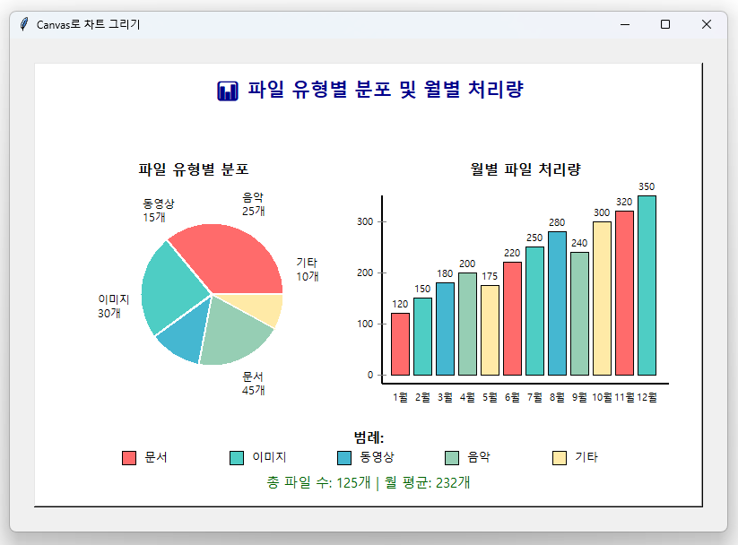

```python linenums="60" title="src/chapter2/12c_canvas_chart.py"
import tkinter as tk
import math

root = tk.Tk()
root.title("Canvas로 차트 그리기")
root.geometry("700x500")

# 캔버스 생성
canvas = tk.Canvas(root, width=600, height=400, bg="white", bd=2, relief="sunken")
canvas.pack(pady=20)

def draw_bar_chart():
    """막대 그래프 그리기"""
    canvas.delete("all")
    
    # 데이터
    data = [("Python", 85), ("Java", 70), ("C++", 60), ("JavaScript", 75), ("Go", 45)]
    colors = ["#3776ab", "#f89820", "#00599c", "#f7df1e", "#00add8"]
    
    # 제목
    canvas.create_text(300, 30, text="📊 프로그래밍 언어 인기도", font=("맑은 고딕", 14, "bold"))
    
    # 막대 그래프 그리기
    bar_width = 80
    max_height = 200
    start_x = 80
    base_y = 350
    
    for i, (lang, score) in enumerate(data):
        x = start_x + i * 100
        height = (score / 100) * max_height
        
        # 막대
        canvas.create_rectangle(x, base_y - height, x + bar_width, base_y,
                               fill=colors[i], outline="black")
        
        # 언어 이름
        canvas.create_text(x + bar_width//2, base_y + 20, text=lang, font=("맑은 고딕", 10))
        
        # 점수
        canvas.create_text(x + bar_width//2, base_y - height - 15, text=str(score), 
                          font=("맑은 고딕", 10, "bold"))

def draw_line_chart():
    """선 그래프 그리기"""
    canvas.delete("all")
    
    # 제목
    canvas.create_text(300, 30, text="📈 월별 방문자 수", font=("맑은 고딕", 14, "bold"))
    
    # 축 그리기
    canvas.create_line(80, 350, 520, 350, fill="black", width=2)  # X축
    canvas.create_line(80, 80, 80, 350, fill="black", width=2)   # Y축
    
    # 데이터
    months = ["1월", "2월", "3월", "4월", "5월", "6월"]
    visitors = [120, 150, 180, 140, 200, 170]
    
    # 선 그래프 그리기
    points = []
    for i, (month, visitor) in enumerate(zip(months, visitors)):
        x = 80 + (i + 1) * 70
        y = 350 - (visitor / 250) * 200  # 스케일 조정
        
        points.extend([x, y])
        
        # 데이터 포인트
        canvas.create_oval(x-4, y-4, x+4, y+4, fill="red", outline="darkred")
        
        # 월 표시
        canvas.create_text(x, 370, text=month, font=("맑은 고딕", 9))
        
        # 방문자 수 표시
        canvas.create_text(x, y-15, text=str(visitor), font=("맑은 고딕", 9))
    
    # 선 연결
    if len(points) > 2:
        canvas.create_line(points, fill="blue", width=3)
    
    # 축 레이블
    canvas.create_text(300, 390, text="월", font=("맑은 고딕", 12))
    canvas.create_text(50, 200, text="방문자", font=("맑은 고딕", 12))

def draw_pie_chart():
    """원형 그래프 그리기"""
    canvas.delete("all")
    
    # 제목
    canvas.create_text(300, 30, text="🥧 운영체제 점유율", font=("맑은 고딕", 14, "bold"))
    
    # 데이터
    data = [("Windows", 60, "#0078d4"), ("macOS", 25, "#000000"), ("Linux", 15, "#fcc624")]
    
    center_x, center_y = 200, 200
    radius = 80
    start_angle = 0
    
    for name, percentage, color in data:
        # 각도 계산 (360도 = 100%)
        angle = percentage * 3.6
        
        # 파이 조각 그리기 (근사적으로 다각형 사용)
        points = [center_x, center_y]
        for i in range(int(angle) + 1):
            radian = math.radians(start_angle + i)
            x = center_x + radius * math.cos(radian)
            y = center_y + radius * math.sin(radian)
            points.extend([x, y])
        
        canvas.create_polygon(points, fill=color, outline="white", width=2)
        
        # 레이블 위치 계산
        label_angle = math.radians(start_angle + angle/2)
        label_x = center_x + (radius + 40) * math.cos(label_angle)
        label_y = center_y + (radius + 40) * math.sin(label_angle)
        
        # 레이블
        canvas.create_text(label_x, label_y, text=f"{name}\n{percentage}%", 
                          font=("맑은 고딕", 10), justify="center")
        
        start_angle += angle

# 버튼들
button_frame = tk.Frame(root)
button_frame.pack(pady=10)

tk.Button(button_frame, text="📊 막대 그래프", command=draw_bar_chart,
          font=("맑은 고딕", 11), bg="lightblue").pack(side=tk.LEFT, padx=5)

tk.Button(button_frame, text="📈 선 그래프", command=draw_line_chart,
          font=("맑은 고딕", 11), bg="lightgreen").pack(side=tk.LEFT, padx=5)

tk.Button(button_frame, text="🥧 원형 그래프", command=draw_pie_chart,
          font=("맑은 고딕", 11), bg="lightyellow").pack(side=tk.LEFT, padx=5)

# 초기 차트 표시
draw_bar_chart()

root.mainloop()
```


!!! tip "💡 Canvas 핵심 포인트"

    - **`.create_rectangle(x1, y1, x2, y2)`**: 직사각형 그리기
    - **`.create_oval(x1, y1, x2, y2)`**: 원/타원 그리기
    - **`.create_line(x1, y1, x2, y2)`**: 직선 그리기
    - **`.create_polygon(points)`**: 다각형 그리기 (points는 [x1,y1,x2,y2,...] 형태)
    - **`.create_text(x, y, text="...")`**: 텍스트 표시
    - **`.delete("all")`**: 모든 그림 지우기
    - **마우스 이벤트**: `<Button-1>`, `<B1-Motion>`, `<ButtonRelease-1>`
    - **색상과 스타일**: `fill`, `outline`, `width` 옵션으로 꾸미기

### Menu - 메뉴바

대부분의 GUI 응용프로그램에는 맨 위에 메뉴바가 있습니다. 파일, 편집, 보기, 도움말 등의 메뉴를 만들어 보겠습니다.

#### 🔹 1단계: 기본 메뉴 만들기

*기본 메뉴바가 있는 tkinter 창의 실제 모습입니다. 상단에 "파일"과 "도움말" 메뉴가 표시되어 있습니다.*

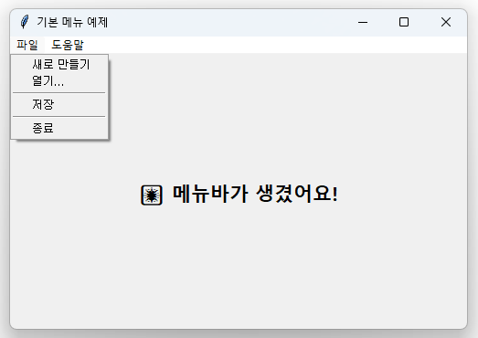

```python linenums="1" title="src/chapter2/13a_basic_menu.py"
import tkinter as tk
from tkinter import messagebox

root = tk.Tk()
root.title("기본 메뉴 예제")
root.geometry("500x300")

# 간단한 기능들
def new_document():
    messagebox.showinfo("새 문서", "새 문서를 만듭니다!")

def open_document():
    messagebox.showinfo("열기", "문서를 엽니다!")

def save_document():
    messagebox.showinfo("저장", "문서를 저장합니다!")

def show_about():
    messagebox.showinfo("프로그램 정보", "간단한 메뉴 예제\n버전 1.0")

# 메뉴바 생성 - 이것이 계층의 최상위!
menubar = tk.Menu(root)
root.config(menu=menubar)  # 루트 윈도우에 메뉴바 연결

# 파일 메뉴 만들기
file_menu = tk.Menu(menubar, tearoff=0)  # tearoff=0으로 띄어낼 수 없게 만들기
menubar.add_cascade(label="파일", menu=file_menu)  # 메뉴바에 추가

# 파일 메뉴 항목들
file_menu.add_command(label="새로 만들기", command=new_document)
file_menu.add_command(label="열기...", command=open_document)
file_menu.add_separator()  # 구분선 추가
file_menu.add_command(label="저장", command=save_document)
file_menu.add_separator()
file_menu.add_command(label="종료", command=root.quit)

# 도움말 메뉴
help_menu = tk.Menu(menubar, tearoff=0)
menubar.add_cascade(label="도움말", menu=help_menu)
help_menu.add_command(label="프로그램 정보", command=show_about)

# 메인 내용 영역
tk.Label(root, text="🎆 메뉴바가 생겼어요!", 
         font=("맑은 고딕", 16, "bold")).pack(expand=True)

root.mainloop()
```


#### 🔹 2단계: 텍스트 에디터 메뉴

*실제 텍스트 에디터의 모습입니다. "파일"과 "편집" 메뉴가 있고, Text 위젯에 설명 텍스트가 표시되어 있습니다. 각 메뉴 항목에는 키보드 단축키(accelerator)가 표시됩니다.*

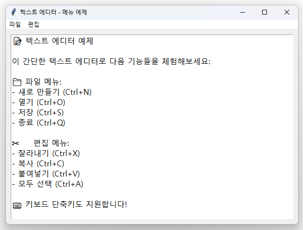

```python linenums="1" title="src/chapter2/13b_text_editor_menu.py"
import tkinter as tk
from tkinter import messagebox, filedialog

root = tk.Tk()
root.title("텍스트 에디터 - 메뉴 예제")
root.geometry("600x400")

# 텍스트 위젯 생성
text_widget = tk.Text(root, font=("맑은 고딕", 12), wrap=tk.WORD)
text_widget.pack(fill="both", expand=True, padx=10, pady=10)

# 파일 관련 기능들
def new_file():
    if text_widget.get(1.0, tk.END).strip():  # 내용이 있는지 확인
        if messagebox.askyesno("새 파일", "현재 내용을 지우고 새 파일을 만들까요?"):
            text_widget.delete(1.0, tk.END)
    else:
        text_widget.delete(1.0, tk.END)

def open_file():
    filename = filedialog.askopenfilename(
        title="파일 열기",
        filetypes=[("텍스트 파일", "*.txt"), ("모든 파일", "*.*")]
    )
    if filename:
        try:
            with open(filename, 'r', encoding='utf-8') as file:
                content = file.read()
                text_widget.delete(1.0, tk.END)
                text_widget.insert(1.0, content)
                root.title(f"텍스트 에디터 - {filename.split('/')[-1]}")
        except Exception as e:
            messagebox.showerror("오류", f"파일을 열 수 없습니다: {e}")

def save_file():
    filename = filedialog.asksaveasfilename(
        title="파일 저장",
        defaultextension=".txt",
        filetypes=[("텍스트 파일", "*.txt"), ("모든 파일", "*.*")]
    )
    if filename:
        try:
            with open(filename, 'w', encoding='utf-8') as file:
                content = text_widget.get(1.0, tk.END)
                file.write(content)
            messagebox.showinfo("저장 완료", f"파일이 저장되었습니다!\n{filename}")
            root.title(f"텍스트 에디터 - {filename.split('/')[-1]}")
        except Exception as e:
            messagebox.showerror("오류", f"파일을 저장할 수 없습니다: {e}")

# 편집 기능들
def cut_text():
    text_widget.event_generate("<<Cut>>")

def copy_text():
    text_widget.event_generate("<<Copy>>")

def paste_text():
    text_widget.event_generate("<<Paste>>")

def select_all():
    text_widget.tag_add(tk.SEL, "1.0", tk.END)
    text_widget.mark_set(tk.INSERT, "1.0")
    text_widget.see(tk.INSERT)

# 메뉴바 생성
menubar = tk.Menu(root)
root.config(menu=menubar)

# 파일 메뉴
file_menu = tk.Menu(menubar, tearoff=0)
menubar.add_cascade(label="파일", menu=file_menu)
file_menu.add_command(label="새로 만들기", command=new_file, accelerator="Ctrl+N")
file_menu.add_command(label="열기...", command=open_file, accelerator="Ctrl+O")
file_menu.add_separator()
file_menu.add_command(label="저장...", command=save_file, accelerator="Ctrl+S")
file_menu.add_separator()
file_menu.add_command(label="종료", command=root.quit, accelerator="Ctrl+Q")

# 편집 메뉴
edit_menu = tk.Menu(menubar, tearoff=0)
menubar.add_cascade(label="편집", menu=edit_menu)
edit_menu.add_command(label="잘라내기", command=cut_text, accelerator="Ctrl+X")
edit_menu.add_command(label="복사", command=copy_text, accelerator="Ctrl+C")
edit_menu.add_command(label="붙여넣기", command=paste_text, accelerator="Ctrl+V")
edit_menu.add_separator()
edit_menu.add_command(label="모두 선택", command=select_all, accelerator="Ctrl+A")

# 키보드 단축키 바인딩
root.bind('<Control-n>', lambda e: new_file())
root.bind('<Control-o>', lambda e: open_file())
root.bind('<Control-s>', lambda e: save_file())
root.bind('<Control-q>', lambda e: root.quit())

# 초기 텍스트
text_widget.insert(1.0, """📝 텍스트 에디터 예제

이 간단한 텍스트 에디터로 다음 기능들을 체험해보세요:

📁 파일 메뉴:
- 새로 만들기 (Ctrl+N)
- 열기 (Ctrl+O)
- 저장 (Ctrl+S)
- 종료 (Ctrl+Q)

✂️ 편집 메뉴:
- 잘라내기 (Ctrl+X)
- 복사 (Ctrl+C)
- 붙여넣기 (Ctrl+V)
- 모두 선택 (Ctrl+A)

⌨️ 키보드 단축키도 지원합니다!

이 내용을 수정해보고, 파일로 저장해보세요.
""")

root.mainloop()
```

#### 🔹 3단계: 고급 메뉴 (서브메뉴, 체크표시)

*고급 메뉴 기능들을 보여주는 실제 GUI입니다. "파일", "보기", "도구", "도움말" 메뉴가 있으며, 체크박스 메뉴(✓ 표시), 라디오버튼 메뉴(● 표시), 서브메뉴 등의 고급 기능들을 확인할 수 있습니다. 하단에는 상태바가 표시되어 있습니다.*

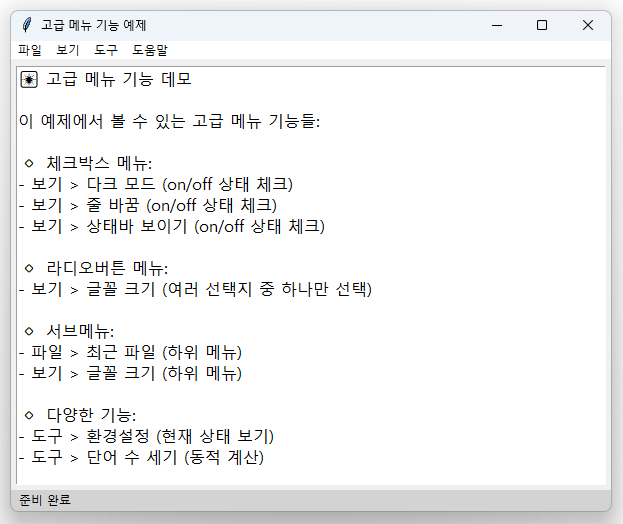

```python linenums="1" title="src/chapter2/13c_advanced_menu.py"
import tkinter as tk
from tkinter import messagebox

root = tk.Tk()
root.title("고급 메뉴 기능 예제")
root.geometry("600x450")

# 상태 변수들
dark_mode = tk.BooleanVar()
word_wrap = tk.BooleanVar(value=True)  # 기본값: 켜짐
show_status = tk.BooleanVar(value=True)
font_size = tk.IntVar(value=12)

# UI 요소들
text_widget = tk.Text(root, height=10, font=("맑은 고딕", font_size.get()), wrap=tk.WORD)
text_widget.pack(fill="both", expand=True, padx=5, pady=5)

status_frame = tk.Frame(root, height=25, bg="lightgray")
status_label = tk.Label(status_frame, text="준비 완료", bg="lightgray", anchor="w")
status_label.pack(side="left", padx=5)
status_frame.pack(fill="x", side="bottom")

# 기능 함수들
def toggle_dark_mode():
    if dark_mode.get():
        # 다크 모드 적용
        text_widget.config(bg="#2b2b2b", fg="white", insertbackground="white")
        root.configure(bg="#1e1e1e")
        status_frame.configure(bg="#1e1e1e")
        status_label.configure(bg="#1e1e1e", fg="white")
        status_label.config(text="다크 모드 활성화")
    else:
        # 라이트 모드 적용
        text_widget.config(bg="white", fg="black", insertbackground="black")
        root.configure(bg="white")
        status_frame.configure(bg="lightgray")
        status_label.configure(bg="lightgray", fg="black")
        status_label.config(text="라이트 모드 활성화")

def toggle_word_wrap():
    if word_wrap.get():
        text_widget.config(wrap=tk.WORD)
        status_label.config(text="줄바꿈 켜짐")
    else:
        text_widget.config(wrap=tk.NONE)
        status_label.config(text="줄바꿈 꺼짐")

def toggle_status_bar():
    if show_status.get():
        status_frame.pack(fill="x", side="bottom")
        status_label.config(text="상태바 표시")
    else:
        status_frame.pack_forget()

def change_font_size(size):
    font_size.set(size)
    text_widget.config(font=("맑은 고딕", size))
    status_label.config(text=f"글꼴 크기: {size}")

def show_preferences():
    messagebox.showinfo("환경설정", f"현재 설정:\n\n다크모드: {'켜짐' if dark_mode.get() else '꺼짐'}\n줄바꿈: {'켜짐' if word_wrap.get() else '꺼짐'}\n상태바: {'보이기' if show_status.get() else '숨기기'}\n글꼴 크기: {font_size.get()}")

# 메뉴바 생성
menubar = tk.Menu(root)
root.config(menu=menubar)

# 파일 메뉴
file_menu = tk.Menu(menubar, tearoff=0)
menubar.add_cascade(label="파일", menu=file_menu)
file_menu.add_command(label="새로 만들기", accelerator="Ctrl+N")
file_menu.add_command(label="열기...", accelerator="Ctrl+O")
file_menu.add_separator()

# 서브메뉴: 최근에 열었던 파일
recent_menu = tk.Menu(file_menu, tearoff=0)
file_menu.add_cascade(label="최근 파일", menu=recent_menu)
recent_files = ["document1.txt", "note.txt", "readme.md"]
for file in recent_files:
    recent_menu.add_command(label=file, command=lambda f=file: messagebox.showinfo("파일 열기", f"'{f}'를 엽니다"))

file_menu.add_separator()
file_menu.add_command(label="종료", command=root.quit)

# 보기 메뉴 (체크박스 있는 메뉴)
view_menu = tk.Menu(menubar, tearoff=0)
menubar.add_cascade(label="보기", menu=view_menu)

# 체크박스 메뉴 항목들
view_menu.add_checkbutton(label="다크 모드", variable=dark_mode, command=toggle_dark_mode)
view_menu.add_checkbutton(label="줄 바꿈", variable=word_wrap, command=toggle_word_wrap)
view_menu.add_checkbutton(label="상태바 보이기", variable=show_status, command=toggle_status_bar)
view_menu.add_separator()

# 서브메뉴: 글꼴 크기
font_menu = tk.Menu(view_menu, tearoff=0)
view_menu.add_cascade(label="글꼴 크기", menu=font_menu)
for size in [10, 12, 14, 16, 18, 20]:
    font_menu.add_radiobutton(label=f"{size}점", variable=font_size, value=size, 
                             command=lambda s=size: change_font_size(s))

# 도구 메뉴
tools_menu = tk.Menu(menubar, tearoff=0)
menubar.add_cascade(label="도구", menu=tools_menu)
tools_menu.add_command(label="환경설정...", command=show_preferences)
tools_menu.add_separator()
tools_menu.add_command(label="단어 수 세기", 
                      command=lambda: messagebox.showinfo("단어 수", f"현재 문서의 단어 수: {len(text_widget.get(1.0, tk.END).split())}개"))

# 도움말 메뉴
help_menu = tk.Menu(menubar, tearoff=0)
menubar.add_cascade(label="도움말", menu=help_menu)
help_menu.add_command(label="사용법", command=lambda: messagebox.showinfo("사용법", "이 프로그램은 고급 메뉴 기능을 시연합니다."))
help_menu.add_separator()
help_menu.add_command(label="프로그램 정보", command=lambda: messagebox.showinfo("정보", "고급 메뉴 예제\n버전 2.0\n\ntkinter 메뉴 시스템 데모"))

# 초기 텍스트
text_widget.insert(1.0, """🎆 고급 메뉴 기능 데모

이 예제에서 볼 수 있는 고급 메뉴 기능들:

🔹 체크박스 메뉴:
- 보기 > 다크 모드 (on/off 상태 체크)
- 보기 > 줄 바꿈 (on/off 상태 체크)
- 보기 > 상태바 보이기 (on/off 상태 체크)

🔹 라디오버튼 메뉴:
- 보기 > 글꼴 크기 (여러 선택지 중 하나만 선택)

🔹 서브메뉴:
- 파일 > 최근 파일 (하위 메뉴)
- 보기 > 글꼴 크기 (하위 메뉴)

🔹 다양한 기능:
- 도구 > 환경설정 (현재 상태 보기)
- 도구 > 단어 수 세기 (동적 계산)

메뉴를 클릭해서 다양한 기능들을 체험해보세요!
""")

root.mainloop()
```

!!! tip "💡 Menu 핵심 포인트"

    - **`tk.Menu(parent, tearoff=0)`**: 메뉴 생성 (tearoff=0으로 떼어낼 수 없게)
    - **`.add_cascade(label, menu)`**: 상위 메뉴에 하위 메뉴 추가
    - **`.add_command(label, command)`**: 일반 메뉴 항목 추가
    - **`.add_checkbutton(label, variable, command)`**: 체크박스 메뉴 항목
    - **`.add_radiobutton(label, variable, value)`**: 라디오버튼 메뉴 항목
    - **`.add_separator()`**: 구분선 추가
    - **`accelerator="Ctrl+N"`**: 단축키 표시 (실제 기능은 bind로 구현)
    - **`root.config(menu=menubar)`**: 루트 윈도우에 메뉴바 연결


### 🌟 핵심 개념

**이벤트 기반 프로그래밍:**
```python
def event_handler():
    # 사용자 액션에 반응하는 코드
    pass

button = tk.Button(root, text="클릭", command=event_handler)
```

**위젯 속성 설정:**
```python
widget = tk.Widget(
    parent,
    text="텍스트",
    font=("맑은 고딕", 12),
    bg="색상",
    command=함수
)
```

**동적 내용 업데이트:**
```python
var = tk.StringVar()
label = tk.Label(root, textvariable=var)
var.set("새로운 내용")  # 자동으로 업데이트됨
```

---

!!! success "🎉 Chapter 2 완주 축하드려요!"
    Tkinter의 모든 핵심 UI 요소들을 성공적으로 배웠습니다!
    
    **이제 할 수 있는 것들:**

    - ✅ 모든 종류의 GUI 위젯 사용하기
    - ✅ 복잡한 레이아웃 구성하기
    - ✅ 사용자 입력 처리하고 검증하기
    - ✅ 이벤트 기반 프로그래밍하기
    - ✅ 실용적인 데스크톱 애플리케이션 설계하기