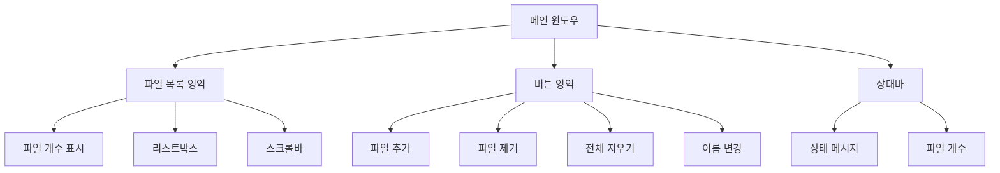

# Chapter 3: 기본 GUI 구조

이 챕터에서는 KRenamer의 기본적인 GUI 구조를 만들어보겠습니다. Python tkinter를 사용하여 파일 리네이머의 뼈대가 되는 기본 레이아웃과 위젯들을 구성해봅시다.

## 🎯 학습 목표

- **tkinter 기본 위젯 사용법** 익히기
- **효율적인 레이아웃 설계**하기
- **기본적인 이벤트 처리** 구현하기
- **사용자 친화적인 인터페이스** 설계하기
- **KRenamer 브랜딩** 적용하기

## 📐 설계 개념

### 전체 레이아웃 구조



### 사용할 위젯들

| 위젯 | 용도 | tkinter 클래스 |
|------|------|----------------|
| 메인 윈도우 | 애플리케이션 창 | `tk.Tk()` |
| 프레임 | 레이아웃 구조 | `ttk.Frame` |
| 라벨 | 텍스트 표시 | `ttk.Label` |
| 리스트박스 | 파일 목록 | `tk.Listbox` |
| 스크롤바 | 스크롤 기능 | `ttk.Scrollbar` |
| 버튼 | 사용자 액션 | `ttk.Button` |

## 💻 코드 구현

### 1. 기본 클래스 구조

```python linenums="1" title="src/krenamer-ch1/main.py"
#!/usr/bin/env python3
"""
KRenamer Chapter 3: Basic Tkinter GUI Structure
기본적인 tkinter 윈도우를 생성하는 예제

이 챕터에서는 KRenamer의 기본 GUI 구조를 배웁니다:
- tkinter 기본 위젯 사용법
- 윈도우 레이아웃 설계
- 기본적인 이벤트 처리
"""

import tkinter as tk
from tkinter import ttk


class BasicKRenamerGUI:
    """
    KRenamer Chapter 1: 기본 GUI 구조
    
    이 클래스는 파일 리네이머의 기본적인 GUI 구조를 구현합니다.
    실제 파일 처리 기능은 다음 챕터에서 추가됩니다.
    """
    
    def __init__(self):
        self.root = tk.Tk()
        self.setup_window()
        self.setup_widgets()
```

!!! info "KRenamer 클래스 구조 설계"
    - `__init__`: 초기화 메서드에서 윈도우 생성과 설정을 분리
    - `setup_window`: 윈도우 기본 속성 설정
    - `setup_widgets`: GUI 위젯들 배치
    - KRenamer 브랜딩을 반영한 클래스명 사용

### 2. 윈도우 설정

```python linenums="25"
def setup_window(self):
    """윈도우 기본 설정"""
    self.root.title("KRenamer - Chapter 1: 기본 GUI 구조")
    self.root.geometry("700x500")
    self.root.resizable(True, True)
    
    # 윈도우를 화면 중앙에 배치
    self.center_window()
    
    # 윈도우 최소 크기 설정
    self.root.minsize(600, 400)

def center_window(self):
    """윈도우를 화면 중앙에 배치"""
    self.root.update_idletasks()
    width = 700
    height = 500
    x = (self.root.winfo_screenwidth() // 2) - (width // 2)
    y = (self.root.winfo_screenheight() // 2) - (height // 2)
    self.root.geometry(f"{width}x{height}+{x}+{y}")
```

!!! tip "윈도우 중앙 배치"
    `center_window()` 메서드는 화면 크기를 계산하여 윈도우를 중앙에 배치합니다. 
    사용자 경험을 향상시키는 작은 디테일입니다.

### 3. 위젯 배치

```python linenums="49"
def setup_widgets(self):
    """GUI 위젯들 설정 및 배치"""
    # 메인 프레임
    main_frame = ttk.Frame(self.root, padding="15")
    main_frame.grid(row=0, column=0, sticky=(tk.W, tk.E, tk.N, tk.S))
    
    # 파일 목록 영역 라벨
    files_label = ttk.Label(
        main_frame, 
        text="파일 목록:", 
        font=("맑은 고딕", 10, "bold")
    )
    files_label.grid(row=0, column=0, sticky=tk.W, pady=(0, 5))
```

#### 파일 목록 영역

```python linenums="65"
# 파일 목록 프레임 (리스트박스 + 스크롤바)
listbox_frame = ttk.Frame(main_frame)
listbox_frame.grid(row=1, column=0, columnspan=2, sticky=(tk.W, tk.E, tk.N, tk.S), pady=(0, 15))

# 파일 리스트박스
self.files_listbox = tk.Listbox(
    listbox_frame, 
    height=15,
    font=("맑은 고딕", 9),
    selectmode=tk.EXTENDED  # 다중 선택 가능
)

# 스크롤바
scrollbar = ttk.Scrollbar(listbox_frame, orient=tk.VERTICAL, command=self.files_listbox.yview)
self.files_listbox.config(yscrollcommand=scrollbar.set)

# 리스트박스와 스크롤바 배치
self.files_listbox.pack(side=tk.LEFT, fill=tk.BOTH, expand=True)
scrollbar.pack(side=tk.RIGHT, fill=tk.Y)
```

!!! note "레이아웃 매니저 조합"
    메인 구조는 `grid`를 사용하고, 리스트박스와 스크롤바는 `pack`을 사용합니다. 
    상황에 맞는 레이아웃 매니저를 선택하는 것이 중요합니다.

#### 버튼 영역

```python linenums="84"
# 버튼 프레임
button_frame = ttk.Frame(main_frame)
button_frame.grid(row=2, column=0, columnspan=2, pady=(0, 15))

# 파일 추가 버튼
self.add_button = ttk.Button(
    button_frame, 
    text="파일 추가", 
    command=self.add_files,
    width=12
)
self.add_button.pack(side=tk.LEFT, padx=(0, 10))

# 파일 제거 버튼
self.remove_button = ttk.Button(
    button_frame, 
    text="파일 제거", 
    command=self.remove_files,
    width=12
)
self.remove_button.pack(side=tk.LEFT, padx=(0, 10))

# 전체 지우기 버튼
self.clear_button = ttk.Button(
    button_frame, 
    text="전체 지우기", 
    command=self.clear_files,
    width=12
)
self.clear_button.pack(side=tk.LEFT, padx=(0, 10))

# 이름 변경 버튼
self.rename_button = ttk.Button(
    button_frame, 
    text="이름 변경", 
    command=self.rename_files,
    width=12
)
self.rename_button.pack(side=tk.LEFT)
```

#### 상태바

```python linenums="124"
# 상태바
self.status_var = tk.StringVar()
self.status_var.set("KRenamer Chapter 1 - 기본 GUI 구조를 학습합니다.")

status_frame = ttk.Frame(main_frame)
status_frame.grid(row=3, column=0, columnspan=2, sticky=(tk.W, tk.E), pady=(10, 0))

status_label = ttk.Label(
    status_frame, 
    textvariable=self.status_var,
    font=("맑은 고딕", 9),
    foreground="gray"
)
status_label.pack(side=tk.LEFT)

# 파일 개수 표시
self.file_count_var = tk.StringVar()
self.file_count_var.set("파일: 0개")

count_label = ttk.Label(
    status_frame,
    textvariable=self.file_count_var,
    font=("맑은 고딕", 9),
    foreground="blue"
)
count_label.pack(side=tk.RIGHT)
```

### 4. 그리드 설정

```python linenums="151"
# 그리드 가중치 설정 (창 크기 조절 시 확장)
main_frame.columnconfigure(0, weight=1)
main_frame.rowconfigure(1, weight=1)  # 파일 목록 영역이 확장
self.root.columnconfigure(0, weight=1)
self.root.rowconfigure(0, weight=1)

# 초기 버튼 상태 설정
self.update_button_states()
```

!!! important "그리드 가중치"
    `columnconfigure`와 `rowconfigure`의 `weight` 매개변수는 창 크기가 변경될 때 
    어떤 영역이 확장될지 결정합니다.

## 🎮 이벤트 처리

### 스마트 버튼 이벤트 핸들러

```python linenums="160"
def add_files(self):
    """파일 추가 (예시 파일들)"""
    self.status_var.set("파일 추가 기능 - 예시 파일들을 추가합니다.")
    
    # 예시 파일들을 리스트에 추가
    example_files = [
        "문서1.txt",
        "이미지_001.jpg", 
        "프레젠테이션.pdf",
        "음악파일.mp3",
        "비디오_클립.mp4",
        "스프레드시트.xlsx",
        "README.md",
        "config.json"
    ]
    
    for file in example_files:
        self.files_listbox.insert(tk.END, file)
    
    self.update_file_count()
    self.update_button_states()
    self.status_var.set(f"{len(example_files)}개의 예시 파일이 추가되었습니다.")

def remove_files(self):
    """선택된 파일 제거"""
    selection = self.files_listbox.curselection()
    if selection:
        # 선택된 파일 개수 저장
        removed_count = len(selection)
        
        # 역순으로 삭제 (인덱스 오류 방지)
        for index in reversed(selection):
            self.files_listbox.delete(index)
        
        self.update_file_count()
        self.update_button_states()
        self.status_var.set(f"{removed_count}개의 파일이 제거되었습니다.")
    else:
        self.status_var.set("제거할 파일을 선택해주세요.")

def clear_files(self):
    """모든 파일 제거"""
    if self.files_listbox.size() > 0:
        removed_count = self.files_listbox.size()
        self.files_listbox.delete(0, tk.END)
        
        self.update_file_count()
        self.update_button_states()
        self.status_var.set(f"모든 파일({removed_count}개)이 제거되었습니다.")
    else:
        self.status_var.set("제거할 파일이 없습니다.")

def rename_files(self):
    """파일명 변경 (다음 챕터에서 구현)"""
    if self.files_listbox.size() > 0:
        self.status_var.set("이름 변경 기능은 Chapter 3에서 구현됩니다.")
    else:
        self.status_var.set("변경할 파일이 없습니다.")
```

### 상태 관리 기능

```python linenums="219"
def update_file_count(self):
    """파일 개수 업데이트"""
    count = self.files_listbox.size()
    self.file_count_var.set(f"파일: {count}개")

def update_button_states(self):
    """버튼 상태 업데이트"""
    has_files = self.files_listbox.size() > 0
    
    # 파일이 있을 때만 활성화되는 버튼들
    state = tk.NORMAL if has_files else tk.DISABLED
    self.remove_button.config(state=state)
    self.clear_button.config(state=state)
    self.rename_button.config(state=state)
```

!!! tip "사용자 피드백"
    모든 사용자 액션에 대해 상태바를 통해 피드백을 제공합니다. 
    버튼 상태도 동적으로 관리하여 사용자가 현재 상황을 이해할 수 있게 도와줍니다.

### 애플리케이션 실행

```python linenums="234"
def run(self):
    """애플리케이션 실행"""
    try:
        self.root.mainloop()
    except KeyboardInterrupt:
        print("\n프로그램이 사용자에 의해 종료되었습니다.")
    except Exception as e:
        print(f"오류가 발생했습니다: {e}")


def main():
    """메인 함수"""
    print("KRenamer Chapter 1: 기본 GUI 구조")
    print("=" * 40)
    print("이 예제에서 배우는 내용:")
    print("• tkinter 기본 위젯 사용법")
    print("• 윈도우 레이아웃 설계")
    print("• 기본적인 이벤트 처리")
    print("• 사용자 인터페이스 설계")
    print()
    print("GUI 윈도우를 시작합니다...")
    
    try:
        app = BasicKRenamerGUI()
        app.run()
    except Exception as e:
        print(f"애플리케이션 시작 중 오류 발생: {e}")
        return 1
    
    print("KRenamer Chapter 1 완료!")
    return 0


if __name__ == "__main__":
    import sys
    sys.exit(main())
```

## 🎨 UI/UX 개선 포인트

### 1. KRenamer 브랜딩

```python
# 윈도우 제목에 KRenamer 브랜딩
self.root.title("KRenamer - Chapter 1: 기본 GUI 구조")

# 클래스명에 KRenamer 적용
class BasicKRenamerGUI:
```

### 2. 한글 폰트 사용

```python
font=("맑은 고딕", 10, "bold")
```

Windows에서 한글이 깨지지 않도록 시스템 폰트를 명시적으로 지정합니다.

### 3. 스마트한 상태 관리

```python
def update_button_states(self):
    """버튼 상태 업데이트"""
    has_files = self.files_listbox.size() > 0
    state = tk.NORMAL if has_files else tk.DISABLED
    # 파일이 없으면 관련 버튼들 비활성화
```

### 4. 적절한 여백과 간격

```python
main_frame = ttk.Frame(self.root, padding="15")  # 넉넉한 외부 여백
pady=(0, 15)  # 위젯 간 수직 간격
padx=(0, 10)  # 위젯 간 수평 간격
```

## 🚀 실행 및 테스트

### 실행 방법

```bash
# Chapter 1 실행
cd src/krenamer-ch1
python main.py
```

### 테스트 시나리오

1. **파일 추가**: "파일 추가" 버튼을 클릭하여 예시 파일들이 추가되는지 확인
2. **파일 선택**: 리스트에서 파일을 클릭하여 다중 선택 상태 확인  
3. **파일 제거**: 선택된 파일이 제거되는지 확인
4. **전체 지우기**: 모든 파일이 한 번에 제거되는지 확인
5. **버튼 상태**: 파일 유무에 따라 버튼이 활성화/비활성화되는지 확인
6. **상태 표시**: 각 액션에 따라 상태바 메시지가 적절히 변경되는지 확인
7. **창 크기 조절**: 창 크기를 변경했을 때 레이아웃이 적절히 조정되는지 확인

## 📚 핵심 개념 정리

### KRenamer GUI 기본 구조

```python
# 1. 루트 윈도우 생성 (KRenamer 브랜딩)
root = tk.Tk()
root.title("KRenamer - Chapter 1")

# 2. 위젯 생성 및 배치
widget = ttk.Widget(parent, options...)
widget.grid(row=0, column=0)

# 3. 이벤트 루프 실행
root.mainloop()
```

### 레이아웃 매니저

=== "grid"
    ```python
    widget.grid(row=0, column=0, sticky=tk.W)
    ```
    표 형태의 정확한 배치에 적합

=== "pack"
    ```python
    widget.pack(side=tk.LEFT, fill=tk.X)
    ```
    순차적 배치에 적합

=== "place"
    ```python
    widget.place(x=10, y=20)
    ```
    절대 위치 지정에 적합

### 상태 관리 패턴

```python
def update_button_states(self):
    """파일 유무에 따른 스마트한 버튼 상태 관리"""
    has_files = self.files_listbox.size() > 0
    state = tk.NORMAL if has_files else tk.DISABLED
    self.remove_button.config(state=state)
    self.clear_button.config(state=state)
    self.rename_button.config(state=state)
```

### 이벤트 처리

```python
def event_handler(self):
    # 이벤트 처리 로직
    self.update_file_count()      # 상태 업데이트
    self.update_button_states()   # UI 상태 동기화
    self.status_var.set("완료")   # 사용자 피드백

button = ttk.Button(parent, text="클릭", command=self.event_handler)
```

## 🔍 문제 해결

### 자주 발생하는 문제들

!!! warning "Import Error"
    ```
    ModuleNotFoundError: No module named 'tkinter'
    ```
    **해결**: Python 설치 시 tkinter가 포함되지 않은 경우입니다. Python을 재설치하거나 시스템별 tkinter 패키지를 설치하세요.

!!! warning "Font 문제"
    한글이 깨져 보이는 경우, 시스템에 맞는 폰트로 변경하세요:
    ```python
    # Windows
    font=("맑은 고딕", 12)
    # macOS
    font=("AppleGothic", 12)
    # Linux
    font=("DejaVu Sans", 12)
    ```

!!! warning "Layout 문제"
    위젯이 원하는 위치에 나타나지 않는 경우:
    ```python
    # sticky 옵션으로 정렬 조정
    widget.grid(row=0, column=0, sticky=(tk.W, tk.E))
    
    # 가중치 설정으로 확장 제어
    parent.columnconfigure(0, weight=1)
    ```

## 🎯 다음 단계 미리보기

Chapter 1에서는 KRenamer의 기본적인 GUI 구조를 만들었습니다. 다음 [Chapter 2](chapter2.md)에서는:

- **드래그 앤 드롭 기능** 추가 (tkinterdnd2 사용)
- **실제 파일 처리** 로직 구현
- **파일 정보 표시** 개선 (크기, 경로 등)
- **폴더 추가 기능** 구현
- **사용자 경험** 향상

---

!!! success "Chapter 1 완료!"
    축하합니다! KRenamer의 기본적인 GUI 구조를 성공적으로 만들었습니다. 
    이제 실제 파일을 다룰 수 있는 기능을 추가해보겠습니다.

!!! tip "연습 과제"
    - 버튼에 아이콘 추가해보기
    - 메뉴바 추가해보기  
    - 키보드 단축키 구현해보기
    - 설정 저장 기능 구상해보기
    - 다크 모드 테마 적용해보기