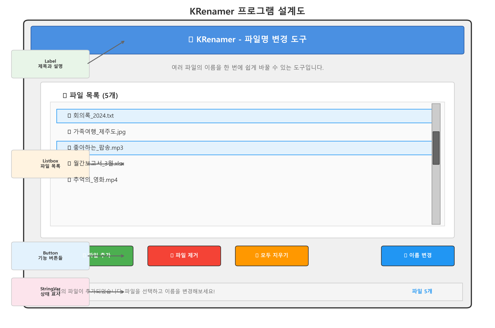
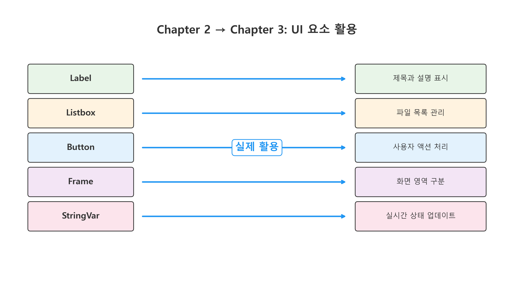
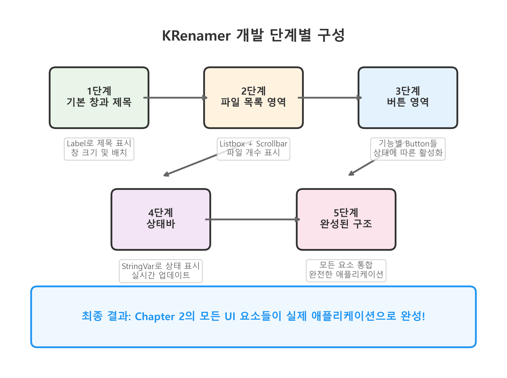
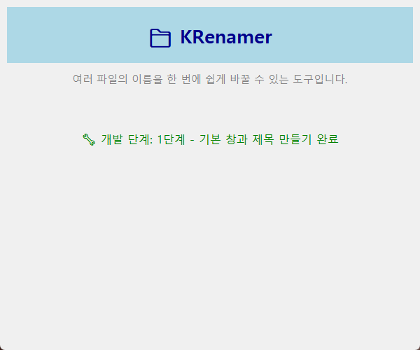
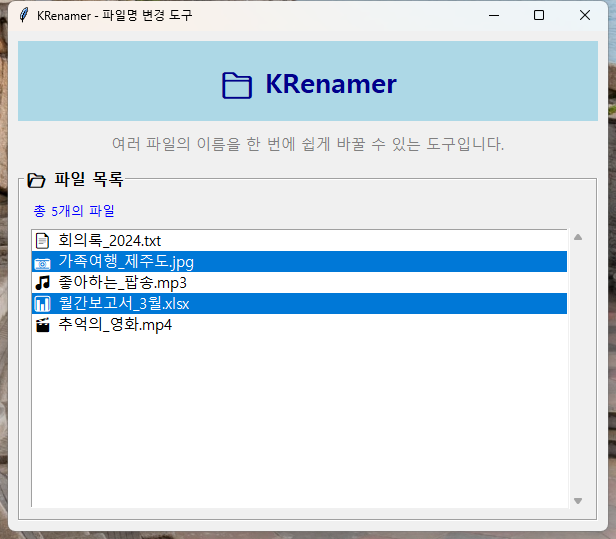

# Chapter 3: KRenamer 기본 구조 만들기

## 🎯 Chapter 2에서 배운 것들을 실제로 사용해보자!

Chapter 2에서 tkinter의 모든 UI 요소들을 배웠습니다. 이제 이 지식을 사용해서 **진짜 KRenamer 애플리케이션**<!-- -->을 만들어봅시다!

우리가 만들 KRenamer는 파일 이름을 쉽게 바꿀 수 있는 도구입니다. Windows 탐색기에서 일일이 파일 이름을 바꾸는 것보다 훨씬 편리하게 여러 파일을 한 번에 처리할 수 있습니다.

## 🏗️ KRenamer 설계하기

### 우리가 만들 프로그램의 모습



*위 설계도는 우리가 Chapter 3에서 만들 KRenamer의 완성된 모습입니다. 각 영역이 Chapter 2에서 배운 어떤 UI 요소로 구현되는지 왼쪽에 표시되어 있습니다.*

### Chapter 2에서 배운 요소들을 어떻게 사용할까?



*Chapter 2에서 개별적으로 배운 UI 요소들이 Chapter 3에서 어떻게 실제 애플리케이션의 구성 요소로 활용되는지 보여줍니다.*

**주요 활용 방식:**

1. **Label**: 제목과 설명 텍스트 표시
2. **Listbox**: 파일 목록 보여주기
3. **Button**: 파일 추가, 제거 등 기능 버튼
4. **Frame**: 화면을 구역별로 나누기
5. **StringVar**: 상태 메시지 동적 업데이트

## 💻 KRenamer 기본 구조 만들기



*위 플로우차트는 KRenamer를 단계별로 어떻게 구축해나갈지 보여줍니다. 각 단계에서 Chapter 2의 어떤 요소들을 사용하는지 확인할 수 있습니다.*

### 1단계: 기본 창과 제목 만들기

Chapter 2에서 배운 창 만들기를 사용해봅시다!

```python linenums="1" title="src/chapter3/step1_basic_window.py"
import tkinter as tk
from tkinter import ttk

class KRenamer:
    """KRenamer 애플리케이션 메인 클래스"""
    
    def __init__(self):
        self.root = tk.Tk()
        self.setup_window()
        self.setup_title()
    
    def setup_window(self):
        """창 기본 설정 - Chapter 2에서 배운 내용!"""
        self.root.title("KRenamer - 파일명 변경 도구")
        self.root.geometry("600x500")
        self.root.resizable(True, True)
        self.root.minsize(500, 400)
        
        # 창을 화면 중앙에 배치 (Chapter 2 기법)
        self.center_window()
    
    def center_window(self):
        """창을 화면 중앙에 배치"""
        self.root.update_idletasks()
        width = 600
        height = 500
        x = (self.root.winfo_screenwidth() // 2) - (width // 2)
        y = (self.root.winfo_screenheight() // 2) - (height // 2)
        self.root.geometry(f"{width}x{height}+{x}+{y}")
    
    def setup_title(self):
        """제목 영역 만들기 - Label 사용"""
        # 메인 제목 (Chapter 2의 Label 활용)
        title_label = tk.Label(
            self.root,
            text="📁 KRenamer",
            font=("맑은 고딕", 20, "bold"),
            fg="darkblue",
            bg="lightblue",
            height=2
        )
        title_label.pack(fill=tk.X, padx=10, pady=10)
        
        # 설명 라벨
        desc_label = tk.Label(
            self.root,
            text="여러 파일의 이름을 한 번에 쉽게 바꿀 수 있는 도구입니다.",
            font=("맑은 고딕", 11),
            fg="gray"
        )
        desc_label.pack(pady=(0, 10))
    
    def run(self):
        """프로그램 실행"""
        self.root.mainloop()

# 프로그램 실행
if __name__ == "__main__":
    app = KRenamer()
    app.run()
```



*KRenamer의 기본 창 구조입니다. Chapter 2에서 배운 Label을 사용해서 제목과 설명을 표시하고, 창 크기와 중앙 배치를 설정했습니다. 이것이 모든 GUI 애플리케이션의 시작점입니다.*

### 2단계: 파일 목록 영역 추가하기

Chapter 2에서 배운 `Listbox`와 `Frame`을 사용해봅시다!

```python linenums="50" title="src/chapter3/step2_file_list.py"
import tkinter as tk
from tkinter import ttk

class KRenamer:
    def __init__(self):
        self.root = tk.Tk()
        self.files = []  # 파일 목록을 저장할 리스트
        self.setup_window()
        self.setup_title()
        self.setup_file_list()  # 새로 추가!
    
    def setup_window(self):
        """창 기본 설정"""
        self.root.title("KRenamer - 파일명 변경 도구")
        self.root.geometry("600x500")
        self.root.resizable(True, True)
        self.root.minsize(500, 400)
        self.center_window()
    
    def center_window(self):
        """창을 화면 중앙에 배치"""
        self.root.update_idletasks()
        width = 600
        height = 500
        x = (self.root.winfo_screenwidth() // 2) - (width // 2)
        y = (self.root.winfo_screenheight() // 2) - (height // 2)
        self.root.geometry(f"{width}x{height}+{x}+{y}")
    
    def setup_title(self):
        """제목 영역"""
        title_label = tk.Label(
            self.root,
            text="📁 KRenamer",
            font=("맑은 고딕", 20, "bold"),
            fg="darkblue",
            bg="lightblue",
            height=2
        )
        title_label.pack(fill=tk.X, padx=10, pady=10)
        
        desc_label = tk.Label(
            self.root,
            text="여러 파일의 이름을 한 번에 쉽게 바꿀 수 있는 도구입니다.",
            font=("맑은 고딕", 11),
            fg="gray"
        )
        desc_label.pack(pady=(0, 10))
    
    def setup_file_list(self):
        """파일 목록 영역 - Chapter 2의 Frame과 Listbox 활용!"""
        
        # 파일 목록 Frame (Chapter 2의 LabelFrame 사용)
        file_frame = tk.LabelFrame(
            self.root,
            text="📂 파일 목록",
            font=("맑은 고딕", 12, "bold"),
            padx=10,
            pady=10
        )
        file_frame.pack(fill=tk.BOTH, expand=True, padx=10, pady=(0, 10))
        
        # 파일 개수 표시 라벨
        self.file_count_var = tk.StringVar()
        self.update_file_count()  # 초기값 설정
        
        count_label = tk.Label(
            file_frame,
            textvariable=self.file_count_var,
            font=("맑은 고딕", 10),
            fg="blue"
        )
        count_label.pack(anchor=tk.W, pady=(0, 5))
        
        # Listbox와 Scrollbar (Chapter 2에서 배운 방법!)
        listbox_frame = tk.Frame(file_frame)
        listbox_frame.pack(fill=tk.BOTH, expand=True)
        
        # 파일 목록 Listbox
        self.file_listbox = tk.Listbox(
            listbox_frame,
            font=("맑은 고딕", 11),
            height=15,
            selectmode=tk.EXTENDED  # 다중 선택 가능
        )
        
        # 스크롤바 (Chapter 2 방법)
        scrollbar = tk.Scrollbar(listbox_frame, orient=tk.VERTICAL)
        self.file_listbox.config(yscrollcommand=scrollbar.set)
        scrollbar.config(command=self.file_listbox.yview)
        
        # 배치
        self.file_listbox.pack(side=tk.LEFT, fill=tk.BOTH, expand=True)
        scrollbar.pack(side=tk.RIGHT, fill=tk.Y)
        
        # 초기 안내 메시지
        self.show_empty_message()
    
    def update_file_count(self):
        """파일 개수 업데이트 - StringVar 활용"""
        count = len(self.files)
        if count == 0:
            self.file_count_var.set("파일이 없습니다. 파일을 추가해보세요!")
        else:
            self.file_count_var.set(f"총 {count}개의 파일")
    
    def show_empty_message(self):
        """빈 목록일 때 안내 메시지"""
        self.file_listbox.insert(tk.END, "")
        self.file_listbox.insert(tk.END, "    📁 파일을 추가해보세요!")
        self.file_listbox.insert(tk.END, "")
        self.file_listbox.insert(tk.END, "    1. '파일 추가' 버튼을 클릭하거나")
        self.file_listbox.insert(tk.END, "    2. 파일을 여기로 끌어다 놓으세요")
        self.file_listbox.insert(tk.END, "")
        
        # 안내 메시지는 선택되지 않도록
        self.file_listbox.config(state=tk.DISABLED)
    
    def run(self):
        """프로그램 실행"""
        self.root.mainloop()

# 프로그램 실행
if __name__ == "__main__":
    app = KRenamer()
    app.run()
```

### 3단계: 버튼 영역 추가하기

Chapter 2에서 배운 `Button`과 `Frame` 배치를 사용합니다!

```python linenums="120" title="src/chapter3/step3_buttons.py"
import tkinter as tk
from tkinter import messagebox

class KRenamer:
    def __init__(self):
        self.root = tk.Tk()
        self.files = []
        self.setup_window()
        self.setup_title()
        self.setup_file_list()
        self.setup_buttons()  # 버튼 영역 추가!
    
    # ... (이전 코드 동일)
    
    def setup_buttons(self):
        """버튼 영역 - Chapter 2의 Button과 Frame 활용!"""
        
        # 버튼 Frame
        button_frame = tk.Frame(self.root)
        button_frame.pack(fill=tk.X, padx=10, pady=10)
        
        # 파일 추가 버튼
        add_button = tk.Button(
            button_frame,
            text="📁 파일 추가",
            font=("맑은 고딕", 11),
            bg="lightgreen",
            width=12,
            command=self.add_files  # 함수 연결
        )
        add_button.pack(side=tk.LEFT, padx=(0, 5))
        
        # 파일 제거 버튼
        self.remove_button = tk.Button(
            button_frame,
            text="🗑️ 파일 제거",
            font=("맑은 고딕", 11),
            bg="lightcoral",
            width=12,
            command=self.remove_files,
            state=tk.DISABLED  # 처음엔 비활성화
        )
        self.remove_button.pack(side=tk.LEFT, padx=5)
        
        # 전체 지우기 버튼
        self.clear_button = tk.Button(
            button_frame,
            text="🧹 모두 지우기",
            font=("맑은 고딕", 11),
            bg="orange",
            width=12,
            command=self.clear_files,
            state=tk.DISABLED  # 처음엔 비활성화
        )
        self.clear_button.pack(side=tk.LEFT, padx=5)
        
        # 이름 변경 버튼 (미래에 구현할 기능)
        self.rename_button = tk.Button(
            button_frame,
            text="✨ 이름 변경",
            font=("맑은 고딕", 11, "bold"),
            bg="lightblue",
            width=12,
            command=self.rename_files,
            state=tk.DISABLED  # 처음엔 비활성화
        )
        self.rename_button.pack(side=tk.RIGHT)
    
    # 버튼 기능들 (Chapter 2에서 배운 이벤트 처리!)
    def add_files(self):
        """파일 추가 기능 - 일단 예시 파일들로"""
        # 실제로는 파일 대화상자를 사용하지만, 지금은 예시로
        example_files = [
            "📄 문서1.txt",
            "📷 여행사진.jpg",
            "🎵 좋아하는음악.mp3",
            "📊 작업파일.xlsx",
            "🎬 영화클립.mp4"
        ]
        
        # 안내 메시지 지우기
        if not self.files:  # 처음 추가하는 경우
            self.file_listbox.config(state=tk.NORMAL)
            self.file_listbox.delete(0, tk.END)
        
        # 예시 파일들 추가
        for file in example_files:
            if file not in self.files:  # 중복 방지
                self.files.append(file)
                self.file_listbox.insert(tk.END, file)
        
        # 상태 업데이트
        self.update_file_count()
        self.update_button_states()
        
        # 사용자에게 알림
        messagebox.showinfo("파일 추가", f"{len(example_files)}개의 예시 파일이 추가되었습니다!")
    
    def remove_files(self):
        """선택된 파일 제거"""
        selection = self.file_listbox.curselection()
        
        if not selection:
            messagebox.showwarning("선택 필요", "제거할 파일을 선택해주세요!")
            return
        
        # 선택된 파일들 제거 (역순으로 - Chapter 2에서 배운 기법!)
        removed_count = len(selection)
        for index in reversed(selection):
            file_name = self.file_listbox.get(index)
            self.files.remove(file_name)
            self.file_listbox.delete(index)
        
        # 모든 파일이 제거되면 안내 메시지 표시
        if not self.files:
            self.show_empty_message()
        
        # 상태 업데이트
        self.update_file_count()
        self.update_button_states()
        
        messagebox.showinfo("파일 제거", f"{removed_count}개의 파일이 제거되었습니다.")
    
    def clear_files(self):
        """모든 파일 제거"""
        if not self.files:
            return
        
        # 확인 대화상자 (Chapter 2에서 배운 messagebox!)
        result = messagebox.askyesno(
            "전체 삭제 확인", 
            f"정말로 모든 파일({len(self.files)}개)을 제거하시겠습니까?"
        )
        
        if result:
            removed_count = len(self.files)
            self.files.clear()
            self.file_listbox.delete(0, tk.END)
            self.show_empty_message()
            
            # 상태 업데이트
            self.update_file_count()
            self.update_button_states()
            
            messagebox.showinfo("전체 삭제", f"{removed_count}개의 파일이 모두 제거되었습니다.")
    
    def rename_files(self):
        """이름 변경 기능 (나중에 구현)"""
        messagebox.showinfo(
            "준비 중", 
            "파일 이름 변경 기능은 다음 챕터에서 구현됩니다!\n"
            "지금은 파일 목록 관리 기능을 연습해보세요."
        )
    
    def update_button_states(self):
        """버튼 상태 업데이트 - 파일 유무에 따라"""
        has_files = len(self.files) > 0
        
        # 파일이 있을 때만 활성화되는 버튼들
        state = tk.NORMAL if has_files else tk.DISABLED
        self.remove_button.config(state=state)
        self.clear_button.config(state=state)
        self.rename_button.config(state=state)
    
    # ... (나머지 메서드들)

# 프로그램 실행
if __name__ == "__main__":
    app = KRenamer()
    app.run()
```

### 4단계: 상태바 추가하기

Chapter 2에서 배운 `StringVar`를 활용한 동적 상태 표시!

```python linenums="200" title="src/chapter3/step4_statusbar.py"
import tkinter as tk
from tkinter import messagebox

class KRenamer:
    def __init__(self):
        self.root = tk.Tk()
        self.files = []
        self.setup_window()
        self.setup_title()
        self.setup_file_list()
        self.setup_buttons()
        self.setup_statusbar()  # 상태바 추가!
    
    # ... (이전 코드들)
    
    def setup_statusbar(self):
        """상태바 - Chapter 2의 StringVar 활용!"""
        
        # 상태바 Frame
        status_frame = tk.Frame(self.root, relief=tk.SUNKEN, bd=1)
        status_frame.pack(side=tk.BOTTOM, fill=tk.X)
        
        # 상태 메시지 (왼쪽)
        self.status_var = tk.StringVar()
        self.status_var.set("KRenamer에 오신 것을 환영합니다! 파일을 추가해보세요.")
        
        status_label = tk.Label(
            status_frame,
            textvariable=self.status_var,
            font=("맑은 고딕", 10),
            anchor=tk.W,
            padx=10
        )
        status_label.pack(side=tk.LEFT, fill=tk.X, expand=True)
        
        # 파일 개수 (오른쪽)
        self.count_status_var = tk.StringVar()
        self.update_count_status()
        
        count_status_label = tk.Label(
            status_frame,
            textvariable=self.count_status_var,
            font=("맑은 고딕", 10),
            fg="blue",
            padx=10
        )
        count_status_label.pack(side=tk.RIGHT)
    
    def update_count_status(self):
        """파일 개수 상태 업데이트"""
        count = len(self.files)
        if count == 0:
            self.count_status_var.set("파일 없음")
        else:
            self.count_status_var.set(f"파일 {count}개")
    
    # 기존 메서드들 업데이트 - 상태 메시지 추가
    def add_files(self):
        """파일 추가 기능"""
        example_files = [
            "📄 문서1.txt",
            "📷 여행사진.jpg", 
            "🎵 좋아하는음악.mp3",
            "📊 작업파일.xlsx",
            "🎬 영화클립.mp4"
        ]
        
        if not self.files:
            self.file_listbox.config(state=tk.NORMAL)
            self.file_listbox.delete(0, tk.END)
        
        added_count = 0
        for file in example_files:
            if file not in self.files:
                self.files.append(file)
                self.file_listbox.insert(tk.END, file)
                added_count += 1
        
        self.update_file_count()
        self.update_count_status()
        self.update_button_states()
        
        # 상태 메시지 업데이트
        self.status_var.set(f"{added_count}개의 파일이 추가되었습니다. 이제 이름을 변경할 수 있습니다!")
        
        messagebox.showinfo("파일 추가", f"{added_count}개의 예시 파일이 추가되었습니다!")
    
    def remove_files(self):
        """선택된 파일 제거"""
        selection = self.file_listbox.curselection()
        
        if not selection:
            self.status_var.set("제거할 파일을 먼저 선택해주세요.")
            messagebox.showwarning("선택 필요", "제거할 파일을 선택해주세요!")
            return
        
        removed_count = len(selection)
        for index in reversed(selection):
            file_name = self.file_listbox.get(index)
            self.files.remove(file_name)
            self.file_listbox.delete(index)
        
        if not self.files:
            self.show_empty_message()
        
        self.update_file_count()
        self.update_count_status()
        self.update_button_states()
        
        # 상태 메시지 업데이트
        self.status_var.set(f"{removed_count}개의 파일이 제거되었습니다.")
        
        messagebox.showinfo("파일 제거", f"{removed_count}개의 파일이 제거되었습니다.")
    
    def clear_files(self):
        """모든 파일 제거"""
        if not self.files:
            return
        
        result = messagebox.askyesno(
            "전체 삭제 확인", 
            f"정말로 모든 파일({len(self.files)}개)을 제거하시겠습니까?"
        )
        
        if result:
            removed_count = len(self.files)
            self.files.clear()
            self.file_listbox.delete(0, tk.END)
            self.show_empty_message()
            
            self.update_file_count()
            self.update_count_status()
            self.update_button_states()
            
            # 상태 메시지 업데이트
            self.status_var.set("모든 파일이 제거되었습니다. 새로운 파일을 추가해보세요.")
            
            messagebox.showinfo("전체 삭제", f"{removed_count}개의 파일이 모두 제거되었습니다.")
    
    def rename_files(self):
        """이름 변경 기능"""
        self.status_var.set("파일 이름 변경 기능은 다음 챕터에서 구현됩니다!")
        messagebox.showinfo(
            "준비 중", 
            "파일 이름 변경 기능은 다음 챕터에서 구현됩니다!\n"
            "지금은 파일 목록 관리 기능을 연습해보세요."
        )
    
    # ... (나머지 메서드들)

# 프로그램 실행
if __name__ == "__main__":
    app = KRenamer()
    app.run()
```

### 5단계: 완성된 KRenamer 기본 구조

모든 것을 합친 완전한 버전입니다!

```python linenums="1" title="src/chapter3/main.py"
import tkinter as tk
from tkinter import messagebox

class KRenamer:
    """KRenamer 메인 애플리케이션 클래스
    
    Chapter 2에서 배운 모든 tkinter 요소들을 조합해서 만든 
    실제 파일명 변경 도구의 기본 구조입니다.
    """
    
    def __init__(self):
        self.root = tk.Tk()
        self.files = []  # 파일 목록
        
        # UI 구성 (단계별로 구성)
        self.setup_window()
        self.setup_title()
        self.setup_file_list()
        self.setup_buttons()
        self.setup_statusbar()
        
        print("🎉 KRenamer 기본 구조가 완성되었습니다!")
        print("📁 파일 추가 버튼을 눌러서 예시 파일들을 추가해보세요.")
    
    def setup_window(self):
        """창 기본 설정"""
        self.root.title("KRenamer - 파일명 변경 도구")
        self.root.geometry("600x500")
        self.root.resizable(True, True)
        self.root.minsize(500, 400)
        self.center_window()
    
    def center_window(self):
        """창을 화면 중앙에 배치"""
        self.root.update_idletasks()
        width = 600
        height = 500
        x = (self.root.winfo_screenwidth() // 2) - (width // 2)
        y = (self.root.winfo_screenheight() // 2) - (height // 2)
        self.root.geometry(f"{width}x{height}+{x}+{y}")
    
    def setup_title(self):
        """제목 영역 구성"""
        # 메인 제목
        title_label = tk.Label(
            self.root,
            text="📁 KRenamer",
            font=("맑은 고딕", 20, "bold"),
            fg="darkblue",
            bg="lightblue",
            height=2
        )
        title_label.pack(fill=tk.X, padx=10, pady=10)
        
        # 설명
        desc_label = tk.Label(
            self.root,
            text="여러 파일의 이름을 한 번에 쉽게 바꿀 수 있는 도구입니다.",
            font=("맑은 고딕", 11),
            fg="gray"
        )
        desc_label.pack(pady=(0, 10))
    
    def setup_file_list(self):
        """파일 목록 영역 구성"""
        # 파일 목록 Frame
        file_frame = tk.LabelFrame(
            self.root,
            text="📂 파일 목록",
            font=("맑은 고딕", 12, "bold"),
            padx=10,
            pady=10
        )
        file_frame.pack(fill=tk.BOTH, expand=True, padx=10, pady=(0, 10))
        
        # 파일 개수 표시
        self.file_count_var = tk.StringVar()
        self.update_file_count()
        
        count_label = tk.Label(
            file_frame,
            textvariable=self.file_count_var,
            font=("맑은 고딕", 10),
            fg="blue"
        )
        count_label.pack(anchor=tk.W, pady=(0, 5))
        
        # Listbox와 Scrollbar
        listbox_frame = tk.Frame(file_frame)
        listbox_frame.pack(fill=tk.BOTH, expand=True)
        
        self.file_listbox = tk.Listbox(
            listbox_frame,
            font=("맑은 고딕", 11),
            height=15,
            selectmode=tk.EXTENDED
        )
        
        scrollbar = tk.Scrollbar(listbox_frame, orient=tk.VERTICAL)
        self.file_listbox.config(yscrollcommand=scrollbar.set)
        scrollbar.config(command=self.file_listbox.yview)
        
        self.file_listbox.pack(side=tk.LEFT, fill=tk.BOTH, expand=True)
        scrollbar.pack(side=tk.RIGHT, fill=tk.Y)
        
        # 초기 안내 메시지
        self.show_empty_message()
    
    def setup_buttons(self):
        """버튼 영역 구성"""
        button_frame = tk.Frame(self.root)
        button_frame.pack(fill=tk.X, padx=10, pady=10)
        
        # 파일 추가 버튼
        add_button = tk.Button(
            button_frame,
            text="📁 파일 추가",
            font=("맑은 고딕", 11),
            bg="lightgreen",
            width=12,
            command=self.add_files
        )
        add_button.pack(side=tk.LEFT, padx=(0, 5))
        
        # 파일 제거 버튼
        self.remove_button = tk.Button(
            button_frame,
            text="🗑️ 파일 제거",
            font=("맑은 고딕", 11),
            bg="lightcoral",
            width=12,
            command=self.remove_files,
            state=tk.DISABLED
        )
        self.remove_button.pack(side=tk.LEFT, padx=5)
        
        # 전체 지우기 버튼
        self.clear_button = tk.Button(
            button_frame,
            text="🧹 모두 지우기",
            font=("맑은 고딕", 11),
            bg="orange",
            width=12,
            command=self.clear_files,
            state=tk.DISABLED
        )
        self.clear_button.pack(side=tk.LEFT, padx=5)
        
        # 이름 변경 버튼
        self.rename_button = tk.Button(
            button_frame,
            text="✨ 이름 변경",
            font=("맑은 고딕", 11, "bold"),
            bg="lightblue",
            width=12,
            command=self.rename_files,
            state=tk.DISABLED
        )
        self.rename_button.pack(side=tk.RIGHT)
    
    def setup_statusbar(self):
        """상태바 구성"""
        status_frame = tk.Frame(self.root, relief=tk.SUNKEN, bd=1)
        status_frame.pack(side=tk.BOTTOM, fill=tk.X)
        
        # 상태 메시지
        self.status_var = tk.StringVar()
        self.status_var.set("KRenamer에 오신 것을 환영합니다! 파일을 추가해보세요.")
        
        status_label = tk.Label(
            status_frame,
            textvariable=self.status_var,
            font=("맑은 고딕", 10),
            anchor=tk.W,
            padx=10
        )
        status_label.pack(side=tk.LEFT, fill=tk.X, expand=True)
        
        # 파일 개수
        self.count_status_var = tk.StringVar()
        self.update_count_status()
        
        count_status_label = tk.Label(
            status_frame,
            textvariable=self.count_status_var,
            font=("맑은 고딕", 10),
            fg="blue",
            padx=10
        )
        count_status_label.pack(side=tk.RIGHT)
    
    # === 기능 메서드들 ===
    
    def add_files(self):
        """파일 추가 기능"""
        example_files = [
            "📄 회의록_2024.txt",
            "📷 가족여행_제주도.jpg", 
            "🎵 좋아하는_팝송.mp3",
            "📊 월간보고서_3월.xlsx",
            "🎬 추억의_영화.mp4",
            "📋 할일목록.txt",
            "🖼️ 프로필사진.png"
        ]
        
        # 처음 추가하는 경우 안내 메시지 지우기
        if not self.files:
            self.file_listbox.config(state=tk.NORMAL)
            self.file_listbox.delete(0, tk.END)
        
        # 중복되지 않은 파일들만 추가
        added_count = 0
        for file in example_files:
            if file not in self.files:
                self.files.append(file)
                self.file_listbox.insert(tk.END, file)
                added_count += 1
        
        # 상태 업데이트
        self.update_file_count()
        self.update_count_status()
        self.update_button_states()
        
        # 상태 메시지
        if added_count > 0:
            self.status_var.set(f"{added_count}개의 파일이 추가되었습니다. 파일을 선택하고 이름을 변경해보세요!")
            messagebox.showinfo("파일 추가 완료", f"{added_count}개의 예시 파일이 추가되었습니다!")
        else:
            self.status_var.set("모든 파일이 이미 목록에 있습니다.")
            messagebox.showinfo("파일 추가", "추가할 새로운 파일이 없습니다.")
    
    def remove_files(self):
        """선택된 파일 제거"""
        selection = self.file_listbox.curselection()
        
        if not selection:
            self.status_var.set("제거할 파일을 먼저 선택해주세요.")
            messagebox.showwarning("선택 필요", "제거할 파일을 선택해주세요!")
            return
        
        # 선택된 파일들 제거 (역순으로)
        removed_files = []
        for index in reversed(selection):
            file_name = self.file_listbox.get(index)
            removed_files.append(file_name)
            self.files.remove(file_name)
            self.file_listbox.delete(index)
        
        # 모든 파일이 제거되면 안내 메시지 표시
        if not self.files:
            self.show_empty_message()
        
        # 상태 업데이트
        self.update_file_count()
        self.update_count_status()
        self.update_button_states()
        
        # 결과 알림
        removed_count = len(removed_files)
        self.status_var.set(f"{removed_count}개의 파일이 제거되었습니다.")
        messagebox.showinfo("파일 제거 완료", f"{removed_count}개의 파일이 제거되었습니다:\n" + 
                           "\n".join([f"• {file}" for file in removed_files[:3]]) + 
                           (f"\n... 외 {removed_count-3}개" if removed_count > 3 else ""))
    
    def clear_files(self):
        """모든 파일 제거"""
        if not self.files:
            return
        
        # 확인 대화상자
        result = messagebox.askyesno(
            "전체 삭제 확인", 
            f"정말로 모든 파일({len(self.files)}개)을 목록에서 제거하시겠습니까?\n\n"
            "※ 실제 파일은 삭제되지 않고, 목록에서만 제거됩니다."
        )
        
        if result:
            removed_count = len(self.files)
            self.files.clear()
            self.file_listbox.delete(0, tk.END)
            self.show_empty_message()
            
            # 상태 업데이트
            self.update_file_count()
            self.update_count_status()
            self.update_button_states()
            
            self.status_var.set("모든 파일이 목록에서 제거되었습니다. 새로운 파일을 추가해보세요.")
            messagebox.showinfo("전체 삭제 완료", f"{removed_count}개의 파일이 모두 제거되었습니다.")
    
    def rename_files(self):
        """이름 변경 기능 (미래 구현)"""
        if not self.files:
            return
        
        self.status_var.set("파일 이름 변경 기능은 다음 챕터에서 구현됩니다!")
        
        # 현재 선택된 파일 정보 표시
        selection = self.file_listbox.curselection()
        if selection:
            selected_files = [self.file_listbox.get(i) for i in selection]
            message = f"선택된 {len(selected_files)}개 파일의 이름을 변경할 예정입니다:\n\n"
            message += "\n".join([f"• {file}" for file in selected_files[:5]])
            if len(selected_files) > 5:
                message += f"\n... 외 {len(selected_files)-5}개"
            message += "\n\n파일 이름 변경 기능은 다음 챕터에서 구현됩니다!"
        else:
            message = f"총 {len(self.files)}개 파일의 이름을 변경할 예정입니다.\n\n파일 이름 변경 기능은 다음 챕터에서 구현됩니다!"
        
        messagebox.showinfo("이름 변경 준비", message)
    
    # === 도우미 메서드들 ===
    
    def update_file_count(self):
        """파일 개수 표시 업데이트"""
        count = len(self.files)
        if count == 0:
            self.file_count_var.set("파일이 없습니다. 파일을 추가해보세요!")
        else:
            self.file_count_var.set(f"총 {count}개의 파일")
    
    def update_count_status(self):
        """상태바 파일 개수 업데이트"""
        count = len(self.files)
        if count == 0:
            self.count_status_var.set("파일 없음")
        else:
            self.count_status_var.set(f"파일 {count}개")
    
    def update_button_states(self):
        """파일 유무에 따른 버튼 상태 업데이트"""
        has_files = len(self.files) > 0
        state = tk.NORMAL if has_files else tk.DISABLED
        
        self.remove_button.config(state=state)
        self.clear_button.config(state=state)
        self.rename_button.config(state=state)
    
    def show_empty_message(self):
        """빈 목록일 때 안내 메시지 표시"""
        self.file_listbox.insert(tk.END, "")
        self.file_listbox.insert(tk.END, "    📁 파일을 추가해보세요!")
        self.file_listbox.insert(tk.END, "")
        self.file_listbox.insert(tk.END, "    1. '파일 추가' 버튼을 클릭하거나")
        self.file_listbox.insert(tk.END, "    2. 나중에는 파일을 끌어다 놓을 수도 있을 거예요")
        self.file_listbox.insert(tk.END, "")
        self.file_listbox.insert(tk.END, "    ✨ KRenamer로 파일 이름을 쉽게 바꿔보세요!")
        
        # 안내 메시지는 선택되지 않도록
        self.file_listbox.config(state=tk.DISABLED)
    
    def run(self):
        """애플리케이션 실행"""
        print("🚀 KRenamer를 시작합니다...")
        try:
            self.root.mainloop()
        except KeyboardInterrupt:
            print("👋 KRenamer가 종료되었습니다.")
        except Exception as e:
            print(f"❌ 오류가 발생했습니다: {e}")

# === 프로그램 실행 ===
if __name__ == "__main__":
    print("=" * 50)
    print("🎉 KRenamer Chapter 3: 기본 구조 완성!")
    print("=" * 50)
    print("📚 Chapter 2에서 배운 내용들:")
    print("  • Label: 제목과 설명 표시")
    print("  • Listbox: 파일 목록 관리")
    print("  • Button: 사용자 액션 처리")
    print("  • Frame: 화면 영역 구분")
    print("  • StringVar: 동적 상태 업데이트")
    print("  • messagebox: 사용자와의 대화")
    print()
    print("🚀 이제 KRenamer를 실행해보세요!")
    print()
    
    app = KRenamer()
    app.run()
    
    print("👋 KRenamer 사용해주셔서 감사합니다!")
```



*완성된 KRenamer 애플리케이션입니다. Chapter 2에서 배운 모든 요소들(Label, Listbox, Button, Frame, StringVar)이 조합되어 실제 동작하는 파일 관리 프로그램을 만들었습니다. 파일 추가, 제거, 상태 표시 등 모든 기본 기능이 구현되어 있습니다.*

## 🎯 Chapter 3에서 배운 것들

### ✅ 실제 애플리케이션 구조

**클래스 기반 설계:**
```python
class KRenamer:
    def __init__(self):
        # 초기화
    
    def setup_window(self):
        # 창 설정
    
    def setup_widgets(self):
        # UI 구성
```

**단계별 UI 구성:**

1. **창 설정** → 기본 창 속성
2. **제목 영역** → Label로 브랜딩
3. **파일 목록** → Listbox + Scrollbar
4. **버튼 영역** → 기능별 Button들
5. **상태바** → StringVar로 동적 피드백

### 🔄 Chapter 2 요소들의 실제 활용

**Label 활용:**

- 제목 표시 (크고 굵게)
- 설명 텍스트 (회색으로)
- 파일 개수 표시 (동적 업데이트)

**Listbox 활용:**

- 파일 목록 표시
- 다중 선택 지원
- 스크롤 기능 포함

**Button 활용:**

- 기능별 색상 구분
- 상태에 따른 활성화/비활성화
- 명확한 아이콘과 텍스트

**Frame 활용:**

- 화면 영역 구분
- LabelFrame으로 그룹화
- 계층적 레이아웃 구성

### 🎨 사용자 경험 고려사항

**직관적인 인터페이스:**

- 아이콘 이모지로 기능 표현
- 색상으로 버튼 의미 구분
- 명확한 상태 피드백

**안전한 작업 환경:**

- 삭제 전 확인 대화상자
- 실시간 상태 표시
- 빈 상태일 때 도움말 제공

## 🚀 다음 단계 예고

Chapter 3에서 KRenamer의 기본 구조를 완성했습니다! 다음 [Chapter 4](chapter4.md)에서는:

- **드래그 앤 드롭 기능** 추가
- **실제 파일 시스템**<!-- -->과 연동
- **파일 정보 표시** (크기, 날짜 등)
- **더 현실적인 파일 관리**

---

!!! success "🎉 Chapter 3 완료!"
    Chapter 2에서 배운 tkinter 요소들을 성공적으로 조합해서 실제 애플리케이션을 만들었습니다!
    
    **완성한 것들:**

    - ✅ 완전한 GUI 애플리케이션 구조
    - ✅ 파일 목록 관리 시스템  
    - ✅ 사용자 친화적 인터페이스
    - ✅ 실시간 상태 피드백
    - ✅ 안전한 파일 작업 환경

!!! tip "🔥 실습해보기"
    완성된 KRenamer를 실행해서:

    - 파일 추가 → 목록 확인 → 일부 제거 → 전체 삭제
    - 버튼 상태 변화 관찰하기
    - 상태바 메시지 변화 확인하기
    - 확인 대화상자 동작 테스트하기
    
    **이제 진짜 파일명 변경 기능을 추가할 준비가 되었습니다!**