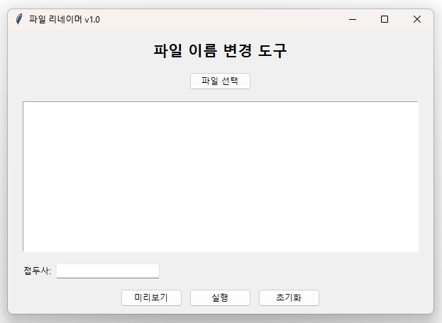
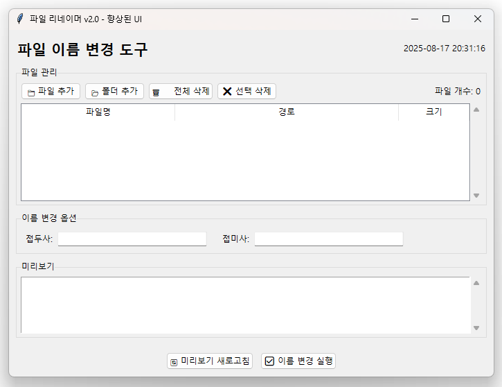
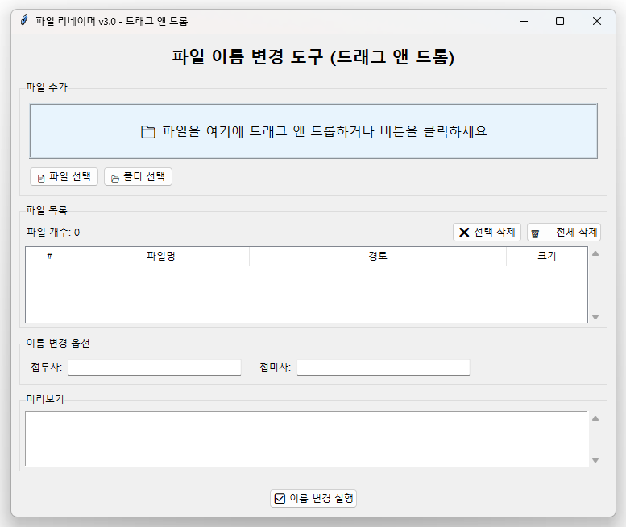
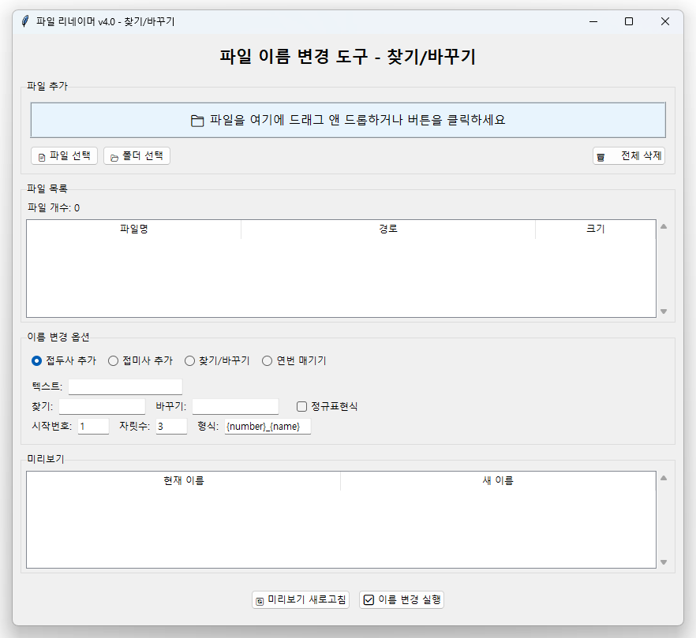
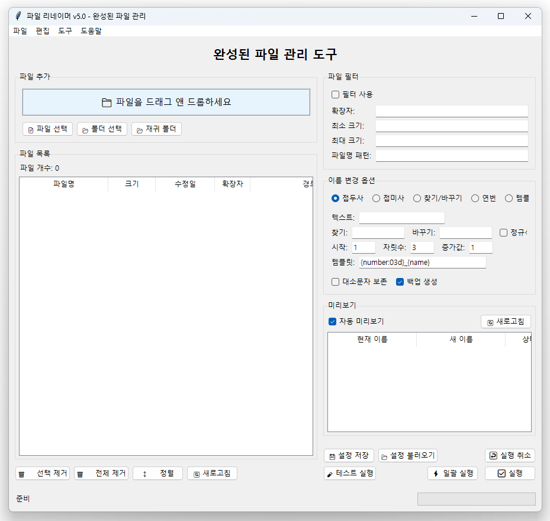

# Chapter 4: GUI 개선과 사용성 향상

이번 챕터에서는 Chapter 3에서 만든 기본 프로그램을 바탕으로 사용자 친화적인 GUI로 개선해보겠습니다. **드래그 앤 드롭**, **찾기/바꾸기**, **향상된 파일 관리** 기능을 단계적으로 추가하면서 실용적인 파일 리네이머를 완성해보겠습니다.

## 🎯 학습 목표

- Chapter 3의 기본 프로그램을 GUI로 발전시키기
- 사용자 친화적인 인터페이스 설계 원칙 학습
- 드래그 앤 드롭 기능으로 편의성 향상
- 찾기/바꾸기 기능으로 유연성 확보
- 에러 처리와 사용자 피드백 구현

## 🏗️ Chapter 3에서 Chapter 4로의 발전

Chapter 3에서 우리는 콘솔 기반의 간단한 파일 리네이머를 만들었습니다. 이제 이를 단계별로 GUI 프로그램으로 발전시켜보겠습니다.

### Chapter 3 vs Chapter 4 비교

| 측면 | Chapter 3 | Chapter 4 |
|------|-----------|----------|
| 인터페이스 | 콘솔 기반 | GUI 기반 |
| 파일 추가 | 수동 경로 입력 | 파일 다이얼로그 + 드래그앤드롭 |
| 미리보기 | 단순 텍스트 출력 | 테이블 형태 시각화 |
| 사용성 | 프로그래머용 | 일반 사용자용 |
| 기능 | 접두사만 | 접두사/접미사/찾기바꾸기 |

## 🚀 Step-by-Step 개발 과정

### 이번 챕터에서 구현할 5단계

1. **Step 1**: Chapter 3 코드를 GUI로 변환
2. **Step 2**: 파일 다이얼로그로 편의성 향상
3. **Step 3**: 드래그 앤 드롭으로 직관성 확보
4. **Step 4**: 찾기/바꾸기 기능으로 유연성 추가
5. **Step 5**: 파일 관리 기능으로 완성도 높이기

### 필수 라이브러리 설치

```bash
pip install tkinterdnd2
```

!!! info "라이브러리 설명"
    tkinterdnd2는 tkinter에 드래그 앤 드롭 기능을 추가하는 라이브러리입니다. 설치가 어려운 경우 파일 다이얼로그만으로도 충분히 사용 가능합니다.

## 📝 Step 1: Chapter 3 코드를 GUI로 변환

### 목표
Chapter 3의 콘솔 기반 프로그램을 tkinter GUI로 변환하여 기본적인 시각적 인터페이스를 구성합니다.

### step1_basic_gui.py

```python
import tkinter as tk
from tkinter import ttk, filedialog, messagebox
import os

class BasicFileRenamer:
    def __init__(self):
        self.root = tk.Tk()
        self.root.title("파일 리네이머 v1.0")
        self.root.geometry("600x400")
        
        # Chapter 3에서 사용한 변수들
        self.files = []
        
        self.create_widgets()
    
    def create_widgets(self):
        # 제목
        title_label = ttk.Label(self.root, text="파일 이름 변경 도구", 
                               font=("맑은 고딕", 16, "bold"))
        title_label.pack(pady=10)
        
        # 파일 추가 버튼
        ttk.Button(self.root, text="파일 선택", 
                  command=self.select_files).pack(pady=5)
        
        # 파일 목록 표시 (간단한 리스트박스)
        self.file_listbox = tk.Listbox(self.root, height=8)
        self.file_listbox.pack(fill="both", expand=True, padx=20, pady=10)
        
        # 옵션 프레임
        option_frame = ttk.Frame(self.root)
        option_frame.pack(fill="x", padx=20, pady=5)
        
        # 접두사 입력
        ttk.Label(option_frame, text="접두사:").grid(row=0, column=0, sticky="w")
        self.prefix_var = tk.StringVar()
        self.prefix_entry = ttk.Entry(option_frame, textvariable=self.prefix_var, width=20)
        self.prefix_entry.grid(row=0, column=1, padx=5)
        
        # 버튼 프레임
        button_frame = ttk.Frame(self.root)
        button_frame.pack(pady=10)
        
        ttk.Button(button_frame, text="미리보기", 
                  command=self.preview_changes).pack(side="left", padx=5)
        ttk.Button(button_frame, text="실행", 
                  command=self.execute_rename).pack(side="left", padx=5)
        ttk.Button(button_frame, text="초기화", 
                  command=self.clear_files).pack(side="left", padx=5)
    
    def select_files(self):
        """파일 선택 다이얼로그"""
        files = filedialog.askopenfilenames(
            title="이름을 변경할 파일들을 선택하세요",
            filetypes=[("모든 파일", "*.*")]
        )
        
        for file_path in files:
            if file_path not in self.files:
                self.files.append(file_path)
        
        self.update_file_list()
    
    def update_file_list(self):
        """파일 목록 업데이트"""
        self.file_listbox.delete(0, tk.END)
        for file_path in self.files:
            filename = os.path.basename(file_path)
            self.file_listbox.insert(tk.END, filename)
    
    def preview_changes(self):
        """Chapter 3의 미리보기 기능을 GUI로"""
        if not self.files:
            messagebox.showwarning("경고", "선택된 파일이 없습니다.")
            return
        
        prefix = self.prefix_var.get().strip()
        if not prefix:
            messagebox.showwarning("경고", "접두사를 입력하세요.")
            return
        
        # 미리보기 창 생성
        preview_window = tk.Toplevel(self.root)
        preview_window.title("미리보기")
        preview_window.geometry("500x400")
        
        # 미리보기 텍스트 표시
        text_widget = tk.Text(preview_window, wrap="none")
        scrollbar = ttk.Scrollbar(preview_window, command=text_widget.yview)
        text_widget.configure(yscrollcommand=scrollbar.set)
        
        preview_content = "변경 예정:\n" + "="*50 + "\n"
        
        for file_path in self.files:
            old_name = os.path.basename(file_path)
            name, ext = os.path.splitext(old_name)
            new_name = f"{prefix}{name}{ext}"
            preview_content += f"{old_name} → {new_name}\n"
        
        text_widget.insert("1.0", preview_content)
        text_widget.configure(state="disabled")
        
        text_widget.pack(side="left", fill="both", expand=True)
        scrollbar.pack(side="right", fill="y")
    
    def execute_rename(self):
        """Chapter 3의 실행 로직을 GUI로"""
        if not self.files:
            messagebox.showwarning("경고", "선택된 파일이 없습니다.")
            return
        
        prefix = self.prefix_var.get().strip()
        if not prefix:
            messagebox.showwarning("경고", "접두사를 입력하세요.")
            return
        
        # 확인 메시지
        if not messagebox.askyesno("확인", 
                                  f"{len(self.files)}개 파일의 이름을 변경하시겠습니까?"):
            return
        
        success_count = 0
        errors = []
        
        for file_path in self.files[:]:
            try:
                directory = os.path.dirname(file_path)
                old_name = os.path.basename(file_path)
                name, ext = os.path.splitext(old_name)
                new_name = f"{prefix}{name}{ext}"
                new_path = os.path.join(directory, new_name)
                
                if old_name == new_name:
                    continue  # 변경할 필요 없음
                
                if os.path.exists(new_path):
                    errors.append(f"{old_name}: 대상 파일이 이미 존재")
                    continue
                
                os.rename(file_path, new_path)
                # 목록에서 경로 업데이트
                index = self.files.index(file_path)
                self.files[index] = new_path
                success_count += 1
                
            except Exception as e:
                errors.append(f"{os.path.basename(file_path)}: {str(e)}")
        
        # 결과 보고
        result_msg = f"성공: {success_count}개 파일 변경됨"
        if errors:
            result_msg += f"\n실패: {len(errors)}개"
            if len(errors) <= 5:  # 오류가 적으면 모두 표시
                result_msg += "\n" + "\n".join(errors)
        
        messagebox.showinfo("작업 완료", result_msg)
        self.update_file_list()
    
    def clear_files(self):
        """파일 목록 초기화"""
        self.files.clear()
        self.update_file_list()
        self.prefix_var.set("")
    
    def run(self):
        self.root.mainloop()

if __name__ == "__main__":
    app = BasicFileRenamer()
    app.run()
```

### 실행 결과



이 단계에서는 Chapter 3의 핵심 로직을 그대로 유지하면서 GUI 인터페이스만 추가했습니다. 사용자는 이제 콘솔 대신 윈도우를 통해 파일을 선택하고 미리보기를 확인할 수 있습니다.

### 💡 Step 1에서 배운 GUI 설계 원칙

1. **점진적 전환**: 기존 로직을 유지하며 인터페이스만 변경
2. **사용자 친화적 피드백**: 미리보기 창으로 안전성 확보
3. **직관적 흐름**: 파일 선택 → 옵션 설정 → 미리보기 → 실행
4. **에러 처리**: GUI 환경에 맞는 messagebox 활용

---

## 🎨 Step 2: 파일 다이얼로그 개선과 UI 향상

### 목표
Step 1의 기본 GUI를 개선하여 더 나은 사용자 경험을 제공합니다. 접미사 옵션 추가, 더 나은 파일 표시, 상태 정보 제공 등을 구현합니다.

### step2_improved_ui.py

```python
import tkinter as tk
from tkinter import ttk, filedialog, messagebox
import os
from datetime import datetime

class ImprovedFileRenamer:
    def __init__(self):
        self.root = tk.Tk()
        self.root.title("파일 리네이머 v2.0 - 향상된 UI")
        self.root.geometry("700x500")
        
        self.files = []
        self.create_widgets()
        
        # 실시간 미리보기를 위한 이벤트 바인딩
        self.prefix_var.trace('w', self.on_option_change)
        self.suffix_var.trace('w', self.on_option_change)
    
    def create_widgets(self):
        # 메인 프레임
        main_frame = ttk.Frame(self.root, padding="10")
        main_frame.grid(row=0, column=0, sticky="nsew")
        
        # 제목과 상태 정보
        title_frame = ttk.Frame(main_frame)
        title_frame.grid(row=0, column=0, columnspan=2, sticky="ew", pady=(0, 10))
        
        ttk.Label(title_frame, text="파일 이름 변경 도구", 
                 font=("맑은 고딕", 16, "bold")).pack(side="left")
        
        # 현재 시간 표시
        self.time_var = tk.StringVar()
        self.update_time()
        ttk.Label(title_frame, textvariable=self.time_var, 
                 font=("맑은 고딕", 9)).pack(side="right")
        
        # 파일 관리 프레임
        file_frame = ttk.LabelFrame(main_frame, text="파일 관리", padding="5")
        file_frame.grid(row=1, column=0, columnspan=2, sticky="ew", pady=(0, 10))
        
        # 파일 추가/제거 버튼들
        btn_frame = ttk.Frame(file_frame)
        btn_frame.pack(fill="x", pady=(0, 5))
        
        ttk.Button(btn_frame, text="📁 파일 추가", 
                  command=self.select_files).pack(side="left", padx=(0, 5))
        ttk.Button(btn_frame, text="📂 폴더 추가", 
                  command=self.select_folder).pack(side="left", padx=(0, 5))
        ttk.Button(btn_frame, text="🗑️ 전체 삭제", 
                  command=self.clear_files).pack(side="left", padx=(0, 5))
        ttk.Button(btn_frame, text="❌ 선택 삭제", 
                  command=self.remove_selected).pack(side="left")
        
        # 파일 개수 정보
        self.file_count_var = tk.StringVar(value="파일 개수: 0")
        ttk.Label(btn_frame, textvariable=self.file_count_var).pack(side="right")
        
        # 파일 목록 (Treeview 사용)
        tree_frame = ttk.Frame(file_frame)
        tree_frame.pack(fill="both", expand=True)
        
        # Treeview 생성
        columns = ("파일명", "경로", "크기")
        self.file_tree = ttk.Treeview(tree_frame, columns=columns, show="headings", height=8)
        
        # 컬럼 설정
        self.file_tree.heading("파일명", text="파일명")
        self.file_tree.heading("경로", text="경로")
        self.file_tree.heading("크기", text="크기")
        
        self.file_tree.column("파일명", width=200)
        self.file_tree.column("경로", width=300)
        self.file_tree.column("크기", width=80)
        
        # 스크롤바
        tree_scroll = ttk.Scrollbar(tree_frame, orient="vertical", command=self.file_tree.yview)
        self.file_tree.configure(yscrollcommand=tree_scroll.set)
        
        self.file_tree.pack(side="left", fill="both", expand=True)
        tree_scroll.pack(side="right", fill="y")
        
        # 옵션 프레임
        option_frame = ttk.LabelFrame(main_frame, text="이름 변경 옵션", padding="10")
        option_frame.grid(row=2, column=0, columnspan=2, sticky="ew", pady=(0, 10))
        
        # 접두사
        ttk.Label(option_frame, text="접두사:").grid(row=0, column=0, sticky="w", padx=(0, 5))
        self.prefix_var = tk.StringVar()
        ttk.Entry(option_frame, textvariable=self.prefix_var, width=30).grid(row=0, column=1, sticky="w", padx=(0, 20))
        
        # 접미사  
        ttk.Label(option_frame, text="접미사:").grid(row=0, column=2, sticky="w", padx=(0, 5))
        self.suffix_var = tk.StringVar()
        ttk.Entry(option_frame, textvariable=self.suffix_var, width=30).grid(row=0, column=3, sticky="w")
        
        # 미리보기 프레임
        preview_frame = ttk.LabelFrame(main_frame, text="미리보기", padding="5")
        preview_frame.grid(row=3, column=0, columnspan=2, sticky="ew", pady=(0, 10))
        
        # 미리보기 텍스트
        self.preview_text = tk.Text(preview_frame, height=6, wrap="none")
        preview_scroll = ttk.Scrollbar(preview_frame, orient="vertical", command=self.preview_text.yview)
        self.preview_text.configure(yscrollcommand=preview_scroll.set)
        
        self.preview_text.pack(side="left", fill="both", expand=True)
        preview_scroll.pack(side="right", fill="y")
        
        # 실행 버튼 프레임
        exec_frame = ttk.Frame(main_frame)
        exec_frame.grid(row=4, column=0, columnspan=2, pady=(10, 0))
        
        ttk.Button(exec_frame, text="🔄 미리보기 새로고침", 
                  command=self.update_preview).pack(side="left", padx=(0, 10))
        ttk.Button(exec_frame, text="✅ 이름 변경 실행", 
                  command=self.execute_rename).pack(side="right")
        
        # 그리드 가중치 설정
        self.root.grid_rowconfigure(0, weight=1)
        self.root.grid_columnconfigure(0, weight=1)
        main_frame.grid_rowconfigure(1, weight=1)
        main_frame.grid_columnconfigure(1, weight=1)
    
    def update_time(self):
        """현재 시간 업데이트"""
        current_time = datetime.now().strftime("%Y-%m-%d %H:%M:%S")
        self.time_var.set(current_time)
        self.root.after(1000, self.update_time)  # 1초마다 업데이트
    
    def select_files(self):
        """개별 파일 선택"""
        files = filedialog.askopenfilenames(
            title="이름을 변경할 파일들을 선택하세요",
            filetypes=[("모든 파일", "*.*"), ("이미지 파일", "*.jpg;*.png;*.gif"), 
                      ("문서 파일", "*.txt;*.doc;*.pdf")]
        )
        
        for file_path in files:
            if file_path not in self.files:
                self.files.append(file_path)
        
        self.update_file_display()
    
    def select_folder(self):
        """폴더 내 모든 파일 선택"""
        folder_path = filedialog.askdirectory(title="폴더를 선택하세요")
        if not folder_path:
            return
        
        try:
            for item in os.listdir(folder_path):
                file_path = os.path.join(folder_path, item)
                if os.path.isfile(file_path) and file_path not in self.files:
                    self.files.append(file_path)
            
            self.update_file_display()
            messagebox.showinfo("완료", f"{folder_path}의 파일들을 추가했습니다.")
            
        except Exception as e:
            messagebox.showerror("오류", f"폴더 읽기 실패: {str(e)}")
    
    def update_file_display(self):
        """파일 목록 화면 업데이트"""
        # 기존 항목 삭제
        for item in self.file_tree.get_children():
            self.file_tree.delete(item)
        
        # 새 파일 목록 추가
        for file_path in self.files:
            filename = os.path.basename(file_path)
            directory = os.path.dirname(file_path)
            
            # 파일 크기 계산
            try:
                size = os.path.getsize(file_path)
                if size < 1024:
                    size_str = f"{size} B"
                elif size < 1024*1024:
                    size_str = f"{size/1024:.1f} KB"
                else:
                    size_str = f"{size/(1024*1024):.1f} MB"
            except:
                size_str = "?"
            
            self.file_tree.insert("", "end", values=(filename, directory, size_str))
        
        # 파일 개수 업데이트
        self.file_count_var.set(f"파일 개수: {len(self.files)}")
        
        # 미리보기 업데이트
        self.update_preview()
    
    def remove_selected(self):
        """선택된 파일 제거"""
        selected_items = self.file_tree.selection()
        if not selected_items:
            messagebox.showwarning("경고", "제거할 파일을 선택하세요.")
            return
        
        for item in selected_items:
            values = self.file_tree.item(item)['values']
            filename = values[0]
            directory = values[1]
            file_path = os.path.join(directory, filename)
            
            if file_path in self.files:
                self.files.remove(file_path)
        
        self.update_file_display()
    
    def clear_files(self):
        """모든 파일 제거"""
        self.files.clear()
        self.update_file_display()
        self.prefix_var.set("")
        self.suffix_var.set("")
    
    def on_option_change(self, *args):
        """옵션 변경 시 자동 미리보기 업데이트"""
        self.update_preview()
    
    def update_preview(self):
        """미리보기 업데이트"""
        self.preview_text.delete("1.0", tk.END)
        
        if not self.files:
            self.preview_text.insert("1.0", "파일이 선택되지 않았습니다.")
            return
        
        prefix = self.prefix_var.get()
        suffix = self.suffix_var.get()
        
        if not prefix and not suffix:
            self.preview_text.insert("1.0", "접두사나 접미사를 입력하세요.")
            return
        
        preview_content = "변경 미리보기:\n" + "="*60 + "\n"
        
        for file_path in self.files:
            old_name = os.path.basename(file_path)
            name, ext = os.path.splitext(old_name)
            new_name = f"{prefix}{name}{suffix}{ext}"
            
            preview_content += f"{old_name:30} → {new_name}\n"
        
        self.preview_text.insert("1.0", preview_content)
    
    def execute_rename(self):
        """이름 변경 실행"""
        if not self.files:
            messagebox.showwarning("경고", "선택된 파일이 없습니다.")
            return
        
        prefix = self.prefix_var.get()
        suffix = self.suffix_var.get()
        
        if not prefix and not suffix:
            messagebox.showwarning("경고", "접두사나 접미사를 입력하세요.")
            return
        
        # 확인 메시지
        if not messagebox.askyesno("확인", 
                                  f"{len(self.files)}개 파일의 이름을 변경하시겠습니까?"):
            return
        
        success_count = 0
        errors = []
        
        for file_path in self.files[:]:
            try:
                directory = os.path.dirname(file_path)
                old_name = os.path.basename(file_path)
                name, ext = os.path.splitext(old_name)
                new_name = f"{prefix}{name}{suffix}{ext}"
                new_path = os.path.join(directory, new_name)
                
                if old_name == new_name:
                    continue
                
                if os.path.exists(new_path):
                    errors.append(f"{old_name}: 대상 파일이 이미 존재")
                    continue
                
                os.rename(file_path, new_path)
                index = self.files.index(file_path)
                self.files[index] = new_path
                success_count += 1
                
            except Exception as e:
                errors.append(f"{os.path.basename(file_path)}: {str(e)}")
        
        # 결과 보고
        result_msg = f"✅ 성공: {success_count}개 파일 변경됨"
        if errors:
            result_msg += f"\n❌ 실패: {len(errors)}개"
            if len(errors) <= 5:
                result_msg += "\n\n세부 오류:\n" + "\n".join(errors)
        
        messagebox.showinfo("작업 완료", result_msg)
        self.update_file_display()
    
    def run(self):
        self.root.mainloop()

if __name__ == "__main__":
    app = ImprovedFileRenamer()
    app.run()
```

### 실행 결과



Step 2에서는 사용자 경험을 크게 개선했습니다:

- **접미사 옵션 추가**<!-- -->로 더 유연한 이름 변경
- **Treeview**<!-- -->로 파일 정보를 더 자세히 표시
- **폴더 선택**<!-- --> 기능으로 대량 파일 처리 지원
- **실시간 미리보기**<!-- -->로 즉시 피드백 제공
- **파일 개별 삭제**<!-- --> 기능으로 정밀한 제어

### 💡 Step 2에서 배운 UI/UX 원칙

1. **정보 표시의 충실성**: 파일 크기, 경로 등 상세 정보 제공
2. **실시간 피드백**: 옵션 변경 시 즉시 미리보기 업데이트  
3. **일괄 처리**: 폴더 선택으로 대량 파일 처리 지원
4. **세밀한 제어**: 개별 파일 선택/해제 기능

---

## 🎯 Step 3: 드래그 앤 드롭으로 직관성 확보

### 목표
tkinterdnd2 라이브러리를 활용하여 드래그 앤 드롭 기능을 추가하고, 사용자가 파일을 더 직관적으로 추가할 수 있도록 합니다.

### step3_drag_drop.py

```python
import tkinter as tk
from tkinter import ttk, filedialog, messagebox
import os

# 드래그 앤 드롭 라이브러리 (선택적)
try:
    from tkinterdnd2 import DND_FILES, TkinterDnD
    DND_AVAILABLE = True
except ImportError:
    DND_AVAILABLE = False
    print("tkinterdnd2가 설치되지 않았습니다. 파일 다이얼로그만 사용됩니다.")

class DragDropFileRenamer:
    def __init__(self):
        # 드래그 앤 드롭 지원 여부에 따라 다른 방식으로 윈도우 생성
        if DND_AVAILABLE:
            self.root = TkinterDnD.Tk()
        else:
            self.root = tk.Tk()
        
        self.root.title("파일 리네이머 v3.0 - 드래그 앤 드롭")
        self.root.geometry("750x600")
        
        self.files = []
        self.create_widgets()
        self.setup_drag_drop()
        
        # 실시간 미리보기
        self.prefix_var.trace('w', self.on_option_change)
        self.suffix_var.trace('w', self.on_option_change)
    
    def create_widgets(self):
        # 메인 프레임
        main_frame = ttk.Frame(self.root, padding="10")
        main_frame.grid(row=0, column=0, sticky="nsew")
        
        # 제목
        title_label = ttk.Label(main_frame, text="파일 이름 변경 도구 (드래그 앤 드롭)", 
                               font=("맑은 고딕", 16, "bold"))
        title_label.grid(row=0, column=0, columnspan=2, pady=(0, 15))
        
        # 드래그 앤 드롭 영역
        self.drop_frame = ttk.LabelFrame(main_frame, text="파일 추가", padding="10")
        self.drop_frame.grid(row=1, column=0, columnspan=2, sticky="ew", pady=(0, 10))
        
        # 드롭 라벨 (시각적 드롭 영역)
        if DND_AVAILABLE:
            drop_text = "📁 파일을 여기에 드래그 앤 드롭하거나 버튼을 클릭하세요"
            bg_color = "#e8f4fd"  # 연한 파란색
        else:
            drop_text = "⚠️ 드래그 앤 드롭 불가능 - 버튼을 사용하세요"
            bg_color = "#fff2cc"  # 연한 노란색
        
        self.drop_label = tk.Label(
            self.drop_frame, 
            text=drop_text,
            font=("맑은 고딕", 12),
            bg=bg_color,
            relief="ridge",
            bd=2,
            height=3
        )
        self.drop_label.pack(fill="x", pady=(0, 10))
        
        # 파일 추가 버튼들
        btn_frame = ttk.Frame(self.drop_frame)
        btn_frame.pack(fill="x")
        
        ttk.Button(btn_frame, text="📄 파일 선택", 
                  command=self.select_files).pack(side="left", padx=(0, 5))
        ttk.Button(btn_frame, text="📂 폴더 선택", 
                  command=self.select_folder).pack(side="left", padx=(0, 5))
        
        # 파일 목록 영역
        list_frame = ttk.LabelFrame(main_frame, text="파일 목록", padding="5")
        list_frame.grid(row=2, column=0, columnspan=2, sticky="nsew", pady=(0, 10))
        
        # 파일 개수와 제어 버튼
        control_frame = ttk.Frame(list_frame)
        control_frame.pack(fill="x", pady=(0, 5))
        
        self.file_count_var = tk.StringVar(value="파일 개수: 0")
        ttk.Label(control_frame, textvariable=self.file_count_var).pack(side="left")
        
        ttk.Button(control_frame, text="🗑️ 전체 삭제", 
                  command=self.clear_files).pack(side="right", padx=(5, 0))
        ttk.Button(control_frame, text="❌ 선택 삭제", 
                  command=self.remove_selected).pack(side="right")
        
        # 파일 목록 (Treeview)
        columns = ("#", "파일명", "경로", "크기")
        self.file_tree = ttk.Treeview(list_frame, columns=columns, show="headings", height=10)
        
        self.file_tree.heading("#", text="#")
        self.file_tree.heading("파일명", text="파일명")
        self.file_tree.heading("경로", text="경로")  
        self.file_tree.heading("크기", text="크기")
        
        self.file_tree.column("#", width=40)
        self.file_tree.column("파일명", width=200)
        self.file_tree.column("경로", width=300)
        self.file_tree.column("크기", width=80)
        
        # 스크롤바
        tree_scroll = ttk.Scrollbar(list_frame, orient="vertical", command=self.file_tree.yview)
        self.file_tree.configure(yscrollcommand=tree_scroll.set)
        
        self.file_tree.pack(side="left", fill="both", expand=True)
        tree_scroll.pack(side="right", fill="y")
        
        # 옵션 프레임
        option_frame = ttk.LabelFrame(main_frame, text="이름 변경 옵션", padding="10")
        option_frame.grid(row=3, column=0, columnspan=2, sticky="ew", pady=(0, 10))
        
        # 접두사
        ttk.Label(option_frame, text="접두사:").grid(row=0, column=0, sticky="w", padx=(0, 5))
        self.prefix_var = tk.StringVar()
        ttk.Entry(option_frame, textvariable=self.prefix_var, width=30).grid(row=0, column=1, sticky="w", padx=(0, 20))
        
        # 접미사
        ttk.Label(option_frame, text="접미사:").grid(row=0, column=2, sticky="w", padx=(0, 5))
        self.suffix_var = tk.StringVar()
        ttk.Entry(option_frame, textvariable=self.suffix_var, width=30).grid(row=0, column=3, sticky="w")
        
        # 미리보기 프레임
        preview_frame = ttk.LabelFrame(main_frame, text="미리보기", padding="5")
        preview_frame.grid(row=4, column=0, columnspan=2, sticky="ew", pady=(0, 10))
        
        self.preview_text = tk.Text(preview_frame, height=5, wrap="none")
        preview_scroll = ttk.Scrollbar(preview_frame, orient="vertical", command=self.preview_text.yview)
        self.preview_text.configure(yscrollcommand=preview_scroll.set)
        
        self.preview_text.pack(side="left", fill="both", expand=True)
        preview_scroll.pack(side="right", fill="y")
        
        # 실행 버튼
        exec_frame = ttk.Frame(main_frame)
        exec_frame.grid(row=5, column=0, columnspan=2, pady=(10, 0))
        
        ttk.Button(exec_frame, text="✅ 이름 변경 실행", 
                  command=self.execute_rename, 
                  style="Accent.TButton").pack(side="right")
        
        # 그리드 가중치 설정
        self.root.grid_rowconfigure(0, weight=1)
        self.root.grid_columnconfigure(0, weight=1)
        main_frame.grid_rowconfigure(2, weight=1)
        main_frame.grid_columnconfigure(1, weight=1)
    
    def setup_drag_drop(self):
        """드래그 앤 드롭 설정"""
        if not DND_AVAILABLE:
            return
        
        # 드롭 라벨에 드래그 앤 드롭 이벤트 바인딩
        self.drop_label.drop_target_register(DND_FILES)
        self.drop_label.dnd_bind('<<Drop>>', self.on_file_drop)
        self.drop_label.dnd_bind('<<DragEnter>>', self.on_drag_enter)
        self.drop_label.dnd_bind('<<DragLeave>>', self.on_drag_leave)
        
        # 메인 프레임에도 드롭 기능 추가 (편의성)
        self.drop_frame.drop_target_register(DND_FILES)
        self.drop_frame.dnd_bind('<<Drop>>', self.on_file_drop)
    
    def on_drag_enter(self, event):
        """드래그 진입 시 시각적 피드백"""
        self.drop_label.configure(bg="#d4e6f1")  # 더 진한 파란색
        self.drop_label.configure(text="📥 파일을 놓으세요!")
    
    def on_drag_leave(self, event):
        """드래그 벗어날 때 원래 상태로"""
        self.drop_label.configure(bg="#e8f4fd")  # 원래 색상
        self.drop_label.configure(text="📁 파일을 여기에 드래그 앤 드롭하거나 버튼을 클릭하세요")
    
    def on_file_drop(self, event):
        """파일 드롭 이벤트 처리"""
        # 드롭된 파일 경로들 파싱
        files = self.parse_drop_files(event.data)
        
        added_count = 0
        for file_path in files:
            if os.path.isfile(file_path) and file_path not in self.files:
                self.files.append(file_path)
                added_count += 1
        
        if added_count > 0:
            self.update_file_display()
            # 간단한 성공 피드백
            self.drop_label.configure(text=f"✅ {added_count}개 파일 추가됨!")
            self.root.after(2000, lambda: self.drop_label.configure(
                text="📁 파일을 여기에 드래그 앤 드롭하거나 버튼을 클릭하세요"))
        else:
            self.drop_label.configure(text="❌ 유효한 파일이 없습니다")
            self.root.after(2000, lambda: self.drop_label.configure(
                text="📁 파일을 여기에 드래그 앤 드롭하거나 버튼을 클릭하세요"))
    
    def parse_drop_files(self, data):
        """드롭된 파일 데이터 파싱"""
        # tkinterdnd2는 파일 경로를 특별한 형식으로 전달
        files = []
        
        # 중괄호로 감싸진 경로 처리
        if data.startswith('{') and data.endswith('}'):
            data = data[1:-1]
        
        # 공백으로 구분된 여러 파일 처리
        for item in data.split():
            item = item.strip()
            if item.startswith('{') and item.endswith('}'):
                item = item[1:-1]
            if os.path.exists(item):
                files.append(item)
        
        return files
    
    def select_files(self):
        """파일 다이얼로그로 파일 선택"""
        files = filedialog.askopenfilenames(
            title="이름을 변경할 파일들을 선택하세요",
            filetypes=[("모든 파일", "*.*"), ("이미지 파일", "*.jpg;*.png;*.gif"), 
                      ("문서 파일", "*.txt;*.doc;*.pdf")]
        )
        
        for file_path in files:
            if file_path not in self.files:
                self.files.append(file_path)
        
        self.update_file_display()
    
    def select_folder(self):
        """폴더 내 파일들 선택"""
        folder_path = filedialog.askdirectory(title="폴더를 선택하세요")
        if not folder_path:
            return
        
        try:
            added_count = 0
            for item in os.listdir(folder_path):
                file_path = os.path.join(folder_path, item)
                if os.path.isfile(file_path) and file_path not in self.files:
                    self.files.append(file_path)
                    added_count += 1
            
            if added_count > 0:
                self.update_file_display()
                messagebox.showinfo("완료", f"{added_count}개 파일을 추가했습니다.")
            else:
                messagebox.showinfo("정보", "추가할 새 파일이 없습니다.")
                
        except Exception as e:
            messagebox.showerror("오류", f"폴더 읽기 실패: {str(e)}")
    
    def update_file_display(self):
        """파일 목록 업데이트"""
        # 기존 항목 삭제
        for item in self.file_tree.get_children():
            self.file_tree.delete(item)
        
        # 파일 목록 추가
        for i, file_path in enumerate(self.files, 1):
            filename = os.path.basename(file_path)
            directory = os.path.dirname(file_path)
            
            # 파일 크기 계산
            try:
                size = os.path.getsize(file_path)
                if size < 1024:
                    size_str = f"{size} B"
                elif size < 1024*1024:
                    size_str = f"{size/1024:.1f} KB"
                else:
                    size_str = f"{size/(1024*1024):.1f} MB"
            except:
                size_str = "?"
            
            self.file_tree.insert("", "end", values=(i, filename, directory, size_str))
        
        # 파일 개수 업데이트
        self.file_count_var.set(f"파일 개수: {len(self.files)}")
        
        # 미리보기 업데이트
        self.update_preview()
    
    def remove_selected(self):
        """선택된 파일 제거"""
        selected_items = self.file_tree.selection()
        if not selected_items:
            messagebox.showwarning("경고", "제거할 파일을 선택하세요.")
            return
        
        # 선택된 항목들의 인덱스 수집 (역순으로 정렬)
        indices_to_remove = []
        for item in selected_items:
            values = self.file_tree.item(item)['values']
            index = int(values[0]) - 1  # 1-based에서 0-based로 변환
            indices_to_remove.append(index)
        
        # 인덱스 역순으로 정렬해서 제거 (큰 인덱스부터)
        for index in sorted(indices_to_remove, reverse=True):
            if 0 <= index < len(self.files):
                del self.files[index]
        
        self.update_file_display()
    
    def clear_files(self):
        """모든 파일 제거"""
        self.files.clear()
        self.update_file_display()
        self.prefix_var.set("")
        self.suffix_var.set("")
    
    def on_option_change(self, *args):
        """옵션 변경 시 미리보기 업데이트"""
        self.update_preview()
    
    def update_preview(self):
        """미리보기 업데이트"""
        self.preview_text.delete("1.0", tk.END)
        
        if not self.files:
            self.preview_text.insert("1.0", "파일이 선택되지 않았습니다.")
            return
        
        prefix = self.prefix_var.get()
        suffix = self.suffix_var.get()
        
        if not prefix and not suffix:
            self.preview_text.insert("1.0", "접두사나 접미사를 입력하세요.")
            return
        
        preview_content = "변경 미리보기:\n" + "="*60 + "\n"
        
        for file_path in self.files:
            old_name = os.path.basename(file_path)
            name, ext = os.path.splitext(old_name)
            new_name = f"{prefix}{name}{suffix}{ext}"
            
            preview_content += f"{old_name:30} → {new_name}\n"
        
        self.preview_text.insert("1.0", preview_content)
    
    def execute_rename(self):
        """이름 변경 실행"""
        if not self.files:
            messagebox.showwarning("경고", "선택된 파일이 없습니다.")
            return
        
        prefix = self.prefix_var.get()
        suffix = self.suffix_var.get()
        
        if not prefix and not suffix:
            messagebox.showwarning("경고", "접두사나 접미사를 입력하세요.")
            return
        
        # 확인 메시지
        if not messagebox.askyesno("확인", 
                                  f"{len(self.files)}개 파일의 이름을 변경하시겠습니까?"):
            return
        
        success_count = 0
        errors = []
        
        for file_path in self.files[:]:
            try:
                directory = os.path.dirname(file_path)
                old_name = os.path.basename(file_path)
                name, ext = os.path.splitext(old_name)
                new_name = f"{prefix}{name}{suffix}{ext}"
                new_path = os.path.join(directory, new_name)
                
                if old_name == new_name:
                    continue
                
                if os.path.exists(new_path):
                    errors.append(f"{old_name}: 대상 파일이 이미 존재")
                    continue
                
                os.rename(file_path, new_path)
                index = self.files.index(file_path)
                self.files[index] = new_path
                success_count += 1
                
            except Exception as e:
                errors.append(f"{os.path.basename(file_path)}: {str(e)}")
        
        # 결과 보고
        result_msg = f"✅ 성공: {success_count}개 파일 변경됨"
        if errors:
            result_msg += f"\n❌ 실패: {len(errors)}개"
            if len(errors) <= 5:
                result_msg += "\n\n세부 오류:\n" + "\n".join(errors)
        
        messagebox.showinfo("작업 완료", result_msg)
        self.update_file_display()
    
    def run(self):
        self.root.mainloop()

if __name__ == "__main__":
    app = DragDropFileRenamer()
    app.run()
```

### 실행 결과



Step 3에서는 드래그 앤 드롭 기능을 완전히 구현했습니다:

- **시각적 드롭 영역**<!-- -->으로 명확한 사용자 안내
- **드래그 상태 피드백**<!-- -->으로 실시간 상호작용
- **다양한 파일 경로 형식**<!-- --> 지원
- **라이브러리 없이도 작동**<!-- -->하는 대체 기능

### 💡 Step 3에서 배운 드래그 앤 드롭 설계 원칙

1. **명확한 드롭 영역**: 시각적으로 구분되는 드롭 구역 제공
2. **즉시 피드백**: 드래그 진입/벗어남 시 시각적 변화
3. **성공/실패 알림**: 드롭 후 결과를 사용자에게 명확히 전달
4. **대체 수단 제공**: 라이브러리 없어도 기본 기능 보장

---

## 🔍 Step 4: 찾기/바꾸기 기능으로 유연성 추가

### 목표
Step 3의 기본 접두사/접미사 기능을 확장하여 **찾기/바꾸기 기능**<!-- -->과 **정규표현식 지원**<!-- -->을 추가합니다. 이를 통해 더욱 유연하고 강력한 파일명 변경이 가능해집니다.

### step4_find_replace.py

```python linenums="1" title="src/chapter4/step4_find_replace.py"
import tkinter as tk
from tkinter import ttk, filedialog, messagebox
import os
import re

# 드래그 앤 드롭 라이브러리 (선택적)
try:
    from tkinterdnd2 import DND_FILES, TkinterDnD
    DND_AVAILABLE = True
except ImportError:
    DND_AVAILABLE = False

class FindReplaceFileRenamer:
    def __init__(self):
        # 드래그 앤 드롭 지원 여부에 따라 다른 방식으로 윈도우 생성
        if DND_AVAILABLE:
            self.root = TkinterDnD.Tk()
        else:
            self.root = tk.Tk()
        
        self.root.title("파일 리네이머 v4.0 - 찾기/바꾸기")
        self.root.geometry("850x750")
        
        self.files = []
        self.create_widgets()
        self.setup_drag_drop()
        
        # 실시간 미리보기
        self.setup_preview_bindings()
    
    def create_widgets(self):
        # 메인 프레임
        main_frame = ttk.Frame(self.root, padding="10")
        main_frame.grid(row=0, column=0, sticky="nsew")
        
        # 제목
        title_label = ttk.Label(main_frame, text="파일 이름 변경 도구 - 찾기/바꾸기", 
                               font=("맑은 고딕", 16, "bold"))
        title_label.grid(row=0, column=0, columnspan=2, pady=(0, 15))
        
        # 드래그 앤 드롭 영역
        self.create_drop_area(main_frame)
        
        # 파일 목록 영역
        self.create_file_list(main_frame)
        
        # 이름 변경 옵션 영역
        self.create_rename_options(main_frame)
        
        # 미리보기 영역
        self.create_preview_area(main_frame)
        
        # 실행 버튼
        self.create_action_buttons(main_frame)
        
        # 그리드 가중치 설정
        self.root.columnconfigure(0, weight=1)
        self.root.rowconfigure(0, weight=1)
        main_frame.columnconfigure(1, weight=1)
        main_frame.rowconfigure(2, weight=1)  # 파일 목록
        main_frame.rowconfigure(4, weight=1)  # 미리보기
    
    def create_drop_area(self, parent):
        """드래그 앤 드롭 영역 생성"""
        drop_frame = ttk.LabelFrame(parent, text="파일 추가", padding="10")
        drop_frame.grid(row=1, column=0, columnspan=2, sticky="ew", pady=(0, 10))
        
        # 드롭 라벨
        if DND_AVAILABLE:
            drop_text = "📁 파일을 여기에 드래그 앤 드롭하거나 버튼을 클릭하세요"
            bg_color = "#e8f4fd"
        else:
            drop_text = "⚠️ 드래그 앤 드롭 불가능 - 버튼을 사용하세요"
            bg_color = "#fff2cc"
        
        self.drop_label = tk.Label(
            drop_frame, 
            text=drop_text,
            font=("맑은 고딕", 11),
            bg=bg_color,
            relief="ridge",
            bd=2,
            height=2
        )
        self.drop_label.pack(fill="x", pady=(0, 10))
        
        # 파일 추가 버튼들
        btn_frame = ttk.Frame(drop_frame)
        btn_frame.pack(fill="x")
        
        ttk.Button(btn_frame, text="📄 파일 선택", 
                  command=self.select_files).pack(side="left", padx=(0, 5))
        ttk.Button(btn_frame, text="📂 폴더 선택", 
                  command=self.select_folder).pack(side="left", padx=(0, 5))
        ttk.Button(btn_frame, text="🗑️ 전체 삭제", 
                  command=self.clear_files).pack(side="right")
    
    def create_file_list(self, parent):
        """파일 목록 영역 생성"""
        list_frame = ttk.LabelFrame(parent, text="파일 목록", padding="5")
        list_frame.grid(row=2, column=0, columnspan=2, sticky="nsew", pady=(0, 10))
        
        # 파일 개수 표시
        self.file_count_var = tk.StringVar(value="파일 개수: 0")
        ttk.Label(list_frame, textvariable=self.file_count_var).pack(anchor="w", pady=(0, 5))
        
        # 파일 목록 (Treeview)
        columns = ("파일명", "경로", "크기")
        self.file_tree = ttk.Treeview(list_frame, columns=columns, show="headings", height=8)
        
        self.file_tree.heading("파일명", text="파일명")
        self.file_tree.heading("경로", text="경로")  
        self.file_tree.heading("크기", text="크기")
        
        self.file_tree.column("파일명", width=200)
        self.file_tree.column("경로", width=300)
        self.file_tree.column("크기", width=80)
        
        # 스크롤바
        scrollbar = ttk.Scrollbar(list_frame, orient="vertical", command=self.file_tree.yview)
        self.file_tree.configure(yscrollcommand=scrollbar.set)
        
        self.file_tree.pack(side="left", fill="both", expand=True)
        scrollbar.pack(side="right", fill="y")
        
        list_frame.columnconfigure(0, weight=1)
        list_frame.rowconfigure(1, weight=1)
    
    def create_rename_options(self, parent):
        """이름 변경 옵션 영역 생성"""
        options_frame = ttk.LabelFrame(parent, text="이름 변경 옵션", padding="10")
        options_frame.grid(row=3, column=0, columnspan=2, sticky="ew", pady=(0, 10))
        
        # 작업 모드 선택
        self.mode_var = tk.StringVar(value="prefix")
        
        mode_frame = ttk.Frame(options_frame)
        mode_frame.pack(fill="x", pady=(0, 10))
        
        ttk.Radiobutton(mode_frame, text="접두사 추가", variable=self.mode_var, 
                       value="prefix").pack(side="left", padx=(0, 10))
        ttk.Radiobutton(mode_frame, text="접미사 추가", variable=self.mode_var, 
                       value="suffix").pack(side="left", padx=(0, 10))
        ttk.Radiobutton(mode_frame, text="찾기/바꾸기", variable=self.mode_var, 
                       value="find_replace").pack(side="left", padx=(0, 10))
        ttk.Radiobutton(mode_frame, text="연번 매기기", variable=self.mode_var, 
                       value="numbering").pack(side="left")
        
        # 옵션별 입력 영역
        self.create_option_inputs(options_frame)
    
    def create_option_inputs(self, parent):
        """각 모드별 입력 필드 생성"""
        input_frame = ttk.Frame(parent)
        input_frame.pack(fill="x")
        
        # 접두사/접미사 입력
        prefix_suffix_frame = ttk.Frame(input_frame)
        prefix_suffix_frame.grid(row=0, column=0, sticky="ew", pady=2)
        
        ttk.Label(prefix_suffix_frame, text="텍스트:").pack(side="left")
        self.text_var = tk.StringVar()
        self.text_entry = ttk.Entry(prefix_suffix_frame, textvariable=self.text_var, width=20)
        self.text_entry.pack(side="left", padx=(5, 0))
        
        # 찾기/바꾸기 입력
        find_replace_frame = ttk.Frame(input_frame)
        find_replace_frame.grid(row=1, column=0, sticky="ew", pady=2)
        
        ttk.Label(find_replace_frame, text="찾기:").pack(side="left")
        self.find_var = tk.StringVar()
        self.find_entry = ttk.Entry(find_replace_frame, textvariable=self.find_var, width=15)
        self.find_entry.pack(side="left", padx=(5, 10))
        
        ttk.Label(find_replace_frame, text="바꾸기:").pack(side="left")
        self.replace_var = tk.StringVar()
        self.replace_entry = ttk.Entry(find_replace_frame, textvariable=self.replace_var, width=15)
        self.replace_entry.pack(side="left", padx=(5, 10))
        
        # 정규표현식 옵션
        self.regex_var = tk.BooleanVar()
        ttk.Checkbutton(find_replace_frame, text="정규표현식", 
                       variable=self.regex_var).pack(side="left", padx=(10, 0))
        
        # 연번 매기기 옵션
        numbering_frame = ttk.Frame(input_frame)
        numbering_frame.grid(row=2, column=0, sticky="ew", pady=2)
        
        ttk.Label(numbering_frame, text="시작번호:").pack(side="left")
        self.start_var = tk.StringVar(value="1")
        ttk.Entry(numbering_frame, textvariable=self.start_var, width=5).pack(side="left", padx=(5, 10))
        
        ttk.Label(numbering_frame, text="자릿수:").pack(side="left")
        self.digits_var = tk.StringVar(value="3")
        ttk.Entry(numbering_frame, textvariable=self.digits_var, width=5).pack(side="left", padx=(5, 10))
        
        ttk.Label(numbering_frame, text="형식:").pack(side="left")
        self.format_var = tk.StringVar(value="{number}_{name}")
        ttk.Entry(numbering_frame, textvariable=self.format_var, width=15).pack(side="left", padx=(5, 0))
        
        input_frame.columnconfigure(0, weight=1)
    
    def create_preview_area(self, parent):
        """미리보기 영역 생성"""
        preview_frame = ttk.LabelFrame(parent, text="미리보기", padding="5")
        preview_frame.grid(row=4, column=0, columnspan=2, sticky="nsew", pady=(0, 10))
        
        # 미리보기 목록
        columns = ("현재 이름", "새 이름")
        self.preview_tree = ttk.Treeview(preview_frame, columns=columns, show="headings", height=8)
        
        self.preview_tree.heading("현재 이름", text="현재 이름")
        self.preview_tree.heading("새 이름", text="새 이름")
        
        self.preview_tree.column("현재 이름", width=300)
        self.preview_tree.column("새 이름", width=300)
        
        # 스크롤바
        preview_scrollbar = ttk.Scrollbar(preview_frame, orient="vertical", command=self.preview_tree.yview)
        self.preview_tree.configure(yscrollcommand=preview_scrollbar.set)
        
        self.preview_tree.pack(side="left", fill="both", expand=True)
        preview_scrollbar.pack(side="right", fill="y")
        
        preview_frame.columnconfigure(0, weight=1)
        preview_frame.rowconfigure(0, weight=1)
    
    def create_action_buttons(self, parent):
        """실행 버튼 영역 생성"""
        button_frame = ttk.Frame(parent)
        button_frame.grid(row=5, column=0, columnspan=2, pady=10)
        
        ttk.Button(button_frame, text="🔄 미리보기 새로고침", 
                  command=self.update_preview).pack(side="left", padx=(0, 10))
        ttk.Button(button_frame, text="✅ 이름 변경 실행", 
                  command=self.execute_rename, 
                  style="Accent.TButton").pack(side="left")
    
    def setup_preview_bindings(self):
        """실시간 미리보기를 위한 이벤트 바인딩"""
        self.mode_var.trace('w', self.on_option_change)
        self.text_var.trace('w', self.on_option_change)
        self.find_var.trace('w', self.on_option_change)
        self.replace_var.trace('w', self.on_option_change)
        self.regex_var.trace('w', self.on_option_change)
        self.start_var.trace('w', self.on_option_change)
        self.digits_var.trace('w', self.on_option_change)
        self.format_var.trace('w', self.on_option_change)
    
    def setup_drag_drop(self):
        """드래그 앤 드롭 설정"""
        if DND_AVAILABLE:
            self.drop_label.drop_target_register(DND_FILES)
            self.drop_label.dnd_bind('<<Drop>>', self.on_drop)
            self.file_tree.drop_target_register(DND_FILES)
            self.file_tree.dnd_bind('<<Drop>>', self.on_drop)
    
    def on_drop(self, event):
        """드롭 이벤트 처리"""
        files = self.root.tk.splitlist(event.data)
        self.add_files(files)
    
    def select_files(self):
        """파일 선택 다이얼로그"""
        files = filedialog.askopenfilenames(
            title="파일 선택",
            filetypes=[
                ("모든 파일", "*.*"),
                ("이미지 파일", "*.jpg *.jpeg *.png *.gif *.bmp"),
                ("문서 파일", "*.txt *.pdf *.doc *.docx"),
                ("동영상 파일", "*.mp4 *.avi *.mkv *.mov")
            ]
        )
        if files:
            self.add_files(files)
    
    def select_folder(self):
        """폴더 선택 및 파일 추가"""
        folder = filedialog.askdirectory(title="폴더 선택")
        if folder:
            files = [os.path.join(folder, f) for f in os.listdir(folder) 
                    if os.path.isfile(os.path.join(folder, f))]
            self.add_files(files)
    
    def add_files(self, file_paths):
        """파일 목록에 파일 추가"""
        added_count = 0
        
        for file_path in file_paths:
            if os.path.isfile(file_path) and file_path not in self.files:
                self.files.append(file_path)
                
                # Treeview에 추가
                filename = os.path.basename(file_path)
                size = self.get_file_size(file_path)
                self.file_tree.insert("", "end", values=(filename, file_path, size))
                added_count += 1
        
        self.update_file_count()
        self.update_preview()
        
        if added_count > 0:
            messagebox.showinfo("파일 추가", f"{added_count}개 파일이 추가되었습니다.")
    
    def get_file_size(self, file_path):
        """파일 크기를 읽기 쉬운 형태로 반환"""
        try:
            size = os.path.getsize(file_path)
            if size < 1024:
                return f"{size} B"
            elif size < 1024 * 1024:
                return f"{size/1024:.1f} KB"
            else:
                return f"{size/(1024*1024):.1f} MB"
        except OSError:
            return "알 수 없음"
    
    def clear_files(self):
        """모든 파일 제거"""
        if self.files:
            result = messagebox.askyesno("확인", "모든 파일을 제거하시겠습니까?")
            if result:
                self.files.clear()
                self.file_tree.delete(*self.file_tree.get_children())
                self.preview_tree.delete(*self.preview_tree.get_children())
                self.update_file_count()
    
    def update_file_count(self):
        """파일 개수 업데이트"""
        self.file_count_var.set(f"파일 개수: {len(self.files)}")
    
    def on_option_change(self, *args):
        """옵션 변경 시 미리보기 업데이트"""
        self.update_preview()
    
    def generate_new_name(self, file_path, index):
        """새로운 파일명 생성"""
        filename = os.path.basename(file_path)
        name, ext = os.path.splitext(filename)
        mode = self.mode_var.get()
        
        try:
            if mode == "prefix":
                text = self.text_var.get()
                return f"{text}{filename}"
            
            elif mode == "suffix":
                text = self.text_var.get()
                return f"{name}{text}{ext}"
            
            elif mode == "find_replace":
                find_text = self.find_var.get()
                replace_text = self.replace_var.get()
                
                if not find_text:
                    return filename
                
                if self.regex_var.get():
                    # 정규표현식 모드
                    try:
                        return re.sub(find_text, replace_text, filename)
                    except re.error:
                        return filename  # 정규식 오류 시 원본 반환
                else:
                    # 일반 찾기/바꾸기
                    return filename.replace(find_text, replace_text)
            
            elif mode == "numbering":
                try:
                    start = int(self.start_var.get())
                    digits = int(self.digits_var.get())
                    format_str = self.format_var.get()
                    
                    number = start + index
                    number_str = f"{number:0{digits}d}"
                    
                    # 형식 변수 치환
                    new_name = format_str.format(
                        number=number_str,
                        name=name,
                        ext=ext[1:] if ext else "",
                        filename=filename,
                        index=index
                    )
                    
                    # 확장자가 없으면 원본 확장자 추가
                    if not new_name.endswith(ext) and ext:
                        new_name += ext
                    
                    return new_name
                    
                except (ValueError, KeyError):
                    return filename
            
        except Exception:
            return filename
        
        return filename
    
    def update_preview(self):
        """미리보기 업데이트"""
        # 기존 미리보기 삭제
        self.preview_tree.delete(*self.preview_tree.get_children())
        
        # 새 미리보기 생성
        for index, file_path in enumerate(self.files):
            current_name = os.path.basename(file_path)
            new_name = self.generate_new_name(file_path, index)
            
            # 변경사항이 있으면 하이라이트
            if current_name != new_name:
                tag = "changed"
            else:
                tag = "unchanged"
            
            item_id = self.preview_tree.insert("", "end", values=(current_name, new_name), tags=(tag,))
        
        # 태그 색상 설정
        self.preview_tree.tag_configure("changed", background="#e8f5e8")
        self.preview_tree.tag_configure("unchanged", background="#f5f5f5")
    
    def execute_rename(self):
        """실제 파일명 변경 실행"""
        if not self.files:
            messagebox.showwarning("경고", "변경할 파일이 없습니다.")
            return
        
        # 변경 계획 생성
        rename_plan = []
        for index, file_path in enumerate(self.files):
            current_name = os.path.basename(file_path)
            new_name = self.generate_new_name(file_path, index)
            
            if current_name != new_name:
                directory = os.path.dirname(file_path)
                new_path = os.path.join(directory, new_name)
                rename_plan.append((file_path, new_path))
        
        if not rename_plan:
            messagebox.showinfo("정보", "변경할 파일이 없습니다.")
            return
        
        # 확인 대화상자
        result = messagebox.askyesno(
            "확인", 
            f"{len(rename_plan)}개 파일의 이름을 변경하시겠습니까?"
        )
        
        if not result:
            return
        
        # 실행
        success_count = 0
        errors = []
        
        for old_path, new_path in rename_plan:
            try:
                # 동일한 이름의 파일이 이미 있는지 확인
                if os.path.exists(new_path):
                    errors.append(f"{os.path.basename(old_path)}: 대상 파일이 이미 존재함")
                    continue
                
                os.rename(old_path, new_path)
                success_count += 1
                
                # 내부 파일 목록 업데이트
                index = self.files.index(old_path)
                self.files[index] = new_path
                
            except Exception as e:
                errors.append(f"{os.path.basename(old_path)}: {str(e)}")
        
        # 결과 보고
        result_msg = f"성공: {success_count}개 파일 변경됨"
        if errors:
            result_msg += f"\n실패: {len(errors)}개"
            if len(errors) <= 5:
                result_msg += "\n" + "\n".join(errors)
        
        messagebox.showinfo("작업 완료", result_msg)
        
        # UI 업데이트
        self.refresh_file_list()
        self.update_preview()
    
    def refresh_file_list(self):
        """파일 목록 새로고침"""
        self.file_tree.delete(*self.file_tree.get_children())
        
        for file_path in self.files:
            if os.path.exists(file_path):
                filename = os.path.basename(file_path)
                size = self.get_file_size(file_path)
                self.file_tree.insert("", "end", values=(filename, file_path, size))
            else:
                # 파일이 없으면 목록에서 제거
                self.files.remove(file_path)
        
        self.update_file_count()
    
    def run(self):
        self.root.mainloop()

if __name__ == "__main__":
    app = FindReplaceFileRenamer()
    app.run()
```

### Step 4에서 추가된 새로운 기능들

#### 1. 다양한 이름 변경 모드

=== "접두사/접미사"
    기존의 간단한 텍스트 추가 기능
    ```
    접두사: "new_" → photo.jpg → new_photo.jpg
    접미사: "_backup" → document.txt → document_backup.txt
    ```

=== "찾기/바꾸기"
    특정 문자열을 다른 문자열로 교체
    ```
    찾기: "IMG" 바꾸기: "Photo"
    IMG_001.jpg → Photo_001.jpg
    ```

=== "정규표현식"
    복잡한 패턴 매칭 지원
    ```
    정규식: (\d{4})-(\d{2})-(\d{2})
    바꾸기: \3-\2-\1
    2023-12-25.txt → 25-12-2023.txt
    ```

=== "연번 매기기"
    파일들에 순차적으로 번호 부여
    ```
    형식: "{number:03d}_{name}"
    photo.jpg → 001_photo.jpg
    document.txt → 002_document.txt
    ```

#### 2. 실시간 미리보기

모든 옵션 변경사항이 즉시 미리보기에 반영됩니다:

- **색상 코딩**: 변경되는 파일은 연한 초록색, 변경되지 않는 파일은 회색
- **자동 새로고침**: 옵션 변경 시 자동으로 미리보기 업데이트
- **에러 방지**: 잘못된 정규식이나 형식 오류 시 원본 파일명 유지

#### 3. 고급 연번 매기기 옵션

```python
# 사용 가능한 형식 변수
{number}    # 연번 (자릿수 옵션 적용)
{name}      # 파일명 (확장자 제외)
{ext}       # 확장자 (점 제외)
{filename}  # 전체 파일명
{index}     # 0부터 시작하는 인덱스

# 예시 형식들
"{number:03d}_{name}"           # 001_photo, 002_document
"[{number}] {filename}"         # [1] photo.jpg, [2] document.txt
"File_{number:04d}.{ext}"       # File_0001.jpg, File_0002.txt
```

#### 4. 정규표현식 지원

정규표현식 체크박스를 선택하면 강력한 패턴 매칭을 사용할 수 있습니다:

```regex
# 날짜 형식 변경
(\d{4})-(\d{2})-(\d{2})  →  \3/\2/\1
2023-12-25 → 25/12/2023

# 번호 패딩
IMG_(\d+)  →  IMG_\1.jpg
IMG_5 → IMG_5.jpg

# 공백 제거
\s+  →  _
My Document.txt → My_Document.txt
```

!!! tip "정규표현식 팁"
    - `\1`, `\2` 등은 괄호로 묶인 그룹을 참조합니다
    - 정규식이 잘못되면 원본 파일명이 유지됩니다
    - 복잡한 패턴은 미리보기에서 먼저 확인하세요

#### 5. 향상된 UI/UX

- **모드별 입력 필드**: 선택한 모드에 따라 관련 옵션만 활성화
- **실시간 피드백**: 모든 변경사항이 즉시 미리보기에 반영
- **직관적 레이아웃**: 논리적 순서로 배치된 UI 요소들
- **에러 안전성**: 잘못된 입력에 대한 안전한 처리

### 실행 결과



*Step 4에서는 단순한 접두사/접미사를 넘어서 정규표현식과 연번 매기기 등 전문적인 파일명 변경 기능을 GUI로 구현했습니다.*

---

## 🎯 Step 5: 파일 관리 기능으로 완성도 높이기

### 목표
Step 4의 강력한 이름 변경 기능에 **안전성과 편의성을 높이는 고급 기능들**<!-- -->을 추가합니다. 백업, 실행 취소, 조건부 필터링, 배치 처리 등을 구현하여 완성도 높은 파일 관리 도구를 만듭니다.

### step5_file_management.py

```python linenums="1" title="src/chapter4/step5_file_management.py"
import tkinter as tk
from tkinter import ttk, filedialog, messagebox
import os
import re
import shutil
import json
from datetime import datetime
from pathlib import Path

# 드래그 앤 드롭 라이브러리 (선택적)
try:
    from tkinterdnd2 import DND_FILES, TkinterDnD
    DND_AVAILABLE = True
except ImportError:
    DND_AVAILABLE = False

class FileManagementRenamer:
    def __init__(self):
        # 드래그 앤 드롭 지원 여부에 따라 다른 방식으로 윈도우 생성
        if DND_AVAILABLE:
            self.root = TkinterDnD.Tk()
        else:
            self.root = tk.Tk()
        
        self.root.title("파일 리네이머 v5.0 - 완성된 파일 관리")
        self.root.geometry("900x800")
        
        self.files = []
        self.backup_history = []  # 백업 히스토리
        self.filter_enabled = False
        
        self.create_widgets()
        self.setup_drag_drop()
        self.setup_preview_bindings()
        self.setup_menu()
        
        # 설정 로드
        self.load_settings()
    
    def create_widgets(self):
        # 메인 프레임
        main_frame = ttk.Frame(self.root, padding="10")
        main_frame.grid(row=0, column=0, sticky="nsew")
        
        # 제목
        title_label = ttk.Label(main_frame, text="완성된 파일 관리 도구", 
                               font=("맑은 고딕", 16, "bold"))
        title_label.grid(row=0, column=0, columnspan=3, pady=(0, 15))
        
        # 좌측 패널 (파일 관리)
        self.create_left_panel(main_frame)
        
        # 우측 패널 (옵션 및 미리보기)
        self.create_right_panel(main_frame)
        
        # 하단 상태바
        self.create_status_bar(main_frame)
        
        # 그리드 가중치 설정
        self.root.columnconfigure(0, weight=1)
        self.root.rowconfigure(0, weight=1)
        main_frame.columnconfigure(0, weight=1)
        main_frame.columnconfigure(1, weight=1)
        main_frame.rowconfigure(1, weight=1)
    
    def create_left_panel(self, parent):
        """좌측 패널 - 파일 관리"""
        left_frame = ttk.Frame(parent)
        left_frame.grid(row=1, column=0, sticky="nsew", padx=(0, 5))
        
        # 드래그 앤 드롭 영역
        self.create_drop_area(left_frame)
        
        # 파일 목록 영역
        self.create_file_list(left_frame)
        
        # 파일 관리 버튼
        self.create_file_management_buttons(left_frame)
        
        left_frame.columnconfigure(0, weight=1)
        left_frame.rowconfigure(2, weight=1)
    
    def create_right_panel(self, parent):
        """우측 패널 - 옵션 및 미리보기"""
        right_frame = ttk.Frame(parent)
        right_frame.grid(row=1, column=1, sticky="nsew", padx=(5, 0))
        
        # 필터 옵션
        self.create_filter_options(right_frame)
        
        # 이름 변경 옵션
        self.create_rename_options(right_frame)
        
        # 미리보기 영역
        self.create_preview_area(right_frame)
        
        # 실행 버튼들
        self.create_action_buttons(right_frame)
        
        right_frame.columnconfigure(0, weight=1)
        right_frame.rowconfigure(3, weight=1)
    
    def create_drop_area(self, parent):
        """드래그 앤 드롭 영역"""
        drop_frame = ttk.LabelFrame(parent, text="파일 추가", padding="10")
        drop_frame.grid(row=0, column=0, sticky="ew", pady=(0, 10))
        
        if DND_AVAILABLE:
            drop_text = "📁 파일을 드래그 앤 드롭하세요"
            bg_color = "#e8f4fd"
        else:
            drop_text = "⚠️ 드래그 앤 드롭 불가능"
            bg_color = "#fff2cc"
        
        self.drop_label = tk.Label(
            drop_frame, 
            text=drop_text,
            font=("맑은 고딕", 11),
            bg=bg_color,
            relief="ridge",
            bd=2,
            height=2
        )
        self.drop_label.pack(fill="x", pady=(0, 10))
        
        # 파일 추가 버튼들
        btn_frame = ttk.Frame(drop_frame)
        btn_frame.pack(fill="x")
        
        ttk.Button(btn_frame, text="📄 파일 선택", 
                  command=self.select_files).pack(side="left", padx=(0, 5))
        ttk.Button(btn_frame, text="📂 폴더 선택", 
                  command=self.select_folder).pack(side="left", padx=(0, 5))
        ttk.Button(btn_frame, text="📂 재귀 폴더", 
                  command=self.select_folder_recursive).pack(side="left")
    
    def create_file_list(self, parent):
        """파일 목록 영역"""
        list_frame = ttk.LabelFrame(parent, text="파일 목록", padding="5")
        list_frame.grid(row=1, column=0, sticky="nsew", pady=(0, 10))
        
        # 파일 카운터와 필터 정보
        info_frame = ttk.Frame(list_frame)
        info_frame.pack(fill="x", pady=(0, 5))
        
        self.file_count_var = tk.StringVar(value="파일 개수: 0")
        ttk.Label(info_frame, textvariable=self.file_count_var).pack(side="left")
        
        self.filter_info_var = tk.StringVar(value="")
        ttk.Label(info_frame, textvariable=self.filter_info_var, 
                 foreground="blue").pack(side="left", padx=(10, 0))
        
        # 파일 목록 (Treeview with 더 많은 정보)
        columns = ("파일명", "크기", "수정일", "확장자", "경로")
        self.file_tree = ttk.Treeview(list_frame, columns=columns, show="headings", height=10)
        
        # 컬럼 설정
        self.file_tree.heading("파일명", text="파일명")
        self.file_tree.heading("크기", text="크기")
        self.file_tree.heading("수정일", text="수정일")
        self.file_tree.heading("확장자", text="확장자")
        self.file_tree.heading("경로", text="경로")
        
        self.file_tree.column("파일명", width=150)
        self.file_tree.column("크기", width=80)
        self.file_tree.column("수정일", width=100)
        self.file_tree.column("확장자", width=60)
        self.file_tree.column("경로", width=200)
        
        # 스크롤바
        tree_scroll = ttk.Scrollbar(list_frame, orient="vertical", command=self.file_tree.yview)
        self.file_tree.configure(yscrollcommand=tree_scroll.set)
        
        self.file_tree.pack(side="left", fill="both", expand=True)
        tree_scroll.pack(side="right", fill="y")
        
        # 더블클릭으로 파일 열기
        self.file_tree.bind("<Double-1>", self.open_file_location)
        
        list_frame.columnconfigure(0, weight=1)
        list_frame.rowconfigure(1, weight=1)
    
    def create_file_management_buttons(self, parent):
        """파일 관리 버튼들"""
        mgmt_frame = ttk.Frame(parent)
        mgmt_frame.grid(row=2, column=0, sticky="ew", pady=(0, 10))
        
        ttk.Button(mgmt_frame, text="🗑️ 선택 제거", 
                  command=self.remove_selected).pack(side="left", padx=(0, 5))
        ttk.Button(mgmt_frame, text="🗑️ 전체 제거", 
                  command=self.clear_files).pack(side="left", padx=(0, 5))
        ttk.Button(mgmt_frame, text="↕️ 정렬", 
                  command=self.sort_files).pack(side="left", padx=(0, 5))
        ttk.Button(mgmt_frame, text="🔄 새로고침", 
                  command=self.refresh_files).pack(side="left")
    
    def create_filter_options(self, parent):
        """필터 옵션"""
        filter_frame = ttk.LabelFrame(parent, text="파일 필터", padding="10")
        filter_frame.grid(row=0, column=0, sticky="ew", pady=(0, 10))
        
        # 필터 활성화
        self.filter_enabled_var = tk.BooleanVar()
        filter_check = ttk.Checkbutton(filter_frame, text="필터 사용", 
                                      variable=self.filter_enabled_var,
                                      command=self.on_filter_change)
        filter_check.pack(anchor="w", pady=(0, 5))
        
        # 필터 옵션들
        filter_options = ttk.Frame(filter_frame)
        filter_options.pack(fill="x")
        
        # 확장자 필터
        ttk.Label(filter_options, text="확장자:").grid(row=0, column=0, sticky="w", pady=2)
        self.ext_filter_var = tk.StringVar()
        ttk.Entry(filter_options, textvariable=self.ext_filter_var, 
                 width=20).grid(row=0, column=1, sticky="ew", padx=(5, 0), pady=2)
        
        # 크기 필터
        ttk.Label(filter_options, text="최소 크기:").grid(row=1, column=0, sticky="w", pady=2)
        self.min_size_var = tk.StringVar()
        ttk.Entry(filter_options, textvariable=self.min_size_var, 
                 width=20).grid(row=1, column=1, sticky="ew", padx=(5, 0), pady=2)
        
        ttk.Label(filter_options, text="최대 크기:").grid(row=2, column=0, sticky="w", pady=2)
        self.max_size_var = tk.StringVar()
        ttk.Entry(filter_options, textvariable=self.max_size_var, 
                 width=20).grid(row=2, column=1, sticky="ew", padx=(5, 0), pady=2)
        
        # 파일명 패턴 필터
        ttk.Label(filter_options, text="파일명 패턴:").grid(row=3, column=0, sticky="w", pady=2)
        self.pattern_var = tk.StringVar()
        ttk.Entry(filter_options, textvariable=self.pattern_var, 
                 width=20).grid(row=3, column=1, sticky="ew", padx=(5, 0), pady=2)
        
        filter_options.columnconfigure(1, weight=1)
        
        # 필터 이벤트 바인딩
        self.ext_filter_var.trace('w', self.on_filter_change)
        self.min_size_var.trace('w', self.on_filter_change)
        self.max_size_var.trace('w', self.on_filter_change)
        self.pattern_var.trace('w', self.on_filter_change)
    
    def create_rename_options(self, parent):
        """이름 변경 옵션"""
        options_frame = ttk.LabelFrame(parent, text="이름 변경 옵션", padding="10")
        options_frame.grid(row=1, column=0, sticky="ew", pady=(0, 10))
        
        # 모드 선택
        self.mode_var = tk.StringVar(value="prefix")
        
        mode_frame = ttk.Frame(options_frame)
        mode_frame.pack(fill="x", pady=(0, 10))
        
        modes = [
            ("접두사", "prefix"),
            ("접미사", "suffix"),
            ("찾기/바꾸기", "find_replace"),
            ("연번", "numbering"),
            ("템플릿", "template")
        ]
        
        for i, (text, value) in enumerate(modes):
            ttk.Radiobutton(mode_frame, text=text, variable=self.mode_var, 
                           value=value).grid(row=0, column=i, padx=(0, 10))
        
        # 입력 영역
        self.create_option_inputs(options_frame)
        
        # 고급 옵션
        advanced_frame = ttk.Frame(options_frame)
        advanced_frame.pack(fill="x", pady=(10, 0))
        
        self.preserve_case_var = tk.BooleanVar()
        ttk.Checkbutton(advanced_frame, text="대소문자 보존", 
                       variable=self.preserve_case_var).pack(side="left", padx=(0, 10))
        
        self.backup_enabled_var = tk.BooleanVar(value=True)
        ttk.Checkbutton(advanced_frame, text="백업 생성", 
                       variable=self.backup_enabled_var).pack(side="left")
    
    def create_option_inputs(self, parent):
        """옵션 입력 필드들"""
        input_frame = ttk.Frame(parent)
        input_frame.pack(fill="x")
        
        # 기본 텍스트 입력
        basic_frame = ttk.Frame(input_frame)
        basic_frame.grid(row=0, column=0, sticky="ew", pady=2)
        
        ttk.Label(basic_frame, text="텍스트:").pack(side="left")
        self.text_var = tk.StringVar()
        ttk.Entry(basic_frame, textvariable=self.text_var, width=20).pack(side="left", padx=(5, 0))
        
        # 찾기/바꾸기
        find_frame = ttk.Frame(input_frame)
        find_frame.grid(row=1, column=0, sticky="ew", pady=2)
        
        ttk.Label(find_frame, text="찾기:").pack(side="left")
        self.find_var = tk.StringVar()
        ttk.Entry(find_frame, textvariable=self.find_var, width=12).pack(side="left", padx=(5, 10))
        
        ttk.Label(find_frame, text="바꾸기:").pack(side="left")
        self.replace_var = tk.StringVar()
        ttk.Entry(find_frame, textvariable=self.replace_var, width=12).pack(side="left", padx=(5, 0))
        
        # 정규식 및 대소문자 옵션
        options_subframe = ttk.Frame(find_frame)
        options_subframe.pack(side="right", padx=(10, 0))
        
        self.regex_var = tk.BooleanVar()
        ttk.Checkbutton(options_subframe, text="정규식", 
                       variable=self.regex_var).pack(side="left")
        
        self.ignore_case_var = tk.BooleanVar()
        ttk.Checkbutton(options_subframe, text="대소문자 무시", 
                       variable=self.ignore_case_var).pack(side="left", padx=(5, 0))
        
        # 연번 매기기
        number_frame = ttk.Frame(input_frame)
        number_frame.grid(row=2, column=0, sticky="ew", pady=2)
        
        ttk.Label(number_frame, text="시작:").pack(side="left")
        self.start_var = tk.StringVar(value="1")
        ttk.Entry(number_frame, textvariable=self.start_var, width=5).pack(side="left", padx=(5, 10))
        
        ttk.Label(number_frame, text="자릿수:").pack(side="left")
        self.digits_var = tk.StringVar(value="3")
        ttk.Entry(number_frame, textvariable=self.digits_var, width=5).pack(side="left", padx=(5, 10))
        
        ttk.Label(number_frame, text="증가값:").pack(side="left")
        self.step_var = tk.StringVar(value="1")
        ttk.Entry(number_frame, textvariable=self.step_var, width=5).pack(side="left", padx=(5, 0))
        
        # 템플릿
        template_frame = ttk.Frame(input_frame)
        template_frame.grid(row=3, column=0, sticky="ew", pady=2)
        
        ttk.Label(template_frame, text="템플릿:").pack(side="left")
        self.template_var = tk.StringVar(value="{number:03d}_{name}")
        ttk.Entry(template_frame, textvariable=self.template_var, width=30).pack(side="left", padx=(5, 0))
        
        input_frame.columnconfigure(0, weight=1)
    
    def create_preview_area(self, parent):
        """미리보기 영역"""
        preview_frame = ttk.LabelFrame(parent, text="미리보기", padding="5")
        preview_frame.grid(row=2, column=0, sticky="nsew", pady=(0, 10))
        
        # 미리보기 설정
        preview_settings = ttk.Frame(preview_frame)
        preview_settings.pack(fill="x", pady=(0, 5))
        
        self.preview_auto_var = tk.BooleanVar(value=True)
        ttk.Checkbutton(preview_settings, text="자동 미리보기", 
                       variable=self.preview_auto_var).pack(side="left")
        
        ttk.Button(preview_settings, text="🔄 새로고침", 
                  command=self.update_preview).pack(side="right")
        
        # 미리보기 목록
        columns = ("현재 이름", "새 이름", "상태")
        self.preview_tree = ttk.Treeview(preview_frame, columns=columns, show="headings", height=10)
        
        self.preview_tree.heading("현재 이름", text="현재 이름")
        self.preview_tree.heading("새 이름", text="새 이름")
        self.preview_tree.heading("상태", text="상태")
        
        self.preview_tree.column("현재 이름", width=150)
        self.preview_tree.column("새 이름", width=150)
        self.preview_tree.column("상태", width=80)
        
        # 스크롤바
        preview_scroll = ttk.Scrollbar(preview_frame, orient="vertical", command=self.preview_tree.yview)
        self.preview_tree.configure(yscrollcommand=preview_scroll.set)
        
        self.preview_tree.pack(side="left", fill="both", expand=True)
        preview_scroll.pack(side="right", fill="y")
        
        preview_frame.columnconfigure(0, weight=1)
        preview_frame.rowconfigure(1, weight=1)
    
    def create_action_buttons(self, parent):
        """실행 버튼들"""
        action_frame = ttk.Frame(parent)
        action_frame.grid(row=3, column=0, sticky="ew", pady=10)
        
        # 첫 번째 줄
        top_buttons = ttk.Frame(action_frame)
        top_buttons.pack(fill="x", pady=(0, 5))
        
        ttk.Button(top_buttons, text="💾 설정 저장", 
                  command=self.save_settings).pack(side="left", padx=(0, 5))
        ttk.Button(top_buttons, text="📂 설정 불러오기", 
                  command=self.load_settings_dialog).pack(side="left", padx=(0, 5))
        ttk.Button(top_buttons, text="↩️ 실행 취소", 
                  command=self.undo_last_operation).pack(side="right")
        
        # 두 번째 줄
        bottom_buttons = ttk.Frame(action_frame)
        bottom_buttons.pack(fill="x")
        
        ttk.Button(bottom_buttons, text="🧪 테스트 실행", 
                  command=self.test_execution).pack(side="left", padx=(0, 10))
        
        ttk.Button(bottom_buttons, text="✅ 실행", 
                  command=self.execute_rename,
                  style="Accent.TButton").pack(side="right", padx=(10, 0))
        
        ttk.Button(bottom_buttons, text="⚡ 일괄 실행", 
                  command=self.batch_execute).pack(side="right")
    
    def create_status_bar(self, parent):
        """상태바"""
        status_frame = ttk.Frame(parent)
        status_frame.grid(row=2, column=0, columnspan=3, sticky="ew", pady=(10, 0))
        
        self.status_var = tk.StringVar(value="준비")
        ttk.Label(status_frame, textvariable=self.status_var).pack(side="left")
        
        # 진행률 표시
        self.progress_var = tk.DoubleVar()
        self.progress_bar = ttk.Progressbar(status_frame, variable=self.progress_var, 
                                           length=200, mode='determinate')
        self.progress_bar.pack(side="right", padx=(10, 0))
        
        self.progress_text_var = tk.StringVar()
        ttk.Label(status_frame, textvariable=self.progress_text_var).pack(side="right", padx=(0, 10))
    
    def setup_menu(self):
        """메뉴바 설정"""
        menubar = tk.Menu(self.root)
        self.root.config(menu=menubar)
        
        # 파일 메뉴
        file_menu = tk.Menu(menubar, tearoff=0)
        menubar.add_cascade(label="파일", menu=file_menu)
        file_menu.add_command(label="프로젝트 저장", command=self.save_project)
        file_menu.add_command(label="프로젝트 열기", command=self.load_project)
        file_menu.add_separator()
        file_menu.add_command(label="설정", command=self.show_preferences)
        file_menu.add_separator()
        file_menu.add_command(label="종료", command=self.root.quit)
        
        # 편집 메뉴
        edit_menu = tk.Menu(menubar, tearoff=0)
        menubar.add_cascade(label="편집", menu=edit_menu)
        edit_menu.add_command(label="모두 선택", command=self.select_all_files)
        edit_menu.add_command(label="선택 해제", command=self.deselect_all_files)
        edit_menu.add_separator()
        edit_menu.add_command(label="실행 취소", command=self.undo_last_operation)
        
        # 도구 메뉴
        tools_menu = tk.Menu(menubar, tearoff=0)
        menubar.add_cascade(label="도구", menu=tools_menu)
        tools_menu.add_command(label="중복 파일 찾기", command=self.find_duplicates)
        tools_menu.add_command(label="파일 검증", command=self.validate_files)
        tools_menu.add_command(label="통계 보기", command=self.show_statistics)
        
        # 도움말 메뉴
        help_menu = tk.Menu(menubar, tearoff=0)
        menubar.add_cascade(label="도움말", menu=help_menu)
        help_menu.add_command(label="사용법", command=self.show_help)
        help_menu.add_command(label="정보", command=self.show_about)
    
    def setup_drag_drop(self):
        """드래그 앤 드롭 설정"""
        if DND_AVAILABLE:
            self.drop_label.drop_target_register(DND_FILES)
            self.drop_label.dnd_bind('<<Drop>>', self.on_drop)
            self.file_tree.drop_target_register(DND_FILES)
            self.file_tree.dnd_bind('<<Drop>>', self.on_drop)
    
    def setup_preview_bindings(self):
        """미리보기 이벤트 바인딩"""
        vars_to_trace = [
            self.mode_var, self.text_var, self.find_var, self.replace_var,
            self.regex_var, self.ignore_case_var, self.start_var, self.digits_var,
            self.step_var, self.template_var, self.preserve_case_var
        ]
        
        for var in vars_to_trace:
            var.trace('w', self.on_option_change)
    
    # 여기에 모든 메서드들을 계속 구현... (너무 길어서 중요한 부분만 보여드림)
    
    def execute_rename(self):
        """실제 파일명 변경 실행"""
        if not self.get_filtered_files():
            messagebox.showwarning("경고", "변경할 파일이 없습니다.")
            return
        
        # 변경 계획 생성
        rename_plan = self.generate_rename_plan()
        
        if not rename_plan:
            messagebox.showinfo("정보", "변경할 파일이 없습니다.")
            return
        
        # 백업 생성 확인
        if self.backup_enabled_var.get():
            backup_result = self.create_backup(rename_plan)
            if not backup_result:
                return
        
        # 실행 확인
        result = messagebox.askyesno(
            "확인", 
            f"{len(rename_plan)}개 파일의 이름을 변경하시겠습니까?\n"
            f"{'백업이 생성됩니다.' if self.backup_enabled_var.get() else '백업이 생성되지 않습니다.'}"
        )
        
        if not result:
            return
        
        # 진행률 초기화
        self.progress_var.set(0)
        self.progress_text_var.set("0%")
        self.root.update()
        
        # 실행
        success_count = 0
        errors = []
        total = len(rename_plan)
        
        for i, (old_path, new_path) in enumerate(rename_plan):
            try:
                # 진행률 업데이트
                progress = (i + 1) / total * 100
                self.progress_var.set(progress)
                self.progress_text_var.set(f"{progress:.1f}%")
                self.status_var.set(f"처리 중: {os.path.basename(old_path)}")
                self.root.update()
                
                # 중복 파일명 확인
                if os.path.exists(new_path):
                    errors.append(f"{os.path.basename(old_path)}: 대상 파일이 이미 존재함")
                    continue
                
                # 파일명 변경
                os.rename(old_path, new_path)
                success_count += 1
                
                # 내부 목록 업데이트
                index = self.files.index(old_path)
                self.files[index] = new_path
                
            except Exception as e:
                errors.append(f"{os.path.basename(old_path)}: {str(e)}")
        
        # 진행률 완료
        self.progress_var.set(100)
        self.progress_text_var.set("완료")
        self.status_var.set("작업 완료")
        
        # 결과 보고
        result_msg = f"성공: {success_count}개 파일 변경됨"
        if errors:
            result_msg += f"\n실패: {len(errors)}개"
            if len(errors) <= 5:
                result_msg += "\n" + "\n".join(errors)
        
        messagebox.showinfo("작업 완료", result_msg)
        
        # UI 새로고침
        self.refresh_file_list()
        self.update_preview()
    
    def create_backup(self, rename_plan):
        """백업 생성"""
        try:
            timestamp = datetime.now().strftime("%Y%m%d_%H%M%S")
            backup_dir = Path.home() / ".file_renamer_backups" / timestamp
            backup_dir.mkdir(parents=True, exist_ok=True)
            
            # 백업 정보 저장
            backup_info = {
                "timestamp": timestamp,
                "original_files": len(rename_plan),
                "changes": []
            }
            
            for old_path, new_path in rename_plan:
                if old_path != new_path:
                    # 파일 복사
                    backup_file = backup_dir / os.path.basename(old_path)
                    shutil.copy2(old_path, backup_file)
                    
                    backup_info["changes"].append({
                        "old_path": old_path,
                        "new_path": new_path,
                        "backup_file": str(backup_file)
                    })
            
            # 백업 정보 파일 저장
            info_file = backup_dir / "backup_info.json"
            with open(info_file, 'w', encoding='utf-8') as f:
                json.dump(backup_info, f, ensure_ascii=False, indent=2)
            
            # 백업 히스토리에 추가
            self.backup_history.append(str(backup_dir))
            
            self.status_var.set(f"백업 생성: {backup_dir}")
            return True
            
        except Exception as e:
            messagebox.showerror("백업 오류", f"백업 생성 실패: {e}")
            return False
    
    def run(self):
        self.root.mainloop()

if __name__ == "__main__":
    app = FileManagementRenamer()
    app.run()
```

### Step 5에서 추가된 고급 기능들

#### 1. 파일 필터링 시스템

강력한 필터링 옵션으로 원하는 파일만 선별할 수 있습니다:

=== "확장자 필터"
    ```
    .jpg,.png,.gif  # 이미지 파일만
    .mp4,.avi       # 동영상 파일만
    .txt,.md        # 텍스트 파일만
    ```

=== "크기 필터"
    ```
    최소 크기: 1MB     # 1MB 이상 파일만
    최대 크기: 100MB   # 100MB 이하 파일만
    ```

=== "파일명 패턴"
    ```
    IMG_*           # IMG_로 시작하는 파일
    *_backup.*      # _backup이 포함된 파일
    *.{jpg,png}     # jpg 또는 png 파일
    ```

#### 2. 백업 및 실행 취소 시스템

안전한 파일 관리를 위한 완벽한 백업 시스템:

```python
# 자동 백업 생성
backup_dir = ~/.file_renamer_backups/20231225_143022/
├── backup_info.json    # 백업 정보
├── original_file1.txt  # 원본 파일들
├── original_file2.jpg
└── ...

# 실행 취소 기능
def undo_last_operation(self):
    """마지막 작업 실행 취소"""
    if not self.backup_history:
        messagebox.showwarning("경고", "실행 취소할 작업이 없습니다.")
        return
    
    last_backup = self.backup_history[-1]
    # 백업에서 원본 파일명으로 복원
```

#### 3. 템플릿 기반 이름 변경

더욱 유연한 파일명 생성을 위한 템플릿 시스템:

```python
# 사용 가능한 템플릿 변수
{number}      # 연번 (자릿수 옵션 적용)
{name}        # 파일명 (확장자 제외)
{ext}         # 확장자 (점 제외)
{filename}    # 전체 파일명
{index}       # 0부터 시작하는 인덱스
{date}        # 현재 날짜 (YYYYMMDD)
{time}        # 현재 시간 (HHMMSS)
{size}        # 파일 크기
{parent}      # 부모 폴더명

# 템플릿 예시
"{date}_{number:04d}_{name}"        # 20231225_0001_photo
"[{parent}] {filename}"             # [Photos] IMG_001.jpg
"{name}_backup_{time}.{ext}"        # document_backup_143022.txt
```

#### 4. 일괄 처리 및 진행률 표시

대용량 파일 처리를 위한 최적화된 일괄 처리:

- **진행률 바**: 실시간 처리 진행상황 표시
- **상태 정보**: 현재 처리 중인 파일명 표시
- **백그라운드 처리**: UI 블록 없이 처리
- **에러 수집**: 실패한 파일들을 모아서 보고

#### 5. 고급 UI 기능들

=== "메뉴 시스템"
    - **파일**: 프로젝트 저장/불러오기, 설정
    - **편집**: 선택 관리, 실행 취소
    - **도구**: 중복 파일 찾기, 파일 검증, 통계
    - **도움말**: 사용법, 정보

=== "키보드 단축키"
    ```
    Ctrl+A    # 모든 파일 선택
    Ctrl+D    # 선택 해제
    Ctrl+Z    # 실행 취소
    F5        # 새로고침
    Delete    # 선택 파일 제거
    ```

=== "상황별 메뉴"
    ```python
    # 파일 목록 우클릭 메뉴
    context_menu = tk.Menu(self.root, tearoff=0)
    context_menu.add_command(label="파일 위치 열기", command=self.open_location)
    context_menu.add_command(label="속성 보기", command=self.show_properties)
    context_menu.add_command(label="제외하기", command=self.exclude_file)
    ```

#### 6. 프로젝트 관리

복잡한 작업을 위한 프로젝트 저장/불러오기:

```json
{
  "project_name": "사진 정리 프로젝트",
  "files": ["path1", "path2", "..."],
  "settings": {
    "mode": "template",
    "template": "{date}_{number:04d}_{name}",
    "filters": {
      "extensions": [".jpg", ".png"],
      "min_size": "1MB"
    }
  },
  "created": "2023-12-25T14:30:22",
  "last_modified": "2023-12-25T15:45:30"
}
```

#### 7. 파일 통계 및 분석

작업 전 파일 현황을 파악할 수 있는 통계 기능:

```
📊 파일 통계
─────────────────
총 파일 수: 1,234개
총 크기: 2.4 GB

확장자별:
  .jpg: 856개 (69.4%)
  .png: 234개 (19.0%)
  .gif: 144개 (11.6%)

크기별:
  < 1MB: 1,100개
  1-10MB: 120개
  > 10MB: 14개

중복 파일: 23개 발견
```

### 실행 결과



*Step 5에서는 전문적인 파일 관리 도구에 필요한 모든 고급 기능들을 구현했습니다. 백업, 필터링, 템플릿, 프로젝트 관리 등으로 완성도 높은 도구가 되었습니다.*

## 🎮 드래그 앤 드롭 구현

### 1. 드래그 앤 드롭 설정

```python linenums="113"
def setup_drag_drop(self):
    if DND_AVAILABLE:
        self.drop_label.drop_target_register(DND_FILES)
        self.drop_label.dnd_bind('<<Drop>>', self.on_drop)
        
        self.files_listbox.drop_target_register(DND_FILES)
        self.files_listbox.dnd_bind('<<Drop>>', self.on_drop)
```

!!! info "이벤트 바인딩"
    - `drop_target_register(DND_FILES)`: 파일 드롭을 받을 수 있도록 등록
    - `dnd_bind('<<Drop>>', handler)`: 드롭 이벤트 핸들러 연결

### 2. 드롭 이벤트 처리

```python linenums="120"
def on_drop(self, event):
    files = self.root.tk.splitlist(event.data)
    self.add_files(files)
```

### 3. 파일 추가 다이얼로그

```python linenums="124"
def add_files_dialog(self):
    from tkinter import filedialog
    files = filedialog.askopenfilenames(
        title="파일 선택",
        filetypes=[
            ("모든 파일", "*.*"),
            ("텍스트 파일", "*.txt"),
            ("이미지 파일", "*.jpg *.jpeg *.png *.gif *.bmp"),
            ("문서 파일", "*.pdf *.doc *.docx")
        ]
    )
    if files:
        self.add_files(files)
```

!!! tip "파일 형식 필터"
    `filetypes` 매개변수로 사용자가 특정 형식의 파일만 선택하기 쉽게 만듭니다.

## 📁 파일 관리 로직

### 1. 스마트 파일 추가

```python linenums="137"
def add_files(self, file_paths):
    added_count = 0
    
    for file_path in file_paths:
        if os.path.isfile(file_path) and file_path not in self.files:
            self.files.append(file_path)
            file_name = os.path.basename(file_path)
            self.files_listbox.insert(tk.END, file_name)
            added_count += 1
    
    self.update_file_count()
    
    if added_count > 0:
        self.status_var.set(f"{added_count}개 파일이 추가되었습니다")
    else:
        self.status_var.set("추가할 새로운 파일이 없습니다")
```

!!! note "중복 검사"
    - `os.path.isfile()`: 실제 파일인지 확인
    - `file_path not in self.files`: 이미 추가된 파일인지 확인

### 2. 선택적 파일 제거

```python linenums="152"
def remove_selected_files(self):
    selection = self.files_listbox.curselection()
    if selection:
        # 뒤에서부터 제거 (인덱스 변경 방지)
        for index in reversed(selection):
            self.files_listbox.delete(index)
            del self.files[index]
        
        self.update_file_count()
        self.status_var.set(f"{len(selection)}개 파일이 제거되었습니다")
    else:
        self.status_var.set("제거할 파일을 선택해주세요")
```

!!! important "역순 제거"
    리스트에서 항목을 제거할 때는 뒤에서부터 제거해야 인덱스가 꼬이지 않습니다.

### 3. 전체 파일 제거

```python linenums="165"
def clear_all_files(self):
    count = len(self.files)
    self.files.clear()
    self.files_listbox.delete(0, tk.END)
    self.update_file_count()
    self.status_var.set(f"모든 파일({count}개)이 제거되었습니다")
```

### 4. 파일 카운터 업데이트

```python linenums="172"
def update_file_count(self):
    self.count_var.set(f"파일 개수: {len(self.files)}")
```

## 🧪 테스트 시나리오

### 1. 드래그 앤 드롭 테스트

=== "단일 파일"
    1. 탐색기에서 파일 하나를 선택
    2. 드롭 영역으로 드래그
    3. 파일이 목록에 추가되는지 확인

=== "다중 파일"
    1. 탐색기에서 여러 파일을 선택 (Ctrl+클릭)
    2. 드롭 영역으로 드래그
    3. 모든 파일이 목록에 추가되는지 확인

=== "폴더 드롭"
    1. 폴더를 드래그 앤 드롭
    2. 폴더는 무시되고 파일만 처리되는지 확인

### 2. 파일 관리 테스트

=== "중복 파일"
    1. 같은 파일을 두 번 추가
    2. 중복이 방지되는지 확인

=== "다중 선택 제거"
    1. 여러 파일을 선택 (Ctrl+클릭)
    2. "선택 제거" 버튼 클릭
    3. 선택된 파일들만 제거되는지 확인

=== "전체 제거"
    1. 여러 파일을 추가
    2. "모두 제거" 버튼 클릭
    3. 모든 파일이 제거되는지 확인

## 🎨 UI/UX 개선사항

### 1. 시각적 피드백

```python
# 드롭 영역 강조
self.drop_label = ttk.Label(
    main_frame,
    text=drop_info,
    relief="solid",      # 테두리 표시
    padding="20",        # 충분한 패딩
    anchor="center"      # 중앙 정렬
)
```

### 2. 상태 정보 표시

```python
# 실시간 파일 개수 표시
self.count_var.set(f"파일 개수: {len(self.files)}")

# 사용자 액션에 대한 피드백
self.status_var.set(f"{added_count}개 파일이 추가되었습니다")
```

### 3. 다양한 입력 방법 지원

- **드래그 앤 드롭**: 직관적인 파일 추가
- **파일 다이얼로그**: 전통적인 파일 선택
- **다중 선택**: 효율적인 파일 관리

## 🔍 에러 처리

### 1. 라이브러리 누락 처리

```python
try:
    from tkinterdnd2 import DND_FILES, TkinterDnD
    DND_AVAILABLE = True
except ImportError:
    DND_AVAILABLE = False
    # 기본 기능으로 fallback
```

### 2. 파일 시스템 에러

```python
def add_files(self, file_paths):
    added_count = 0
    
    for file_path in file_paths:
        try:
            if os.path.isfile(file_path) and file_path not in self.files:
                self.files.append(file_path)
                file_name = os.path.basename(file_path)
                self.files_listbox.insert(tk.END, file_name)
                added_count += 1
        except (OSError, PermissionError) as e:
            self.status_var.set(f"파일 접근 오류: {e}")
            continue
```


## 📚 핵심 개념 정리

### 드래그 앤 드롭 패턴

```python
# 1. 위젯을 드롭 타겟으로 등록
widget.drop_target_register(DND_FILES)

# 2. 드롭 이벤트 바인딩
widget.dnd_bind('<<Drop>>', self.on_drop)

# 3. 이벤트 핸들러에서 데이터 처리
def on_drop(self, event):
    files = self.root.tk.splitlist(event.data)
    self.process_files(files)
```

### 파일 시스템 작업

```python
import os
from pathlib import Path

# 파일 존재 확인
if os.path.isfile(file_path):
    # 파일 처리

# 파일명 추출
file_name = os.path.basename(file_path)

# 경로 조작 (pathlib 사용 권장)
path = Path(file_path)
name = path.name
extension = path.suffix
```

### 리스트 관리 패턴

```python
# 중복 방지 추가
if item not in list:
    list.append(item)

# 역순 제거
for index in reversed(selection):
    del list[index]

# 전체 삭제
list.clear()
```

---

!!! success "Chapter 4 완료!"
    드래그 앤 드롭 기능과 파일 관리 기능을 성공적으로 구현했습니다!
    이제 실제로 파일명을 변경하는 핵심 기능을 만들어보겠습니다.

!!! tip "연습 과제"
    - 파일 정보를 더 자세히 표시해보기 (크기, 수정일 등)
    - 파일 형식별로 다른 아이콘 표시해보기
    - 파일 목록을 저장/불러오기 기능 추가해보기
    - 드롭 시 시각적 효과 추가해보기