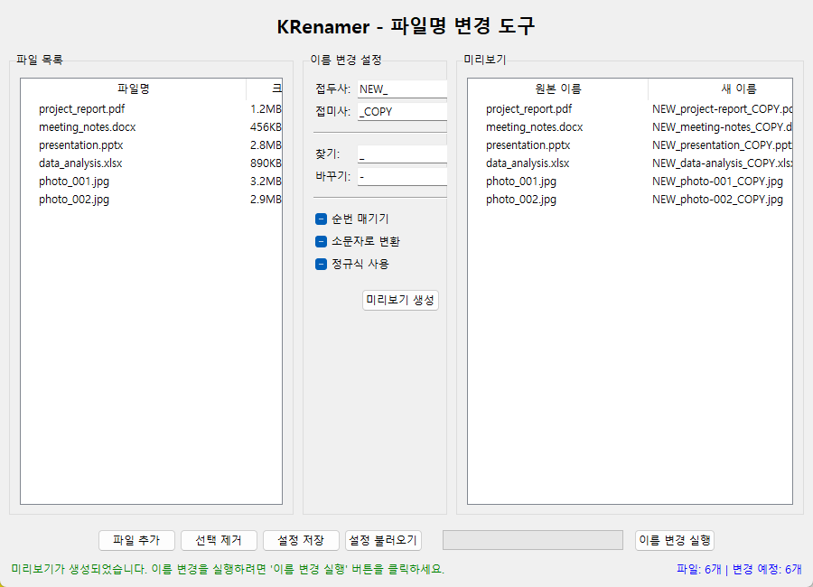

# Chapter 5: 파일명 변경 로직

이번 챕터에서는 실제로 파일명을 변경하는 핵심 로직을 구현합니다. 

지금까지 우리는 파일을 드래그 앤 드롭으로 받고, 목록으로 표시하는 기본적인 GUI를 만들었습니다. 이제 정말 중요한 부분인 **파일명을 실제로 바꾸는 기능**<!-- -->을 단계별로 차근차근 만들어보겠습니다.

## 🎯 이번 챕터에서 만들 것들

- **Step 1**: 간단한 접두사/접미사 추가하기
- **Step 2**: 찾기/바꾸기 기능 만들기  
- **Step 3**: 순번 매기기 기능 추가하기
- **Step 4**: 미리보기로 안전하게 확인하기
- **Step 5**: 실제 파일명 변경 실행하기

## 🛠️ 프로젝트 구조 이해하기

파일명을 바꾸는 프로그램을 만들 때는 **GUI(화면)**<!-- -->와 **로직(실제 처리)**<!-- -->을 분리해서 만드는 것이 좋습니다.

왜냐하면:
- **GUI**<!-- -->는 사용자가 보는 부분 (버튼, 입력창 등)
- **엔진**<!-- -->은 실제 파일명을 바꾸는 부분
- 이렇게 나누면 나중에 수정하기도 쉽고, 문제가 생겼을 때 찾기도 쉽습니다

### 우리가 만들 파일들

```
src/krenamer-ch5/
├── main.py              # GUI 화면
└── rename_engine.py     # 파일명 변경 로직
```

- `main.py`: 사용자가 보는 화면 (지금까지 만든 것과 비슷)
- `rename_engine.py`: 파일명을 실제로 바꾸는 기능 (새로 만들 예정)

## Step 1: 기본 엔진 클래스 만들기

먼저 파일명을 바꾸는 **엔진(Engine)**<!-- -->을 만들어보겠습니다. 엔진은 자동차의 엔진처럼 **실제 일을 하는 부분**이라고 생각하면 됩니다.

### 엔진이 해야 할 일들

1. 파일 목록을 저장하기
2. 사용자가 설정한 옵션들을 기억하기
3. 파일명을 어떻게 바꿀지 계산하기
4. 실제로 파일명을 바꾸기

### 엔진 클래스의 기본 구조 만들기

새 파일을 만들어보겠습니다: `src/krenamer-ch5/rename_engine.py`

```python title="src/krenamer-ch5/rename_engine.py"
import os

class RenameEngine:
    """파일명을 바꾸는 엔진"""
    
    def __init__(self):
        # 파일 목록을 저장할 리스트
        self.files = []
```

이게 가장 기본입니다. `self.files`는 파이썬의 **리스트**인데, 여기에 파일 경로들을 저장할 예정입니다.

### 파일 추가/제거 기능 만들기

이제 파일을 추가하고 제거하는 기능을 만들어보겠습니다:

```python
def add_file(self, file_path: str) -> bool:
    """파일을 목록에 추가"""
    # 실제 파일이 있는지 확인하고, 이미 목록에 없으면 추가
    if os.path.isfile(file_path) and file_path not in self.files:
        self.files.append(file_path)
        return True  # 성공
    return False  # 실패

def remove_file(self, file_path: str) -> bool:
    """파일을 목록에서 제거"""
    if file_path in self.files:
        self.files.remove(file_path)
        return True  # 성공
    return False  # 실패

def clear_files(self):
    """모든 파일 제거"""
    self.files.clear()
```

### 설정 옵션들 추가하기

사용자가 설정할 수 있는 옵션들을 엔진에 추가해보겠습니다:

```python
def __init__(self):
    # 파일 목록
    self.files = []
    
    # 기본 설정들
    self.prefix = ""      # 앞에 붙일 글자
    self.suffix = ""      # 뒤에 붙일 글자
    self.find_text = ""   # 찾을 글자
    self.replace_text = "" # 바꿀 글자
```

지금까지 만든 코드를 모두 합치면:

```python title="src/krenamer-ch5/rename_engine.py (전체 코드)"
import os

class RenameEngine:
    """파일명을 바꾸는 엔진"""
    
    def __init__(self):
        # 파일 목록을 저장할 리스트
        self.files = []
        
        # 기본 설정들
        self.prefix = ""      # 앞에 붙일 글자
        self.suffix = ""      # 뒤에 붙일 글자
        self.find_text = ""   # 찾을 글자
        self.replace_text = "" # 바꿀 글자
    
    def add_file(self, file_path: str) -> bool:
        """파일을 목록에 추가"""
        if os.path.isfile(file_path) and file_path not in self.files:
            self.files.append(file_path)
            return True
        return False
    
    def remove_file(self, file_path: str) -> bool:
        """파일을 목록에서 제거"""
        if file_path in self.files:
            self.files.remove(file_path)
            return True
        return False
    
    def clear_files(self):
        """모든 파일 제거"""
        self.files.clear()
```

기본 엔진이 완성됐습니다! 이제 실제로 파일명을 바꾸는 기능을 만들어보겠습니다.

## Step 2: 간단한 파일명 변경 로직 만들기

파일명을 바꾸는 가장 간단한 방법부터 시작해보겠습니다. **접두사**(앞에 붙일 글자)와 **접미사**(뒤에 붙일 글자)를 추가하는 기능입니다.

### 파일명을 분석하는 방법

파일명은 보통 두 부분으로 나눌 수 있습니다:
- **이름**: `document`
- **확장자**: `.txt`

파이썬에서는 `os.path.splitext()`를 사용해서 쉽게 나눌 수 있습니다:

```python
import os

filename = "document.txt"
name, ext = os.path.splitext(filename)
print(f"이름: {name}, 확장자: {ext}")
# 결과: 이름: document, 확장자: .txt
```

### 새로운 파일명 만들기

이제 새로운 파일명을 만드는 함수를 추가해보겠습니다:

```python
def generate_new_name(self, original_filename):
    """하나의 파일명을 새로운 이름으로 변경"""
    # 파일명을 이름과 확장자로 분리
    name, ext = os.path.splitext(original_filename)
    
    # 접두사와 접미사를 추가해서 새 이름 만들기
    new_name = f"{self.prefix}{name}{self.suffix}{ext}"
    
    return new_name
```

이 함수가 하는 일:
1. `original_filename`을 이름과 확장자로 나눔
2. `prefix + 원래이름 + suffix + 확장자` 형태로 새 이름 만들기

### 예시로 이해해보기

```python
# 예시
engine = RenameEngine()
engine.prefix = "새_"      # 앞에 "새_" 붙이기
engine.suffix = "_복사본"   # 뒤에 "_복사본" 붙이기

# "document.txt" → "새_document_복사본.txt"
new_name = engine.generate_new_name("document.txt")
print(new_name)  # 새_document_복사본.txt
```

### 찾기/바꾸기 기능 추가하기

이제 조금 더 고급 기능인 **찾기/바꾸기**<!-- -->를 추가해보겠습니다:

```python
def generate_new_name(self, original_filename):
    """하나의 파일명을 새로운 이름으로 변경"""
    name, ext = os.path.splitext(original_filename)
    
    # 1단계: 찾기/바꾸기 적용
    if self.find_text:  # 찾을 글자가 있으면
        name = name.replace(self.find_text, self.replace_text)
    
    # 2단계: 접두사/접미사 추가
    new_name = f"{self.prefix}{name}{self.suffix}{ext}"
    
    return new_name
```

이제 더 다양한 변경이 가능합니다:

```python
# 예시
engine = RenameEngine()
engine.find_text = "old"        # "old"를 찾아서
engine.replace_text = "new"     # "new"로 바꾸기
engine.prefix = "[수정]"        # 앞에 "[수정]" 붙이기

# "old_document.txt" → "[수정]new_document.txt"
new_name = engine.generate_new_name("old_document.txt")
```

## Step 3: 미리보기 기능 만들기

파일명을 실제로 바꾸기 전에 **미리보기**<!-- -->를 보여주는 것이 중요합니다. 사용자가 실수로 잘못된 설정을 했을 때 파일이 망가지는 것을 방지할 수 있습니다.

### 미리보기가 보여줄 정보

- **원본 파일명**: 현재 파일명
- **새 파일명**: 바뀔 파일명
- **상태**: 변경 가능한지 여부

### 미리보기 생성 함수 만들기

```python
def generate_preview(self):
    """모든 파일의 미리보기를 생성"""
    preview_list = []
    
    for file_path in self.files:
        # 파일 경로에서 파일명만 추출
        original_name = os.path.basename(file_path)
        
        # 새로운 이름 생성
        new_name = self.generate_new_name(original_name)
        
        # 나중에 유효성 검사 추가 예정
        is_valid = True
        
        preview_list.append((original_name, new_name, is_valid))
    
    return preview_list
```

이 함수가 하는 일:
1. 엔진에 저장된 모든 파일을 하나씩 확인
2. 각 파일의 새로운 이름을 계산
3. (원본명, 새이름, 유효성) 튜플로 결과 저장

### 간단한 테스트 해보기

지금까지 만든 코드를 테스트해보겠습니다:

```python
# 테스트 코드
engine = RenameEngine()
engine.add_file("test1.txt")
engine.add_file("test2.jpg")

engine.prefix = "새_"
engine.find_text = "test"
engine.replace_text = "파일"

preview = engine.generate_preview()
for original, new, valid in preview:
    print(f"{original} → {new}")

# 결과:
# test1.txt → 새_파일1.txt
# test2.jpg → 새_파일2.jpg
```

## Step 4: 파일명 안전성 검사하기

파일명을 바꿀 때는 **안전성 검사**<!-- -->가 중요합니다. 왜냐하면:

- 윈도우에서는 사용할 수 없는 문자들이 있음 (`<>:"/\|?*`)
- 너무 긴 파일명은 문제가 됨
- 이미 같은 이름의 파일이 있으면 덮어써짐

### 파일명 유효성 검사 함수 만들기

```python
def is_valid_filename(self, filename, original_path):
    """파일명이 유효한지 검사"""
    
    # 1. 빈 파일명 검사
    if not filename.strip():
        return False
    
    # 2. 금지된 문자 검사 (윈도우 기준)
    forbidden_chars = '<>:"/\\|?*'
    for char in forbidden_chars:
        if char in filename:
            return False
    
    # 3. 길이 검사 (255자 제한)
    if len(filename) > 255:
        return False
    
    # 4. 중복 파일명 검사
    directory = os.path.dirname(original_path)
    new_path = os.path.join(directory, filename)
    if os.path.exists(new_path) and new_path != original_path:
        return False
    
    return True  # 모든 검사를 통과하면 유효함
```

### 미리보기에 안전성 검사 적용하기

이제 미리보기 함수를 업데이트해서 안전성 검사를 포함시켜보겠습니다:

```python
def generate_preview(self):
    """모든 파일의 미리보기를 생성 (안전성 검사 포함)"""
    preview_list = []
    
    for file_path in self.files:
        original_name = os.path.basename(file_path)
        new_name = self.generate_new_name(original_name)
        
        # 안전성 검사 추가
        is_valid = self.is_valid_filename(new_name, file_path)
        
        preview_list.append((original_name, new_name, is_valid))
    
    return preview_list
```

이제 미리보기에서 **안전하지 않은 파일명**<!-- -->을 미리 확인할 수 있습니다!

## Step 5: 실제 파일명 변경 실행하기

드디어 실제로 파일명을 바꾸는 기능을 만들어보겠습니다. 이 부분이 가장 조심스러운 부분입니다.

### 파일명 변경 실행 함수

```python
def execute_rename(self):
    """실제로 파일명을 변경"""
    results = {
        'success': 0,    # 성공한 파일 수
        'failed': 0,     # 실패한 파일 수
        'errors': []     # 오류 메시지들
    }
    
    # 먼저 미리보기로 계획 세우기
    preview = self.generate_preview()
    
    for i, (original_name, new_name, is_valid) in enumerate(preview):
        if not is_valid:
            # 유효하지 않은 파일명은 건너뛰기
            results['failed'] += 1
            results['errors'].append(f"{original_name}: 유효하지 않은 파일명")
            continue
        
        # 실제 파일 경로들
        original_path = self.files[i]
        directory = os.path.dirname(original_path)
        new_path = os.path.join(directory, new_name)
        
        try:
            # 파일명이 실제로 바뀌는 경우만 처리
            if original_path != new_path:
                os.rename(original_path, new_path)
                # 성공시 내부 목록도 업데이트
                self.files[i] = new_path
            
            results['success'] += 1
            
        except Exception as e:
            # 오류 발생시 기록
            results['failed'] += 1
            results['errors'].append(f"{original_name}: {str(e)}")
    
    return results
```

### 안전한 실행을 위한 주의사항

1. **미리보기 먼저**: 항상 미리보기로 확인 후 실행
2. **유효성 검사**: 안전하지 않은 파일은 건너뛰기
3. **오류 처리**: 실패한 경우 사용자에게 알려주기
4. **목록 업데이트**: 성공한 경우 내부 파일 목록도 업데이트

## 완성된 RenameEngine 전체 코드

지금까지 만든 모든 기능을 합친 완전한 코드입니다:

```python title="src/krenamer-ch5/rename_engine.py (완성본)"
import os

class RenameEngine:
    """파일명을 바꾸는 엔진"""
    
    def __init__(self):
        self.files = []
        self.prefix = ""
        self.suffix = ""
        self.find_text = ""
        self.replace_text = ""
    
    def add_file(self, file_path: str) -> bool:
        if os.path.isfile(file_path) and file_path not in self.files:
            self.files.append(file_path)
            return True
        return False
    
    def clear_files(self):
        self.files.clear()
    
    def generate_new_name(self, original_filename):
        name, ext = os.path.splitext(original_filename)
        
        # 찾기/바꾸기 적용
        if self.find_text:
            name = name.replace(self.find_text, self.replace_text)
        
        # 접두사/접미사 추가
        new_name = f"{self.prefix}{name}{self.suffix}{ext}"
        return new_name
    
    def is_valid_filename(self, filename, original_path):
        if not filename.strip():
            return False
        
        forbidden_chars = '<>:"/\\|?*'
        for char in forbidden_chars:
            if char in filename:
                return False
        
        if len(filename) > 255:
            return False
        
        directory = os.path.dirname(original_path)
        new_path = os.path.join(directory, filename)
        if os.path.exists(new_path) and new_path != original_path:
            return False
        
        return True
    
    def generate_preview(self):
        preview_list = []
        for file_path in self.files:
            original_name = os.path.basename(file_path)
            new_name = self.generate_new_name(original_name)
            is_valid = self.is_valid_filename(new_name, file_path)
            preview_list.append((original_name, new_name, is_valid))
        return preview_list
    
    def execute_rename(self):
        results = {'success': 0, 'failed': 0, 'errors': []}
        preview = self.generate_preview()
        
        for i, (original_name, new_name, is_valid) in enumerate(preview):
            if not is_valid:
                results['failed'] += 1
                results['errors'].append(f"{original_name}: 유효하지 않은 파일명")
                continue
            
            original_path = self.files[i]
            directory = os.path.dirname(original_path)
            new_path = os.path.join(directory, new_name)
            
            try:
                if original_path != new_path:
                    os.rename(original_path, new_path)
                    self.files[i] = new_path
                results['success'] += 1
            except Exception as e:
                results['failed'] += 1
                results['errors'].append(f"{original_name}: {str(e)}")
        
        return results
```

## GUI에서 엔진 사용하기

이제 만든 엔진을 GUI에서 사용해보겠습니다. 기존의 GUI에 몇 가지 요소만 추가하면 됩니다.

### 1. GUI에 엔진 연결하기

```python title="src/krenamer-ch5/main.py"
import tkinter as tk
from tkinter import ttk, messagebox
from rename_engine import RenameEngine

class RenamerGUI:
    def __init__(self):
        self.root = tk.Tk()
        self.engine = RenameEngine()  # 엔진 생성
        self.setup_window()
        self.setup_widgets()
    
    def setup_window(self):
        self.root.title("KRenamer - Chapter 5")
        self.root.geometry("800x600")
```

### 2. 옵션 입력 UI 만들기

사용자가 설정을 입력할 수 있는 간단한 UI를 만들어보겠습니다:

```python
def setup_widgets(self):
    # 옵션 입력 영역
    options_frame = ttk.LabelFrame(self.root, text="리네임 옵션", padding="10")
    options_frame.pack(fill=tk.X, padx=10, pady=5)
    
    # 접두사 입력
    ttk.Label(options_frame, text="접두사:").grid(row=0, column=0, sticky="w")
    self.prefix_var = tk.StringVar()
    self.prefix_var.trace_add('write', self.on_option_change)
    ttk.Entry(options_frame, textvariable=self.prefix_var).grid(row=0, column=1, sticky="ew", padx=5)
    
    # 접미사 입력
    ttk.Label(options_frame, text="접미사:").grid(row=0, column=2, sticky="w")
    self.suffix_var = tk.StringVar()
    self.suffix_var.trace_add('write', self.on_option_change)
    ttk.Entry(options_frame, textvariable=self.suffix_var).grid(row=0, column=3, sticky="ew", padx=5)
    
    # 찾기/바꾸기
    ttk.Label(options_frame, text="찾기:").grid(row=1, column=0, sticky="w")
    self.find_var = tk.StringVar()
    self.find_var.trace_add('write', self.on_option_change)
    ttk.Entry(options_frame, textvariable=self.find_var).grid(row=1, column=1, sticky="ew", padx=5)
    
    ttk.Label(options_frame, text="바꾸기:").grid(row=1, column=2, sticky="w")
    self.replace_var = tk.StringVar()
    self.replace_var.trace_add('write', self.on_option_change)
    ttk.Entry(options_frame, textvariable=self.replace_var).grid(row=1, column=3, sticky="ew", padx=5)
    
    options_frame.columnconfigure(1, weight=1)
    options_frame.columnconfigure(3, weight=1)
```

### 3. 미리보기 테이블 만들기

```python
def setup_preview_table(self):
    # 미리보기 영역
    preview_frame = ttk.LabelFrame(self.root, text="미리보기", padding="10")
    preview_frame.pack(fill=tk.BOTH, expand=True, padx=10, pady=5)
    
    # 테이블 생성
    columns = ("원본", "새이름", "상태")
    self.tree = ttk.Treeview(preview_frame, columns=columns, show="headings")
    
    for col in columns:
        self.tree.heading(col, text=col)
        self.tree.column(col, width=200)
    
    # 스크롤바
    scrollbar = ttk.Scrollbar(preview_frame, orient=tk.VERTICAL, command=self.tree.yview)
    self.tree.configure(yscrollcommand=scrollbar.set)
    
    self.tree.pack(side=tk.LEFT, fill=tk.BOTH, expand=True)
    scrollbar.pack(side=tk.RIGHT, fill=tk.Y)
```

### 4. 이벤트 처리 함수들

```python
def on_option_change(self, *args):
    """옵션이 변경되면 엔진 설정 업데이트 및 미리보기 갱신"""
    self.update_engine_settings()
    self.update_preview()

def update_engine_settings(self):
    """GUI 설정을 엔진에 반영"""
    self.engine.prefix = self.prefix_var.get()
    self.engine.suffix = self.suffix_var.get()
    self.engine.find_text = self.find_var.get()
    self.engine.replace_text = self.replace_var.get()

def update_preview(self):
    """미리보기 테이블 업데이트"""
    # 기존 항목 제거
    for item in self.tree.get_children():
        self.tree.delete(item)
    
    # 새 미리보기 생성
    preview = self.engine.generate_preview()
    for original, new, is_valid in preview:
        status = "유효" if is_valid else "오류"
        self.tree.insert("", tk.END, values=(original, new, status))

def execute_rename(self):
    """파일명 변경 실행"""
    if not self.engine.files:
        messagebox.showwarning("경고", "변경할 파일이 없습니다.")
        return
    
    # 확인 대화상자
    result = messagebox.askyesno("확인", "파일명을 변경하시겠습니까?")
    if not result:
        return
    
    # 실행
    results = self.engine.execute_rename()
    
    # 결과 표시
    message = f"성공: {results['success']}개, 실패: {results['failed']}개"
    if results['errors']:
        message += f"\n오류: {results['errors'][0]}"  # 첫 번째 오류만 표시
    
    messagebox.showinfo("완료", message)
    self.update_preview()  # 결과 반영
```

### 5. 실행 버튼 추가

```python
def setup_buttons(self):
    # 버튼 영역
    button_frame = ttk.Frame(self.root)
    button_frame.pack(fill=tk.X, padx=10, pady=10)
    
    ttk.Button(button_frame, text="미리보기 새로고침", 
               command=self.update_preview).pack(side=tk.LEFT, padx=(0, 10))
    
    ttk.Button(button_frame, text="파일명 변경 실행", 
               command=self.execute_rename).pack(side=tk.LEFT)
```

## 🎯 실행 해보기

완성된 프로그램을 실행해보면:

1. **파일 드래그 앤 드롭**: 이전 챕터의 기능
2. **옵션 설정**: 접두사, 접미사, 찾기/바꾸기 입력
3. **실시간 미리보기**: 설정 변경시 즉시 결과 확인
4. **안전한 실행**: 유효성 검사 후 파일명 변경



## 📚 이번 챕터에서 배운 것들

### 핵심 개념들

1. **관심사 분리**: GUI와 로직을 분리해서 관리하기 쉽게 만들기
2. **안전한 파일 처리**: 미리보기 → 유효성 검사 → 실행 순서
3. **사용자 친화적 인터페이스**: 실시간 미리보기와 명확한 피드백

### 파일명 변경의 기본 패턴

```python
# 1. 파일명 분리
name, ext = os.path.splitext(filename)

# 2. 변환 적용
new_name = apply_transformations(name)

# 3. 확장자와 재결합
result = new_name + ext
```

### 안전성 검사의 중요성

- **금지 문자 확인**: 운영체제별 제한사항 고려
- **중복 파일명 방지**: 기존 파일 덮어쓰기 방지
- **사용자 확인**: 실행 전 반드시 확인 받기

## 🎯 다음 단계 예고

다음 [Chapter 6](chapter6.md)에서는 더 고급 기능들을 추가해보겠습니다:

- **순번 매기기**: 001, 002, 003... 형태의 자동 순번
- **날짜/시간 패턴**: 파일 생성일시 기반 이름 변경
- **정규표현식**: 복잡한 패턴 매칭과 치환
- **설정 저장**: 자주 사용하는 설정을 저장하고 불러오기

---

!!! success "Chapter 5 완료!"
    파일명 변경의 핵심 로직을 성공적으로 구현했습니다! 
    이제 실제로 파일명을 안전하게 바꿀 수 있는 도구가 완성되었습니다.

!!! tip "연습 과제"
    - 대소문자 변환 기능 추가하기 (upper, lower, title)
    - 실행 취소(Undo) 기능 만들어보기
    - 파일 확장자 변경 기능 추가하기
