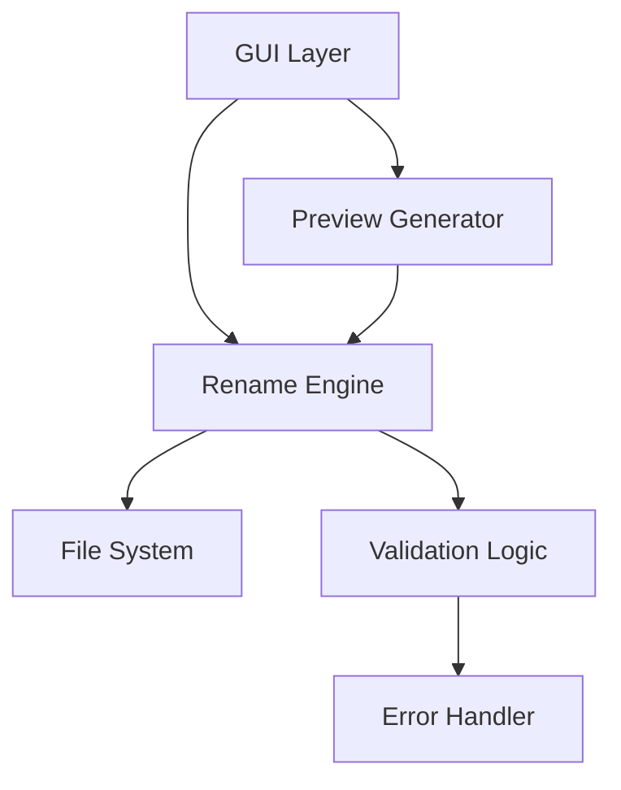

# Chapter 5: 파일명 변경 로직

이번 챕터에서는 실제로 파일명을 변경하는 핵심 로직을 구현합니다. 다양한 리네임 방식을 지원하고, 미리보기 기능을 통해 안전하고 사용자 친화적인 파일명 변경 도구를 완성해보겠습니다.

## 🎯 학습 목표

- **다양한 리네임 방식** 구현 (접두사, 접미사, 순번, 찾기/바꾸기)
- **실시간 미리보기** 기능 구현
- **안전한 파일 시스템 조작** 방법 학습
- **에러 처리**와 **롤백 기능** 구현
- **정규표현식**을 활용한 고급 패턴 매칭

## 🛠️ 핵심 아키텍처

### 분리된 로직 설계



!!! note "관심사 분리"
    - **GUI**: 사용자 인터페이스만 담당
    - **Engine**: 리네임 로직과 파일 처리
    - **Validator**: 안전성 검증
    - **Preview**: 변경 결과 미리보기

## 💻 파일명 변경 엔진

### 1. RenameEngine 클래스 설계

```python linenums="1" title="src/krenamer-ch3/rename_engine.py"
#!/usr/bin/env python3
"""
파일명 변경 엔진
다양한 리네임 방식과 안전한 파일 처리를 담당
"""

import os
import re
from pathlib import Path
from typing import List, Tuple, Dict, Optional

class RenameEngine:
    """파일명 변경 엔진"""
    
    def __init__(self):
        self.files = []  # 파일 경로 목록
        
        # 리네임 옵션
        self.prefix = ""
        self.suffix = ""
        self.find_text = ""
        self.replace_text = ""
        self.use_regex = False
        
        # 순번 매기기 옵션
        self.numbering_enabled = False
        self.numbering_start = 1
        self.numbering_digits = 3
        self.numbering_position = "prefix"  # "prefix" or "suffix"
        
        # 대소문자 변환
        self.case_change = "none"  # "none", "upper", "lower", "title"
    
    def add_file(self, file_path: str) -> bool:
        """파일을 목록에 추가"""
        if os.path.isfile(file_path) and file_path not in self.files:
            self.files.append(file_path)
            return True
        return False
    
    def remove_file(self, file_path: str) -> bool:
        """파일을 목록에서 제거"""
        if file_path in self.files:
            self.files.remove(file_path)
            return True
        return False
    
    def clear_files(self):
        """모든 파일 제거"""
        self.files.clear()
```

### 2. 미리보기 생성 로직

```python linenums="45"
def generate_preview(self) -> List[Tuple[str, str, bool]]:
    """
    현재 설정으로 리네임 미리보기 생성
    
    Returns:
        List[Tuple[str, str, bool]]: (원본명, 새이름, 유효성) 목록
    """
    preview_list = []
    
    for i, file_path in enumerate(self.files):
        original_name = os.path.basename(file_path)
        new_name = self._generate_new_name(original_name, i)
        is_valid = self._validate_filename(new_name, file_path)
        
        preview_list.append((original_name, new_name, is_valid))
    
    return preview_list

def _generate_new_name(self, original_name: str, index: int) -> str:
    """개별 파일의 새 이름 생성"""
    name, ext = os.path.splitext(original_name)
    
    # 1. 찾기/바꾸기 적용
    if self.find_text:
        if self.use_regex:
            try:
                name = re.sub(self.find_text, self.replace_text, name)
            except re.error:
                pass  # 정규표현식 오류 시 무시
        else:
            name = name.replace(self.find_text, self.replace_text)
    
    # 2. 대소문자 변환
    if self.case_change == "upper":
        name = name.upper()
    elif self.case_change == "lower":
        name = name.lower()
    elif self.case_change == "title":
        name = name.title()
    
    # 3. 순번 매기기
    if self.numbering_enabled:
        number_str = f"{self.numbering_start + index:0{self.numbering_digits}d}"
        if self.numbering_position == "prefix":
            name = f"{number_str}_{name}"
        else:
            name = f"{name}_{number_str}"
    
    # 4. 접두사/접미사 추가
    name = f"{self.prefix}{name}{self.suffix}"
    
    return f"{name}{ext}"
```

### 3. 파일명 유효성 검증

```python linenums="88"
def _validate_filename(self, filename: str, original_path: str) -> bool:
    """파일명 유효성 검증"""
    # 1. 빈 파일명 검사
    if not filename.strip():
        return False
    
    # 2. 금지된 문자 검사 (Windows 기준)
    forbidden_chars = '<>:"/\\|?*'
    if any(char in filename for char in forbidden_chars):
        return False
    
    # 3. 예약된 이름 검사
    reserved_names = {
        'CON', 'PRN', 'AUX', 'NUL',
        'COM1', 'COM2', 'COM3', 'COM4', 'COM5', 'COM6', 'COM7', 'COM8', 'COM9',
        'LPT1', 'LPT2', 'LPT3', 'LPT4', 'LPT5', 'LPT6', 'LPT7', 'LPT8', 'LPT9'
    }
    name_without_ext = os.path.splitext(filename)[0].upper()
    if name_without_ext in reserved_names:
        return False
    
    # 4. 길이 검사
    if len(filename) > 255:
        return False
    
    # 5. 중복 파일명 검사
    directory = os.path.dirname(original_path)
    new_path = os.path.join(directory, filename)
    if os.path.exists(new_path) and new_path != original_path:
        return False
    
    return True
```

### 4. 실제 파일명 변경 실행

```python linenums="119"
def execute_rename(self) -> Dict[str, any]:
    """파일명 변경 실행"""
    results = {
        'success': 0,
        'failed': 0,
        'errors': [],
        'renamed_files': []  # 롤백용
    }
    
    preview = self.generate_preview()
    
    for i, (original_name, new_name, is_valid) in enumerate(preview):
        if not is_valid:
            results['failed'] += 1
            results['errors'].append(f"{original_name}: 유효하지 않은 파일명")
            continue
        
        original_path = self.files[i]
        directory = os.path.dirname(original_path)
        new_path = os.path.join(directory, new_name)
        
        try:
            # 파일명이 실제로 변경되는 경우만 처리
            if original_path != new_path:
                os.rename(original_path, new_path)
                results['renamed_files'].append((original_path, new_path))
                
                # 내부 파일 목록도 업데이트
                self.files[i] = new_path
            
            results['success'] += 1
            
        except OSError as e:
            results['failed'] += 1
            results['errors'].append(f"{original_name}: {str(e)}")
    
    return results

def rollback_rename(self, renamed_files: List[Tuple[str, str]]) -> Dict[str, any]:
    """파일명 변경 롤백"""
    results = {
        'success': 0,
        'failed': 0,
        'errors': []
    }
    
    # 역순으로 롤백
    for new_path, original_path in reversed(renamed_files):
        try:
            if os.path.exists(new_path):
                os.rename(new_path, original_path)
                results['success'] += 1
        except OSError as e:
            results['failed'] += 1
            results['errors'].append(f"롤백 실패 {new_path}: {str(e)}")
    
    return results
```

## 🖥️ GUI 통합

### 1. 메인 GUI 클래스 확장

```python linenums="1" title="src/krenamer-ch3/main.py"
#!/usr/bin/env python3
"""
Chapter 5: 파일명 변경 로직 구현
실제 파일명 변경과 미리보기 기능이 추가된 GUI
"""

import tkinter as tk
from tkinter import ttk, messagebox
import os
from pathlib import Path

try:
    from tkinterdnd2 import DND_FILES, TkinterDnD
    DND_AVAILABLE = True
except ImportError:
    DND_AVAILABLE = False

from rename_engine import RenameEngine

class RenamerGUI:
    def __init__(self):
        if DND_AVAILABLE:
            self.root = TkinterDnD.Tk()
        else:
            self.root = tk.Tk()
        
        self.engine = RenameEngine()
        self.setup_window()
        self.setup_widgets()
        self.setup_drag_drop()
        self.update_preview()
    
    def setup_window(self):
        self.root.title("KRenamer - Chapter 3")
        self.root.geometry("800x700")
        self.root.minsize(600, 500)
```

### 2. 리네임 옵션 UI

```python linenums="35"
def setup_rename_options(self, parent):
    """리네임 옵션 UI 설정"""
    options_frame = ttk.LabelFrame(parent, text="리네임 옵션", padding="10")
    options_frame.pack(fill=tk.X, padx=10, pady=5)
    
    # 접두사/접미사
    prefix_frame = ttk.Frame(options_frame)
    prefix_frame.pack(fill=tk.X, pady=2)
    
    ttk.Label(prefix_frame, text="접두사:", width=10).pack(side=tk.LEFT)
    self.prefix_var = tk.StringVar()
    self.prefix_var.trace_add('write', self.on_option_change)
    prefix_entry = ttk.Entry(prefix_frame, textvariable=self.prefix_var)
    prefix_entry.pack(side=tk.LEFT, fill=tk.X, expand=True, padx=(5, 10))
    
    ttk.Label(prefix_frame, text="접미사:", width=10).pack(side=tk.LEFT)
    self.suffix_var = tk.StringVar()
    self.suffix_var.trace_add('write', self.on_option_change)
    suffix_entry = ttk.Entry(prefix_frame, textvariable=self.suffix_var)
    suffix_entry.pack(side=tk.LEFT, fill=tk.X, expand=True, padx=5)
    
    # 찾기/바꾸기
    find_frame = ttk.Frame(options_frame)
    find_frame.pack(fill=tk.X, pady=2)
    
    ttk.Label(find_frame, text="찾기:", width=10).pack(side=tk.LEFT)
    self.find_var = tk.StringVar()
    self.find_var.trace_add('write', self.on_option_change)
    find_entry = ttk.Entry(find_frame, textvariable=self.find_var)
    find_entry.pack(side=tk.LEFT, fill=tk.X, expand=True, padx=(5, 10))
    
    ttk.Label(find_frame, text="바꾸기:", width=10).pack(side=tk.LEFT)
    self.replace_var = tk.StringVar()
    self.replace_var.trace_add('write', self.on_option_change)
    replace_entry = ttk.Entry(find_frame, textvariable=self.replace_var)
    replace_entry.pack(side=tk.LEFT, fill=tk.X, expand=True, padx=5)
    
    # 정규표현식 체크박스
    regex_frame = ttk.Frame(options_frame)
    regex_frame.pack(fill=tk.X, pady=2)
    
    self.regex_var = tk.BooleanVar()
    self.regex_var.trace_add('write', self.on_option_change)
    regex_check = ttk.Checkbutton(
        regex_frame, 
        text="정규표현식 사용", 
        variable=self.regex_var
    )
    regex_check.pack(side=tk.LEFT)
```

### 3. 순번 매기기 옵션

```python linenums="78"
    # 순번 매기기
    numbering_frame = ttk.Frame(options_frame)
    numbering_frame.pack(fill=tk.X, pady=2)
    
    self.numbering_var = tk.BooleanVar()
    self.numbering_var.trace_add('write', self.on_option_change)
    numbering_check = ttk.Checkbutton(
        numbering_frame, 
        text="순번 매기기", 
        variable=self.numbering_var
    )
    numbering_check.pack(side=tk.LEFT)
    
    ttk.Label(numbering_frame, text="시작:", width=8).pack(side=tk.LEFT, padx=(20, 0))
    self.start_var = tk.StringVar(value="1")
    self.start_var.trace_add('write', self.on_option_change)
    start_spin = ttk.Spinbox(numbering_frame, from_=1, to=9999, width=6, textvariable=self.start_var)
    start_spin.pack(side=tk.LEFT, padx=5)
    
    ttk.Label(numbering_frame, text="자릿수:", width=8).pack(side=tk.LEFT)
    self.digits_var = tk.StringVar(value="3")
    self.digits_var.trace_add('write', self.on_option_change)
    digits_spin = ttk.Spinbox(numbering_frame, from_=1, to=10, width=6, textvariable=self.digits_var)
    digits_spin.pack(side=tk.LEFT, padx=5)
    
    ttk.Label(numbering_frame, text="위치:").pack(side=tk.LEFT, padx=(10, 0))
    self.position_var = tk.StringVar(value="prefix")
    self.position_var.trace_add('write', self.on_option_change)
    position_combo = ttk.Combobox(
        numbering_frame, 
        textvariable=self.position_var,
        values=["prefix", "suffix"],
        state="readonly",
        width=8
    )
    position_combo.pack(side=tk.LEFT, padx=5)
    
    # 대소문자 변환
    case_frame = ttk.Frame(options_frame)
    case_frame.pack(fill=tk.X, pady=2)
    
    ttk.Label(case_frame, text="대소문자:", width=10).pack(side=tk.LEFT)
    self.case_var = tk.StringVar(value="none")
    self.case_var.trace_add('write', self.on_option_change)
    case_combo = ttk.Combobox(
        case_frame,
        textvariable=self.case_var,
        values=["none", "upper", "lower", "title"],
        state="readonly",
        width=10
    )
    case_combo.pack(side=tk.LEFT, padx=5)
```

### 4. 미리보기 테이블

```python linenums="125"
def setup_preview_table(self, parent):
    """미리보기 테이블 설정"""
    preview_frame = ttk.LabelFrame(parent, text="미리보기", padding="10")
    preview_frame.pack(fill=tk.BOTH, expand=True, padx=10, pady=5)
    
    # 테이블 생성
    columns = ("원본 파일명", "새 파일명", "상태")
    self.preview_tree = ttk.Treeview(preview_frame, columns=columns, show="headings", height=12)
    
    # 컬럼 설정
    self.preview_tree.heading("원본 파일명", text="원본 파일명")
    self.preview_tree.heading("새 파일명", text="새 파일명")
    self.preview_tree.heading("상태", text="상태")
    
    self.preview_tree.column("원본 파일명", width=250)
    self.preview_tree.column("새 파일명", width=250)
    self.preview_tree.column("상태", width=100)
    
    # 스크롤바
    preview_scroll = ttk.Scrollbar(preview_frame, orient=tk.VERTICAL, command=self.preview_tree.yview)
    self.preview_tree.configure(yscrollcommand=preview_scroll.set)
    
    self.preview_tree.pack(side=tk.LEFT, fill=tk.BOTH, expand=True)
    preview_scroll.pack(side=tk.RIGHT, fill=tk.Y)
    
    # 상태별 색상 태그 설정
    self.preview_tree.tag_configure('valid', foreground='green')
    self.preview_tree.tag_configure('invalid', foreground='red')
    self.preview_tree.tag_configure('unchanged', foreground='gray')
```

### 5. 실행 버튼과 이벤트 처리

```python linenums="155"
def setup_action_buttons(self, parent):
    """실행 버튼 설정"""
    button_frame = ttk.Frame(parent)
    button_frame.pack(fill=tk.X, padx=10, pady=10)
    
    # 미리보기 새로고침 버튼
    refresh_btn = ttk.Button(
        button_frame, 
        text="미리보기 새로고침", 
        command=self.update_preview
    )
    refresh_btn.pack(side=tk.LEFT, padx=(0, 10))
    
    # 이름 바꾸기 실행 버튼
    execute_btn = ttk.Button(
        button_frame, 
        text="이름 바꾸기 실행", 
        command=self.execute_rename,
        style="Accent.TButton"
    )
    execute_btn.pack(side=tk.LEFT, padx=(0, 10))
    
    # 유효한 파일 개수 표시
    self.valid_count_var = tk.StringVar()
    count_label = ttk.Label(button_frame, textvariable=self.valid_count_var)
    count_label.pack(side=tk.RIGHT)

def on_option_change(self, *args):
    """옵션 변경 시 엔진 설정 업데이트 및 미리보기 갱신"""
    self.update_engine_settings()
    self.update_preview()

def update_engine_settings(self):
    """GUI 설정을 엔진에 반영"""
    self.engine.prefix = self.prefix_var.get()
    self.engine.suffix = self.suffix_var.get()
    self.engine.find_text = self.find_var.get()
    self.engine.replace_text = self.replace_var.get()
    self.engine.use_regex = self.regex_var.get()
    
    self.engine.numbering_enabled = self.numbering_var.get()
    try:
        self.engine.numbering_start = int(self.start_var.get())
        self.engine.numbering_digits = int(self.digits_var.get())
    except ValueError:
        pass  # 잘못된 숫자 입력 시 무시
    
    self.engine.numbering_position = self.position_var.get()
    self.engine.case_change = self.case_var.get()

def update_preview(self):
    """미리보기 테이블 업데이트"""
    # 기존 항목 제거
    for item in self.preview_tree.get_children():
        self.preview_tree.delete(item)
    
    # 새 미리보기 생성
    preview = self.engine.generate_preview()
    valid_count = 0
    
    for original, new, is_valid in preview:
        if original == new:
            status = "변경없음"
            tag = "unchanged"
        elif is_valid:
            status = "유효"
            tag = "valid"
            valid_count += 1
        else:
            status = "오류"
            tag = "invalid"
        
        self.preview_tree.insert("", tk.END, values=(original, new, status), tags=(tag,))
    
    # 유효한 파일 개수 표시
    total = len(preview)
    self.valid_count_var.set(f"유효한 파일: {valid_count}/{total}")

def execute_rename(self):
    """파일명 변경 실행"""
    if not self.engine.files:
        messagebox.showwarning("경고", "변경할 파일이 없습니다.")
        return
    
    # 확인 대화상자
    valid_count = len([p for p in self.engine.generate_preview() if p[2]])
    if valid_count == 0:
        messagebox.showwarning("경고", "변경 가능한 파일이 없습니다.")
        return
    
    result = messagebox.askyesno(
        "확인", 
        f"{valid_count}개 파일의 이름을 변경하시겠습니까?\n"
        "이 작업은 되돌릴 수 있습니다."
    )
    
    if not result:
        return
    
    # 실행
    results = self.engine.execute_rename()
    
    # 결과 표시
    if results['success'] > 0:
        message = f"성공: {results['success']}개 파일"
        if results['failed'] > 0:
            message += f"\n실패: {results['failed']}개 파일"
        
        # 롤백 옵션 제공
        if results['renamed_files']:
            message += "\n\n되돌리기를 원하시면 '예'를 클릭하세요."
            rollback = messagebox.askyesno("완료", message)
            
            if rollback:
                rollback_results = self.engine.rollback_rename(results['renamed_files'])
                messagebox.showinfo(
                    "롤백 완료", 
                    f"롤백 성공: {rollback_results['success']}개 파일"
                )
        else:
            messagebox.showinfo("완료", message)
    else:
        messagebox.showerror("실패", "파일명 변경에 실패했습니다.")
    
    # 오류 메시지 표시
    if results['errors']:
        error_msg = "오류 목록:\n" + "\n".join(results['errors'][:10])
        if len(results['errors']) > 10:
            error_msg += f"\n... 외 {len(results['errors']) - 10}개"
        messagebox.showerror("오류 상세", error_msg)
    
    # 미리보기 업데이트
    self.update_preview()
```

## 🧪 고급 기능 구현

### 1. 정규표현식 도우미

```python linenums="280"
def show_regex_help(self):
    """정규표현식 도움말 창"""
    help_window = tk.Toplevel(self.root)
    help_window.title("정규표현식 도움말")
    help_window.geometry("500x400")
    
    help_text = """
정규표현식 패턴 예제:

1. 날짜 패턴:
   \\d{4}-\\d{2}-\\d{2}  → 2023-12-25
   \\d{8}               → 20231225

2. 파일명 패턴:
   IMG_\\d+             → IMG_001, IMG_002
   \\w+_v\\d+\\.\\d+     → file_v1.2

3. 치환 예제:
   찾기: IMG_(\\d+)
   바꾸기: PHOTO_\\1     → IMG_001 → PHOTO_001

4. 자주 사용되는 패턴:
   \\d   숫자
   \\w   문자
   \\s   공백
   .     모든 문자
   +     1개 이상
   *     0개 이상
   ?     0개 또는 1개
   """
    
    text_widget = tk.Text(help_window, wrap=tk.WORD, padx=10, pady=10)
    text_widget.insert("1.0", help_text)
    text_widget.config(state=tk.DISABLED)
    text_widget.pack(fill=tk.BOTH, expand=True)
```

### 2. 배치 작업 처리

```python linenums="320"
def process_batch_rename(self):
    """대용량 파일 배치 처리"""
    if len(self.engine.files) > 100:
        # 진행률 대화상자 표시
        progress_window = tk.Toplevel(self.root)
        progress_window.title("처리 중...")
        progress_window.geometry("300x100")
        
        progress_var = tk.DoubleVar()
        progress_bar = ttk.Progressbar(
            progress_window, 
            variable=progress_var, 
            maximum=len(self.engine.files)
        )
        progress_bar.pack(padx=20, pady=20, fill=tk.X)
        
        status_label = ttk.Label(progress_window, text="처리 중...")
        status_label.pack()
        
        # 배치 단위로 처리
        batch_size = 50
        for i in range(0, len(self.engine.files), batch_size):
            batch_files = self.engine.files[i:i+batch_size]
            # 배치 처리 로직
            progress_var.set(i + len(batch_files))
            progress_window.update()
        
        progress_window.destroy()
```

## 🎯 실행 결과

완성된 Chapter 4 예제를 실행하면:

### 새로 추가된 기능들

1. **다양한 리네임 옵션**: 접두사, 접미사, 순번, 찾기/바꾸기, 대소문자 변환
2. **실시간 미리보기**: 설정 변경 시 즉시 결과 확인
3. **유효성 검증**: 파일명 규칙 검사 및 오류 표시
4. **안전한 실행**: 확인 대화상자와 롤백 기능
5. **정규표현식 지원**: 고급 패턴 매칭
6. **배치 처리**: 대용량 파일 처리 지원

### 미리보기 테이블 기능

- **색상 코딩**: 유효(녹색), 오류(빨강), 변경없음(회색)
- **상태 표시**: 각 파일의 처리 가능 여부 표시
- **실시간 업데이트**: 옵션 변경 시 자동 갱신

## 📚 핵심 개념 정리

### 1. 파일명 변경 패턴

```python
# 기본 패턴
name, ext = os.path.splitext(filename)
new_name = f"{prefix}{name}{suffix}{ext}"

# 순번 매기기
number = f"{start + index:0{digits}d}"
new_name = f"{number}_{name}{ext}"

# 정규표현식
new_name = re.sub(pattern, replacement, name)
```

### 2. 안전한 파일 처리

```python
try:
    os.rename(old_path, new_path)
except OSError as e:
    # 오류 처리
    log_error(f"Rename failed: {e}")
```

### 3. 미리보기 패턴

```python
def generate_preview():
    results = []
    for file_path in files:
        original = os.path.basename(file_path)
        new_name = transform_name(original)
        is_valid = validate_name(new_name)
        results.append((original, new_name, is_valid))
    return results
```

## 🎯 다음 단계 미리보기

Chapter 4에서는 핵심 리네임 기능을 구현했습니다. 다음 [Chapter 5](chapter5.md)에서는:

- **고급 조건 필터링** (파일 크기, 날짜, 확장자별)
- **사용자 설정 저장/복원** 기능
- **히스토리 관리** 및 **작업 로그**
- **플러그인 아키텍처** 기초

---

!!! success "Chapter 4 완료!"
    파일명 변경 핵심 로직과 미리보기 기능을 성공적으로 구현했습니다!
    이제 고급 기능과 사용자 편의성을 추가해보겠습니다.

!!! tip "연습 과제"
    - 커스텀 날짜 포맷 추가하기
    - 파일 확장자 변경 기능 구현하기
    - 실행 취소/다시 실행 스택 만들기
    - 템플릿 기반 파일명 생성하기