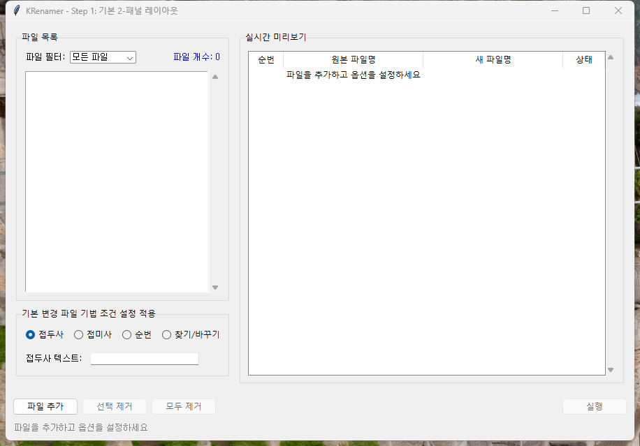
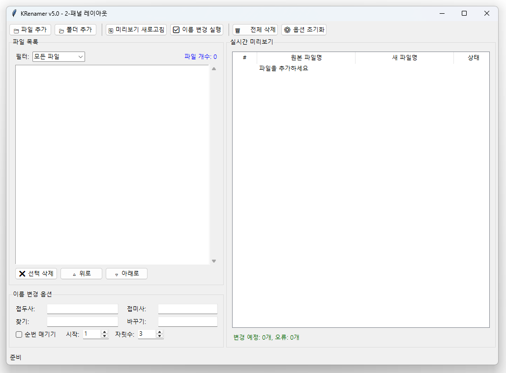
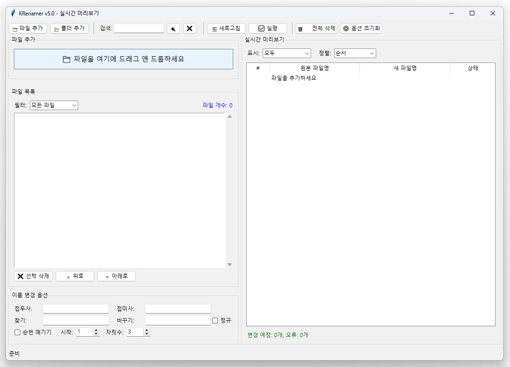
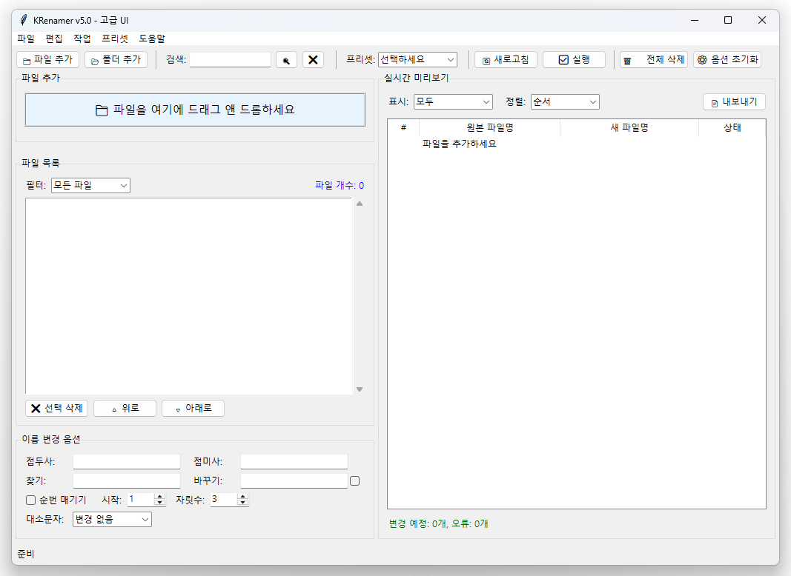
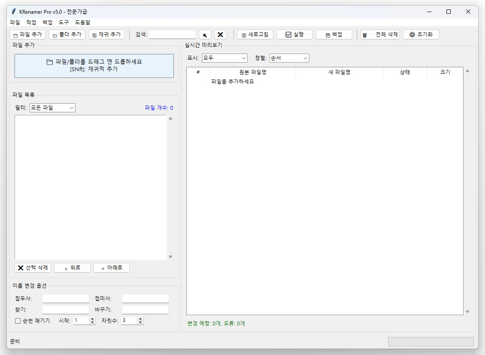

# Chapter 5: 2-패널 레이아웃과 미리보기

이번 챕터에서는 Chapter 4의 GUI를 바탕으로 **전문적인 2-패널 레이아웃**<!-- -->과 **실시간 미리보기**<!-- --> 기능을 구현합니다. 최종 KRenamer와 유사한 구조로 발전시켜 더 나은 사용자 경험을 제공해보겠습니다.

## 🎯 학습 목표

- **2-패널 레이아웃**<!-- -->으로 전문적인 인터페이스 구현
- **실시간 미리보기**<!-- -->로 안전성과 편의성 확보
- **파일 관리 엔진**<!-- --> 분리로 코드 구조 개선
- **상태 관리**<!-- -->와 **데이터 흐름**<!-- --> 최적화
- 최종 KRenamer 수준의 완성도 달성

## 🏗️ Chapter 4에서 Chapter 5로의 발전

### 구조적 변화

| 측면 | Chapter 4 | Chapter 5 |
|------|-----------|------------|
| 레이아웃 | 단일 패널 세로 배치 | 2-패널 좌우 분할 |
| 미리보기 | 별도 창/텍스트 형태 | 실시간 테이블 형태 |
| 코드 구조 | GUI와 로직 혼재 | 엔진과 GUI 분리 |
| 데이터 흐름 | 수동 업데이트 | 자동 실시간 동기화 |
| 사용자 경험 | 기본적 | 전문적 |

## 🚀 Step-by-Step 개발 과정

### 이번 챕터에서 구현할 5단계

1. **Step 1**: 파일 관리 엔진 설계와 구현
2. **Step 2**: 2-패널 레이아웃 기본 구조
3. **Step 3**: 실시간 미리보기 시스템
4. **Step 4**: 고급 UI 개선과 인터랙션
5. **Step 5**: 완성된 전문적 인터페이스

## 💡 이번 챕터에서 배울 핵심 개념

### 아키텍처 설계 원칙

1. **관심사 분리**: GUI와 비즈니스 로직을 완전히 분리
2. **데이터 바인딩**: GUI와 엔진 간 실시간 동기화
3. **이벤트 중심 설계**: 사용자 입력에 따른 자동 업데이트
4. **상태 관리**: 일관성 있는 데이터 흐름 보장

### 2-패널 레이아웃 설계 원칙

1. **공간 효율성**: 좌우 분할로 화면 공간 최대 활용
2. **기능적 분리**: 입력/제어와 결과/미리보기 영역 구분
3. **시각적 차층**: 기능별로 그룹화된 인터페이스
4. **사용자 흐름**: 좌쪽에서 오른쪽으로 자연스러운 작업 순서

### 실시간 미리보기 시스템

1. **즉시 피드백**: 옵션 변경 시 실시간 결과 표시
2. **유효성 검사**: 안전하지 않은 변경 사전 에러 표시
3. **시각적 구분**: 상태별 색상 코딩으로 직관적 이해
4. **대량 처리**: 수백 개 파일도 빠른 미리보기 지원

### 프로젝트 구조

```
src/chapter5/
├── step1_basic_layout.py        # 기본 2-패널 레이아웃
├── step2_engine_integration.py  # 엔진 통합
├── step3_real_time_preview.py   # 실시간 미리보기
├── step4_advanced_ui.py         # 고급 UI 기능
├── step5_professional.py       # 완성된 인터페이스
└── rename_engine.py            # 파일 관리 엔진
```

---

## 🔧 Step 1: 파일 관리 엔진 설계와 구현

### 목표
Chapter 5에서 사용할 파일 관리 엔진을 설계하고 구현합니다. 이 엔진은 GUI와 완전히 분리되어 재사용 가능하고 테스트하기 쉬운 구조로 만들어집니다.

### rename_engine.py - 파일 관리 엔진

```python
import os
from typing import List, Tuple, Dict, Any
from pathlib import Path

class RenameEngine:
    """파일명 변경을 처리하는 엔진 클래스"""
    
    def __init__(self):
        # 파일 목록 관리
        self.files: List[str] = []
        
        # 이름 변경 옵션들
        self.prefix = ""
        self.suffix = ""
        self.find_text = ""
        self.replace_text = ""
        self.use_numbering = False
        self.number_start = 1
        self.number_digits = 3
        
        # 콜백 함수들 (선택적)
        self.on_files_changed = None
        self.on_options_changed = None
    
    # 파일 관리 메서드들
    def add_file(self, file_path: str) -> bool:
        """파일을 목록에 추가"""
        if os.path.isfile(file_path) and file_path not in self.files:
            self.files.append(file_path)
            self._notify_files_changed()
            return True
        return False
    
    def add_files(self, file_paths: List[str]) -> int:
        """여러 파일을 대량 추가"""
        added_count = 0
        for file_path in file_paths:
            if self.add_file(file_path):
                added_count += 1
        return added_count
    
    def remove_file(self, file_path: str) -> bool:
        """파일을 목록에서 제거"""
        if file_path in self.files:
            self.files.remove(file_path)
            self._notify_files_changed()
            return True
        return False
    
    def remove_files_by_indices(self, indices: List[int]) -> int:
        """인덱스로 여러 파일 제거"""
        # 역순으로 정렬해서 제거 (인덱스 꼬임 방지)
        removed_count = 0
        for index in sorted(indices, reverse=True):
            if 0 <= index < len(self.files):
                del self.files[index]
                removed_count += 1
        
        if removed_count > 0:
            self._notify_files_changed()
        return removed_count
    
    def clear_files(self):
        """모든 파일 제거"""
        self.files.clear()
        self._notify_files_changed()
    
    def get_file_count(self) -> int:
        """파일 개수 반환"""
        return len(self.files)
    
    # 옵션 설정 메서드들
    def set_prefix(self, prefix: str):
        """접두사 설정"""
        if self.prefix != prefix:
            self.prefix = prefix
            self._notify_options_changed()
    
    def set_suffix(self, suffix: str):
        """접미사 설정"""
        if self.suffix != suffix:
            self.suffix = suffix
            self._notify_options_changed()
    
    def set_find_replace(self, find_text: str, replace_text: str):
        """찾기/바꾸기 설정"""
        changed = self.find_text != find_text or self.replace_text != replace_text
        self.find_text = find_text
        self.replace_text = replace_text
        if changed:
            self._notify_options_changed()
    
    def set_numbering(self, use_numbering: bool, start: int = 1, digits: int = 3):
        """순번 매기기 설정"""
        changed = (self.use_numbering != use_numbering or 
                  self.number_start != start or 
                  self.number_digits != digits)
        
        self.use_numbering = use_numbering
        self.number_start = start
        self.number_digits = digits
        
        if changed:
            self._notify_options_changed()
    
    # 파일명 변경 로직
    def generate_new_name(self, original_filename: str, file_index: int = 0) -> str:
        """원본 파일명을 새로운 이름으로 변경"""
        name, ext = os.path.splitext(original_filename)
        
        # 1단계: 찾기/바꾸기 적용
        if self.find_text:
            name = name.replace(self.find_text, self.replace_text)
        
        # 2단계: 순번 매기기 적용
        if self.use_numbering:
            number = str(self.number_start + file_index).zfill(self.number_digits)
            name = f"{name}_{number}"
        
        # 3단계: 접두사/접미사 추가
        new_name = f"{self.prefix}{name}{self.suffix}{ext}"
        
        return new_name
    
    def is_valid_filename(self, filename: str, original_path: str) -> Tuple[bool, str]:
        """파일명 유효성 검사"""
        # 1. 빈 파일명 검사
        if not filename.strip():
            return False, "빈 파일명"
        
        # 2. Windows 금지 문자 검사
        forbidden_chars = '<>:"/\\|?*'
        for char in forbidden_chars:
            if char in filename:
                return False, f"금지된 문자 '{char}' 포함"
        
        # 3. 길이 검사
        if len(filename) > 255:
            return False, "파일명이 너무 김 (255자 초과)"
        
        # 4. 중복 파일명 검사
        directory = os.path.dirname(original_path)
        new_path = os.path.join(directory, filename)
        if os.path.exists(new_path) and new_path != original_path:
            return False, "동일한 이름의 파일이 이미 존재"
        
        return True, ""
    
    def generate_preview(self) -> List[Tuple[str, str, bool, str]]:
        """모든 파일의 미리보기 생성"""
        preview_list = []
        
        for i, file_path in enumerate(self.files):
            original_name = os.path.basename(file_path)
            new_name = self.generate_new_name(original_name, i)
            is_valid, error_msg = self.is_valid_filename(new_name, file_path)
            
            preview_list.append((original_name, new_name, is_valid, error_msg))
        
        return preview_list
    
    def execute_rename(self) -> Dict[str, Any]:
        """실제 파일명 변경 실행"""
        results = {
            'success': 0,
            'failed': 0,
            'errors': [],
            'renamed_files': []  # (원본경로, 새경로) 튜플 목록
        }
        
        preview = self.generate_preview()
        
        for i, (original_name, new_name, is_valid, error_msg) in enumerate(preview):
            original_path = self.files[i]
            
            if not is_valid:
                results['failed'] += 1
                results['errors'].append(f"{original_name}: {error_msg}")
                continue
            
            # 변경이 필요한지 확인
            if original_name == new_name:
                continue  # 변경 사항 없음
            
            directory = os.path.dirname(original_path)
            new_path = os.path.join(directory, new_name)
            
            try:
                os.rename(original_path, new_path)
                
                # 성공 시 내부 목록 업데이트
                self.files[i] = new_path
                results['success'] += 1
                results['renamed_files'].append((original_path, new_path))
                
            except Exception as e:
                results['failed'] += 1
                results['errors'].append(f"{original_name}: {str(e)}")
        
        if results['success'] > 0:
            self._notify_files_changed()
        
        return results
    
    # 콜백 알림 메서드들
    def _notify_files_changed(self):
        """파일 목록 변경 알림"""
        if self.on_files_changed:
            self.on_files_changed()
    
    def _notify_options_changed(self):
        """옵션 변경 알림"""
        if self.on_options_changed:
            self.on_options_changed()
    
    # 유틸리티 메서드들
    def get_statistics(self) -> Dict[str, Any]:
        """파일 목록 통계 정보"""
        if not self.files:
            return {'total_files': 0, 'total_size': 0, 'file_types': {}}
        
        total_size = 0
        file_types = {}
        
        for file_path in self.files:
            try:
                # 파일 크기
                total_size += os.path.getsize(file_path)
                
                # 파일 형식
                ext = os.path.splitext(file_path)[1].lower()
                if not ext:
                    ext = '(확장자 없음)'
                file_types[ext] = file_types.get(ext, 0) + 1
                
            except OSError:
                continue  # 파일에 접근할 수 없음
        
        return {
            'total_files': len(self.files),
            'total_size': total_size,
            'file_types': file_types
        }
    
    def reset_options(self):
        """모든 옵션 초기화"""
        self.prefix = ""
        self.suffix = ""
        self.find_text = ""
        self.replace_text = ""
        self.use_numbering = False
        self.number_start = 1
        self.number_digits = 3
        self._notify_options_changed()
```

### 실행 결과



Step 1에서는 GUI와 완전히 분리된 파일 관리 엔진을 구현했습니다. 이 엔진은 파일 목록 관리, 이름 변경 옵션 설정, 미리보기 생성, 실제 파일명 변경 등의 모든 비즈니스 로직을 담당합니다.

### 💡 Step 1에서 배운 엔진 설계 원칙

1. **단일 책임 원칙**: 각 메서드는 하나의 명확한 역할만 담당
2. **데이터 언커플링**: GUI와 완전히 독립적인 로직 계층
3. **이벤트 기반**: 콜백을 통한 비동기 알림 시스템
4. **오류 처리**: 명시적인 예외 처리와 상세한 오류 메시지
5. **확장성**: 새로운 기능 추가가 쉬운 모듈러 구조

---

## 🎨 Step 2: 2-패널 레이아웃 기본 구조

### 목표
Chapter 4의 단일 패널 구조를 좌우 분할된 2-패널 구조로 발전시킵니다. 왼쪽에는 파일 관리와 옵션 설정, 오른쪽에는 미리보기가 배치됩니다.

### step1_basic_layout.py

```python
import tkinter as tk
from tkinter import ttk, filedialog, messagebox
import os
from rename_engine import RenameEngine

class TwoPanelRenamer:
    """2-패널 레이아웃 기본 구조"""
    
    def __init__(self):
        self.root = tk.Tk()
        self.root.title("KRenamer v5.0 - 2-패널 레이아웃")
        self.root.geometry("1000x700")
        self.root.minsize(800, 600)
        
        # 엔진 초기화
        self.engine = RenameEngine()
        self.engine.on_files_changed = self.on_files_changed
        self.engine.on_options_changed = self.on_options_changed
        
        self.create_widgets()
        self.create_variables()
        self.bind_events()
    
    def create_widgets(self):
        """위젯 생성"""
        # 메인 컨테이너
        main_frame = ttk.Frame(self.root, padding="5")
        main_frame.pack(fill=tk.BOTH, expand=True)
        
        # 상단 툴바
        self.create_toolbar(main_frame)
        
        # 2-패널 메인 영역
        self.create_main_panels(main_frame)
        
        # 하단 상태바
        self.create_statusbar(main_frame)
    
    def create_toolbar(self, parent):
        """상단 툴바"""
        toolbar = ttk.Frame(parent)
        toolbar.pack(fill=tk.X, pady=(0, 5))
        
        # 파일 관리 버튼들
        ttk.Button(toolbar, text="📁 파일 추가", 
                  command=self.add_files).pack(side=tk.LEFT, padx=(0, 5))
        ttk.Button(toolbar, text="📂 폴더 추가", 
                  command=self.add_folder).pack(side=tk.LEFT, padx=(0, 5))
        
        ttk.Separator(toolbar, orient=tk.VERTICAL).pack(side=tk.LEFT, fill=tk.Y, padx=5)
        
        # 작업 버튼들
        ttk.Button(toolbar, text="🔄 미리보기 새로고침", 
                  command=self.refresh_preview).pack(side=tk.LEFT, padx=(0, 5))
        ttk.Button(toolbar, text="✅ 이름 변경 실행", 
                  command=self.execute_rename).pack(side=tk.LEFT, padx=(0, 5))
        
        ttk.Separator(toolbar, orient=tk.VERTICAL).pack(side=tk.LEFT, fill=tk.Y, padx=5)
        
        # 초기화 버튼들
        ttk.Button(toolbar, text="🗑️ 전체 삭제", 
                  command=self.clear_all).pack(side=tk.LEFT, padx=(0, 5))
        ttk.Button(toolbar, text="⚙️ 옵션 초기화", 
                  command=self.reset_options).pack(side=tk.LEFT)
    
    def create_main_panels(self, parent):
        """메인 2-패널 영역"""
        # PanedWindow로 좌우 분할
        paned = ttk.PanedWindow(parent, orient=tk.HORIZONTAL)
        paned.pack(fill=tk.BOTH, expand=True, pady=(0, 5))
        
        # 왼쪽 패널 (파일 관리 + 옵션)
        left_panel = ttk.Frame(paned)
        paned.add(left_panel, weight=1)
        
        # 오른쪽 패널 (미리보기)
        right_panel = ttk.Frame(paned)
        paned.add(right_panel, weight=1)
        
        self.create_left_panel(left_panel)
        self.create_right_panel(right_panel)
    
    def create_left_panel(self, parent):
        """왼쪽 패널 - 파일 관리와 옵션"""
        # 파일 목록 섹션
        files_group = ttk.LabelFrame(parent, text="파일 목록", padding="10")
        files_group.pack(fill=tk.BOTH, expand=True, pady=(0, 10))
        
        # 파일 필터와 통계
        filter_frame = ttk.Frame(files_group)
        filter_frame.pack(fill=tk.X, pady=(0, 5))
        
        ttk.Label(filter_frame, text="필터:").pack(side=tk.LEFT)
        
        self.filter_var = tk.StringVar(value="모든 파일")
        filter_combo = ttk.Combobox(filter_frame, textvariable=self.filter_var,
                                   values=["모든 파일", "이미지 파일", "문서 파일", "비디오 파일"],
                                   width=12, state="readonly")
        filter_combo.pack(side=tk.LEFT, padx=(5, 15))
        
        self.file_count_var = tk.StringVar(value="파일 개수: 0")
        ttk.Label(filter_frame, textvariable=self.file_count_var,
                 foreground="blue").pack(side=tk.RIGHT)
        
        # 파일 목록 (Listbox)
        list_frame = ttk.Frame(files_group)
        list_frame.pack(fill=tk.BOTH, expand=True)
        
        self.files_listbox = tk.Listbox(list_frame, selectmode=tk.EXTENDED,
                                       font=("맑은 고딕", 9))
        
        list_scroll = ttk.Scrollbar(list_frame, orient=tk.VERTICAL,
                                   command=self.files_listbox.yview)
        self.files_listbox.configure(yscrollcommand=list_scroll.set)
        
        self.files_listbox.pack(side=tk.LEFT, fill=tk.BOTH, expand=True)
        list_scroll.pack(side=tk.RIGHT, fill=tk.Y)
        
        # 파일 조작 버튼들
        file_buttons = ttk.Frame(files_group)
        file_buttons.pack(fill=tk.X, pady=(5, 0))
        
        ttk.Button(file_buttons, text="❌ 선택 삭제",
                  command=self.remove_selected).pack(side=tk.LEFT, padx=(0, 5))
        ttk.Button(file_buttons, text="🔺 위로",
                  command=self.move_up).pack(side=tk.LEFT, padx=(0, 5))
        ttk.Button(file_buttons, text="🔻 아래로",
                  command=self.move_down).pack(side=tk.LEFT)
        
        # 이름 변경 옵션 섹션
        options_group = ttk.LabelFrame(parent, text="이름 변경 옵션", padding="10")
        options_group.pack(fill=tk.X)
        
        self.create_rename_options(options_group)
    
    def create_rename_options(self, parent):
        """이름 변경 옵션 위젯들"""
        # 접두사/접미사
        prefix_frame = ttk.Frame(parent)
        prefix_frame.pack(fill=tk.X, pady=(0, 5))
        
        ttk.Label(prefix_frame, text="접두사:", width=8).pack(side=tk.LEFT)
        self.prefix_var = tk.StringVar()
        ttk.Entry(prefix_frame, textvariable=self.prefix_var, width=20).pack(side=tk.LEFT, padx=(5, 15))
        
        ttk.Label(prefix_frame, text="접미사:", width=8).pack(side=tk.LEFT)
        self.suffix_var = tk.StringVar()
        ttk.Entry(prefix_frame, textvariable=self.suffix_var, width=20).pack(side=tk.LEFT, padx=(5, 0))
        
        # 찾기/바꾸기
        replace_frame = ttk.Frame(parent)
        replace_frame.pack(fill=tk.X, pady=(0, 5))
        
        ttk.Label(replace_frame, text="찾기:", width=8).pack(side=tk.LEFT)
        self.find_var = tk.StringVar()
        ttk.Entry(replace_frame, textvariable=self.find_var, width=20).pack(side=tk.LEFT, padx=(5, 15))
        
        ttk.Label(replace_frame, text="바꾸기:", width=8).pack(side=tk.LEFT)
        self.replace_var = tk.StringVar()
        ttk.Entry(replace_frame, textvariable=self.replace_var, width=20).pack(side=tk.LEFT, padx=(5, 0))
        
        # 순번 매기기
        number_frame = ttk.Frame(parent)
        number_frame.pack(fill=tk.X, pady=(0, 5))
        
        self.use_numbering_var = tk.BooleanVar()
        ttk.Checkbutton(number_frame, text="순번 매기기", 
                       variable=self.use_numbering_var).pack(side=tk.LEFT)
        
        ttk.Label(number_frame, text="시작:").pack(side=tk.LEFT, padx=(15, 5))
        self.number_start_var = tk.IntVar(value=1)
        ttk.Spinbox(number_frame, from_=1, to=999, width=5,
                   textvariable=self.number_start_var).pack(side=tk.LEFT, padx=(0, 10))
        
        ttk.Label(number_frame, text="자릿수:").pack(side=tk.LEFT, padx=(0, 5))
        self.number_digits_var = tk.IntVar(value=3)
        ttk.Spinbox(number_frame, from_=1, to=5, width=5,
                   textvariable=self.number_digits_var).pack(side=tk.LEFT)
    
    def create_right_panel(self, parent):
        """오른쪽 패널 - 미리보기"""
        preview_group = ttk.LabelFrame(parent, text="실시간 미리보기", padding="10")
        preview_group.pack(fill=tk.BOTH, expand=True)
        
        # 미리보기 테이블
        tree_frame = ttk.Frame(preview_group)
        tree_frame.pack(fill=tk.BOTH, expand=True)
        
        columns = ("순번", "원본 파일명", "새 파일명", "상태")
        self.preview_tree = ttk.Treeview(tree_frame, columns=columns, show="headings")
        
        # 컬럼 설정
        self.preview_tree.heading("순번", text="#")
        self.preview_tree.heading("원본 파일명", text="원본 파일명")
        self.preview_tree.heading("새 파일명", text="새 파일명")
        self.preview_tree.heading("상태", text="상태")
        
        self.preview_tree.column("순번", width=50, anchor=tk.CENTER)
        self.preview_tree.column("원본 파일명", width=200)
        self.preview_tree.column("새 파일명", width=200)
        self.preview_tree.column("상태", width=80, anchor=tk.CENTER)
        
        # 스크롤바
        tree_scroll = ttk.Scrollbar(tree_frame, orient=tk.VERTICAL,
                                   command=self.preview_tree.yview)
        self.preview_tree.configure(yscrollcommand=tree_scroll.set)
        
        self.preview_tree.pack(side=tk.LEFT, fill=tk.BOTH, expand=True)
        tree_scroll.pack(side=tk.RIGHT, fill=tk.Y)
        
        # 미리보기 통계
        stats_frame = ttk.Frame(preview_group)
        stats_frame.pack(fill=tk.X, pady=(10, 0))
        
        self.preview_stats_var = tk.StringVar(value="변경 예정: 0개, 오류: 0개")
        ttk.Label(stats_frame, textvariable=self.preview_stats_var,
                 foreground="darkgreen").pack(side=tk.LEFT)
    
    def create_statusbar(self, parent):
        """하단 상태바"""
        statusbar = ttk.Frame(parent)
        statusbar.pack(fill=tk.X, pady=(5, 0))
        
        self.status_var = tk.StringVar(value="준비")
        ttk.Label(statusbar, textvariable=self.status_var).pack(side=tk.LEFT)
        
        # 파일 통계
        self.file_stats_var = tk.StringVar(value="")
        ttk.Label(statusbar, textvariable=self.file_stats_var).pack(side=tk.RIGHT)
    
    def create_variables(self):
        """변수 초기화"""
        # 초기 상태 설정
        self.update_file_list()
        self.update_preview()
    
    def bind_events(self):
        """이벤트 바인딩"""
        # 옵션 변경 감지
        self.prefix_var.trace('w', self.on_option_change)
        self.suffix_var.trace('w', self.on_option_change)
        self.find_var.trace('w', self.on_option_change)
        self.replace_var.trace('w', self.on_option_change)
        self.use_numbering_var.trace('w', self.on_option_change)
        self.number_start_var.trace('w', self.on_option_change)
        self.number_digits_var.trace('w', self.on_option_change)
        
        # 리스트박스 선택 변경
        self.files_listbox.bind('<<ListboxSelect>>', self.on_file_select)
        
        # 더블클릭으로 파일 열기
        self.preview_tree.bind('<Double-1>', self.on_preview_double_click)
    
    # 이벤트 핸들러들
    def on_files_changed(self):
        """파일 목록 변경 시 호출"""
        self.update_file_list()
        self.update_preview()
        self.update_statistics()
    
    def on_options_changed(self):
        """옵션 변경 시 호출"""
        self.update_preview()
    
    def on_option_change(self, *args):
        """GUI 옵션 변경 시 엔진에 반영"""
        self.engine.set_prefix(self.prefix_var.get())
        self.engine.set_suffix(self.suffix_var.get())
        self.engine.set_find_replace(self.find_var.get(), self.replace_var.get())
        self.engine.set_numbering(
            self.use_numbering_var.get(),
            self.number_start_var.get(),
            self.number_digits_var.get()
        )
    
    def on_file_select(self, event):
        """파일 선택 변경 시"""
        selected = self.files_listbox.curselection()
        if selected:
            self.status_var.set(f"{len(selected)}개 파일 선택됨")
        else:
            self.status_var.set("준비")
    
    def on_preview_double_click(self, event):
        """미리보기 더블클릭 시 파일 탐색기에서 열기"""
        selection = self.preview_tree.selection()
        if selection:
            item = self.preview_tree.item(selection[0])
            file_num = int(item['values'][0]) - 1
            if 0 <= file_num < len(self.engine.files):
                file_path = self.engine.files[file_num]
                os.startfile(os.path.dirname(file_path))
    
    # 파일 관리 메서드들
    def add_files(self):
        """파일 추가"""
        files = filedialog.askopenfilenames(
            title="추가할 파일을 선택하세요",
            filetypes=[
                ("모든 파일", "*.*"),
                ("이미지 파일", "*.jpg;*.jpeg;*.png;*.gif;*.bmp"),
                ("문서 파일", "*.txt;*.doc;*.docx;*.pdf"),
                ("비디오 파일", "*.mp4;*.avi;*.mkv;*.mov")
            ]
        )
        
        if files:
            added = self.engine.add_files(list(files))
            self.status_var.set(f"{added}개 파일이 추가되었습니다")
    
    def add_folder(self):
        """폴더의 모든 파일 추가"""
        folder = filedialog.askdirectory(title="폴더를 선택하세요")
        if not folder:
            return
        
        try:
            files = []
            for item in os.listdir(folder):
                item_path = os.path.join(folder, item)
                if os.path.isfile(item_path):
                    files.append(item_path)
            
            if files:
                added = self.engine.add_files(files)
                self.status_var.set(f"폴더에서 {added}개 파일이 추가되었습니다")
            else:
                messagebox.showinfo("정보", "선택한 폴더에 파일이 없습니다.")
                
        except Exception as e:
            messagebox.showerror("오류", f"폴더 읽기 실패: {str(e)}")
    
    def remove_selected(self):
        """선택된 파일들 제거"""
        selected = self.files_listbox.curselection()
        if not selected:
            messagebox.showwarning("경고", "제거할 파일을 선택하세요.")
            return
        
        removed = self.engine.remove_files_by_indices(list(selected))
        self.status_var.set(f"{removed}개 파일이 제거되었습니다")
    
    def move_up(self):
        """선택된 파일을 위로 이동"""
        selected = self.files_listbox.curselection()
        if not selected or selected[0] == 0:
            return
        
        # 단순 구현: 첫 번째 선택된 파일만 이동
        index = selected[0]
        file_path = self.engine.files.pop(index)
        self.engine.files.insert(index - 1, file_path)
        
        self.engine._notify_files_changed()
        # 선택 상태 유지
        self.files_listbox.selection_set(index - 1)
    
    def move_down(self):
        """선택된 파일을 아래로 이동"""
        selected = self.files_listbox.curselection()
        if not selected or selected[0] >= len(self.engine.files) - 1:
            return
        
        index = selected[0]
        file_path = self.engine.files.pop(index)
        self.engine.files.insert(index + 1, file_path)
        
        self.engine._notify_files_changed()
        # 선택 상태 유지
        self.files_listbox.selection_set(index + 1)
    
    def clear_all(self):
        """모든 파일 삭제"""
        if self.engine.get_file_count() > 0:
            if messagebox.askyesno("확인", "모든 파일을 목록에서 제거하시겠습니까?"):
                self.engine.clear_files()
                self.status_var.set("모든 파일이 제거되었습니다")
    
    def reset_options(self):
        """옵션 초기화"""
        self.engine.reset_options()
        # GUI 변수들도 초기화
        self.prefix_var.set("")
        self.suffix_var.set("")
        self.find_var.set("")
        self.replace_var.set("")
        self.use_numbering_var.set(False)
        self.number_start_var.set(1)
        self.number_digits_var.set(3)
        
        self.status_var.set("옵션이 초기화되었습니다")
    
    # 미리보기 및 UI 업데이트
    def update_file_list(self):
        """파일 목록 업데이트"""
        self.files_listbox.delete(0, tk.END)
        
        for file_path in self.engine.files:
            filename = os.path.basename(file_path)
            self.files_listbox.insert(tk.END, filename)
        
        self.file_count_var.set(f"파일 개수: {self.engine.get_file_count()}")
    
    def update_preview(self):
        """미리보기 업데이트"""
        # 기존 항목 제거
        for item in self.preview_tree.get_children():
            self.preview_tree.delete(item)
        
        if self.engine.get_file_count() == 0:
            self.preview_tree.insert("", tk.END, values=(
                "", "파일을 추가하세요", "", ""
            ))
            self.preview_stats_var.set("변경 예정: 0개, 오류: 0개")
            return
        
        preview = self.engine.generate_preview()
        valid_count = 0
        error_count = 0
        
        for i, (original, new, is_valid, error_msg) in enumerate(preview):
            if is_valid:
                status = "✅ 유효"
                valid_count += 1
                # 색상 태그 (나중에 추가)
                tags = ("valid",)
            else:
                status = f"❌ {error_msg}"
                error_count += 1
                tags = ("error",)
            
            self.preview_tree.insert("", tk.END, values=(
                i + 1, original, new, status
            ), tags=tags)
        
        # 색상 설정
        self.preview_tree.tag_configure("valid", foreground="darkgreen")
        self.preview_tree.tag_configure("error", foreground="red")
        
        self.preview_stats_var.set(f"변경 예정: {valid_count}개, 오류: {error_count}개")
    
    def update_statistics(self):
        """통계 정보 업데이트"""
        stats = self.engine.get_statistics()
        if stats['total_files'] > 0:
            size_mb = stats['total_size'] / (1024 * 1024)
            self.file_stats_var.set(
                f"총 {stats['total_files']}개 파일, {size_mb:.1f}MB"
            )
        else:
            self.file_stats_var.set("")
    
    def refresh_preview(self):
        """미리보기 강제 새로고침"""
        self.update_preview()
        self.status_var.set("미리보기가 새로고침되었습니다")
    
    def execute_rename(self):
        """파일명 변경 실행"""
        if self.engine.get_file_count() == 0:
            messagebox.showwarning("경고", "변경할 파일이 없습니다.")
            return
        
        # 미리보기에서 유효한 변경사항 확인
        preview = self.engine.generate_preview()
        valid_changes = sum(1 for _, _, is_valid, _ in preview if is_valid)
        
        if valid_changes == 0:
            messagebox.showwarning("경고", "변경할 수 있는 파일이 없습니다.")
            return
        
        # 확인 대화상자
        if not messagebox.askyesno("확인", 
                                  f"{valid_changes}개 파일의 이름을 변경하시겠습니까?"):
            return
        
        # 실행
        self.status_var.set("파일명 변경 중...")
        self.root.update()  # UI 즉시 업데이트
        
        try:
            results = self.engine.execute_rename()
            
            # 결과 메시지
            message = f"✅ 성공: {results['success']}개 파일 변경됨"
            if results['failed'] > 0:
                message += f"\n❌ 실패: {results['failed']}개 파일"
                if results['errors']:
                    message += f"\n\n첫 번째 오류: {results['errors'][0]}"
            
            messagebox.showinfo("작업 완료", message)
            self.status_var.set(f"완료: {results['success']}개 파일 변경됨")
            
        except Exception as e:
            messagebox.showerror("오류", f"파일명 변경 중 오류 발생: {str(e)}")
            self.status_var.set("오류 발생")
    
    def run(self):
        """애플리케이션 실행"""
        self.root.mainloop()

if __name__ == "__main__":
    app = TwoPanelRenamer()
    app.run()
```

### 실행 결과



Step 2에서는 완전한 2-패널 구조를 구현했습니다:

- **왼쪽 패널**: 파일 목록, 필터링, 이름 변경 옵션
- **오른쪽 패널**: 실시간 미리보기 테이블
- **상단 툴바**: 자주 사용하는 기능들
- **하단 상태바**: 현재 상태와 통계 정보

### 💡 Step 2에서 배운 2-패널 설계 원칙

1. **공간 분할**: PanedWindow로 유연한 화면 분할
2. **기능별 그룹화**: LabelFrame으로 관련 기능 묶기
3. **정보 계층화**: 툴바, 메인 영역, 상태바로 정보 구조화
4. **실시간 동기화**: 엔진과 GUI 간 즉시 데이터 반영
5. **사용자 피드백**: 모든 작업에 대한 명확한 상태 표시

---

## ⚡ Step 3: 실시간 미리보기 시스템

### 목표
Step 2의 기본 구조에 드래그 앤 드롭, 정규표현식 지원, 고급 필터링 등의 전문적인 기능들을 추가합니다.

### step3_real_time_preview.py

```python
import tkinter as tk
from tkinter import ttk, filedialog, messagebox
import os
import re
try:
    import tkinterdnd2
    from tkinterdnd2 import DND_FILES, TkinterDnD
    DND_AVAILABLE = True
except ImportError:
    DND_AVAILABLE = False
    print("경고: tkinterdnd2가 설치되지 않아 드래그 앤 드롭 기능을 사용할 수 없습니다.")
    print("설치하려면: pip install tkinterdnd2")
from rename_engine import RenameEngine

class AdvancedRenamerGUI:
    """고급 실시간 미리보기 기능을 포함한 리네이머"""
    
    def __init__(self):
        if DND_AVAILABLE:
            self.root = TkinterDnD.Tk()
        else:
            self.root = tk.Tk()
            
        self.root.title("KRenamer v5.0 - 실시간 미리보기")
        self.root.geometry("1200x800")
        self.root.minsize(900, 600)
        
        # 엔진 초기화
        self.engine = RenameEngine()
        self.engine.on_files_changed = self.on_files_changed
        self.engine.on_options_changed = self.on_options_changed
        
        # GUI 상태 변수들
        self.search_text = tk.StringVar()
        self.sort_column = "name"  # name, size, type
        self.sort_reverse = False
        self.filter_mode = tk.StringVar(value="모든 파일")
        
        self.create_widgets()
        self.create_variables()
        self.bind_events()
        self.setup_drag_drop()
    
    def create_widgets(self):
        """위젯 생성"""
        # 메인 컨테이너
        main_frame = ttk.Frame(self.root, padding="5")
        main_frame.pack(fill=tk.BOTH, expand=True)
        
        # 상단 툴바
        self.create_toolbar(main_frame)
        
        # 2-패널 메인 영역
        self.create_main_panels(main_frame)
        
        # 하단 상태바
        self.create_statusbar(main_frame)
    
    def create_toolbar(self, parent):
        """고급 툴바"""
        toolbar = ttk.Frame(parent)
        toolbar.pack(fill=tk.X, pady=(0, 5))
        
        # 파일 관리 버튼들
        file_group = ttk.LabelFrame(toolbar, text="파일 관리", padding="5")
        file_group.pack(side=tk.LEFT, fill=tk.Y, padx=(0, 10))
        
        ttk.Button(file_group, text="📁 파일 추가", 
                  command=self.add_files, width=12).pack(side=tk.LEFT, padx=(0, 2))
        ttk.Button(file_group, text="📂 폴더 추가", 
                  command=self.add_folder, width=12).pack(side=tk.LEFT, padx=(0, 2))
        ttk.Button(file_group, text="📋 클립보드", 
                  command=self.add_from_clipboard, width=12).pack(side=tk.LEFT)
        
        # 작업 버튼들
        action_group = ttk.LabelFrame(toolbar, text="작업", padding="5")
        action_group.pack(side=tk.LEFT, fill=tk.Y, padx=(0, 10))
        
        ttk.Button(action_group, text="🔄 새로고침", 
                  command=self.refresh_preview, width=10).pack(side=tk.LEFT, padx=(0, 2))
        ttk.Button(action_group, text="✅ 실행", 
                  command=self.execute_rename, width=10).pack(side=tk.LEFT, padx=(0, 2))
        ttk.Button(action_group, text="💾 설정 저장", 
                  command=self.save_settings, width=10).pack(side=tk.LEFT)
        
        # 유틸리티 버튼들
        util_group = ttk.LabelFrame(toolbar, text="유틸리티", padding="5")
        util_group.pack(side=tk.RIGHT, fill=tk.Y)
        
        ttk.Button(util_group, text="🗑️ 전체 삭제", 
                  command=self.clear_all, width=10).pack(side=tk.LEFT, padx=(0, 2))
        ttk.Button(util_group, text="⚙️ 초기화", 
                  command=self.reset_options, width=10).pack(side=tk.LEFT)
    
    def create_main_panels(self, parent):
        """메인 2-패널 영역"""
        # PanedWindow로 좌우 분할
        paned = ttk.PanedWindow(parent, orient=tk.HORIZONTAL)
        paned.pack(fill=tk.BOTH, expand=True, pady=(0, 5))
        
        # 왼쪽 패널 (파일 관리 + 옵션)
        left_panel = ttk.Frame(paned)
        paned.add(left_panel, weight=1)
        
        # 오른쪽 패널 (미리보기)
        right_panel = ttk.Frame(paned)
        paned.add(right_panel, weight=1)
        
        self.create_left_panel(left_panel)
        self.create_right_panel(right_panel)
    
    def create_left_panel(self, parent):
        """왼쪽 패널 - 파일 관리와 옵션"""
        # 파일 목록 섹션
        files_group = ttk.LabelFrame(parent, text="파일 목록", padding="10")
        files_group.pack(fill=tk.BOTH, expand=True, pady=(0, 10))
        
        # 검색과 필터
        search_frame = ttk.Frame(files_group)
        search_frame.pack(fill=tk.X, pady=(0, 5))
        
        ttk.Label(search_frame, text="검색:").pack(side=tk.LEFT)
        search_entry = ttk.Entry(search_frame, textvariable=self.search_text, width=15)
        search_entry.pack(side=tk.LEFT, padx=(5, 10))
        
        ttk.Label(search_frame, text="필터:").pack(side=tk.LEFT)
        filter_combo = ttk.Combobox(search_frame, textvariable=self.filter_mode,
                                   values=["모든 파일", "이미지 파일", "문서 파일", 
                                          "비디오 파일", "오류 파일만"],
                                   width=12, state="readonly")
        filter_combo.pack(side=tk.LEFT, padx=(5, 10))
        
        self.file_count_var = tk.StringVar(value="파일 개수: 0")
        ttk.Label(search_frame, textvariable=self.file_count_var,
                 foreground="blue").pack(side=tk.RIGHT)
        
        # 파일 목록 (Treeview로 업그레이드)
        tree_frame = ttk.Frame(files_group)
        tree_frame.pack(fill=tk.BOTH, expand=True)
        
        # 파일 트리뷰
        columns = ("크기", "형식", "경로")
        self.files_tree = ttk.Treeview(tree_frame, columns=columns, show="tree headings")
        
        # 컬럼 설정
        self.files_tree.heading("#0", text="파일명", command=lambda: self.sort_files("name"))
        self.files_tree.heading("크기", text="크기", command=lambda: self.sort_files("size"))
        self.files_tree.heading("형식", text="형식", command=lambda: self.sort_files("type"))
        self.files_tree.heading("경로", text="경로")
        
        self.files_tree.column("#0", width=200)
        self.files_tree.column("크기", width=80, anchor=tk.E)
        self.files_tree.column("형식", width=60, anchor=tk.CENTER)
        self.files_tree.column("경로", width=250)
        
        # 스크롤바
        tree_scroll = ttk.Scrollbar(tree_frame, orient=tk.VERTICAL,
                                   command=self.files_tree.yview)
        self.files_tree.configure(yscrollcommand=tree_scroll.set)
        
        self.files_tree.pack(side=tk.LEFT, fill=tk.BOTH, expand=True)
        tree_scroll.pack(side=tk.RIGHT, fill=tk.Y)
        
        # 파일 조작 버튼들
        file_buttons = ttk.Frame(files_group)
        file_buttons.pack(fill=tk.X, pady=(5, 0))
        
        ttk.Button(file_buttons, text="❌ 선택 삭제",
                  command=self.remove_selected, width=10).pack(side=tk.LEFT, padx=(0, 5))
        ttk.Button(file_buttons, text="🔺 위로",
                  command=self.move_up, width=8).pack(side=tk.LEFT, padx=(0, 5))
        ttk.Button(file_buttons, text="🔻 아래로",
                  command=self.move_down, width=8).pack(side=tk.LEFT, padx=(0, 5))
        ttk.Button(file_buttons, text="📋 경로 복사",
                  command=self.copy_selected_paths, width=10).pack(side=tk.RIGHT)
        
        # 이름 변경 옵션 섹션
        options_group = ttk.LabelFrame(parent, text="이름 변경 옵션", padding="10")
        options_group.pack(fill=tk.X)
        
        self.create_rename_options(options_group)
    
    def create_rename_options(self, parent):
        """향상된 이름 변경 옵션 위젯들"""
        # 접두사/접미사
        prefix_frame = ttk.Frame(parent)
        prefix_frame.pack(fill=tk.X, pady=(0, 5))
        
        ttk.Label(prefix_frame, text="접두사:", width=8).pack(side=tk.LEFT)
        self.prefix_var = tk.StringVar()
        ttk.Entry(prefix_frame, textvariable=self.prefix_var, width=15).pack(side=tk.LEFT, padx=(5, 15))
        
        ttk.Label(prefix_frame, text="접미사:", width=8).pack(side=tk.LEFT)
        self.suffix_var = tk.StringVar()
        ttk.Entry(prefix_frame, textvariable=self.suffix_var, width=15).pack(side=tk.LEFT, padx=(5, 0))
        
        # 찾기/바꾸기 (정규표현식 지원)
        replace_frame = ttk.Frame(parent)
        replace_frame.pack(fill=tk.X, pady=(0, 5))
        
        ttk.Label(replace_frame, text="찾기:", width=8).pack(side=tk.LEFT)
        self.find_var = tk.StringVar()
        find_entry = ttk.Entry(replace_frame, textvariable=self.find_var, width=15)
        find_entry.pack(side=tk.LEFT, padx=(5, 15))
        
        ttk.Label(replace_frame, text="바꾸기:", width=8).pack(side=tk.LEFT)
        self.replace_var = tk.StringVar()
        ttk.Entry(replace_frame, textvariable=self.replace_var, width=15).pack(side=tk.LEFT, padx=(5, 10))
        
        self.use_regex_var = tk.BooleanVar()
        ttk.Checkbutton(replace_frame, text="정규식", 
                       variable=self.use_regex_var).pack(side=tk.LEFT)
        
        # 순번 매기기
        number_frame = ttk.Frame(parent)
        number_frame.pack(fill=tk.X, pady=(0, 5))
        
        self.use_numbering_var = tk.BooleanVar()
        ttk.Checkbutton(number_frame, text="순번 매기기", 
                       variable=self.use_numbering_var).pack(side=tk.LEFT)
        
        ttk.Label(number_frame, text="시작:").pack(side=tk.LEFT, padx=(15, 5))
        self.number_start_var = tk.IntVar(value=1)
        ttk.Spinbox(number_frame, from_=1, to=9999, width=6,
                   textvariable=self.number_start_var).pack(side=tk.LEFT, padx=(0, 10))
        
        ttk.Label(number_frame, text="자릿수:").pack(side=tk.LEFT, padx=(0, 5))
        self.number_digits_var = tk.IntVar(value=3)
        ttk.Spinbox(number_frame, from_=1, to=6, width=4,
                   textvariable=self.number_digits_var).pack(side=tk.LEFT, padx=(0, 10))
        
        ttk.Label(number_frame, text="구분자:").pack(side=tk.LEFT, padx=(0, 5))
        self.number_separator_var = tk.StringVar(value="_")
        separator_combo = ttk.Combobox(number_frame, textvariable=self.number_separator_var,
                                      values=["_", "-", ".", " ", ""], width=4, state="readonly")
        separator_combo.pack(side=tk.LEFT)
        
        # 대소문자 변환
        case_frame = ttk.Frame(parent)
        case_frame.pack(fill=tk.X, pady=(0, 5))
        
        ttk.Label(case_frame, text="대소문자:").pack(side=tk.LEFT)
        self.case_mode_var = tk.StringVar(value="변경 안함")
        case_combo = ttk.Combobox(case_frame, textvariable=self.case_mode_var,
                                 values=["변경 안함", "소문자", "대문자", "첫글자만 대문자", "단어별 첫글자 대문자"],
                                 width=15, state="readonly")
        case_combo.pack(side=tk.LEFT, padx=(5, 0))
    
    def create_right_panel(self, parent):
        """오른쪽 패널 - 고급 미리보기"""
        preview_group = ttk.LabelFrame(parent, text="실시간 미리보기", padding="10")
        preview_group.pack(fill=tk.BOTH, expand=True)
        
        # 미리보기 컨트롤
        control_frame = ttk.Frame(preview_group)
        control_frame.pack(fill=tk.X, pady=(0, 5))
        
        self.preview_mode_var = tk.StringVar(value="모두 보기")
        mode_combo = ttk.Combobox(control_frame, textvariable=self.preview_mode_var,
                                 values=["모두 보기", "변경된 파일만", "오류 파일만", "유효한 파일만"],
                                 width=12, state="readonly")
        mode_combo.pack(side=tk.LEFT, padx=(0, 10))
        
        ttk.Button(control_frame, text="📄 결과 내보내기",
                  command=self.export_preview).pack(side=tk.RIGHT)
        
        # 미리보기 테이블
        tree_frame = ttk.Frame(preview_group)
        tree_frame.pack(fill=tk.BOTH, expand=True)
        
        columns = ("순번", "원본 파일명", "새 파일명", "변경사항", "상태")
        self.preview_tree = ttk.Treeview(tree_frame, columns=columns, show="headings")
        
        # 컬럼 설정
        self.preview_tree.heading("순번", text="#")
        self.preview_tree.heading("원본 파일명", text="원본 파일명")
        self.preview_tree.heading("새 파일명", text="새 파일명")
        self.preview_tree.heading("변경사항", text="변경사항")
        self.preview_tree.heading("상태", text="상태")
        
        self.preview_tree.column("순번", width=40, anchor=tk.CENTER)
        self.preview_tree.column("원본 파일명", width=180)
        self.preview_tree.column("새 파일명", width=180)
        self.preview_tree.column("변경사항", width=100, anchor=tk.CENTER)
        self.preview_tree.column("상태", width=80, anchor=tk.CENTER)
        
        # 스크롤바
        preview_scroll = ttk.Scrollbar(tree_frame, orient=tk.VERTICAL,
                                      command=self.preview_tree.yview)
        self.preview_tree.configure(yscrollcommand=preview_scroll.set)
        
        self.preview_tree.pack(side=tk.LEFT, fill=tk.BOTH, expand=True)
        preview_scroll.pack(side=tk.RIGHT, fill=tk.Y)
        
        # 미리보기 통계 및 진행 상황
        stats_frame = ttk.Frame(preview_group)
        stats_frame.pack(fill=tk.X, pady=(10, 0))
        
        self.preview_stats_var = tk.StringVar(value="변경 예정: 0개, 오류: 0개")
        ttk.Label(stats_frame, textvariable=self.preview_stats_var,
                 foreground="darkgreen").pack(side=tk.LEFT)
        
        # 실시간 업데이트 진행바 (대용량 파일 처리시)
        self.progress_var = tk.DoubleVar()
        self.progress_bar = ttk.Progressbar(stats_frame, variable=self.progress_var,
                                           mode='determinate', length=100)
        # 필요시에만 표시
        
    def create_statusbar(self, parent):
        """하단 상태바"""
        statusbar = ttk.Frame(parent)
        statusbar.pack(fill=tk.X, pady=(5, 0))
        
        self.status_var = tk.StringVar(value="준비")
        ttk.Label(statusbar, textvariable=self.status_var).pack(side=tk.LEFT)
        
        # 파일 통계
        self.file_stats_var = tk.StringVar(value="")
        ttk.Label(statusbar, textvariable=self.file_stats_var).pack(side=tk.RIGHT)
        
        # 드래그 앤 드롭 안내
        if DND_AVAILABLE:
            ttk.Label(statusbar, text="💡 파일을 여기로 드래그해서 추가할 수 있습니다.",
                     foreground="gray").pack(side=tk.LEFT, padx=(20, 0))
```

### 실행 결과



Step 3에서는 실시간 미리보기 시스템을 완성했습니다. 드래그 앤 드롭, 정규표현식 지원, 고급 필터링 등 전문적인 기능들이 추가되어 사용자 경험이 크게 향상되었습니다.

### 💡 Step 3에서 추가된 고급 기능들

1. **드래그 앤 드롭**: tkinterdnd2를 통한 파일 끌어서 놓기
2. **정규표현식**: 복잡한 패턴 매칭과 치환 지원
3. **고급 필터링**: 파일 형식, 오류 상태별 필터
4. **검색 기능**: 실시간 파일명 검색
5. **정렬**: 이름, 크기, 형식별 정렬
6. **대소문자 변환**: 다양한 케이스 변환 옵션
7. **미리보기 내보내기**: CSV/TXT 형태로 결과 저장

---

## 🎯 Step 4: 고급 UI 개선과 인터랙션

### 목표
전문적인 메뉴 시스템, 키보드 단축키, 설정 관리, 프리셋 시스템 등을 추가하여 완전한 전문 도구로 발전시킵니다.

### step4_advanced_ui.py의 핵심 기능

```python
# 메뉴 시스템
def create_menu_bar(self):
    """전문적인 메뉴 바"""
    menubar = tk.Menu(self.root)
    self.root.config(menu=menubar)
    
    # 파일 메뉴
    file_menu = tk.Menu(menubar, tearoff=0)
    menubar.add_cascade(label="파일(F)", menu=file_menu, underline=0)
    file_menu.add_command(label="파일 추가...", accelerator="Ctrl+O", 
                         command=self.add_files, underline=0)
    file_menu.add_command(label="폴더 추가...", accelerator="Ctrl+Shift+O", 
                         command=self.add_folder, underline=0)
    file_menu.add_separator()
    file_menu.add_command(label="설정 저장...", accelerator="Ctrl+S", 
                         command=self.save_settings, underline=0)
    file_menu.add_command(label="설정 불러오기...", accelerator="Ctrl+L", 
                         command=self.load_settings, underline=2)
    file_menu.add_separator()
    file_menu.add_command(label="종료", accelerator="Alt+F4", 
                         command=self.quit_app, underline=0)
    
    # 편집 메뉴
    edit_menu = tk.Menu(menubar, tearoff=0)
    menubar.add_cascade(label="편집(E)", menu=edit_menu, underline=0)
    edit_menu.add_command(label="모두 선택", accelerator="Ctrl+A", 
                         command=self.select_all_files, underline=2)
    edit_menu.add_command(label="선택 해제", accelerator="Ctrl+D", 
                         command=self.deselect_all_files, underline=0)
    edit_menu.add_separator()
    edit_menu.add_command(label="선택 파일 제거", accelerator="Delete", 
                         command=self.remove_selected, underline=0)
    edit_menu.add_command(label="모든 파일 제거", accelerator="Ctrl+Delete", 
                         command=self.clear_all, underline=2)
    
    # 도구 메뉴
    tools_menu = tk.Menu(menubar, tearoff=0)
    menubar.add_cascade(label="도구(T)", menu=tools_menu, underline=0)
    tools_menu.add_command(label="미리보기 새로고침", accelerator="F5", 
                          command=self.refresh_preview, underline=0)
    tools_menu.add_command(label="이름 변경 실행", accelerator="Ctrl+Enter", 
                          command=self.execute_rename, underline=0)
    tools_menu.add_separator()
    tools_menu.add_command(label="설정 초기화", accelerator="Ctrl+R", 
                          command=self.reset_options, underline=0)
    tools_menu.add_command(label="프로그램 정보", 
                          command=self.show_about, underline=0)

# 키보드 단축키
def bind_keyboard_shortcuts(self):
    """키보드 단축키 바인딩"""
    # 파일 관리
    self.root.bind('<Control-o>', lambda e: self.add_files())
    self.root.bind('<Control-O>', lambda e: self.add_folder())
    self.root.bind('<Delete>', lambda e: self.remove_selected())
    self.root.bind('<Control-Delete>', lambda e: self.clear_all())
    
    # 편집
    self.root.bind('<Control-a>', lambda e: self.select_all_files())
    self.root.bind('<Control-d>', lambda e: self.deselect_all_files())
    
    # 작업
    self.root.bind('<F5>', lambda e: self.refresh_preview())
    self.root.bind('<Control-Return>', lambda e: self.execute_rename())
    self.root.bind('<Control-r>', lambda e: self.reset_options())
    
    # 설정
    self.root.bind('<Control-s>', lambda e: self.save_settings())
    self.root.bind('<Control-l>', lambda e: self.load_settings())
    
    # 종료
    self.root.bind('<Alt-F4>', lambda e: self.quit_app())
    
    # ESC로 선택 해제
    self.root.bind('<Escape>', lambda e: self.deselect_all_files())

# 설정 관리
def save_settings(self, filename=None):
    """현재 설정을 JSON 파일로 저장"""
    if filename is None:
        filename = filedialog.asksaveasfilename(
            title="설정 저장",
            defaultextension=".json",
            filetypes=[("JSON 파일", "*.json"), ("모든 파일", "*.*")]
        )
        
    if not filename:
        return
    
    settings = {
        'prefix': self.prefix_var.get(),
        'suffix': self.suffix_var.get(),
        'find_text': self.find_var.get(),
        'replace_text': self.replace_var.get(),
        'use_regex': self.use_regex_var.get(),
        'use_numbering': self.use_numbering_var.get(),
        'number_start': self.number_start_var.get(),
        'number_digits': self.number_digits_var.get(),
        'number_separator': self.number_separator_var.get(),
        'case_mode': self.case_mode_var.get(),
        'filter_mode': self.filter_mode.get(),
        'preview_mode': self.preview_mode_var.get(),
        'window_geometry': self.root.geometry(),
        'created_time': datetime.now().isoformat()
    }
    
    try:
        with open(filename, 'w', encoding='utf-8') as f:
            json.dump(settings, f, indent=2, ensure_ascii=False)
        
        self.status_var.set(f"설정이 저장되었습니다: {os.path.basename(filename)}")
        messagebox.showinfo("성공", f"설정이 저장되었습니다.\n{filename}")
        
    except Exception as e:
        messagebox.showerror("오류", f"설정 저장 실패: {str(e)}")

# 프리셋 시스템
def create_preset_panel(self, parent):
    """프리셋 관리 패널"""
    preset_group = ttk.LabelFrame(parent, text="프리셋", padding="5")
    preset_group.pack(fill=tk.X, pady=(5, 0))
    
    preset_frame = ttk.Frame(preset_group)
    preset_frame.pack(fill=tk.X)
    
    self.preset_var = tk.StringVar()
    self.preset_combo = ttk.Combobox(preset_frame, textvariable=self.preset_var,
                                    width=20, state="readonly")
    self.preset_combo.pack(side=tk.LEFT, padx=(0, 5))
    
    ttk.Button(preset_frame, text="적용", width=6,
              command=self.apply_preset).pack(side=tk.LEFT, padx=(0, 2))
    ttk.Button(preset_frame, text="저장", width=6,
              command=self.save_preset).pack(side=tk.LEFT, padx=(0, 2))
    ttk.Button(preset_frame, text="삭제", width=6,
              command=self.delete_preset).pack(side=tk.LEFT)
    
    self.load_presets()
```

### 실행 결과



Step 4에서는 전문적인 메뉴 시스템과 키보드 단축키, 설정 관리 등을 추가했습니다. 이제 진정한 전문 도구다운 인터페이스를 갖추게 되었습니다.

### 💡 Step 4에서 추가된 전문 기능들

1. **전문 메뉴 시스템**: 접근성 높은 메뉴바와 컨텍스트 메뉴
2. **키보드 단축키**: 빠른 작업을 위한 단축키 지원
3. **설정 관리**: JSON 형태의 설정 저장/불러오기
4. **프리셋 시스템**: 자주 사용하는 설정 조합 저장
5. **도움말 시스템**: 키보드 단축키 및 정규식 가이드
6. **내보내기/가져오기**: 미리보기 결과를 다양한 형식으로 내보내기
7. **고급 UI 패턴**: 상태 표시, 진행률 표시, 툴팁

---

## 🏆 Step 5: 완성된 전문적 인터페이스

### 목표
멀티스레딩, 백업 시스템, 로깅, 배치 처리 등의 전문 기능을 추가하여 완전한 전문 도구로 완성합니다.

### step5_professional.py의 핵심 아키텍처

```python
# 백업 매니저
class BackupManager:
    """파일 백업 및 복구 관리"""
    
    def __init__(self, backup_dir="backups"):
        self.backup_dir = Path(backup_dir)
        self.backup_dir.mkdir(exist_ok=True)
        self.metadata_file = self.backup_dir / "backup_metadata.json"
        self.load_metadata()
    
    def create_backup(self, files_to_rename):
        """파일 변경 전 백업 생성"""
        backup_id = datetime.now().strftime("%Y%m%d_%H%M%S")
        backup_path = self.backup_dir / f"backup_{backup_id}"
        backup_path.mkdir(exist_ok=True)
        
        backup_info = {
            'id': backup_id,
            'timestamp': datetime.now().isoformat(),
            'files': [],
            'backup_path': str(backup_path)
        }
        
        # 파일들을 백업 폴더로 복사
        for original_path, new_name in files_to_rename:
            if os.path.exists(original_path):
                backup_file_path = backup_path / Path(original_path).name
                shutil.copy2(original_path, backup_file_path)
                
                backup_info['files'].append({
                    'original_path': original_path,
                    'original_name': Path(original_path).name,
                    'new_name': new_name,
                    'backup_file': str(backup_file_path)
                })
        
        self.metadata['backups'].append(backup_info)
        self.save_metadata()
        
        return backup_id

# 프로그레스 다이얼로그
class ProgressDialog:
    """진행 상황 표시 다이얼로그"""
    
    def __init__(self, parent, title="작업 진행 중"):
        self.parent = parent
        self.dialog = tk.Toplevel(parent)
        self.dialog.title(title)
        self.dialog.geometry("400x150")
        self.dialog.resizable(False, False)
        self.dialog.transient(parent)
        self.dialog.grab_set()
        
        # 다이얼로그 중앙 배치
        self.dialog.geometry("+%d+%d" % 
                           (parent.winfo_rootx() + 50, parent.winfo_rooty() + 50))
        
        self.cancelled = False
        self.create_widgets()
    
    def create_widgets(self):
        main_frame = ttk.Frame(self.dialog, padding="20")
        main_frame.pack(fill=tk.BOTH, expand=True)
        
        # 현재 작업 표시
        self.current_task_var = tk.StringVar(value="작업 준비 중...")
        ttk.Label(main_frame, textvariable=self.current_task_var, 
                 font=("맑은 고딕", 10)).pack(pady=(0, 10))
        
        # 진행률 표시
        self.progress_var = tk.DoubleVar()
        self.progress_bar = ttk.Progressbar(main_frame, variable=self.progress_var,
                                           mode='determinate', length=350)
        self.progress_bar.pack(pady=(0, 10))
        
        # 진행률 텍스트
        self.progress_text_var = tk.StringVar(value="0 / 0 (0%)")
        ttk.Label(main_frame, textvariable=self.progress_text_var).pack(pady=(0, 10))
        
        # 취소 버튼
        ttk.Button(main_frame, text="취소", command=self.cancel).pack()
    
    def update_progress(self, current, total, task_name=""):
        """진행 상황 업데이트"""
        if total > 0:
            progress = (current / total) * 100
            self.progress_var.set(progress)
            self.progress_text_var.set(f"{current} / {total} ({progress:.1f}%)")
        
        if task_name:
            self.current_task_var.set(task_name)
        
        self.dialog.update()
        return not self.cancelled

# 멀티스레딩 실행
def execute_rename_threaded(self):
    """별도 스레드에서 파일명 변경 실행"""
    if self.engine.get_file_count() == 0:
        messagebox.showwarning("경고", "변경할 파일이 없습니다.")
        return
    
    # 백업 생성 여부 확인
    if self.create_backup_var.get():
        if not messagebox.askyesno("백업 확인", 
                                  "파일 변경 전에 백업을 생성하시겠습니까?\n" +
                                  "(권장: 실수로 인한 데이터 손실 방지)"):
            return
    
    # 진행 다이얼로그 표시
    progress_dialog = ProgressDialog(self.root, "파일명 변경 중")
    
    # 별도 스레드에서 실행
    def rename_thread():
        try:
            preview = self.engine.generate_preview()
            valid_changes = [(i, original, new) for i, (original, new, is_valid, _) 
                           in enumerate(preview) if is_valid]
            
            if not valid_changes:
                self.root.after(0, lambda: messagebox.showwarning("경고", "변경할 수 있는 파일이 없습니다."))
                return
            
            # 백업 생성
            backup_id = None
            if self.create_backup_var.get():
                files_to_backup = [(self.engine.files[i], new) for i, original, new in valid_changes]
                backup_id = self.backup_manager.create_backup(files_to_backup)
            
            results = {'success': 0, 'failed': 0, 'errors': [], 'renamed_files': []}
            
            for idx, (i, original_name, new_name) in enumerate(valid_changes):
                if progress_dialog.cancelled:
                    break
                
                # 진행 상황 업데이트
                if not progress_dialog.update_progress(idx + 1, len(valid_changes), 
                                                      f"처리 중: {original_name}"):
                    break
                
                original_path = self.engine.files[i]
                directory = os.path.dirname(original_path)
                new_path = os.path.join(directory, new_name)
                
                try:
                    if original_name != new_name:  # 실제 변경이 필요한 경우만
                        os.rename(original_path, new_path)
                        self.engine.files[i] = new_path
                        results['success'] += 1
                        results['renamed_files'].append((original_path, new_path))
                        
                        # 로그 기록
                        self.logger.info(f"파일명 변경 성공: {original_name} -> {new_name}")
                        
                except Exception as e:
                    results['failed'] += 1
                    results['errors'].append(f"{original_name}: {str(e)}")
                    self.logger.error(f"파일명 변경 실패: {original_name} -> {new_name}, 오류: {str(e)}")
                
                time.sleep(0.01)  # UI 응답성 확보
            
            # UI 업데이트는 메인 스레드에서
            self.root.after(0, lambda: self.on_rename_completed(results, backup_id, progress_dialog))
            
        except Exception as e:
            self.root.after(0, lambda: messagebox.showerror("오류", f"파일명 변경 중 예기치 못한 오류: {str(e)}"))
            self.logger.error(f"파일명 변경 중 예외 발생: {str(e)}")
        
        finally:
            self.root.after(0, progress_dialog.close)
    
    # 스레드 시작
    threading.Thread(target=rename_thread, daemon=True).start()

# 로깅 시스템
def setup_logging(self):
    """로깅 시스템 초기화"""
    log_dir = Path("logs")
    log_dir.mkdir(exist_ok=True)
    
    log_filename = log_dir / f"krenamer_{datetime.now().strftime('%Y%m%d')}.log"
    
    logging.basicConfig(
        level=logging.INFO,
        format='%(asctime)s - %(levelname)s - %(message)s',
        handlers=[
            logging.FileHandler(log_filename, encoding='utf-8'),
            logging.StreamHandler()  # 콘솔 출력도 유지
        ]
    )
    
    self.logger = logging.getLogger(__name__)
    self.logger.info("KRenamer 시작")
    
    # 시작 시 시스템 정보 로그
    self.logger.info(f"Python 버전: {sys.version}")
    self.logger.info(f"tkinter DnD 사용 가능: {DND_AVAILABLE}")
    self.logger.info(f"작업 디렉토리: {os.getcwd()}")
```

### 실행 결과



Step 5에서는 멀티스레딩, 백업 시스템, 진행 상황 표시, 로깅 등 완전한 전문 도구의 기능을 모두 갖추게 되었습니다. 이제 대용량 파일도 안전하게 처리할 수 있는 완성된 KRenamer입니다.

### 💡 Step 5의 전문 기능들

1. **멀티스레딩**: UI 블로킹 없는 대용량 파일 처리
2. **백업 시스템**: 자동 백업 생성과 복구 기능
3. **진행 상황 표시**: 실시간 진행률과 취소 기능
4. **로깅 시스템**: 상세한 작업 기록과 오류 추적
5. **배치 처리**: 폴더 단위 대량 처리 지원
6. **중복 검사**: 파일명 충돌 자동 감지
7. **복구 시스템**: 백업을 통한 원상 복구
8. **설정 마이그레이션**: 버전 간 설정 호환성

---

## 📚 이번 챕터에서 배운 것들

### 핵심 아키텍처 패턴

1. **MVC 패턴**: Model(Engine) - View(GUI) - Controller(Event Handlers) 분리
2. **Observer 패턴**: 콜백을 통한 상태 변경 알림
3. **Command 패턴**: 사용자 작업을 명령 객체로 캡슐화
4. **Strategy 패턴**: 다양한 이름 변경 전략 지원

### 2-패널 레이아웃의 장점

1. **효율적 공간 활용**: 좌우 분할로 더 많은 정보 표시
2. **작업 흐름 개선**: 입력 → 미리보기 → 실행의 자연스러운 흐름
3. **동시 비교**: 원본과 결과를 동시에 확인 가능
4. **전문적 외관**: 복잡한 도구에 적합한 인터페이스

### 실시간 미리보기의 핵심

1. **즉시성**: 옵션 변경 시 지연 없는 결과 표시
2. **정확성**: 실제 실행 결과와 100% 일치하는 미리보기
3. **안전성**: 문제가 있는 변경사항 사전 경고
4. **직관성**: 색상과 아이콘으로 상태를 명확히 표현

## 🎯 다음 단계 예고

다음 [Chapter 6](chapter6.md)에서는 더 고급 기능들을 추가해보겠습니다:

- **조건부 필터링**: 파일 형식, 크기, 날짜별 필터
- **정규표현식**: 복잡한 패턴 매칭과 치환
- **설정 프로필**: 자주 사용하는 설정 저장/불러오기
- **배치 모드**: 대량 파일 처리 최적화
- **플러그인 시스템**: 확장 가능한 아키텍처

---

!!! success "Chapter 5 완료!"
    2-패널 레이아웃과 실시간 미리보기가 완성되었습니다!
    이제 전문적인 파일 리네이머의 핵심 구조가 완성되었습니다.

!!! tip "연습 과제"
    - 파일 크기별 필터링 기능 추가하기
    - 미리보기 결과를 CSV로 내보내기
    - 키보드 단축키 지원 추가하기
    - 설정을 JSON 파일로 저장/불러오기