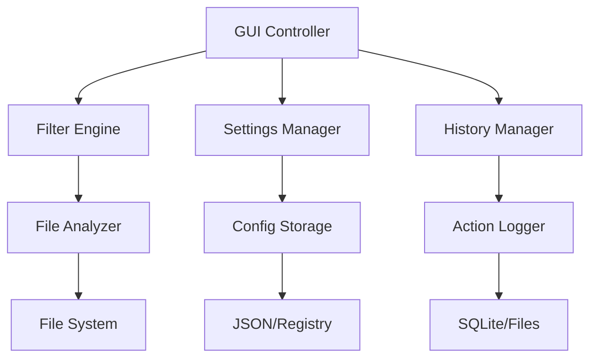

# Chapter 6: 고급 조건과 기능

이번 챕터에서는 KRenamer에 고급 조건 필터링, 사용자 설정 관리, 히스토리 추적 등의 전문적인 기능을 추가하여 완성도 높은 파일 관리 도구를 만들어보겠습니다.

## 🎯 학습 목표

- **조건부 필터링** 시스템 구현 (크기, 날짜, 확장자)
- **사용자 설정 저장/복원** 기능
- **작업 히스토리** 관리 및 **실행 취소** 기능
- **설정 프리셋** 관리 시스템
- **고급 UI/UX** 패턴 적용

## 🏗️ 고급 아키텍처 설계

### 시스템 구조



!!! note "확장 가능한 설계"
    - **Filter Engine**: 다양한 필터 조건을 플러그인 방식으로 확장
    - **Settings Manager**: 사용자 설정의 중앙 관리
    - **History Manager**: 모든 작업의 추적과 되돌리기

## 🔍 고급 필터링 시스템

### 1. 필터 엔진 기반 클래스

```python linenums="1" title="src/krenamer-ch4/filter_engine.py"
#!/usr/bin/env python3
"""
고급 필터링 엔진
다양한 조건으로 파일을 필터링하는 시스템
"""

import os
import re
from datetime import datetime, timedelta
from pathlib import Path
from typing import List, Dict, Any, Callable
from abc import ABC, abstractmethod

class FileFilter(ABC):
    """파일 필터 기반 클래스"""
    
    @abstractmethod
    def matches(self, file_path: str, file_info: Dict[str, Any]) -> bool:
        """파일이 필터 조건에 맞는지 확인"""
        pass
    
    @abstractmethod
    def get_description(self) -> str:
        """필터 설명 반환"""
        pass

class SizeFilter(FileFilter):
    """파일 크기 필터"""
    
    def __init__(self, min_size: int = 0, max_size: int = 0):
        self.min_size = min_size  # bytes
        self.max_size = max_size  # bytes
    
    def matches(self, file_path: str, file_info: Dict[str, Any]) -> bool:
        size = file_info.get('size', 0)
        
        if self.min_size > 0 and size < self.min_size:
            return False
        if self.max_size > 0 and size > self.max_size:
            return False
        
        return True
    
    def get_description(self) -> str:
        if self.min_size > 0 and self.max_size > 0:
            return f"크기: {self._format_size(self.min_size)} ~ {self._format_size(self.max_size)}"
        elif self.min_size > 0:
            return f"크기: {self._format_size(self.min_size)} 이상"
        elif self.max_size > 0:
            return f"크기: {self._format_size(self.max_size)} 이하"
        else:
            return "크기: 제한없음"
    
    def _format_size(self, size_bytes: int) -> str:
        """파일 크기를 읽기 쉬운 형태로 변환"""
        for unit in ['B', 'KB', 'MB', 'GB']:
            if size_bytes < 1024.0:
                if unit == 'B':
                    return f"{int(size_bytes)}{unit}"
                else:
                    return f"{size_bytes:.1f}{unit}"
            size_bytes /= 1024.0
        return f"{size_bytes:.1f}TB"

class ExtensionFilter(FileFilter):
    """파일 확장자 필터"""
    
    def __init__(self, extensions: List[str], include: bool = True):
        self.extensions = [ext.lower().strip('.') for ext in extensions]
        self.include = include  # True: 포함, False: 제외
    
    def matches(self, file_path: str, file_info: Dict[str, Any]) -> bool:
        ext = file_info.get('extension', '').lower().strip('.')
        
        if self.include:
            return ext in self.extensions
        else:
            return ext not in self.extensions
    
    def get_description(self) -> str:
        action = "포함" if self.include else "제외"
        ext_str = ", ".join(f".{ext}" for ext in self.extensions)
        return f"확장자 {action}: {ext_str}"

class DateFilter(FileFilter):
    """파일 날짜 필터"""
    
    def __init__(self, date_type: str = "modified", 
                 start_date: datetime = None, end_date: datetime = None):
        self.date_type = date_type  # "created", "modified", "accessed"
        self.start_date = start_date
        self.end_date = end_date
    
    def matches(self, file_path: str, file_info: Dict[str, Any]) -> bool:
        date_key = f"{self.date_type}_date"
        file_date = file_info.get(date_key)
        
        if not file_date:
            return True
        
        if self.start_date and file_date < self.start_date:
            return False
        if self.end_date and file_date > self.end_date:
            return False
        
        return True
    
    def get_description(self) -> str:
        date_names = {
            "created": "생성일",
            "modified": "수정일", 
            "accessed": "접근일"
        }
        
        date_name = date_names.get(self.date_type, "날짜")
        
        if self.start_date and self.end_date:
            return f"{date_name}: {self.start_date.strftime('%Y-%m-%d')} ~ {self.end_date.strftime('%Y-%m-%d')}"
        elif self.start_date:
            return f"{date_name}: {self.start_date.strftime('%Y-%m-%d')} 이후"
        elif self.end_date:
            return f"{date_name}: {self.end_date.strftime('%Y-%m-%d')} 이전"
        else:
            return f"{date_name}: 제한없음"

class NamePatternFilter(FileFilter):
    """파일명 패턴 필터"""
    
    def __init__(self, pattern: str, use_regex: bool = False, case_sensitive: bool = False):
        self.pattern = pattern
        self.use_regex = use_regex
        self.case_sensitive = case_sensitive
        
        if use_regex:
            flags = 0 if case_sensitive else re.IGNORECASE
            try:
                self.compiled_regex = re.compile(pattern, flags)
            except re.error:
                self.compiled_regex = None
    
    def matches(self, file_path: str, file_info: Dict[str, Any]) -> bool:
        filename = os.path.basename(file_path)
        
        if not self.case_sensitive:
            filename = filename.lower()
            pattern = self.pattern.lower()
        else:
            pattern = self.pattern
        
        if self.use_regex and self.compiled_regex:
            return bool(self.compiled_regex.search(filename))
        else:
            return pattern in filename
    
    def get_description(self) -> str:
        pattern_type = "정규식" if self.use_regex else "텍스트"
        case_info = "대소문자 구분" if self.case_sensitive else "대소문자 무시"
        return f"파일명 패턴 ({pattern_type}, {case_info}): {self.pattern}"
```

### 2. 필터 관리자

```python linenums="130"
class FilterManager:
    """필터 관리 클래스"""
    
    def __init__(self):
        self.filters: List[FileFilter] = []
        self.file_info_cache: Dict[str, Dict[str, Any]] = {}
    
    def add_filter(self, filter_obj: FileFilter):
        """필터 추가"""
        self.filters.append(filter_obj)
    
    def remove_filter(self, filter_obj: FileFilter):
        """필터 제거"""
        if filter_obj in self.filters:
            self.filters.remove(filter_obj)
    
    def clear_filters(self):
        """모든 필터 제거"""
        self.filters.clear()
    
    def get_file_info(self, file_path: str) -> Dict[str, Any]:
        """파일 정보 캐시된 조회"""
        if file_path not in self.file_info_cache:
            self.file_info_cache[file_path] = self._collect_file_info(file_path)
        return self.file_info_cache[file_path]
    
    def _collect_file_info(self, file_path: str) -> Dict[str, Any]:
        """파일 정보 수집"""
        try:
            stat = os.stat(file_path)
            path_obj = Path(file_path)
            
            return {
                'size': stat.st_size,
                'created_date': datetime.fromtimestamp(stat.st_ctime),
                'modified_date': datetime.fromtimestamp(stat.st_mtime),
                'accessed_date': datetime.fromtimestamp(stat.st_atime),
                'extension': path_obj.suffix,
                'name': path_obj.name,
                'stem': path_obj.stem
            }
        except OSError:
            return {}
    
    def filter_files(self, file_paths: List[str]) -> List[str]:
        """필터 조건에 맞는 파일만 반환"""
        if not self.filters:
            return file_paths
        
        filtered_files = []
        
        for file_path in file_paths:
            file_info = self.get_file_info(file_path)
            
            # 모든 필터 조건을 만족해야 함
            if all(filter_obj.matches(file_path, file_info) for filter_obj in self.filters):
                filtered_files.append(file_path)
        
        return filtered_files
    
    def get_filter_summary(self) -> List[str]:
        """적용된 필터 요약 반환"""
        return [filter_obj.get_description() for filter_obj in self.filters]
    
    def clear_cache(self):
        """파일 정보 캐시 초기화"""
        self.file_info_cache.clear()
```

## ⚙️ 설정 관리 시스템

### 1. 설정 관리자

```python linenums="1" title="src/krenamer-ch4/settings_manager.py"
#!/usr/bin/env python3
"""
사용자 설정 관리 시스템
설정 저장/복원, 프리셋 관리 등을 담당
"""

import json
import os
from pathlib import Path
from typing import Dict, Any, List
from datetime import datetime

class SettingsManager:
    """설정 관리 클래스"""
    
    def __init__(self, app_name: str = "KRenamer"):
        self.app_name = app_name
        self.config_dir = self._get_config_directory()
        self.config_file = self.config_dir / "settings.json"
        self.presets_file = self.config_dir / "presets.json"
        
        # 설정 디렉토리 생성
        self.config_dir.mkdir(parents=True, exist_ok=True)
        
        # 기본 설정
        self.default_settings = {
            "window": {
                "width": 800,
                "height": 700,
                "x": 100,
                "y": 100
            },
            "rename_options": {
                "prefix": "",
                "suffix": "",
                "find_text": "",
                "replace_text": "",
                "use_regex": False,
                "numbering_enabled": False,
                "numbering_start": 1,
                "numbering_digits": 3,
                "numbering_position": "prefix",
                "case_change": "none"
            },
            "ui": {
                "theme": "default",
                "font_size": 9,
                "language": "ko",
                "auto_preview": True,
                "confirm_operations": True
            },
            "filters": {
                "remember_filters": True,
                "default_extensions": [".txt", ".jpg", ".png", ".pdf"]
            },
            "advanced": {
                "backup_enabled": True,
                "backup_directory": "",
                "log_operations": True,
                "max_history": 100
            }
        }
        
        self.current_settings = self.load_settings()
    
    def _get_config_directory(self) -> Path:
        """OS별 설정 디렉토리 경로 반환"""
        if os.name == 'nt':  # Windows
            config_dir = Path.home() / "AppData" / "Local" / self.app_name
        else:  # macOS, Linux
            config_dir = Path.home() / f".{self.app_name.lower()}"
        
        return config_dir
    
    def load_settings(self) -> Dict[str, Any]:
        """설정 파일 로드"""
        if self.config_file.exists():
            try:
                with open(self.config_file, 'r', encoding='utf-8') as f:
                    loaded_settings = json.load(f)
                
                # 기본 설정과 병합 (새로운 설정 항목 추가)
                return self._merge_settings(self.default_settings, loaded_settings)
                
            except (json.JSONDecodeError, OSError) as e:
                print(f"설정 로드 실패: {e}")
        
        return self.default_settings.copy()
    
    def save_settings(self, settings: Dict[str, Any] = None):
        """설정 파일 저장"""
        if settings is None:
            settings = self.current_settings
        
        try:
            with open(self.config_file, 'w', encoding='utf-8') as f:
                json.dump(settings, f, indent=2, ensure_ascii=False)
        except OSError as e:
            print(f"설정 저장 실패: {e}")
    
    def _merge_settings(self, default: Dict, loaded: Dict) -> Dict:
        """기본 설정과 로드된 설정 병합"""
        result = default.copy()
        
        for key, value in loaded.items():
            if key in result and isinstance(result[key], dict) and isinstance(value, dict):
                result[key] = self._merge_settings(result[key], value)
            else:
                result[key] = value
        
        return result
    
    def get(self, path: str, default=None):
        """점 표기법으로 설정 값 조회"""
        keys = path.split('.')
        value = self.current_settings
        
        try:
            for key in keys:
                value = value[key]
            return value
        except (KeyError, TypeError):
            return default
    
    def set(self, path: str, value: Any):
        """점 표기법으로 설정 값 설정"""
        keys = path.split('.')
        settings = self.current_settings
        
        for key in keys[:-1]:
            if key not in settings:
                settings[key] = {}
            settings = settings[key]
        
        settings[keys[-1]] = value
    
    def reset_to_defaults(self):
        """설정을 기본값으로 초기화"""
        self.current_settings = self.default_settings.copy()
        self.save_settings()
```

### 2. 프리셋 관리

```python linenums="120"
    def save_preset(self, name: str, description: str = ""):
        """현재 설정을 프리셋으로 저장"""
        presets = self.load_presets()
        
        preset_data = {
            "name": name,
            "description": description,
            "created_date": datetime.now().isoformat(),
            "rename_options": self.current_settings["rename_options"].copy(),
            "filters": self.current_settings.get("filters", {}).copy()
        }
        
        presets[name] = preset_data
        self._save_presets(presets)
    
    def load_presets(self) -> Dict[str, Any]:
        """프리셋 목록 로드"""
        if self.presets_file.exists():
            try:
                with open(self.presets_file, 'r', encoding='utf-8') as f:
                    return json.load(f)
            except (json.JSONDecodeError, OSError):
                pass
        return {}
    
    def _save_presets(self, presets: Dict[str, Any]):
        """프리셋 파일 저장"""
        try:
            with open(self.presets_file, 'w', encoding='utf-8') as f:
                json.dump(presets, f, indent=2, ensure_ascii=False)
        except OSError as e:
            print(f"프리셋 저장 실패: {e}")
    
    def apply_preset(self, name: str) -> bool:
        """프리셋 적용"""
        presets = self.load_presets()
        
        if name in presets:
            preset = presets[name]
            
            # 리네임 옵션 적용
            if "rename_options" in preset:
                self.current_settings["rename_options"].update(preset["rename_options"])
            
            # 필터 설정 적용
            if "filters" in preset:
                self.current_settings["filters"].update(preset["filters"])
            
            return True
        
        return False
    
    def delete_preset(self, name: str) -> bool:
        """프리셋 삭제"""
        presets = self.load_presets()
        
        if name in presets:
            del presets[name]
            self._save_presets(presets)
            return True
        
        return False
    
    def get_preset_list(self) -> List[Dict[str, str]]:
        """프리셋 목록 반환"""
        presets = self.load_presets()
        
        preset_list = []
        for name, data in presets.items():
            preset_info = {
                "name": name,
                "description": data.get("description", ""),
                "created_date": data.get("created_date", "")
            }
            preset_list.append(preset_info)
        
        return sorted(preset_list, key=lambda x: x["created_date"], reverse=True)
```

## 📝 히스토리 관리 시스템

### 1. 작업 히스토리 관리자

```python linenums="1" title="src/krenamer-ch4/history_manager.py"
#!/usr/bin/env python3
"""
작업 히스토리 관리 시스템
파일 작업의 추적, 되돌리기, 다시 실행 기능
"""

import json
import sqlite3
from datetime import datetime
from pathlib import Path
from typing import List, Dict, Any, Optional
from dataclasses import dataclass, asdict

@dataclass
class HistoryAction:
    """단일 히스토리 액션"""
    id: str
    action_type: str  # "rename", "move", "delete"
    timestamp: datetime
    original_path: str
    new_path: str
    success: bool
    error_message: str = ""
    
    def to_dict(self) -> Dict[str, Any]:
        data = asdict(self)
        data['timestamp'] = self.timestamp.isoformat()
        return data
    
    @classmethod
    def from_dict(cls, data: Dict[str, Any]) -> 'HistoryAction':
        data['timestamp'] = datetime.fromisoformat(data['timestamp'])
        return cls(**data)

@dataclass
class HistorySession:
    """히스토리 세션 (관련된 작업들의 그룹)"""
    session_id: str
    session_name: str
    timestamp: datetime
    actions: List[HistoryAction]
    total_files: int
    success_count: int
    
    def to_dict(self) -> Dict[str, Any]:
        data = asdict(self)
        data['timestamp'] = self.timestamp.isoformat()
        data['actions'] = [action.to_dict() for action in self.actions]
        return data
    
    @classmethod
    def from_dict(cls, data: Dict[str, Any]) -> 'HistorySession':
        data['timestamp'] = datetime.fromisoformat(data['timestamp'])
        data['actions'] = [HistoryAction.from_dict(action) for action in data['actions']]
        return cls(**data)

class HistoryManager:
    """히스토리 관리 클래스"""
    
    def __init__(self, config_dir: Path):
        self.config_dir = config_dir
        self.db_path = config_dir / "history.db"
        self.current_session: Optional[HistorySession] = None
        self._init_database()
    
    def _init_database(self):
        """데이터베이스 초기화"""
        with sqlite3.connect(self.db_path) as conn:
            conn.execute('''
                CREATE TABLE IF NOT EXISTS sessions (
                    session_id TEXT PRIMARY KEY,
                    session_name TEXT,
                    timestamp TEXT,
                    total_files INTEGER,
                    success_count INTEGER
                )
            ''')
            
            conn.execute('''
                CREATE TABLE IF NOT EXISTS actions (
                    id TEXT PRIMARY KEY,
                    session_id TEXT,
                    action_type TEXT,
                    timestamp TEXT,
                    original_path TEXT,
                    new_path TEXT,
                    success BOOLEAN,
                    error_message TEXT,
                    FOREIGN KEY (session_id) REFERENCES sessions (session_id)
                )
            ''')
            
            conn.commit()
    
    def start_session(self, session_name: str) -> str:
        """새 히스토리 세션 시작"""
        session_id = f"session_{datetime.now().strftime('%Y%m%d_%H%M%S')}"
        
        self.current_session = HistorySession(
            session_id=session_id,
            session_name=session_name,
            timestamp=datetime.now(),
            actions=[],
            total_files=0,
            success_count=0
        )
        
        return session_id
    
    def add_action(self, action_type: str, original_path: str, 
                  new_path: str, success: bool, error_message: str = ""):
        """현재 세션에 액션 추가"""
        if not self.current_session:
            return
        
        action_id = f"action_{len(self.current_session.actions) + 1}"
        action = HistoryAction(
            id=action_id,
            action_type=action_type,
            timestamp=datetime.now(),
            original_path=original_path,
            new_path=new_path,
            success=success,
            error_message=error_message
        )
        
        self.current_session.actions.append(action)
        self.current_session.total_files += 1
        if success:
            self.current_session.success_count += 1
    
    def end_session(self):
        """현재 세션 종료 및 저장"""
        if not self.current_session:
            return
        
        with sqlite3.connect(self.db_path) as conn:
            # 세션 저장
            conn.execute('''
                INSERT INTO sessions 
                (session_id, session_name, timestamp, total_files, success_count)
                VALUES (?, ?, ?, ?, ?)
            ''', (
                self.current_session.session_id,
                self.current_session.session_name,
                self.current_session.timestamp.isoformat(),
                self.current_session.total_files,
                self.current_session.success_count
            ))
            
            # 액션들 저장
            for action in self.current_session.actions:
                conn.execute('''
                    INSERT INTO actions 
                    (id, session_id, action_type, timestamp, original_path, 
                     new_path, success, error_message)
                    VALUES (?, ?, ?, ?, ?, ?, ?, ?)
                ''', (
                    action.id,
                    self.current_session.session_id,
                    action.action_type,
                    action.timestamp.isoformat(),
                    action.original_path,
                    action.new_path,
                    action.success,
                    action.error_message
                ))
            
            conn.commit()
        
        self.current_session = None
    
    def get_sessions(self, limit: int = 50) -> List[HistorySession]:
        """최근 세션 목록 조회"""
        sessions = []
        
        with sqlite3.connect(self.db_path) as conn:
            conn.row_factory = sqlite3.Row
            
            cursor = conn.execute('''
                SELECT * FROM sessions 
                ORDER BY timestamp DESC 
                LIMIT ?
            ''', (limit,))
            
            for row in cursor.fetchall():
                # 해당 세션의 액션들 조회
                action_cursor = conn.execute('''
                    SELECT * FROM actions 
                    WHERE session_id = ?
                    ORDER BY timestamp
                ''', (row['session_id'],))
                
                actions = []
                for action_row in action_cursor.fetchall():
                    action = HistoryAction(
                        id=action_row['id'],
                        action_type=action_row['action_type'],
                        timestamp=datetime.fromisoformat(action_row['timestamp']),
                        original_path=action_row['original_path'],
                        new_path=action_row['new_path'],
                        success=bool(action_row['success']),
                        error_message=action_row['error_message']
                    )
                    actions.append(action)
                
                session = HistorySession(
                    session_id=row['session_id'],
                    session_name=row['session_name'],
                    timestamp=datetime.fromisoformat(row['timestamp']),
                    actions=actions,
                    total_files=row['total_files'],
                    success_count=row['success_count']
                )
                sessions.append(session)
        
        return sessions
    
    def rollback_session(self, session_id: str) -> Dict[str, Any]:
        """특정 세션의 작업을 되돌리기"""
        result = {
            'success': 0,
            'failed': 0,
            'errors': []
        }
        
        with sqlite3.connect(self.db_path) as conn:
            conn.row_factory = sqlite3.Row
            
            cursor = conn.execute('''
                SELECT * FROM actions 
                WHERE session_id = ? AND success = 1 AND action_type = 'rename'
                ORDER BY timestamp DESC
            ''', (session_id,))
            
            for row in cursor.fetchall():
                try:
                    # 파일이 존재하고 되돌릴 수 있는지 확인
                    if Path(row['new_path']).exists():
                        import os
                        os.rename(row['new_path'], row['original_path'])
                        result['success'] += 1
                    else:
                        result['failed'] += 1
                        result['errors'].append(f"파일을 찾을 수 없음: {row['new_path']}")
                        
                except OSError as e:
                    result['failed'] += 1
                    result['errors'].append(f"되돌리기 실패 {row['new_path']}: {str(e)}")
        
        return result
    
    def delete_old_history(self, days: int = 30):
        """오래된 히스토리 삭제"""
        cutoff_date = datetime.now() - timedelta(days=days)
        
        with sqlite3.connect(self.db_path) as conn:
            conn.execute('''
                DELETE FROM actions 
                WHERE session_id IN (
                    SELECT session_id FROM sessions 
                    WHERE timestamp < ?
                )
            ''', (cutoff_date.isoformat(),))
            
            conn.execute('''
                DELETE FROM sessions 
                WHERE timestamp < ?
            ''', (cutoff_date.isoformat(),))
            
            conn.commit()
```

## 🎨 고급 GUI 구성요소

### 1. 필터 설정 다이얼로그

```python linenums="1" title="src/krenamer-ch4/filter_dialog.py"
#!/usr/bin/env python3
"""
고급 필터 설정 다이얼로그
"""

import tkinter as tk
from tkinter import ttk, messagebox
from datetime import datetime, timedelta
from filter_engine import SizeFilter, ExtensionFilter, DateFilter, NamePatternFilter

class FilterDialog:
    """필터 설정 대화상자"""
    
    def __init__(self, parent, filter_manager):
        self.parent = parent
        self.filter_manager = filter_manager
        self.result = None
        
        self.dialog = tk.Toplevel(parent)
        self.dialog.title("고급 필터 설정")
        self.dialog.geometry("600x500")
        self.dialog.transient(parent)
        self.dialog.grab_set()
        
        self.setup_ui()
        self.load_current_filters()
        
        # 대화상자 중앙 배치
        self.dialog.update_idletasks()
        x = (self.dialog.winfo_screenwidth() // 2) - (600 // 2)
        y = (self.dialog.winfo_screenheight() // 2) - (500 // 2)
        self.dialog.geometry(f"600x500+{x}+{y}")
    
    def setup_ui(self):
        """UI 구성"""
        notebook = ttk.Notebook(self.dialog)
        notebook.pack(fill=tk.BOTH, expand=True, padx=10, pady=10)
        
        # 크기 필터 탭
        self.setup_size_filter_tab(notebook)
        
        # 확장자 필터 탭
        self.setup_extension_filter_tab(notebook)
        
        # 날짜 필터 탭
        self.setup_date_filter_tab(notebook)
        
        # 이름 패턴 필터 탭
        self.setup_name_pattern_tab(notebook)
        
        # 버튼 프레임
        button_frame = ttk.Frame(self.dialog)
        button_frame.pack(fill=tk.X, padx=10, pady=10)
        
        ttk.Button(button_frame, text="적용", command=self.apply_filters).pack(side=tk.RIGHT, padx=(5, 0))
        ttk.Button(button_frame, text="취소", command=self.cancel).pack(side=tk.RIGHT)
        ttk.Button(button_frame, text="초기화", command=self.reset_filters).pack(side=tk.LEFT)
    
    def setup_size_filter_tab(self, notebook):
        """크기 필터 탭 설정"""
        frame = ttk.Frame(notebook)
        notebook.add(frame, text="파일 크기")
        
        # 크기 필터 활성화
        self.size_enabled = tk.BooleanVar()
        ttk.Checkbutton(frame, text="크기로 필터링", variable=self.size_enabled).pack(anchor=tk.W, pady=5)
        
        # 최소 크기
        min_frame = ttk.Frame(frame)
        min_frame.pack(fill=tk.X, pady=5)
        
        ttk.Label(min_frame, text="최소 크기:").pack(side=tk.LEFT)
        self.min_size_var = tk.StringVar()
        ttk.Entry(min_frame, textvariable=self.min_size_var, width=10).pack(side=tk.LEFT, padx=5)
        
        self.min_size_unit = tk.StringVar(value="KB")
        ttk.Combobox(min_frame, textvariable=self.min_size_unit, 
                    values=["B", "KB", "MB", "GB"], width=5).pack(side=tk.LEFT, padx=5)
        
        # 최대 크기
        max_frame = ttk.Frame(frame)
        max_frame.pack(fill=tk.X, pady=5)
        
        ttk.Label(max_frame, text="최대 크기:").pack(side=tk.LEFT)
        self.max_size_var = tk.StringVar()
        ttk.Entry(max_frame, textvariable=self.max_size_var, width=10).pack(side=tk.LEFT, padx=5)
        
        self.max_size_unit = tk.StringVar(value="MB")
        ttk.Combobox(max_frame, textvariable=self.max_size_unit,
                    values=["B", "KB", "MB", "GB"], width=5).pack(side=tk.LEFT, padx=5)
    
    def setup_extension_filter_tab(self, notebook):
        """확장자 필터 탭 설정"""
        frame = ttk.Frame(notebook)
        notebook.add(frame, text="확장자")
        
        # 확장자 필터 활성화
        self.ext_enabled = tk.BooleanVar()
        ttk.Checkbutton(frame, text="확장자로 필터링", variable=self.ext_enabled).pack(anchor=tk.W, pady=5)
        
        # 포함/제외 옵션
        mode_frame = ttk.Frame(frame)
        mode_frame.pack(fill=tk.X, pady=5)
        
        self.ext_mode = tk.StringVar(value="include")
        ttk.Radiobutton(mode_frame, text="포함", variable=self.ext_mode, value="include").pack(side=tk.LEFT)
        ttk.Radiobutton(mode_frame, text="제외", variable=self.ext_mode, value="exclude").pack(side=tk.LEFT, padx=20)
        
        # 확장자 목록
        list_frame = ttk.Frame(frame)
        list_frame.pack(fill=tk.BOTH, expand=True, pady=5)
        
        ttk.Label(list_frame, text="확장자 목록 (쉼표로 구분):").pack(anchor=tk.W)
        
        self.ext_text = tk.Text(list_frame, height=10, width=50)
        ext_scroll = ttk.Scrollbar(list_frame, command=self.ext_text.yview)
        self.ext_text.config(yscrollcommand=ext_scroll.set)
        
        self.ext_text.pack(side=tk.LEFT, fill=tk.BOTH, expand=True)
        ext_scroll.pack(side=tk.RIGHT, fill=tk.Y)
        
        # 기본 확장자 버튼들
        preset_frame = ttk.Frame(frame)
        preset_frame.pack(fill=tk.X, pady=5)
        
        presets = [
            ("이미지", ".jpg,.jpeg,.png,.gif,.bmp,.tiff"),
            ("문서", ".pdf,.doc,.docx,.txt,.rtf"),
            ("오디오", ".mp3,.wav,.flac,.ogg,.m4a"),
            ("비디오", ".mp4,.avi,.mkv,.mov,.wmv")
        ]
        
        for name, extensions in presets:
            ttk.Button(preset_frame, text=name, 
                      command=lambda ext=extensions: self.add_extensions(ext)).pack(side=tk.LEFT, padx=2)
    
    def add_extensions(self, extensions: str):
        """확장자 목록에 추가"""
        current = self.ext_text.get("1.0", tk.END).strip()
        if current:
            current += ", "
        current += extensions
        
        self.ext_text.delete("1.0", tk.END)
        self.ext_text.insert("1.0", current)
    
    def apply_filters(self):
        """필터 적용"""
        try:
            # 기존 필터 제거
            self.filter_manager.clear_filters()
            
            # 크기 필터
            if self.size_enabled.get():
                min_size = self._parse_size(self.min_size_var.get(), self.min_size_unit.get())
                max_size = self._parse_size(self.max_size_var.get(), self.max_size_unit.get())
                
                if min_size > 0 or max_size > 0:
                    self.filter_manager.add_filter(SizeFilter(min_size, max_size))
            
            # 확장자 필터
            if self.ext_enabled.get():
                ext_text = self.ext_text.get("1.0", tk.END).strip()
                if ext_text:
                    extensions = [ext.strip() for ext in ext_text.split(",") if ext.strip()]
                    include_mode = self.ext_mode.get() == "include"
                    self.filter_manager.add_filter(ExtensionFilter(extensions, include_mode))
            
            self.result = "applied"
            self.dialog.destroy()
            
        except Exception as e:
            messagebox.showerror("오류", f"필터 적용 중 오류가 발생했습니다: {str(e)}")
    
    def _parse_size(self, size_str: str, unit: str) -> int:
        """크기 문자열을 바이트로 변환"""
        if not size_str.strip():
            return 0
        
        try:
            size = float(size_str)
            multipliers = {"B": 1, "KB": 1024, "MB": 1024**2, "GB": 1024**3}
            return int(size * multipliers.get(unit, 1))
        except ValueError:
            return 0
    
    def cancel(self):
        """취소"""
        self.result = "cancelled"
        self.dialog.destroy()
    
    def reset_filters(self):
        """필터 초기화"""
        self.filter_manager.clear_filters()
        self.result = "reset"
        self.dialog.destroy()
```

## 🚀 완성된 메인 애플리케이션

### 통합된 GUI 클래스

```python linenums="1" title="src/krenamer-ch4/main.py"
#!/usr/bin/env python3
"""
Chapter 4: 고급 조건과 기능
완성된 KRenamer with 고급 필터링, 설정 관리, 히스토리
"""

import tkinter as tk
from tkinter import ttk, messagebox, filedialog
import os
from pathlib import Path

try:
    from tkinterdnd2 import DND_FILES, TkinterDnD
    DND_AVAILABLE = True
except ImportError:
    DND_AVAILABLE = False

from rename_engine import RenameEngine
from filter_engine import FilterManager
from settings_manager import SettingsManager
from history_manager import HistoryManager
from filter_dialog import FilterDialog

class AdvancedRenamerGUI:
    """고급 기능이 포함된 KRenamer GUI"""
    
    def __init__(self):
        # GUI 초기화
        if DND_AVAILABLE:
            self.root = TkinterDnD.Tk()
        else:
            self.root = tk.Tk()
        
        # 핵심 컴포넌트 초기화
        self.engine = RenameEngine()
        self.filter_manager = FilterManager()
        self.settings = SettingsManager()
        self.history = HistoryManager(self.settings.config_dir)
        
        self.setup_window()
        self.setup_widgets()
        self.setup_drag_drop()
        self.load_user_settings()
        self.update_preview()
    
    def setup_window(self):
        """윈도우 기본 설정"""
        self.root.title("KRenamer - Advanced")
        
        # 설정에서 윈도우 크기 로드
        width = self.settings.get("window.width", 900)
        height = self.settings.get("window.height", 800)
        self.root.geometry(f"{width}x{height}")
        self.root.minsize(800, 600)
        
        # 윈도우 닫기 이벤트
        self.root.protocol("WM_DELETE_WINDOW", self.on_closing)
    
    def setup_widgets(self):
        """위젯 구성"""
        # 메인 프레임
        main_frame = ttk.Frame(self.root)
        main_frame.pack(fill=tk.BOTH, expand=True, padx=10, pady=10)
        
        # 상단: 파일 목록 및 필터
        self.setup_file_section(main_frame)
        
        # 중단: 리네임 옵션
        self.setup_rename_options(main_frame)
        
        # 하단: 미리보기 및 실행
        self.setup_preview_section(main_frame)
        
        # 메뉴바
        self.setup_menubar()
        
        # 상태바
        self.setup_statusbar()
    
    def setup_menubar(self):
        """메뉴바 설정"""
        menubar = tk.Menu(self.root)
        self.root.config(menu=menubar)
        
        # 파일 메뉴
        file_menu = tk.Menu(menubar, tearoff=0)
        menubar.add_cascade(label="파일", menu=file_menu)
        file_menu.add_command(label="파일 추가...", command=self.add_files_dialog)
        file_menu.add_separator()
        file_menu.add_command(label="설정 저장", command=self.save_user_settings)
        file_menu.add_command(label="설정 초기화", command=self.reset_settings)
        file_menu.add_separator()
        file_menu.add_command(label="종료", command=self.on_closing)
        
        # 필터 메뉴
        filter_menu = tk.Menu(menubar, tearoff=0)
        menubar.add_cascade(label="필터", menu=filter_menu)
        filter_menu.add_command(label="고급 필터...", command=self.show_filter_dialog)
        filter_menu.add_command(label="필터 초기화", command=self.clear_filters)
        
        # 프리셋 메뉴
        preset_menu = tk.Menu(menubar, tearoff=0)
        menubar.add_cascade(label="프리셋", menu=preset_menu)
        preset_menu.add_command(label="현재 설정 저장...", command=self.save_preset_dialog)
        preset_menu.add_command(label="프리셋 관리...", command=self.manage_presets_dialog)
        
        # 히스토리 메뉴
        history_menu = tk.Menu(menubar, tearoff=0)
        menubar.add_cascade(label="히스토리", menu=history_menu)
        history_menu.add_command(label="작업 히스토리...", command=self.show_history_dialog)
        history_menu.add_command(label="히스토리 정리...", command=self.cleanup_history_dialog)
        
        # 도움말 메뉴
        help_menu = tk.Menu(menubar, tearoff=0)
        menubar.add_cascade(label="도움말", menu=help_menu)
        help_menu.add_command(label="정규표현식 도움말", command=self.show_regex_help)
        help_menu.add_command(label="프로그램 정보", command=self.show_about)
    
    def save_preset_dialog(self):
        """프리셋 저장 대화상자"""
        dialog = tk.Toplevel(self.root)
        dialog.title("프리셋 저장")
        dialog.geometry("400x200")
        dialog.transient(self.root)
        dialog.grab_set()
        
        # 프리셋 이름
        ttk.Label(dialog, text="프리셋 이름:").pack(pady=10)
        name_var = tk.StringVar()
        ttk.Entry(dialog, textvariable=name_var, width=30).pack(pady=5)
        
        # 설명
        ttk.Label(dialog, text="설명 (선택사항):").pack(pady=(10, 0))
        desc_text = tk.Text(dialog, height=4, width=40)
        desc_text.pack(pady=5)
        
        # 버튼
        button_frame = ttk.Frame(dialog)
        button_frame.pack(pady=10)
        
        def save_preset():
            name = name_var.get().strip()
            if not name:
                messagebox.showwarning("경고", "프리셋 이름을 입력하세요.")
                return
            
            desc = desc_text.get("1.0", tk.END).strip()
            self.save_current_settings_to_engine()
            self.settings.save_preset(name, desc)
            messagebox.showinfo("성공", "프리셋이 저장되었습니다.")
            dialog.destroy()
        
        ttk.Button(button_frame, text="저장", command=save_preset).pack(side=tk.LEFT, padx=5)
        ttk.Button(button_frame, text="취소", command=dialog.destroy).pack(side=tk.LEFT, padx=5)
    
    def on_closing(self):
        """프로그램 종료 시 처리"""
        # 현재 윈도우 크기 저장
        self.settings.set("window.width", self.root.winfo_width())
        self.settings.set("window.height", self.root.winfo_height())
        
        # 현재 설정 저장
        self.save_user_settings()
        
        # 히스토리 정리 (30일 이상된 것)
        self.history.delete_old_history(30)
        
        self.root.destroy()
    
    def execute_rename_with_history(self):
        """히스토리 추적이 포함된 파일명 변경 실행"""
        if not self.engine.files:
            messagebox.showwarning("경고", "변경할 파일이 없습니다.")
            return
        
        # 필터 적용
        filtered_files = self.filter_manager.filter_files(self.engine.files)
        if not filtered_files:
            messagebox.showwarning("경고", "필터 조건에 맞는 파일이 없습니다.")
            return
        
        # 미리보기 생성 및 유효성 확인
        preview = self.engine.generate_preview()
        valid_files = [p for p in preview if p[2]]
        
        if not valid_files:
            messagebox.showwarning("경고", "변경 가능한 파일이 없습니다.")
            return
        
        # 확인 대화상자
        result = messagebox.askyesno(
            "확인",
            f"{len(valid_files)}개 파일의 이름을 변경하시겠습니까?"
        )
        
        if not result:
            return
        
        # 히스토리 세션 시작
        session_id = self.history.start_session(f"Batch Rename {datetime.now().strftime('%Y-%m-%d %H:%M')}")
        
        try:
            # 리네임 실행
            results = self.engine.execute_rename()
            
            # 히스토리에 액션 추가
            for success_file in results.get('renamed_files', []):
                self.history.add_action(
                    action_type="rename",
                    original_path=success_file[0],
                    new_path=success_file[1],
                    success=True
                )
            
            # 실패한 파일들도 기록
            for i, (original, new, is_valid) in enumerate(preview):
                if not is_valid:
                    self.history.add_action(
                        action_type="rename",
                        original_path=self.engine.files[i],
                        new_path=new,
                        success=False,
                        error_message="유효하지 않은 파일명"
                    )
            
            # 결과 표시
            if results['success'] > 0:
                message = f"성공: {results['success']}개 파일"
                if results['failed'] > 0:
                    message += f"\n실패: {results['failed']}개 파일"
                messagebox.showinfo("완료", message)
            else:
                messagebox.showerror("실패", "파일명 변경에 실패했습니다.")
            
            # 오류 메시지 표시
            if results['errors']:
                error_msg = "오류 목록:\n" + "\n".join(results['errors'][:5])
                if len(results['errors']) > 5:
                    error_msg += f"\n... 외 {len(results['errors']) - 5}개"
                messagebox.showerror("오류 상세", error_msg)
            
        finally:
            # 히스토리 세션 종료
            self.history.end_session()
            
            # 미리보기 업데이트
            self.update_preview()

if __name__ == "__main__":
    app = AdvancedRenamerGUI()
    app.root.mainloop()
```

## 🎯 완성된 기능 목록

### 핵심 기능

1. **다양한 리네임 방식**: 접두사, 접미사, 순번, 찾기/바꾸기, 대소문자 변환
2. **고급 필터링**: 파일 크기, 확장자, 날짜, 이름 패턴별 필터링
3. **실시간 미리보기**: 설정 변경 시 즉시 결과 확인
4. **사용자 설정 관리**: 설정 저장/복원, 프리셋 관리
5. **작업 히스토리**: 모든 작업 추적, 되돌리기 기능

### 고급 기능

1. **플러그인 방식 필터**: 확장 가능한 필터 아키텍처
2. **SQLite 히스토리**: 효율적인 히스토리 관리
3. **JSON 설정 저장**: 크로스 플랫폼 호환 설정
4. **정규표현식 지원**: 복잡한 패턴 매칭
5. **배치 처리**: 대용량 파일 효율적 처리

### UI/UX 개선

1. **탭 기반 필터 설정**: 직관적인 필터 구성
2. **상태별 색상 표시**: 유효/무효/변경없음 구분
3. **프리셋 관리**: 자주 사용하는 설정 저장
4. **컨텍스트 메뉴**: 우클릭 메뉴 지원
5. **키보드 단축키**: 효율적인 작업 환경

## 📚 핵심 개념 정리

### 1. 필터 패턴

```python
# 플러그인 방식 필터
class CustomFilter(FileFilter):
    def matches(self, file_path, file_info):
        # 커스텀 로직
        return True
```

### 2. 설정 관리 패턴

```python
# 점 표기법 설정 접근
self.settings.set("ui.theme", "dark")
value = self.settings.get("ui.theme", "default")
```

### 3. 히스토리 패턴

```python
# 작업 추적
session_id = history.start_session("작업명")
history.add_action("rename", old_path, new_path, True)
history.end_session()
```

## 🎯 다음 단계 미리보기

Chapter 5에서는 고급 기능을 완성했습니다. 다음 [Chapter 6](chapter6.md)에서는:

- **모듈화 아키텍처** 설계
- **패키지 구조** 최적화
- **플러그인 시스템** 구현
- **배포 준비** 작업

---

!!! success "Chapter 5 완료!"
    고급 조건 필터링과 사용자 편의 기능을 성공적으로 구현했습니다!
    이제 전문적인 소프트웨어 개발 방법론을 학습해보겠습니다.

!!! tip "연습 과제"
    - 커스텀 필터 플러그인 만들기
    - 다국어 지원 기능 추가하기
    - 테마 시스템 구현하기
    - 클라우드 설정 동기화 기능 만들기