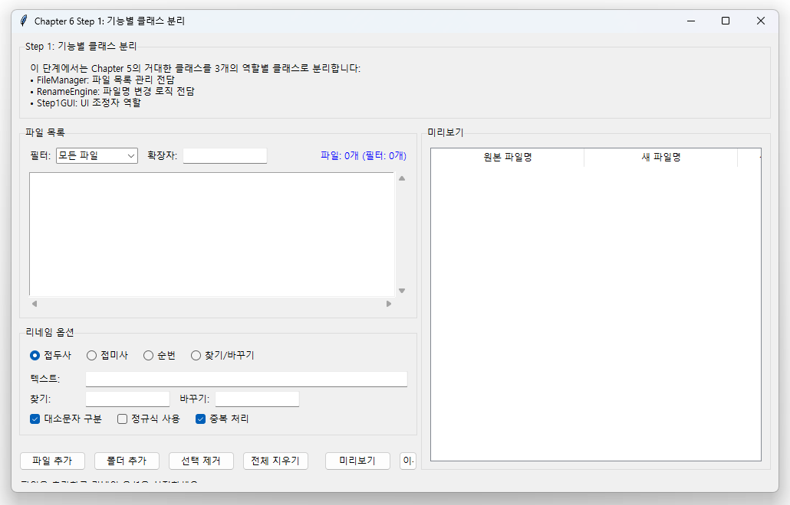
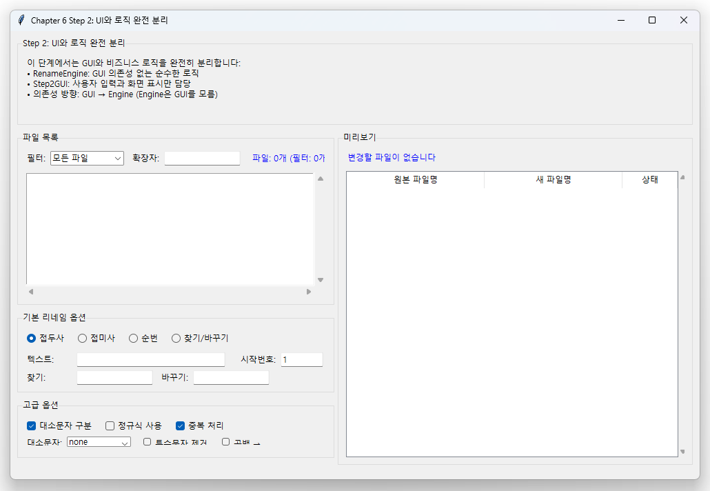
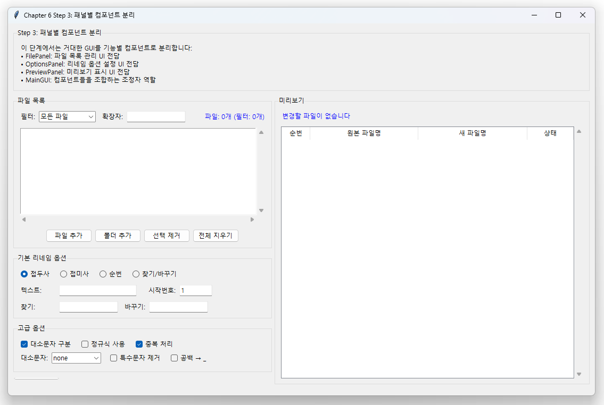
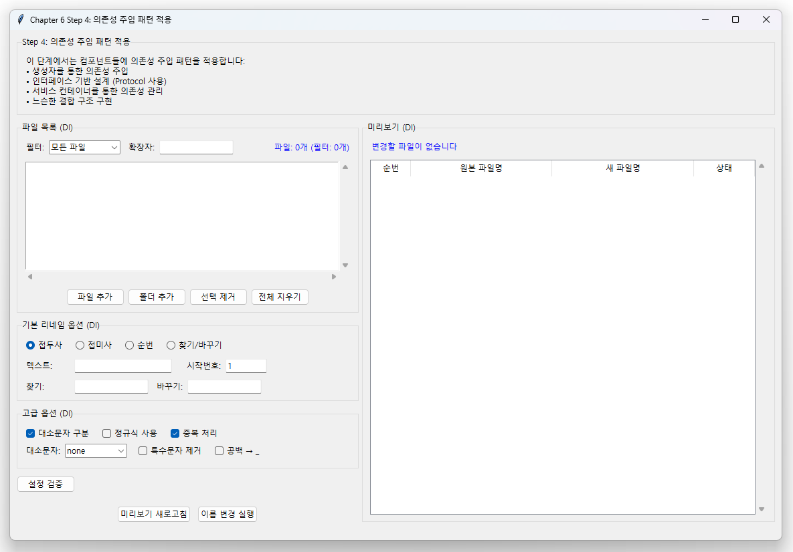

# Chapter 6: 2-패널 레이아웃에서 모듈화로

이번 챕터에서는 **Chapter 5의 통합된 코드를 Chapter 7의 모듈화 구조로 점진적으로 전환**<!-- -->하는 과정을 배웁니다. 단순히 모든 기능을 하나의 클래스에 넣는 것이 아니라, **기능별로 분리하고 의존성을 관리하는 전문적인 아키텍처**<!-- -->를 구축합니다.

## 🎯 학습 목표

- **단일 클래스에서 다중 클래스 구조**<!-- -->로의 전환
- **UI와 비즈니스 로직의 분리** 실습
- **컴포넌트 간 의존성 주입** 패턴 구현
- **점진적 리팩토링** 기법 습득
- **Chapter 7의 완전 모듈화 구조** 준비

## 🔄 전환 과정 개요

### Chapter 5의 문제점
```python
# ❌ Chapter 5: 모든 기능이 하나의 클래스에
class ProfessionalRenamerGUI:
    def __init__(self):
        self.engine = RenameEngine()  # 엔진도 내부에서 관리
        self.setup_ui()               # UI 설정
        self.setup_logic()            # 로직 설정
        # 700+ 라인의 거대한 클래스
```

### Chapter 7의 목표
```python
# ✅ Chapter 7: 완전한 모듈 분리
from core import RenameEngine
from gui.main_window import RenamerGUI
from gui.file_panel import FilePanel
from gui.options_tabs import OptionsTabs

# 각 모듈이 독립적이면서 조합 가능
```

### Chapter 6의 역할: 점진적 전환
**"큰 변화를 작은 단계로 나누어 안전하게 진행"**

## 📋 단계별 학습 로드맵

| 단계 | 내용 | 핵심 개념 | 결과물 |
|------|------|-----------|---------|
| **Step 1** | 기능별 클래스 분리 | 단일 책임 원칙 | `FileManager`, `RenameEngine` 클래스 |
| **Step 2** | UI와 로직 완전 분리 | 관심사 분리 | `RenamerGUI` + `RenameEngine` |
| **Step 3** | 패널별 컴포넌트 분리 | 컴포넌트 패턴 | `FilePanel`, `OptionsPanel` 클래스 |
| **Step 4** | 의존성 주입 적용 | 느슨한 결합 | 생성자 주입, 콜백 패턴 |
| **Step 5** | 모듈 구조 완성 | 패키지 구조 | Chapter 7 준비 완료 |

## 🏗️ Step 1: 기능별 클래스 분리

### 목표: 거대한 클래스를 기능별로 분할

**변경 전 (Chapter 5 스타일):**
```python
class ProfessionalRenamerGUI:
    def __init__(self):
        # 파일 관리 관련
        self.files = []
        self.setup_file_widgets()
        
        # 리네임 로직 관련  
        self.engine = RenameEngine()
        self.setup_rename_logic()
        
        # UI 관련
        self.setup_ui_components()
        # ... 모든 기능이 한 곳에
```

**변경 후 (Step 1):**
```python
class FileManager:
    """파일 목록 관리 전담"""
    def __init__(self):
        self.files = []
        
    def add_files(self, paths): pass
    def remove_files(self, indices): pass
    def filter_files(self, criteria): pass

class RenameEngine:
    """파일명 변경 로직 전담"""
    def __init__(self):
        self.settings = {}
        
    def generate_new_name(self, path, index): pass
    def execute_rename(self, files): pass

class Step1GUI:
    """UI 조정자 역할"""
    def __init__(self):
        self.file_manager = FileManager()    # 기능별 객체 조합
        self.rename_engine = RenameEngine()
        self.setup_ui()
```



### 핵심 배우는 내용
1. **단일 책임 원칙**: 각 클래스가 하나의 명확한 역할
2. **객체 조합**: 기능별 객체를 조합해서 전체 기능 구성
3. **코드 구조화**: 관련된 코드를 그룹화

## 🔧 Step 2: UI와 로직 완전 분리

### 목표: GUI 코드와 비즈니스 로직의 완전한 분리

**핵심 원칙:**
```python
# 🎨 GUI 클래스: 사용자 인터페이스만 담당
class Step2GUI:
    def __init__(self, engine):
        self.engine = engine  # 로직은 외부에서 주입받음
        self.setup_ui()
        
    def on_add_files_clicked(self):
        files = filedialog.askopenfilenames()
        self.engine.add_files(files)      # 로직은 엔진에 위임
        self.refresh_ui()                 # UI만 처리

# 🧠 엔진 클래스: 비즈니스 로직만 담당
class RenameEngine:
    def __init__(self):
        pass  # GUI에 대한 의존성 없음
        
    def add_files(self, paths):
        # 순수한 파일 처리 로직만
        return processed_files
```



### 분리의 이점
- **테스트 용이**: 엔진만 독립적으로 테스트 가능
- **재사용성**: 엔진을 다른 UI와 함께 사용 가능
- **유지보수성**: UI 변경이 로직에 영향 없음

## 📦 Step 3: 패널별 컴포넌트 분리

### 목표: UI를 기능별 패널 컴포넌트로 분할

```python
class FilePanel:
    """파일 목록 관리 패널"""
    def __init__(self, parent, engine, callback):
        self.parent = parent
        self.engine = engine
        self.callback = callback  # 상위로 알림
        self.create_widgets()
    
    def create_widgets(self):
        # 파일 목록 표시 위젯들만
        pass
        
    def refresh(self):
        # 파일 목록 갱신만
        pass

class OptionsPanel:  
    """옵션 설정 패널"""
    def __init__(self, parent, engine, callback):
        # 옵션 설정 관련 UI만
        pass

class PreviewPanel:
    """미리보기 패널"""  
    def __init__(self, parent, engine):
        # 미리보기 표시만
        pass

# 메인 GUI는 조정자 역할
class Step3GUI:
    def __init__(self):
        self.engine = RenameEngine()
        
        # 패널들을 조합
        self.file_panel = FilePanel(frame1, self.engine, self.on_file_changed)
        self.options_panel = OptionsPanel(frame2, self.engine, self.on_option_changed) 
        self.preview_panel = PreviewPanel(frame3, self.engine)
```



### 패널 분리의 장점
- **독립 개발**: 각 패널을 별도로 개발/테스트
- **재사용성**: 패널을 다른 화면에서 재사용
- **유지보수성**: 특정 패널만 수정 가능

## 🔗 Step 4: 의존성 주입 적용

### 목표: 컴포넌트 간 느슨한 결합 구현

**변경 전 (강한 결합):**
```python
# ❌ 패널이 직접 다른 객체를 생성/참조
class FilePanel:
    def __init__(self, parent):
        self.engine = RenameEngine()        # 직접 생성
        self.preview = PreviewPanel()       # 직접 생성
        
    def on_file_added(self):
        self.engine.add_files(...)
        self.preview.refresh()              # 직접 호출
```


**변경 후 (느슨한 결합):**
```python
# ✅ 필요한 의존성을 외부에서 주입받음
class FilePanel:
    def __init__(self, parent, engine, update_callback):
        self.engine = engine                # 주입받음
        self.update_callback = update_callback  # 콜백으로 통신
        
    def on_file_added(self):
        self.engine.add_files(...)
        self.update_callback('files_changed')  # 콜백으로 알림

# 메인에서 의존성 연결
class Step4GUI:
    def __init__(self):
        self.engine = RenameEngine()
        
        self.file_panel = FilePanel(
            parent=frame1,
            engine=self.engine,              # 엔진 주입
            update_callback=self.on_update   # 콜백 주입
        )
    
    def on_update(self, event_type):
        if event_type == 'files_changed':
            self.preview_panel.refresh()     # 중앙에서 조정
```



### 의존성 주입의 이점
- **테스트 용이**: Mock 객체로 쉽게 대체 가능
- **유연성**: 다른 엔진이나 콜백으로 교체 가능
- **결합도 감소**: 컴포넌트들이 독립적

## 📂 Step 5: 모듈 구조 완성

### 목표: Chapter 7 스타일의 패키지 구조 구현

**최종 구조:**
```
src/chapter6/step5/
├── main.py                 # 진입점
├── core/
│   ├── __init__.py
│   ├── engine.py          # RenameEngine 클래스
│   └── file_manager.py    # FileManager 클래스  
├── gui/
│   ├── __init__.py
│   ├── main_window.py     # RenamerGUI (조정자)
│   ├── file_panel.py      # FilePanel 컴포넌트
│   ├── options_panel.py   # OptionsPanel 컴포넌트
│   └── preview_panel.py   # PreviewPanel 컴포넌트
└── utils/
    ├── __init__.py
    └── helpers.py         # 공통 유틸리티
```

**사용법:**
```python
# main.py
from gui.main_window import RenamerGUI

if __name__ == "__main__":
    app = RenamerGUI()
    app.run()

# gui/main_window.py  
from core.engine import RenameEngine
from .file_panel import FilePanel
from .options_panel import OptionsPanel

class RenamerGUI:
    def __init__(self):
        self.engine = RenameEngine()
        self.setup_components()
```


## 🔍 각 단계별 실습 내용

### Step 1 - 기능별 클래스 분리
**실습 내용:**
- Chapter 5의 거대한 GUI 클래스를 3개 클래스로 분할
- `FileManager`, `RenameEngine`, `Step1GUI`로 역할 분담
- 객체 조합을 통한 기능 구현

**배우는 개념:**
- 단일 책임 원칙 (SRP)
- 클래스 설계와 책임 분할
- 객체 지향 설계의 기초

### Step 2 - UI와 로직 분리
**실습 내용:**  
- GUI 클래스에서 모든 비즈니스 로직 제거
- RenameEngine을 완전히 독립적인 클래스로 분리
- GUI는 사용자 입력과 화면 표시만 담당

**배우는 개념:**
- 관심사의 분리 (Separation of Concerns)
- MVC 패턴의 기초
- 테스트 가능한 코드 구조

### Step 3 - 패널별 컴포넌트 분리
**실습 내용:**
- UI를 기능별 패널 클래스로 분할
- 각 패널의 독립적인 위젯 관리
- 패널 간 통신을 위한 콜백 시스템

**배우는 개념:**
- 컴포넌트 기반 설계
- UI 모듈화 기법
- 이벤트 기반 통신

### Step 4 - 의존성 주입 적용
**실습 내용:**
- 생성자를 통한 의존성 주입 구현
- 콜백 함수를 통한 컴포넌트 간 통신
- 인터페이스 기반 설계 원칙 적용

**배우는 개념:**
- 의존성 주입 패턴
- 느슨한 결합 vs 강한 결합
- 제어의 역전 (IoC)

### Step 5 - 완전한 모듈 구조
**실습 내용:**
- 파일과 디렉토리 구조로 모듈 분리
- `__init__.py`를 통한 패키지 관리
- import 경로와 모듈 의존성 관리

**배우는 개념:**
- Python 패키지 시스템
- 모듈 설계 원칙
- Chapter 7으로의 자연스러운 연결

## 🎯 학습 결과물

Chapter 6를 완주하면 다음과 같은 능력을 갖추게 됩니다:

### 🔧 기술적 역량
- **클래스 설계 능력**: 단일 책임을 갖는 클래스 설계
- **아키텍처 설계 능력**: UI-로직 분리, 컴포넌트 설계
- **의존성 관리 능력**: 느슨한 결합 구조 구현
- **모듈 구조 설계 능력**: 확장 가능한 패키지 구조 구성

### 📋 설계 패턴
- **Model-View-Controller (MVC)** 패턴의 기초
- **의존성 주입 (Dependency Injection)** 패턴
- **옵저버 (Observer)** 패턴의 기초 (콜백)
- **컴포넌트 (Component)** 패턴

### 🚀 실무 역량
- **리팩토링 기법**: 기존 코드를 안전하게 개선하는 방법
- **점진적 개발**: 큰 변화를 작은 단계로 나누는 기법
- **코드 품질 향상**: 유지보수 가능한 코드 작성

## 💡 학습 팁

### 🎯 효과적인 학습 방법
1. **단계별 실행**: 각 Step을 순서대로 실행하며 변화 확인
2. **코드 비교**: 이전 단계와 비교하여 변화 포인트 이해
3. **독립 실행**: 각 컴포넌트를 독립적으로 테스트해보기
4. **확장 실험**: 새로운 기능을 추가하며 설계 유연성 체험

### 🔍 주의깊게 관찰할 포인트
- **클래스 크기 변화**: 거대한 클래스 → 작은 클래스들
- **의존성 방향**: 강한 결합 → 느슨한 결합
- **코드 위치**: 어떤 코드가 어떤 클래스로 이동하는가
- **통신 방식**: 직접 호출 → 콜백/이벤트 기반

---

!!! tip "Chapter 6의 핵심 가치"
    Chapter 6은 **"좋은 코드로 발전시키는 과정"**<!-- -->을 배우는 챕터입니다. 
    
    완성된 기능을 가진 코드를 더 좋은 구조로 개선하는 **리팩토링 기법**을 익히고, 
    **전문적인 소프트웨어 아키텍처**를 이해하는 것이 목표입니다.

!!! note "실무 연관성"
    이 Chapter에서 배우는 점진적 모듈화 과정은 실무에서 **레거시 코드를 현대적 구조로 개선**할 때 사용하는 실제 기법입니다.
    
    많은 회사에서 "큰 클래스를 작은 클래스들로 나누고, 의존성을 정리하는" 작업을 통해 코드 품질을 향상시킵니다.