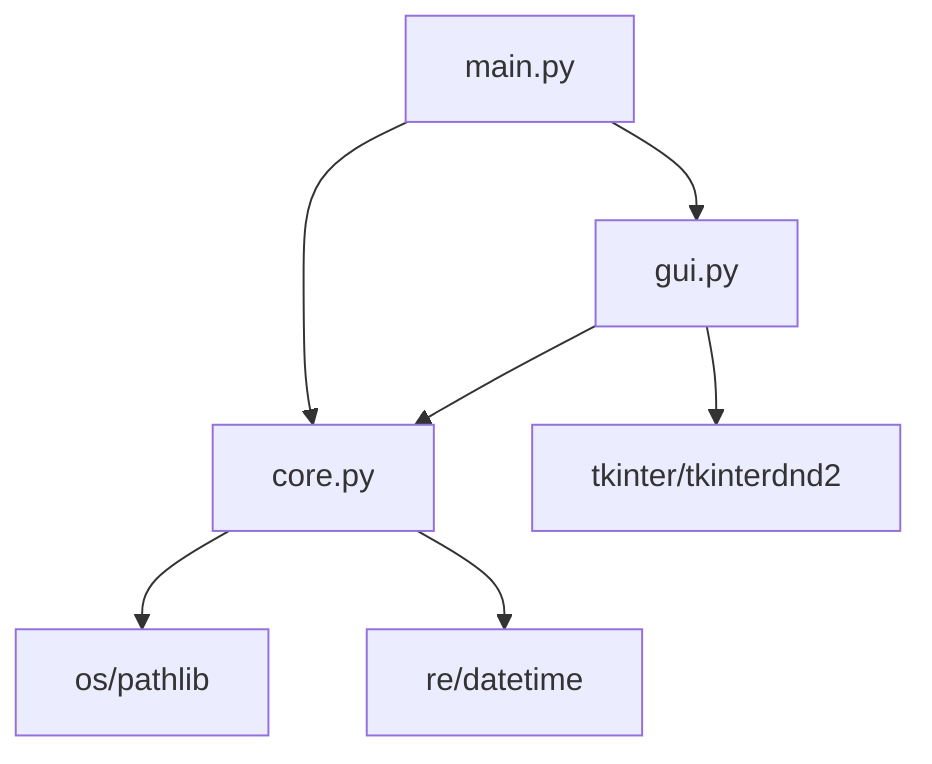

# 최종 완성 - 배포 가능한 Renamer

모든 챕터를 통해 단계별로 개발한 기능들을 통합하여 완전한 파일 리네이머 애플리케이션을 완성했습니다. 이제 실제로 사용할 수 있는 수준의 도구가 되었습니다.

## 🎯 완성된 기능들

### 🖥️ 사용자 인터페이스

=== "메인 화면"
    
    
    - **직관적인 레이아웃**: 파일 목록, 옵션 탭, 제어 버튼 구성
    - **반응형 디자인**: 창 크기 조절에 따른 적응형 레이아웃
    - **다국어 지원**: 한글 인터페이스 완벽 지원

=== "파일 관리"
    - **드래그 앤 드롭**: 직접 파일을 끌어다 놓기
    - **다중 선택**: 여러 파일 동시 관리
    - **파일 정보**: 크기, 수정일, 형식 표시
    - **실시간 통계**: 전체/조건일치 파일 수 표시

=== "옵션 탭"
    - **기본 변경**: 접두사, 접미사, 순번, 찾기/바꾸기
    - **패턴/정규식**: 복잡한 패턴 매칭 지원
    - **조건부 변경**: 크기, 날짜, 확장자 필터링
    - **변환 규칙**: 대소문자, 특수문자 처리

## 🏗️ 아키텍처 구조

### 모듈 구성



=== "core.py"
    ```python
    class RenameEngine:
        """파일명 변경 로직을 처리하는 핵심 엔진"""
        
        def add_files(self, file_paths) -> int
        def matches_conditions(self, file_path) -> bool
        def generate_rename_plan(self) -> List[Tuple[str, str]]
        def execute_rename(self, plan) -> Tuple[int, List[str]]
    ```

=== "gui.py"
    ```python
    class RenamerGUI:
        """메인 GUI 애플리케이션"""
        
        def setup_window(self)
        def setup_widgets(self)
        def setup_drag_drop(self)
        def update_engine_options(self)
    ```

=== "main.py"
    ```python
    def main():
        """메인 진입점"""
        setup_styles()
        app = RenamerGUI()
        app.run()
    ```

### 핵심 설계 원칙

!!! success "관심사 분리"
    - **GUI**: 사용자 인터페이스만 담당
    - **Core**: 비즈니스 로직과 파일 처리
    - **Main**: 애플리케이션 진입점과 설정

!!! success "확장성"
    - 새로운 리네임 방식 쉽게 추가 가능
    - 조건부 필터링 확장 가능
    - 다양한 파일 형식 지원 가능

## 🚀 설치 및 실행

### 1. 의존성 설치

```bash
# 필수 패키지 설치
pip install tkinterdnd2

# 문서 빌드용 (선택사항)
pip install mkdocs mkdocs-material
```

### 2. 패키지 설치

```bash
# 개발 모드로 설치
pip install -e .

# 또는 일반 설치
pip install .
```

### 3. 실행 방법

=== "명령행 실행"
    ```bash
    # 설치 후 어디서든
    renamer
    
    # 또는 Python 모듈로
    python -m renamer.main
    ```

=== "소스코드 실행"
    ```bash
    # 최종 버전
    cd src/renamer
    python main.py
    
    # 챕터별 예제
    cd src/renamer-ch1
    python main.py
    ```

## 🎮 사용법 가이드

### 기본 워크플로우

1. **파일 추가**
   - 드래그 앤 드롭으로 파일들을 추가
   - 또는 "파일 추가" 버튼으로 선택

2. **조건 설정**
   - 원하는 탭에서 이름 변경 옵션 설정
   - 필요시 조건부 필터링 적용

3. **미리보기**
   - "미리보기" 버튼으로 변경 결과 확인
   - 문제가 있으면 옵션 조정

4. **실행**
   - "실행" 버튼으로 실제 파일명 변경
   - 결과 확인 및 완료

### 고급 사용 예제

=== "사진 파일 정리"
    ```
    조건: 확장자 .jpg, .png만
    방식: 순번 매기기
    패턴: 001_vacation, 002_vacation, ...
    ```

=== "문서 파일 백업명"
    ```
    조건: .docx 파일만
    방식: 찾기/바꾸기
    패턴: .docx → _backup.docx
    ```

=== "날짜 형식 통일"
    ```
    조건: 모든 파일
    패턴: 정규식 사용
    검색: (\d{4})(\d{2})(\d{2})
    치환: \1-\2-\3
    ```

## 🔧 고급 기능 활용

### 정규식 패턴 예제

| 작업 | 검색 패턴 | 치환 패턴 | 설명 |
|------|-----------|-----------|------|
| 숫자 제거 | `\d+` | `` | 모든 숫자 제거 |
| 공백 정리 | `\s+` | `_` | 공백을 언더스코어로 |
| 날짜 형식 | `(\d{4})(\d{2})(\d{2})` | `\1-\2-\3` | YYYYMMDD → YYYY-MM-DD |
| 확장자 변경 | `\.jpeg$` | `.jpg` | JPEG를 JPG로 |
| 접두사 제거 | `^IMG_` | `` | 앞에 IMG_ 제거 |

### 조건부 필터링 활용

=== "파일 크기별"
    ```python
    # 1MB 이상 파일만
    크기 조건: > 1 MB
    
    # 작은 파일들만
    크기 조건: < 100 KB
    ```

=== "날짜별"
    ```python
    # 최근 파일만
    날짜 조건: 2024-01-01 이후
    
    # 오래된 파일만
    날짜 조건: 2023-12-31 이전
    ```

=== "확장자별"
    ```python
    # 이미지 파일만
    확장자: .jpg,.png,.gif,.bmp
    
    # 문서 파일만
    확장자: .pdf,.doc,.docx,.txt
    ```

## 📦 배포 준비

### PyPI 배포용 설정

```toml title="pyproject.toml"
[project]
name = "renamer"
version = "1.0.0"
description = "Windows GUI file renamer tool"
dependencies = ["tkinterdnd2>=0.3.0"]

[project.scripts]
renamer = "renamer.main:main"
```

### 배포 명령

```bash
# 빌드
python -m build

# 테스트 PyPI 업로드
python -m twine upload --repository testpypi dist/*

# 실제 PyPI 업로드
python -m twine upload dist/*
```

## 🧪 품질 보증

### 자동 테스트

```python title="test_renamer.py"
def test_basic_rename():
    engine = RenameEngine()
    engine.add_files(["test.txt"])
    engine.set_basic_rename_options("prefix", text="new_")
    
    plan = engine.generate_rename_plan()
    assert plan[0][1] == "new_test.txt"

def test_conditions():
    engine = RenameEngine()
    engine.set_size_condition(">", 1, "MB")
    
    # 테스트 파일로 조건 검증
    assert engine.matches_conditions("large_file.txt") == True
```

### 성능 최적화

- **지연 로딩**: 필요할 때만 무거운 모듈 import
- **메모리 효율**: 대용량 파일 목록 처리 최적화
- **UI 반응성**: 긴 작업 시 진행률 표시

## 🎯 향후 개선 계획

### 단기 개선사항

- [ ] **실행 취소 기능**: 파일명 변경 되돌리기
- [ ] **프리셋 저장**: 자주 사용하는 설정 저장
- [ ] **배치 처리**: 명령행에서 배치 실행
- [ ] **플러그인 시스템**: 사용자 정의 변환 규칙

### 장기 개선사항

- [ ] **다국어 지원**: 영어, 일본어 등 추가
- [ ] **클라우드 동기화**: 설정 클라우드 저장
- [ ] **AI 기반 제안**: 머신러닝으로 이름 제안
- [ ] **웹 버전**: 브라우저에서 사용 가능한 버전

## 📚 학습 정리

### 개발 과정에서 배운 것들

!!! success "GUI 개발"
    - tkinter의 효과적인 활용법
    - 레이아웃 매니저의 조합 사용
    - 사용자 경험을 고려한 디자인

!!! success "파일 시스템"
    - 안전한 파일 조작 방법
    - 크로스 플랫폼 호환성 고려
    - 에러 처리와 예외 상황 대응

!!! success "소프트웨어 아키텍처"
    - 관심사 분리와 모듈화
    - 확장 가능한 구조 설계
    - 테스트 가능한 코드 작성

### 응용 가능한 기술들

이 프로젝트에서 학습한 기술들은 다른 GUI 애플리케이션 개발에도 응용할 수 있습니다:

- **파일 관리 도구**: 복사, 이동, 백업 도구
- **이미지 처리 도구**: 일괄 리사이징, 포맷 변환
- **문서 처리 도구**: PDF 합병, 텍스트 변환
- **데이터 처리 도구**: CSV 변환, 데이터 정제

## 🎉 완성을 축하합니다!

4개 챕터를 통해 처음부터 완전한 GUI 애플리케이션을 만들어보았습니다. 

### 달성한 것들

✅ **완전한 GUI 애플리케이션** 개발  
✅ **실용적인 도구** 완성  
✅ **pip 설치 패키지** 준비  
✅ **체계적인 문서화** 완료  
✅ **단계별 학습 경험** 제공  

이제 여러분은 Python tkinter로 전문적인 GUI 애플리케이션을 개발할 수 있는 능력을 갖추게 되었습니다!

---

!!! tip "다음 도전"
    - 다른 종류의 GUI 도구 만들어보기
    - 웹 애플리케이션으로 포팅해보기
    - 오픈소스로 공개하여 기여받기
    - 상용 소프트웨어로 발전시키기

!!! quote "마무리"
    "훌륭한 소프트웨어는 사용자의 문제를 해결하는 것입니다. 
    여러분이 만든 Renamer가 많은 사람들에게 도움이 되기를 바랍니다!"