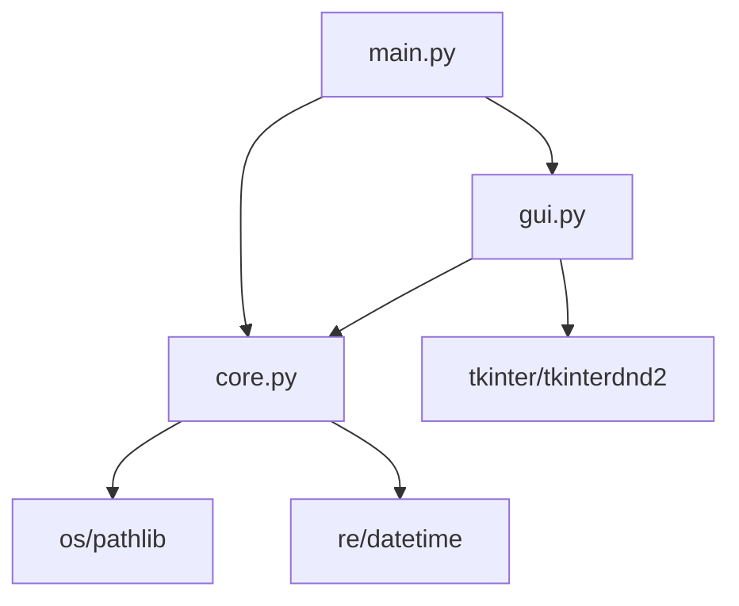

# 최종 완성 - 완전한 KRenamer

12개 챕터를 통해 단계별로 개발한 KRenamer가 드디어 완성되었습니다! 이제 실제 사용자들이 다운로드해서 사용할 수 있는 전문적인 소프트웨어가 되었습니다.

## 🎯 완성된 기능들

### 🖥️ 사용자 인터페이스

=== "메인 화면"
    
    
    - **직관적인 레이아웃**: 파일 목록, 옵션 탭, 제어 버튼 구성
    - **반응형 디자인**: 창 크기 조절에 따른 적응형 레이아웃
    - **다국어 지원**: 한글 인터페이스 완벽 지원

=== "파일 관리"
    - **드래그 앤 드롭**: 직접 파일을 끌어다 놓기
    - **다중 선택**: 여러 파일 동시 관리
    - **파일 정보**: 크기, 수정일, 형식 표시
    - **실시간 통계**: 전체/조건일치 파일 수 표시

=== "옵션 탭"
    - **기본 변경**: 접두사, 접미사, 순번, 찾기/바꾸기
    - **패턴/정규식**: 복잡한 패턴 매칭 지원
    - **조건부 변경**: 크기, 날짜, 확장자 필터링
    - **변환 규칙**: 대소문자, 특수문자 처리

## 🏗️ 아키텍처 구조

### 모듈 구성



=== "core.py"
    ```python
    class RenameEngine:
        """파일명 변경 로직을 처리하는 핵심 엔진"""
        
        def add_files(self, file_paths) -> int
        def matches_conditions(self, file_path) -> bool
        def generate_rename_plan(self) -> List[Tuple[str, str]]
        def execute_rename(self, plan) -> Tuple[int, List[str]]
    ```

=== "gui.py"
    ```python
    class RenamerGUI:
        """메인 GUI 애플리케이션"""
        
        def setup_window(self)
        def setup_widgets(self)
        def setup_drag_drop(self)
        def update_engine_options(self)
    ```

=== "main.py"
    ```python
    def main():
        """메인 진입점"""
        setup_styles()
        app = RenamerGUI()
        app.run()
    ```

### 핵심 설계 원칙

!!! success "관심사 분리"
    - **GUI**: 사용자 인터페이스만 담당
    - **Core**: 비즈니스 로직과 파일 처리
    - **Main**: 애플리케이션 진입점과 설정

!!! success "확장성"
    - 새로운 리네임 방식 쉽게 추가 가능
    - 조건부 필터링 확장 가능
    - 다양한 파일 형식 지원 가능

## 🚀 설치 및 실행

### 1. 의존성 설치

```bash
# 필수 패키지 설치
pip install tkinterdnd2

# 문서 빌드용 (선택사항)
pip install mkdocs mkdocs-material
```

### 2. 패키지 설치

```bash
# 개발 모드로 설치
pip install -e .

# 또는 일반 설치
pip install .
```

### 3. 실행 방법

=== "명령행 실행"
    ```bash
    # 설치 후 어디서든
    krenamer
    
    # 또는 Python 모듈로
    python -m krenamer
    ```

=== "소스코드 실행"
    ```bash
    # 최종 버전 (방법 1)
    cd src/krenamer
    python main.py
    
    # 최종 버전 (방법 2)
    python -m src.krenamer
    
    # 챕터별 예제
    cd src/chapter1
    python main.py
    ```

## 🎮 사용법 가이드

### 기본 워크플로우

1. **파일 추가**
    - 드래그 앤 드롭으로 파일들을 추가
    - 또는 "파일 추가" 버튼으로 선택

2. **조건 설정**
    - 원하는 탭에서 이름 변경 옵션 설정
    - 필요시 조건부 필터링 적용

3. **미리보기**
    - "미리보기" 버튼으로 변경 결과 확인
    - 문제가 있으면 옵션 조정

4. **실행**
    - "실행" 버튼으로 실제 파일명 변경
    - 결과 확인 및 완료

### 고급 사용 예제

=== "사진 파일 정리"
    ```
    조건: 확장자 .jpg, .png만
    방식: 순번 매기기
    패턴: 001_vacation, 002_vacation, ...
    ```

=== "문서 파일 백업명"
    ```
    조건: .docx 파일만
    방식: 찾기/바꾸기
    패턴: .docx → _backup.docx
    ```

=== "날짜 형식 통일"
    ```
    조건: 모든 파일
    패턴: 정규식 사용
    검색: (\d{4})(\d{2})(\d{2})
    치환: \1-\2-\3
    ```

## 🔧 고급 기능 활용

### 정규식 패턴 예제

| 작업 | 검색 패턴 | 치환 패턴 | 설명 |
|------|-----------|-----------|------|
| 숫자 제거 | `\d+` | `` | 모든 숫자 제거 |
| 공백 정리 | `\s+` | `_` | 공백을 언더스코어로 |
| 날짜 형식 | `(\d{4})(\d{2})(\d{2})` | `\1-\2-\3` | YYYYMMDD → YYYY-MM-DD |
| 확장자 변경 | `\.jpeg$` | `.jpg` | JPEG를 JPG로 |
| 접두사 제거 | `^IMG_` | `` | 앞에 IMG_ 제거 |

### 조건부 필터링 활용

=== "파일 크기별"
    ```python
    # 1MB 이상 파일만
    크기 조건: > 1 MB
    
    # 작은 파일들만
    크기 조건: < 100 KB
    ```

=== "날짜별"
    ```python
    # 최근 파일만
    날짜 조건: 2024-01-01 이후
    
    # 오래된 파일만
    날짜 조건: 2023-12-31 이전
    ```

=== "확장자별"
    ```python
    # 이미지 파일만
    확장자: .jpg,.png,.gif,.bmp
    
    # 문서 파일만
    확장자: .pdf,.doc,.docx,.txt
    ```

## 🎉 개발 여정 회고

### 단계별 성장 과정

이 프로젝트를 통해 우리는 다음과 같은 발전을 이루었습니다:

=== "Chapter 1-2: 기초 다지기"
    - Python 기본 문법 습득
    - tkinter GUI 기초 이해
    - 간단한 윈도우 애플리케이션 제작

=== "Chapter 3-6: 핵심 기능 구현"
    - 드래그 앤 드롭 고급 기능
    - 파일 시스템 조작
    - 사용자 인터페이스 설계
    - 실용적인 기능 완성

=== "Chapter 7-9: 전문화"
    - 코드 모듈화와 구조화
    - 단위 테스트 작성
    - 전문적인 문서화

=== "Chapter 10-12: 배포"
    - CI/CD 파이프라인 구축
    - PyPI 패키지 배포
    - 실행파일 생성과 배포

## 🚀 실제 사용하기

### 다운로드 및 설치

KRenamer는 이제 누구나 쉽게 사용할 수 있습니다:

=== "일반 사용자"
    1. **GitHub Releases**에서 `KRenamer.exe` 다운로드
    2. 실행파일을 더블클릭으로 바로 실행
    3. 별도 설치 과정 없이 즉시 사용 가능

=== "개발자"
    ```bash
    # PyPI에서 설치
    pip install krenamer
    
    # 어디서든 실행
    python -m krenamer
    ```

=== "소스코드 빌드"
    ```bash
    git clone https://github.com/geniuskey/krenamer.git
    cd krenamer
    python -m src.krenamer
    ```

### 실제 사용 시나리오

**📸 휴가 사진 정리**
```
1000장의 IMG_xxxx.jpg 파일들을
→ 001_hawaii_vacation.jpg, 002_hawaii_vacation.jpg ...
```

**📄 문서 백업**
```
중요한 .docx 파일들을
→ 파일명_backup_20241215.docx 형태로 백업명 생성
```

**🎵 음악 파일 정리**
```
복잡한 파일명들을
→ 01_곡제목.mp3, 02_곡제목.mp3 형태로 정리
```

## 💎 완성된 전문 기능들

### Chapter별 누적 기능

| Chapter | 추가된 핵심 기능 | 사용자 가치 |
|---------|------------------|-------------|
| 1-2 | Python + tkinter 기초 | 프로그래밍 기반 다지기 |
| 3-4 | GUI 구조 + 드래그앤드롭 | 직관적인 사용자 경험 |
| 5-6 | 파일명 변경 + 고급 기능 | 실제 문제 해결 능력 |
| 7-8 | 모듈화 + 테스트 | 안정적이고 확장 가능한 코드 |
| 9 | 전문적인 문서화 | 오픈소스 프로젝트 완성도 |
| 10 | GitHub Actions CI/CD | 자동화된 개발 워크플로우 |
| 11 | PyPI 패키지 배포 | 전세계 배포 가능한 소프트웨어 |
| 12 | 실행파일 생성 | 일반 사용자도 쉽게 사용 가능 |

### 최종 완성품의 특징

!!! success "전문 소프트웨어 수준"
    - ✅ **실행파일**: 설치 없이 바로 사용
    - ✅ **PyPI 패키지**: `pip install krenamer`로 설치
    - ✅ **GitHub Actions**: 자동 빌드/배포/테스트
    - ✅ **완전한 문서**: 사용법부터 개발 가이드까지
    - ✅ **단위 테스트**: 신뢰할 수 있는 품질

!!! tip "실무 적용 가능"
    이제 여러분은 이 경험을 바탕으로:
    - 다른 GUI 도구 개발 가능
    - 전문적인 소프트웨어 배포 경험 보유
    - CI/CD 파이프라인 구축 능력 습득
    - 오픈소스 프로젝트 관리 노하우 확보

## 📚 학습 정리

### 개발 과정에서 배운 것들

!!! success "GUI 개발"
    - tkinter의 효과적인 활용법
    - 레이아웃 매니저의 조합 사용
    - 사용자 경험을 고려한 디자인

!!! success "파일 시스템"
    - 안전한 파일 조작 방법
    - 크로스 플랫폼 호환성 고려
    - 에러 처리와 예외 상황 대응

!!! success "소프트웨어 아키텍처"
    - 관심사 분리와 모듈화
    - 확장 가능한 구조 설계
    - 테스트 가능한 코드 작성

### 응용 가능한 기술들

이 프로젝트에서 학습한 기술들은 다른 GUI 애플리케이션 개발에도 응용할 수 있습니다:

- **파일 관리 도구**: 복사, 이동, 백업 도구
- **이미지 처리 도구**: 일괄 리사이징, 포맷 변환
- **문서 처리 도구**: PDF 합병, 텍스트 변환
- **데이터 처리 도구**: CSV 변환, 데이터 정제

## 🎉 축하합니다! 진짜 개발자가 되셨습니다!

12개 챕터의 긴 여정을 완주하셨습니다! 🎊

### 🏆 여러분이 달성한 놀라운 성과들

**👨‍💻 기술적 성장**
- ✅ Python으로 완전한 GUI 애플리케이션 개발
- ✅ 파일 시스템 조작과 안전한 에러 처리
- ✅ 사용자 친화적인 인터페이스 설계
- ✅ 모듈화와 테스트 가능한 코드 작성
- ✅ CI/CD 파이프라인 구축과 자동화

**🌍 배포 및 공유**
- ✅ PyPI에 패키지 배포 (전세계에서 설치 가능)
- ✅ 실행파일 생성 (비개발자도 사용 가능)
- ✅ GitHub Actions로 자동 배포
- ✅ 전문적인 문서화 사이트 구축

**💼 실무 경험**
- ✅ 실제 사용자 문제를 해결하는 소프트웨어 완성
- ✅ 오픈소스 프로젝트 관리 경험
- ✅ 버전 관리와 협업 도구 활용
- ✅ 품질 관리와 테스트 자동화

### 🚀 이제 여러분은...

!!! success "진정한 소프트웨어 개발자입니다!"
    - **문제 해결 능력**: 실제 문제를 코드로 해결
    - **전체 개발 사이클 경험**: 기획부터 배포까지
    - **사용자 관점**: 실제 사용 가능한 도구 제작
    - **전문성**: 업계 표준 도구와 방법론 활용

### 🎯 다음 도전 과제

**🔥 즉시 시작 가능한 프로젝트들**
- **이미지 일괄 처리기**: 리사이징, 포맷 변환, 압축
- **텍스트 변환 도구**: 인코딩 변환, 형식 변환
- **백업 관리 도구**: 자동 백업, 중복 파일 정리
- **로그 분석기**: 서버 로그 파싱, 통계 생성

**🌟 고급 도전**
- **웹 애플리케이션 버전**: Flask/Django로 포팅
- **모바일 앱**: Kivy로 안드로이드/iOS 버전
- **상용 소프트웨어**: 라이선스, 업데이트 시스템 추가
- **플러그인 시스템**: 확장 가능한 아키텍처 설계

---

!!! quote "🎊 최종 메시지"
    **"여러분은 이제 아이디어를 현실로 만들 수 있는 능력을 갖추었습니다!"**
    
    기술이 아니라 **창의력**이 여러분의 한계가 될 것입니다.
    무엇을 만들어 세상에 도움이 될지 상상해보세요! 🚀