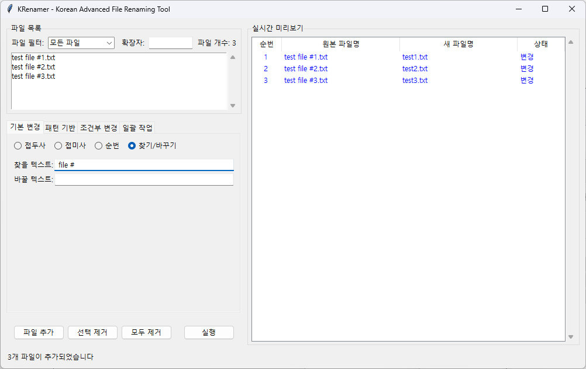

# Getting Started

이 가이드를 통해 KRenamer 프로젝트를 설정하고 실행해보겠습니다.

## 🔧 개발 환경 설정

### 1. Python 설치 확인

먼저 Python이 올바르게 설치되어 있는지 확인합니다:

```bash
python --version
```

!!! success "Python 3.8+"
    Python 3.8 이상이 필요합니다. 구버전을 사용 중이시라면 [python.org](https://python.org)에서 최신 버전을 다운로드하세요.

### 2. 프로젝트 클론 및 설치

GitHub에서 프로젝트를 클론하고 필요한 패키지를 설치합니다:

```bash
# 프로젝트 클론
git clone https://github.com/geniuskey/krenamer.git
cd krenamer

# 의존성 패키지 설치
pip install tkinterdnd2

# 개발 모드로 설치 (선택사항)
pip install -e .

# 개발 도구 설치 (선택사항)
pip install -e .[dev]
```

### 3. 프로젝트 구조 확인

프로젝트의 구조는 다음과 같습니다:

```
krenamer/
├── src/
│   ├── chapter1/           # Chapter 1: Python 기초
│   │   ├── main.py         # 파일 관리 기본 개념
│   │   ├── step1_variables.py
│   │   └── ...
│   ├── chapter2/           # Chapter 2: Tkinter GUI 기초
│   │   ├── 01_basic_window.py
│   │   ├── 02_window_config.py
│   │   └── ...
│   ├── chapter3/           # Chapter 3: CLI 기반 파일 이름 변경
│   │   ├── step1_basic_cli.py
│   │   └── ...
│   ├── chapter4/           # Chapter 4: GUI 개선과 사용성
│   │   ├── main.py
│   │   └── ...
│   ├── chapter5/           # Chapter 5: 2-패널 레이아웃과 미리보기
│   ├── chapter6/           # Chapter 6: 고급 기능과 안전성
│   ├── chapter7/           # Chapter 7: 모듈화하기
│   └── krenamer/           # 최종 완성 버전
│       ├── __init__.py
│       ├── core.py         # 파일 처리 엔진
│       ├── gui.py          # GUI 인터페이스
│       └── main.py         # 메인 실행 파일
├── docs/                   # MkDocs 문서
├── tests/                  # 단위 테스트
├── samples/                # 테스트용 샘플 파일
├── pyproject.toml          # 패키지 설정
├── make.bat               # 빌드 스크립트
└── README.md
```

## 🎯 KRenamer 실행하기

### 최종 완성 버전 실행

KRenamer의 완성된 버전을 바로 실행해보겠습니다:

```bash
# 방법 1: 모듈로 실행
python -m krenamer

# 방법 2: 스크립트로 실행
cd src/krenamer
python main.py

# 방법 3: 설치 후 명령어로 실행 (pip install -e . 후)
krenamer
```

정상적으로 실행되면 다음과 같은 GUI가 나타납니다:



### 기본 사용법

1. **파일 추가**: 
   - 드래그 앤 드롭으로 파일/폴더를 왼쪽 패널에 끌어다 놓기
   - "파일 추가" 버튼으로 파일 선택

2. **이름 변경 조건 설정**:
   - **기본**: 접두사/접미사 추가, 번호 매기기
   - **찾기/바꾸기**: 텍스트 찾아 바꾸기
   - **정규식**: 고급 패턴 매칭
   - **조건**: 확장자, 크기, 날짜별 필터링

3. **미리보기 및 실행**:
   - 오른쪽 패널에서 변경 결과 미리보기
   - "이름 변경" 버튼으로 실제 실행

### 주요 기능

!!! info "핵심 기능"
    - **드래그 앤 드롭**: 직관적인 파일 추가
    - **실시간 미리보기**: 변경 결과를 미리 확인
    - **다양한 변경 방식**: 접두사/접미사, 찾기/바꾸기, 정규식
    - **조건부 처리**: 파일 형식, 크기, 날짜별 필터링
    - **안전 장치**: 중복 이름 처리, 실행 취소

## 🎓 단계별 학습하기

### Chapter 1: Python 기초

파일 처리의 기본 개념을 익힙니다:

```bash
cd src/chapter1
python main.py  # 파일 관리자 기본 개념
python step1_variables.py  # 변수와 데이터 타입
python step2_filename_processing.py  # 파일명 처리
```

### Chapter 2: Tkinter GUI 기초

GUI 개발의 기초를 학습합니다:

```bash
cd src/chapter2
python 01_basic_window.py  # 기본 윈도우
python 03_labels.py  # 라벨과 텍스트
python 06_buttons.py  # 버튼과 이벤트
python 10_frames_layout.py  # 레이아웃 관리
```

### Chapter 3: CLI 도구 개발

명령줄 인터페이스를 만들어봅니다:

```bash
cd src/chapter3
python step1_basic_cli.py  # 기본 CLI
python step5_complete.py  # 완성된 CLI 도구
```

### Chapter 4: GUI 애플리케이션

본격적인 GUI 애플리케이션을 개발합니다:

```bash
cd src/chapter4
python step1_basic_gui.py  # 기본 GUI
python step3_drag_drop.py  # 드래그 앤 드롭
python main.py  # 완성된 GUI
```

## 🔧 빌드 및 개발 도구

### 빌드 명령어

Windows에서 제공되는 `make.bat` 스크립트를 사용합니다:

```bash
# 실행 파일 빌드
make exe

# 문서 빌드
make docs

# 문서 로컬 서버
make serve

# 테스트 실행
make test

# 패키지 빌드
make build

# 빌드 파일 정리
make clean
```

### 개발 환경 설정

```bash
# 개발 의존성 설치
pip install -e .[dev]

# 테스트 실행
pytest tests/

# 문서 로컬 서버
mkdocs serve
```

## 🚀 다음 단계

### 학습 경로

| 단계 | 내용 | 소요 시간 |
|------|------|----------|
| [Chapter 1](chapter1.md) | Python 기초와 파일 처리 | 45분 |
| [Chapter 2](chapter2.md) | Tkinter GUI 기초 | 60분 |
| [Chapter 3](chapter3.md) | CLI 도구 개발 | 45분 |
| [Chapter 4](chapter4.md) | GUI 개선과 사용성 향상 | 90분 |
| [Chapter 5](chapter5.md) | 2-패널 레이아웃과 미리보기 | 90분 |
| [Chapter 6](chapter6.md) | 고급 기능과 안전성 | 120분 |
| [Chapter 7](chapter7.md) | 모듈화하기 | 60분 |

### 프로젝트 활용

!!! tip "학습 후 활용"
    - KRenamer를 실제 파일 정리에 활용해보세요
    - 코드를 수정해서 새로운 기능을 추가해보세요
    - 다른 GUI 애플리케이션 개발에 패턴을 응용해보세요

---

!!! question "문제가 발생했나요?"
    - 설치나 실행 중 문제가 발생하면 [문제해결 가이드](troubleshooting.md)를 참고하세요
    - GitHub Issues에서 도움을 요청할 수 있습니다

!!! info "추가 리소스"
    - [API 문서](api/) - 코드 상세 문서
    - [기여 가이드](contributing.md) - 프로젝트 기여 방법
    - [부록 A](appendix-a.md) - AI와 함께하는 개발
    - [부록 B](appendix-b.md) - 실습 프롬프트 가이드