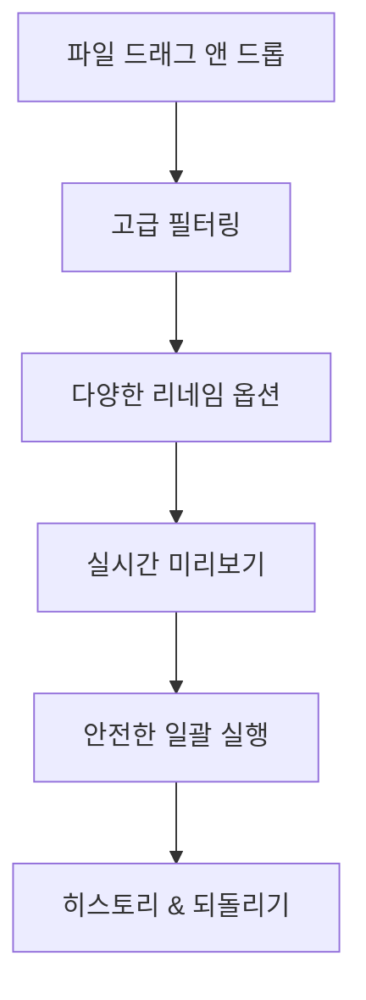

# 파이썬으로 만드는 KRenamer

{ align=right width=200 }

## 😤 이런 경험 있으시죠?

**"아, 또 파일명을 하나씩 바꿔야 하네..."**

휴가에서 찍은 사진 200장의 이름을 "IMG_001.jpg"에서 "2024_여행_001.jpg"로 바꾸려고 하는데... 😱

- 🖱️ 마우스 우클릭 → 이름 바꾸기 → 타이핑 → 엔터
- 🖱️ 마우스 우클릭 → 이름 바꾸기 → 타이핑 → 엔터  
- 🖱️ 마우스 우클릭 → 이름 바꾸기 → 타이핑 → 엔터
- **(200번 반복...)**

**30분 뒤:** 손목은 아프고, 시간은 날아갔지만 겨우 절반밖에 못 바꿨습니다. 😫

## ✨ 하지만 프로그래밍을 배우면?

**똑같은 작업을 3초 만에!**

```
파일 200개 → 드래그 앤 드롭 → 클릭 한 번 → 완료! 🎉
```

**더 놀라운건:**

- ✅ 실수로 덮어쓸 걱정 없음 (미리보기 제공)
- ✅ 복잡한 규칙도 OK ("날짜_장소_번호" 같은 패턴)
- ✅ 언제든 되돌리기 가능
- ✅ 자주 쓰는 설정은 저장해서 재사용

## 🚀 단순한 도구를 넘어서

**진짜 목표는 이것입니다:**

### "평생 써먹을 수 있는 프로그래밍 실력"

이 프로젝트를 통해 배우는 건 파일명 바꾸는 프로그램이 아니라...

- 🧠 **문제해결 사고방식**: "반복 작업을 자동화하는 방법"
- 🔧 **실무 개발 기술**: GUI, 테스트, 배포까지 전체 과정
- 💼 **포트폴리오**: 실제로 사람들이 사용할 만한 완성된 소프트웨어
- 🎯 **자신감**: "나도 프로그램을 만들 수 있구나!"

## 🎁 이런 분들께 추천해요

- **"프로그래밍은 배웠는데 뭘 만들지 모르겠어요"** → 실용적인 프로젝트로 경험 쌓기
- **"항상 튜토리얼만 따라하다 끝나요"** → 완성품까지 끝까지 가보기  
- **"GUI 프로그래밍이 어려워요"** → 단계별로 차근차근 배우기
- **"현업에서 쓰는 기술을 배우고 싶어요"** → CI/CD, 테스트, 배포까지 전부

**Python으로 배우는 완전한 소프트웨어 개발 워크플로우**

Python 기초부터 전문적인 소프트웨어 배포까지, 실제 프로젝트를 통해 배우는 완전한 개발 가이드입니다. tkinter GUI 개발, 테스팅, 문서화, CI/CD, 패키지 배포까지 현업에서 사용하는 모든 기술을 단계별로 학습합니다.

## 🎯 이 책의 목표

- **체계적인 개발 프로세스**: 기획부터 배포까지 전체 개발 생명주기 경험
- **실무 중심 기술 습득**: 현업에서 실제로 사용하는 도구와 방법론 학습
- **완전한 프로젝트 완성**: 실제 사용 가능한 GUI 애플리케이션 구축
- **전문적인 배포**: PyPI 패키지, 실행파일, 문서화까지 완성

## 📚 학습 로드맵

**"문제를 해결하는 완전한 프로그램을 만들어보세요!"**

| 단계 | 챕터 | 내용 | 예상 시간 | 성취감 지수 | 배우는 핵심 |
|------|------|------|----------|-------------|-------------|
| **🎯 기초 다지기** |
| 1 | [Python 기초](chapter1.md) | 프로젝트에 필요한 파이썬 핵심 기술 | 2-3시간 | ⭐⭐⭐ | 탄탄한 기초, 자신감 상승! |
| 2 | [Tkinter UI 요소 완전 정복](chapter2.md) | GUI 프로그램의 모든 구성 요소 학습 | 4-5시간 | ⭐⭐⭐⭐ | "내가 프로그램을 만들었다!" |
| **🚀 핵심 기능 구현** |
| 3 | [CLI 기반 파일 이름 변경 도구](chapter3.md) | 명령행에서 동작하는 실용적 도구 | 3-4시간 | ⭐⭐⭐⭐ | 진짜 문제를 해결하는 순간! |
| 4 | [GUI 개선과 사용성 향상](chapter4.md) | 드래그 앤 드롭과 향상된 인터페이스 | 4-5시간 | ⭐⭐⭐⭐⭐ | "와! 정말 프로그램 같다!" |
| 5 | [2-패널 레이아웃과 미리보기](chapter5.md) | 전문적인 인터페이스와 실시간 미리보기 | 4-5시간 | ⭐⭐⭐⭐⭐ | 완성도 높은 프로그램의 모습! |
| 6 | [2-패널 레이아웃에서 모듈화로](chapter6.md) | 통합 코드를 모듈화 구조로 전환 | 3-4시간 | ⭐⭐⭐⭐ | 점진적 리팩토링의 기술 |
| **💎 전문가 수준** |
| 7 | [전문적인 모듈화 아키텍처](chapter7.md) | 실무 수준의 모듈화 설계와 구현 | 4-5시간 | ⭐⭐⭐⭐ | 프로처럼 코딩하는 법 |
| 8 | [단위 테스트](chapter8.md) | 체계적인 테스트 시스템 구축 | 3-4시간 | ⭐⭐⭐⭐ | 현업에서 쓰는 개발 방법 |
| 9 | [MkDocs 적용하기](chapter9.md) | 전문적인 문서화 시스템 구축 | 2-3시간 | ⭐⭐⭐ | 포트폴리오 완성도 UP |
| **🌟 배포와 자동화** |
| 10 | [자동화의 마법 - GitHub Actions](chapter10.md) | 자동화된 개발 파이프라인 구축 | 3-4시간 | ⭐⭐⭐⭐ | 진짜 개발자의 워크플로우 |
| 11 | [전 세계에 내 프로그램 배포하기 - PyPI](chapter11.md) | 공식 패키지 저장소에 배포 | 2-3시간 | ⭐⭐⭐⭐⭐ | "내가 오픈소스 개발자!" |
| 12 | [더블클릭으로 실행되는 프로그램 만들기](chapter12.md) | 독립 실행파일 생성과 배포 | 3-4시간 | ⭐⭐⭐⭐⭐ | 누구나 쓸 수 있는 완전한 프로그램 |

**총 예상 학습 시간: 38-50시간** (주말에 조금씩 하면 2-3개월 완주!)

### 📚 부록 (선택사항)

| 부록 | 제목 | 내용 | 대상 |
|------|------|------|------|
| A | [AI와 함께하는 개발](appendix-a.md) | 코딩 없이도 프로젝트 만드는 법 | AI 도구 활용에 관심 있는 분 |
| B | [실습 프롬프트 가이드](appendix-b.md) | KRenamer 개발 완전 프롬프트 모음 | AI로 직접 개발해보고 싶은 분 |

### 🎯 단계별 성취감 미리보기

- **1-2단계 후**: "나도 프로그래밍 할 수 있구나!" 자신감 폭발
- **3-4단계 후**: "이거 진짜 쓸만한 프로그램이네!" 실용성 체감  
- **5-6단계 후**: "친구들에게 자랑하고 싶다!" 완성의 뿌듯함
- **7-8단계 후**: "이제 진짜 개발자가 된 것 같아!" 자신감 확보
- **9-12단계 후**: "내 프로그램을 전세계 사람들이 쓸 수 있다!" 성취감 극대화

## 🛠️ 개발 환경

### 필요한 도구들

- **Python 3.8+**: 기본 개발 환경
- **tkinter**: Python 표준 라이브러리 (별도 설치 불필요)
- **tkinterdnd2**: 드래그 앤 드롭 기능 (`pip install tkinterdnd2`)
- **개발 도구**: pytest, black, mypy, mkdocs 등
- **Code Editor**: VS Code, PyCharm 등

**💡 설치가 막막하다고요?** 걱정 마세요! 각 챕터에서 필요할 때마다 친절하게 안내해드립니다.

## 🎯 대상 독자

- **Python 기초 문법을 알고 있는 개발자**
- **전문적인 소프트웨어 개발 프로세스를 배우고 싶은 분**
- **GUI 애플리케이션 개발에 관심이 있는 분**
- **CI/CD, 테스팅, 패키지 배포 등 실무 기술을 익히고 싶은 분**

## 📦 프로젝트 완성품

이 가이드를 통해 완성되는 KRenamer는 다음과 같은 특징을 가집니다:

### 🎨 사용자 경험



### 🔧 핵심 기능

| 카테고리 | 기능 | 설명 |
|----------|------|------|
| **리네임 방식** | 접두사/접미사, 순번, 찾기/바꾸기, 정규식 | 다양한 파일명 변경 패턴 |
| **필터링** | 크기, 날짜, 확장자, 이름 패턴 | 조건부 파일 처리 |
| **사용자 경험** | 드래그앤드롭, 실시간 미리보기, 설정 저장 | 직관적이고 편리한 인터페이스 |
| **안전성** | 유효성 검증, 오류 처리, 되돌리기 | 안전한 파일 조작 |

### 🏗️ 기술적 완성도

- **📋 테스트**: 단위 테스트, 통합 테스트, GUI 테스트
- **📖 문서화**: MkDocs를 활용한 전문적인 문서 사이트
- **🔄 CI/CD**: GitHub Actions를 통한 자동화된 빌드/배포
- **📦 배포**: PyPI 패키지 + 독립 실행파일 + 인스톨러
- **🔧 모듈화**: 확장 가능한 플러그인 아키텍처

## 💡 학습 성과

**이 가이드를 완주하면 당신은 이런 것들을 할 수 있게 됩니다:**

### 🚀 기술적 역량
- **GUI 개발**: tkinter를 활용한 데스크톱 애플리케이션 개발
- **테스트 주도 개발**: pytest를 활용한 체계적인 테스트 작성
- **문서화**: 전문적인 기술 문서 작성과 자동 배포
- **CI/CD**: GitHub Actions를 통한 자동화 파이프라인 구축
- **패키지 관리**: 현대적인 Python 패키징과 배포

### 📋 개발 프로세스
- **계획**: 요구사항 분석과 아키텍처 설계
- **구현**: 점진적 개발과 리팩토링
- **검증**: 다양한 테스트 기법과 품질 관리
- **배포**: 사용자에게 전달하는 완전한 배포 프로세스
- **운영**: 버전 관리와 지속적인 개선

**결국 이런 말을 할 수 있게 됩니다:**
> *"나는 실제 문제를 해결하는 완전한 소프트웨어를 처음부터 끝까지 만들 수 있는 개발자다!"*

## 🚀 시작하기

준비되셨나요? [Chapter 1: Python 기초](chapter1.md)에서 KRenamer 프로젝트를 위한 Python 기본기부터 시작해보겠습니다!

---

## 📖 성공적인 학습을 위한 팁

### 🎯 학습 방법
- **순서대로 따라가세요**: 각 챕터는 이전 챕터를 기반으로 구성되어 있습니다
- **직접 코딩하세요**: 복사-붙여넣기보다는 직접 타이핑하며 따라해보세요
- **연습 과제를 꼭 해보세요**: 각 챕터 마지막의 연습 과제로 이해도를 확인하세요
- **막힐 때는 다시 읽어보세요**: 이해가 안 되면 이전 챕터로 돌아가서 다시 읽어보세요

### 📁 소스코드 및 리소스
- **GitHub 저장소**: [geniuskey/krenamer](https://github.com/geniuskey/krenamer)
- **문서**: [GitHub Pages](https://geniuskey.github.io/krenamer)
- **PyPI 패키지**: `pip install krenamer`

### 💪 마지막 응원 메시지

**"실패를 두려워하지 마세요!"**

프로그래밍은 시행착오의 연속입니다. 에러가 나고, 막히고, 안 될 때가 많습니다. 하지만 그럴 때마다 한 걸음씩 성장하고 있는 겁니다.

이 가이드를 완주하는 그 순간, 당신은 **"문제를 스스로 해결할 수 있는 개발자"**<!-- -->가 되어 있을 것입니다.