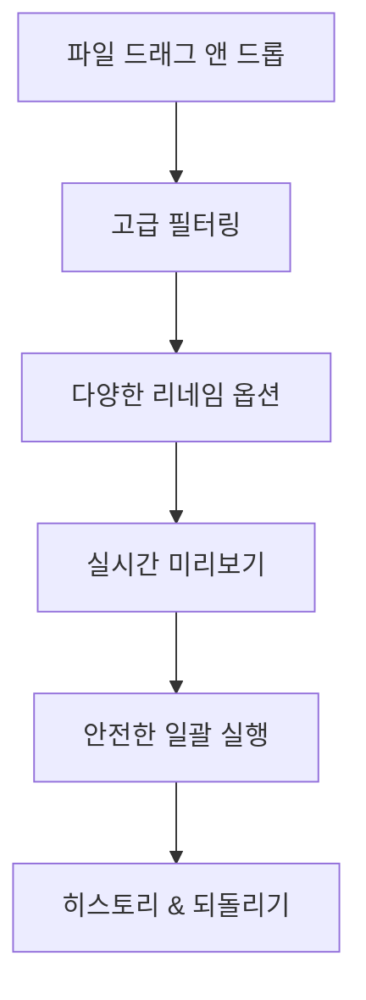

# 파이썬으로 만드는 KRenamer

{ align=right width=200 }

**Python으로 배우는 완전한 소프트웨어 개발 워크플로우**

Python 기초부터 전문적인 소프트웨어 배포까지, 실제 프로젝트를 통해 배우는 완전한 개발 가이드입니다. tkinter GUI 개발, 테스팅, 문서화, CI/CD, 패키지 배포까지 현업에서 사용하는 모든 기술을 단계별로 학습합니다.

## 🎯 이 책의 목표

- **체계적인 개발 프로세스**: 기획부터 배포까지 전체 개발 생명주기 경험
- **실무 중심 기술 습득**: 현업에서 실제로 사용하는 도구와 방법론 학습
- **완전한 프로젝트 완성**: 실제 사용 가능한 GUI 애플리케이션 구축
- **전문적인 배포**: PyPI 패키지, 실행파일, 문서화까지 완성

## 📚 학습 로드맵

### Part 1: 기초와 준비
Python 기초와 Tkinter GUI 기초를 다지는 단계

=== "Chapter 1"
    **[Python 기초](chapter1.md)**
    
    - KRenamer 프로젝트를 위한 Python 기본기
    - 파일 시스템 조작, 문자열 처리, 정규표현식
    - 객체지향 프로그래밍과 모듈 설계

=== "Chapter 2"
    **[Tkinter GUI 기초](chapter2.md)**
    
    - 윈도우 애플리케이션의 기본 구조 이해하기
    - 위젯(버튼, 라벨, 입력창) 배치와 디자인
    - 이벤트 처리와 사용자 상호작용
    - 한국어 폰트와 테마 적용하기

### Part 2: 핵심 기능 개발
드래그 앤 드롭부터 완성된 GUI 애플리케이션까지

=== "Chapter 3"
    **[기본 GUI 구조](chapter3.md)**
    
    - tkinter 기본 위젯과 레이아웃
    - 윈도우 설계와 이벤트 처리
    - 사용자 인터페이스 기초

=== "Chapter 4"
    **[드래그 앤 드롭 기능](chapter4.md)**
    
    - tkinterdnd2 라이브러리 활용
    - 파일 목록 관리와 상태 표시
    - 사용자 경험 개선

=== "Chapter 5"
    **[파일명 변경 로직](chapter5.md)**
    
    - 간단한 접두사/접미사 추가하기
    - 찾기/바꾸기 기능 만들기
    - 미리보기로 안전하게 확인하기
    - 실제 파일명 변경 실행하기

=== "Chapter 6"
    **[고급 기능 만들기](chapter6.md)**
    
    - 파일 필터링 기능 (확장자, 크기별 골라내기)
    - 설정 저장하기 (자주 쓰는 설정 기억하게 하기)
    - 작업 기록 남기기 (되돌리기 기능)
    - 사용자 친화적인 UI 통합

### Part 3: 전문 개발
코드 품질, 테스팅, 문서화 등 전문적인 개발 기법

=== "Chapter 7"
    **[모듈화하기](chapter7.md)**
    
    - 확장 가능한 아키텍처 설계
    - 패키지 구조와 의존성 관리
    - 플러그인 시스템 구현

=== "Chapter 8"
    **[단위 테스트 구성하기](chapter8.md)**
    
    - pytest를 활용한 테스트 작성
    - GUI 테스트와 Mock 활용
    - 테스트 커버리지와 품질 관리

=== "Chapter 9"
    **[MkDocs 적용하기](chapter9.md)**
    
    - 전문적인 문서화 시스템
    - Material 테마와 다국어 지원
    - GitHub Pages 자동 배포

### Part 4: 배포와 운영
CI/CD, 패키지 배포, 실행파일 생성 등 운영 기술

=== "Chapter 10"
    **[GitHub Actions Workflows](chapter10.md)**
    
    - CI/CD 파이프라인 구축
    - 자동화된 테스트와 빌드
    - 다중 플랫폼 배포 자동화

=== "Chapter 11"
    **[PyPI 배포하기](chapter11.md)**
    
    - 현대적 패키징 (pyproject.toml)
    - 자동화된 PyPI 배포
    - 버전 관리와 보안 설정

=== "Chapter 12"
    **[PyInstaller .exe 파일 만들기](chapter12.md)**
    
    - 독립 실행파일 생성
    - 크기 최적화와 인스톨러 제작
    - 자동 업데이트 시스템

## 🛠️ 개발 환경

!!! info "필요한 도구들"
    - **Python 3.8+**: 기본 개발 환경
    - **tkinter**: Python 표준 라이브러리 (별도 설치 불필요)
    - **tkinterdnd2**: 드래그 앤 드롭 기능 (`pip install tkinterdnd2`)
    - **개발 도구**: pytest, black, mypy, mkdocs 등
    - **Code Editor**: VS Code, PyCharm 등

## 🎯 대상 독자

- **Python 기초 문법을 알고 있는 개발자**
- **전문적인 소프트웨어 개발 프로세스를 배우고 싶은 분**
- **GUI 애플리케이션 개발에 관심이 있는 분**
- **CI/CD, 테스팅, 패키지 배포 등 실무 기술을 익히고 싶은 분**

## 📦 프로젝트 완성품

이 가이드를 통해 완성되는 KRenamer는 다음과 같은 특징을 가집니다:

### 🎨 사용자 경험

### 🔧 핵심 기능

| 카테고리 | 기능 | 설명 |
|----------|------|------|
| **리네임 방식** | 접두사/접미사, 순번, 찾기/바꾸기, 정규식 | 다양한 파일명 변경 패턴 |
| **필터링** | 크기, 날짜, 확장자, 이름 패턴 | 조건부 파일 처리 |
| **사용자 경험** | 드래그앤드롭, 실시간 미리보기, 설정 저장 | 직관적이고 편리한 인터페이스 |
| **안전성** | 유효성 검증, 오류 처리, 되돌리기 | 안전한 파일 조작 |

### 🏗️ 기술적 완성도

- **📋 테스트**: 단위 테스트, 통합 테스트, GUI 테스트
- **📖 문서화**: MkDocs를 활용한 전문적인 문서 사이트
- **🔄 CI/CD**: GitHub Actions를 통한 자동화된 빌드/배포
- **📦 배포**: PyPI 패키지 + 독립 실행파일 + 인스톨러
- **🔧 모듈화**: 확장 가능한 플러그인 아키텍처

## 💡 학습 성과

이 가이드를 완주하면 다음을 경험하게 됩니다:

!!! success "기술적 역량"
    - **GUI 개발**: tkinter를 활용한 데스크톱 애플리케이션 개발
    - **테스트 주도 개발**: pytest를 활용한 체계적인 테스트 작성
    - **문서화**: 전문적인 기술 문서 작성과 자동 배포
    - **CI/CD**: GitHub Actions를 통한 자동화 파이프라인 구축
    - **패키지 관리**: 현대적인 Python 패키징과 배포

!!! info "개발 프로세스"
    - **계획**: 요구사항 분석과 아키텍처 설계
    - **구현**: 점진적 개발과 리팩토링
    - **검증**: 다양한 테스트 기법과 품질 관리
    - **배포**: 사용자에게 전달하는 완전한 배포 프로세스
    - **운영**: 버전 관리와 지속적인 개선

## 🚀 시작하기

준비되셨나요? [Chapter 1: Python 기초](chapter1.md)에서 KRenamer 프로젝트를 위한 Python 기본기부터 시작해보겠습니다!

---

!!! tip "학습 방법"
    - 각 챕터는 이전 챕터를 기반으로 구성되어 있어 순서대로 학습하는 것을 권장합니다
    - 실습 코드를 직접 타이핑하며 따라해보세요
    - 각 챕터 마지막의 연습 과제로 이해도를 확인해보세요

!!! note "소스코드 및 리소스"
    - **GitHub 저장소**: [geniuskey/krenamer](https://github.com/geniuskey/krenamer)
    - **문서**: [GitHub Pages](https://geniuskey.github.io/krenamer)
    - **PyPI 패키지**: `pip install krenamer`