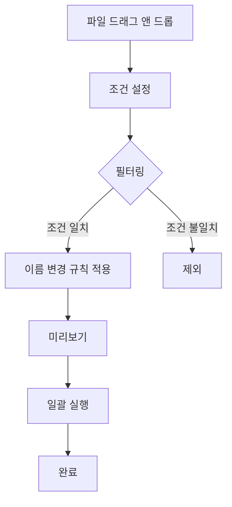

# 파이썬으로 만드는 Renamer

{ align=right width=200 }

**Python tkinter를 사용한 Windows 파일 리네이머 개발 완전 가이드**

이 전자책은 Python의 tkinter 라이브러리를 사용하여 Windows용 GUI 파일 리네이머를 처음부터 완성까지 개발하는 과정을 단계별로 안내합니다.

## 🎯 이 책의 목표

- **실용적인 GUI 애플리케이션 개발**: 실제로 사용할 수 있는 파일 리네이머 도구 구축
- **단계적 학습**: 기본 GUI부터 고급 기능까지 체계적으로 학습
- **실무 중심 접근**: 실제 개발 과정에서 만나는 문제들과 해결책 제시
- **배포까지**: pip 설치 가능한 패키지로 만들어 배포하는 방법까지

## 📚 구성

### Part 1: 개발 과정
각 챕터는 독립적인 예제 코드와 함께 점진적으로 기능을 추가해나갑니다.

=== "Chapter 1"
    **기본 GUI 구조**
    
    - tkinter 기본 위젯 사용법
    - 윈도우 레이아웃 설계
    - 이벤트 처리 기초

=== "Chapter 2"
    **드래그 앤 드롭**
    
    - tkinterdnd2 라이브러리 활용
    - 파일 목록 관리
    - 사용자 경험 개선

=== "Chapter 3"
    **파일명 변경 로직**
    
    - 다양한 리네임 방식 구현
    - 미리보기 기능
    - 오류 처리

=== "Chapter 4"
    **고급 기능**
    
    - 조건부 필터링
    - 정규식 패턴 매칭
    - 일괄 변환 규칙

### Part 2: 기술 참고
개발 과정에서 사용된 핵심 기술들과 심화 내용을 다룹니다.

### Part 3: 배포와 운영
완성된 애플리케이션을 pip 패키지로 배포하고 사용자에게 전달하는 방법을 설명합니다.

## 🛠️ 개발 환경

!!! info "필요한 도구들"
    - **Python 3.8+**: 기본 개발 환경
    - **tkinter**: Python 표준 라이브러리 (별도 설치 불필요)
    - **tkinterdnd2**: 드래그 앤 드롭 기능 (`pip install tkinterdnd2`)
    - **Code Editor**: VS Code, PyCharm 등

## 🎯 대상 독자

- **Python 기초 문법을 알고 있는 개발자**
- **GUI 애플리케이션 개발에 관심이 있는 분**
- **실용적인 도구를 만들어보고 싶은 분**
- **Python 패키지 배포를 경험해보고 싶은 분**

## 📦 최종 완성품

이 책을 통해 만들어지는 Renamer는 다음과 같은 기능을 제공합니다:

### 🎨 주요 기능

### 🔧 리네임 방식

| 방식 | 설명 | 예시 |
|------|------|------|
| **접두사/접미사** | 텍스트 추가 | `photo.jpg` → `vacation_photo.jpg` |
| **순번 매기기** | 순차 번호 부여 | `IMG001.jpg`, `IMG002.jpg` |
| **찾기/바꾸기** | 특정 텍스트 변경 | `IMG_20240315` → `Photo_20240315` |
| **정규식 패턴** | 복잡한 패턴 매칭 | `20240315_IMG` → `2024-03-15_Photo` |

### 🎛️ 고급 조건

- **파일 크기 필터링**: 특정 크기 이상/이하 파일만 대상
- **날짜 조건**: 수정일 기준 필터링
- **확장자 제한**: 특정 파일 형식만 처리
- **대소문자 변환**: 일괄 케이스 변경
- **특수문자 처리**: 안전한 파일명으로 정리

## 🚀 시작하기

준비되셨나요? [Getting Started](getting-started.md)에서 개발 환경을 설정하고 첫 번째 예제를 만들어보겠습니다!

---

!!! tip "학습 팁"
    각 챕터의 예제 코드는 독립적으로 실행할 수 있도록 구성되어 있습니다. 
    순서대로 따라하시면 자연스럽게 완전한 애플리케이션이 완성됩니다.

!!! note "소스코드"
    모든 예제 코드는 [GitHub 저장소](https://github.com/geniuskey/renamer)에서 확인하실 수 있습니다.